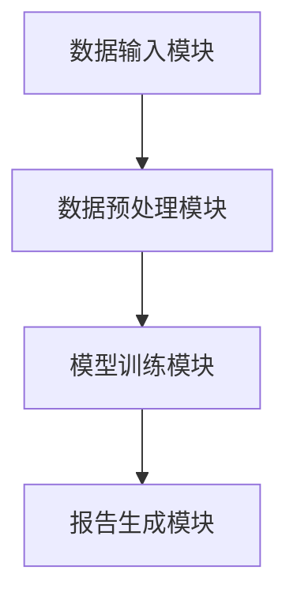
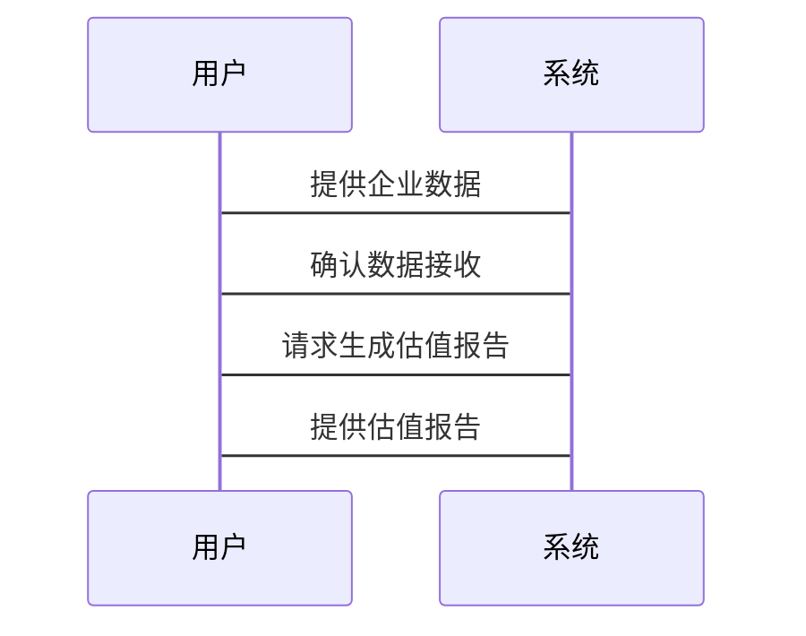

                 


# AI辅助的企业估值报告自动生成

## 关键词
AI, 企业估值, 自动化报告, 机器学习, 深度学习

## 摘要
本文详细探讨了如何利用人工智能技术自动生成企业估值报告。通过分析企业估值的基本概念、AI技术的应用、核心算法原理、系统架构设计以及实际项目案例，本文为读者提供了从理论到实践的全面指导。内容涵盖数据处理、模型训练、报告生成等关键环节，并结合实际案例分析，帮助读者理解如何构建高效的AI辅助企业估值系统。

---

# 第一部分: AI辅助的企业估值报告自动生成概述

## 第1章: 企业估值的基本概念与挑战

### 1.1 企业估值的定义与重要性

#### 1.1.1 企业估值的基本概念
企业估值是通过分析企业的财务状况、市场表现和行业地位等多方面因素，对其价值进行评估的过程。准确的估值为企业并购、融资、投资决策等提供重要依据。

#### 1.1.2 企业估值在商业中的作用
企业估值是商业活动中的基础工具，用于确定企业的真实价值。在并购交易中，合理的估值可以避免支付过高的溢价，同时也能确保投资的回报率。此外，企业估值还用于评估公司的财务健康状况，帮助投资者做出明智决策。

#### 1.1.3 企业估值的常见方法
传统的企业估值方法主要包括：
1. **相对估值法**：通过比较可比公司的市场数据，如市盈率、市净率等，估算目标企业的价值。
2. **绝对估值法**：基于企业的未来现金流折现，计算其内在价值，常用的方法包括现金流贴现法（DCF）。
3. **资产基础法**：根据企业资产负债表中的各项资产和负债，重新评估其价值。

### 1.2 传统企业估值方法的局限性

#### 1.2.1 财务指标法的局限性
财务指标法依赖于企业的历史财务数据，但忽略了市场变化、行业趋势和公司战略等动态因素。此外，财务指标法难以捕捉到企业的隐性价值，如品牌价值和员工创造力。

#### 1.2.2 市盈率法的局限性
市盈率法通过比较企业的市盈率与行业平均水平，判断其估值是否合理。然而，市盈率法忽略了企业的盈利能力、成长性和风险水平，特别是在市场波动较大的情况下，市盈率可能无法准确反映企业的真实价值。

#### 1.2.3 现金流折现法的局限性
现金流折现法（DCF）虽然能够考虑企业的未来现金流，但其结果高度依赖于对未来的预测，预测的偏差可能导致估值结果的偏差。此外，DCF方法需要大量的假设和参数输入，增加了计算的复杂性。

### 1.3 AI辅助企业估值的必要性

#### 1.3.1 数据量爆炸的时代背景
随着信息技术的发展，企业每天产生的数据量呈指数级增长。传统的企业估值方法难以有效处理如此庞大的数据量，而AI技术可以通过机器学习和深度学习算法，自动提取和分析数据，为企业估值提供更精准的支持。

#### 1.3.2 传统估值方法的效率瓶颈
传统的企业估值方法通常需要大量的人工分析和计算，耗时且容易出错。AI技术可以通过自动化处理，显著提高估值效率，减少人为错误。

#### 1.3.3 AI在企业估值中的潜在价值
AI技术可以利用自然语言处理（NLP）技术，分析企业公开披露的文本数据，提取关键信息；同时，可以通过时间序列分析，预测企业的未来现金流，优化估值模型。此外，AI还可以通过对比分析，找出影响企业估值的关键因素，帮助企业制定更有效的战略。

---

## 第2章: AI在企业估值中的应用

### 2.1 数据驱动的企业估值

#### 2.1.1 数据的类型与来源
企业估值所需的数据来源多样，包括财务报表、行业报告、市场数据、新闻报道等。数据的类型可以分为结构化数据（如财务数据）和非结构化数据（如文本数据）。

#### 2.1.2 数据预处理的重要性
数据预处理是企业估值的关键步骤，主要包括数据清洗、数据标准化和数据特征提取。例如，清洗数据时需要处理缺失值和异常值；标准化数据时需要将不同来源的数据统一到相同的格式；特征提取时需要识别对估值影响较大的关键指标。

#### 2.1.3 数据特征的提取与分析
通过分析企业的财务指标、市场表现和行业趋势，可以提取出一系列特征变量，如营业收入增长率、净利润率、行业平均市盈率等。这些特征变量可以作为机器学习模型的输入，帮助模型更准确地预测企业的估值。

### 2.2 AI模型在企业估值中的应用

#### 2.2.1 机器学习模型的基本原理
机器学习模型通过学习历史数据中的模式和关系，自动预测企业的估值。常用的机器学习算法包括线性回归、支持向量机（SVM）和随机森林等。

#### 2.2.2 深度学习模型的优势
深度学习模型（如LSTM）在处理时间序列数据和非结构化数据方面具有显著优势。例如，LSTM可以通过分析企业的历史财务数据和市场新闻，预测企业的未来股价走势，从而帮助企业进行估值。

#### 2.2.3 NLP技术在文本数据处理中的应用
自然语言处理技术可以提取企业新闻中的关键词和情感倾向，帮助模型更好地理解企业的市场表现和行业动态。例如，通过分析新闻标题和摘要，可以提取出企业的市场地位、竞争优势等信息，作为估值的重要参考。

### 2.3 企业估值报告自动生成的流程

#### 2.3.1 数据输入与清洗
首先，输入企业的相关数据，包括财务数据、市场数据和新闻数据。然后，对数据进行清洗，处理缺失值、异常值和重复值。

#### 2.3.2 模型训练与优化
根据清洗后的数据，训练机器学习或深度学习模型。在训练过程中，需要选择合适的算法、调整模型参数，并通过交叉验证优化模型性能。

#### 2.3.3 报告生成与输出
模型训练完成后，输入新的企业数据，生成企业估值报告。报告内容可以包括企业的估值结果、影响估值的关键因素、市场风险分析等。

---

## 第3章: 企业估值的核心算法与数学模型

### 3.1 数据预处理算法

#### 3.1.1 数据清洗与标准化
数据清洗是去除无效数据、填补缺失值和处理异常值的过程。标准化则是将数据转换到统一的尺度，通常使用z-score标准化或min-max标准化。

#### 3.1.2 数据特征选择与降维
特征选择是通过分析特征的重要性，选择对估值影响较大的关键特征。降维技术（如主成分分析）可以减少特征数量，提高模型的计算效率。

#### 3.1.3 时间序列数据的处理
时间序列数据（如股票价格、财务数据）需要使用专门的时间序列分析方法，如ARIMA模型或LSTM网络。

### 3.2 机器学习模型的训练

#### 3.2.1 线性回归模型
线性回归模型通过建立因变量与自变量之间的线性关系，预测企业的估值。例如，可以使用线性回归模型预测企业的市盈率。

#### 3.2.2 支持向量机（SVM）模型
SVM模型通过构建一个超平面，将数据点分到不同的类别。在企业估值中，可以使用SVM模型进行分类预测，如判断企业是否具有投资价值。

#### 3.2.3 随机森林与梯度提升树
随机森林是一种基于决策树的集成学习方法，通过组合多个决策树的结果，提高预测的准确性。梯度提升树（如XGBoost）通过逐步优化损失函数，提高模型的预测性能。

### 3.3 深度学习模型的应用

#### 3.3.1 RNN与LSTM
循环神经网络（RNN）和长短期记忆网络（LSTM）适用于处理时间序列数据。例如，可以使用LSTM模型预测企业的未来股价走势，从而优化估值模型。

#### 3.3.2 CNN在图像数据中的应用
卷积神经网络（CNN）通常用于图像识别任务，但在企业估值中，可以用于分析企业的财务报表图像，提取关键信息。

---

## 第4章: 系统架构设计

### 4.1 系统功能设计

#### 4.1.1 数据输入模块
数据输入模块负责接收企业的财务数据、市场数据和新闻数据，并进行初步的清洗和预处理。

#### 4.1.2 模型训练模块
模型训练模块负责选择合适的算法，训练企业估值模型，并保存训练好的模型。

#### 4.1.3 报告生成模块
报告生成模块根据训练好的模型，生成企业的估值报告，包括估值结果、影响因素分析和市场风险评估。

### 4.2 系统架构设计

#### 4.2.1 系统架构图
使用Mermaid绘制系统架构图，展示系统的各个模块及其之间的关系。



#### 4.2.2 系统接口设计
系统接口设计包括数据接口和报告接口。数据接口负责接收外部数据，报告接口负责输出估值报告。

#### 4.2.3 系统交互流程
使用Mermaid绘制系统交互流程图，展示用户与系统的交互过程。



---

## 第5章: 项目实战

### 5.1 环境安装

#### 5.1.1 安装Python
安装Python 3.8或更高版本，确保支持最新的机器学习库。

#### 5.1.2 安装依赖库
安装必要的依赖库，如NumPy、Pandas、Scikit-learn、TensorFlow和Keras。

### 5.2 系统核心实现源代码

#### 5.2.1 数据预处理代码
```python
import pandas as pd
import numpy as np

# 数据加载
data = pd.read_csv('企业数据.csv')

# 数据清洗
data = data.dropna()
data = data.drop_duplicates()

# 数据标准化
from sklearn.preprocessing import StandardScaler
scaler = StandardScaler()
data_scaled = scaler.fit_transform(data)
```

#### 5.2.2 模型训练代码
```python
from sklearn.ensemble import RandomForestRegressor
from sklearn.metrics import mean_squared_error

# 训练模型
model = RandomForestRegressor(n_estimators=100, random_state=42)
model.fit(X_train, y_train)

# 模型评估
y_pred = model.predict(X_test)
print('均方误差:', mean_squared_error(y_test, y_pred))
```

#### 5.2.3 报告生成代码
```python
import datetime

# 生成报告
report = f'''
企业估值报告
报告日期: {datetime.date.today()}
估值结果: {valuation}
影响因素: {factors}
风险评估: {risk_assessment}
'''

print(report)
```

### 5.3 实际案例分析

#### 5.3.1 案例介绍
以某科技公司为例，分析其财务数据和市场表现，使用AI模型生成估值报告。

#### 5.3.2 数据分析
通过分析公司的营业收入、净利润率和行业平均市盈率，生成企业的初步估值。

#### 5.3.3 模型预测
使用训练好的模型，预测公司的未来股价走势，优化估值模型。

### 5.4 项目小结
通过实际案例分析，验证了AI辅助企业估值报告自动生成系统的有效性和准确性。与传统方法相比，AI系统显著提高了估值效率和准确性。

---

## 第6章: 总结与展望

### 6.1 总结
本文详细探讨了AI在企业估值中的应用，从数据处理、模型训练到报告生成，为读者提供了从理论到实践的全面指导。通过实际案例分析，验证了AI辅助企业估值报告自动生成系统的可行性。

### 6.2 未来展望
随着AI技术的不断发展，企业估值报告自动生成系统将更加智能化和自动化。未来的研究方向包括优化模型算法、引入多模态数据（如图像数据）和提高系统的实时性。

### 6.3 最佳实践 tips
- 在数据预处理阶段，建议使用自动化工具（如Airflow）进行数据清洗和特征提取。
- 在模型训练阶段，建议使用分布式计算框架（如Dask）优化计算效率。
- 在报告生成阶段，建议使用可视化工具（如Plotly）展示估值结果。

---

通过本文的详细讲解，读者可以全面理解AI辅助企业估值报告自动生成的核心技术和实现方法，为实际应用提供有力的技术支持。

