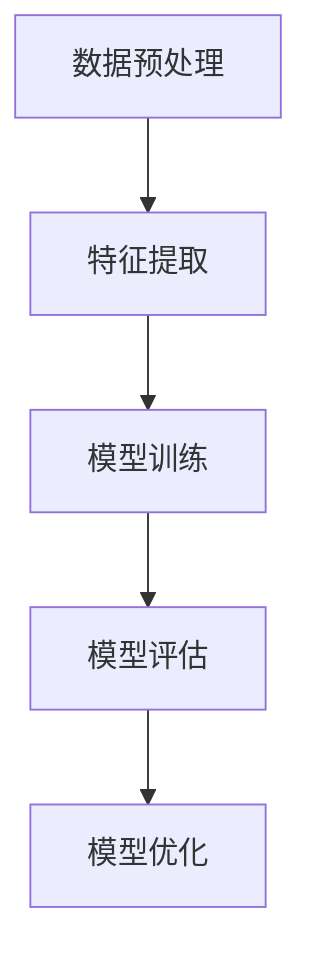
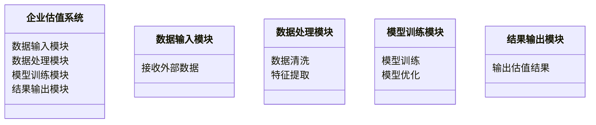

                 


# AI辅助的企业估值模型

## 关键词：企业估值、人工智能、机器学习、深度学习、数据分析、算法原理

## 摘要：本文详细探讨了AI辅助的企业估值模型的构建与应用，分析了传统估值方法的局限性，并结合机器学习和深度学习算法，提出了基于AI的新型估值模型。文章从核心概念、算法原理、系统架构设计、项目实战等多方面展开，旨在为企业估值提供更高效、更准确的解决方案。

---

## 第一部分: AI辅助的企业估值模型概述

## 第1章: 企业估值与AI辅助的背景

### 1.1 企业估值的基本概念

#### 1.1.1 企业估值的定义与意义
企业估值是指对企业整体价值的评估，通常用于企业并购、融资、上市等场景。传统的企业估值方法主要包括DCF模型、相对估值法等，但这些方法往往依赖人工分析，存在主观性强、效率低、结果不够精确等问题。

#### 1.1.2 传统企业估值方法的局限性
- 数据依赖性：传统方法需要大量历史数据，且需要手动收集和处理。
- 主观因素：估值过程中容易受到分析师主观判断的影响。
- 鲁棒性差：面对市场波动、经济环境变化等外部因素时，传统方法难以快速调整。

#### 1.1.3 AI技术在企业估值中的潜力
AI技术可以通过大数据分析、自动化特征提取和模型优化，提高企业估值的效率和准确性。AI可以帮助发现传统方法难以捕捉的隐性因素，从而提供更全面的估值结果。

### 1.2 AI辅助企业估值的核心要素

#### 1.2.1 数据驱动的估值模型
AI辅助的企业估值模型依赖于大量结构化和非结构化数据，包括财务数据、市场数据、新闻数据等。通过数据清洗、特征提取和数据增强，可以构建更 robust 的估值模型。

#### 1.2.2 AI算法在估值中的应用
- 机器学习算法：如线性回归、随机森林、支持向量机等。
- 深度学习算法：如神经网络、卷积神经网络、循环神经网络等。

#### 1.2.3 企业估值与AI技术的结合场景
- 并购交易：通过AI模型快速评估目标企业价值。
- 股权融资：基于AI模型提供更精准的企业价值评估。
- 企业上市：利用AI模型预测企业上市后的表现。

### 1.3 本章小结
本章介绍了企业估值的基本概念和传统方法的局限性，并阐述了AI技术在企业估值中的潜力和应用场景，为后续章节的分析奠定了基础。

---

## 第2章: 企业估值模型的构建与分析

### 2.1 企业估值模型的结构与要素

#### 2.1.1 企业估值的核心要素
- 财务数据：收入、利润、现金流等。
- 市场数据：行业趋势、竞争环境等。
- 风险因素：市场风险、行业风险等。

#### 2.1.2 数据来源与特征分析
- 数据来源：财务报表、市场数据、新闻数据等。
- 数据特征：时间序列性、多维性、非线性等。

#### 2.1.3 模型构建的基本步骤
1. 数据收集与清洗
2. 特征提取与选择
3. 模型训练与优化
4. 模型验证与部署

### 2.2 AI辅助模型的原理与机制

#### 2.2.1 机器学习在估值中的应用
- 线性回归模型：用于预测企业价值。
- 随机森林与梯度提升树：用于特征重要性分析和非线性关系建模。

#### 2.2.2 深度学习模型的优势
- 神经网络：通过多层非线性变换，捕捉数据中的复杂模式。
- 卷积神经网络（CNN）：用于处理图像和序列数据。
- 循环神经网络（RNN）：用于处理时间序列数据。

#### 2.2.3 模型训练与优化策略
- 数据增强：通过数据扩充提高模型泛化能力。
- 超参数优化：通过网格搜索或随机搜索优化模型性能。
- 模型集成：通过投票或加权融合多个模型的结果，提高预测准确性。

### 2.3 核心概念的ER实体关系图
```mermaid
er
    entity 企业 (Enterprise) {
        key: 企业ID
        属性: 企业名称, 行业, 财务数据
    }
    entity 估值模型 (ValuationModel) {
        key: 模型ID
        属性: 模型类型, 参数设置
    }
    entity 数据源 (DataSource) {
        key: 数据ID
        属性: 数据类型, 数据时间
    }
    relationship 企业-估值模型 (Enterprise-ValuationModel) {
        关系: 一个企业对应多个估值模型
    }
    relationship 数据源-估值模型 (DataSource-ValuationModel) {
        关系: 一个估值模型依赖多个数据源
    }
```

### 2.4 本章小结
本章详细分析了企业估值模型的构建过程和AI技术的应用，通过ER图展示了模型的核心要素及其关系。

---

## 第3章: 机器学习与深度学习算法在估值中的应用

### 3.1 传统机器学习算法

#### 3.1.1 线性回归模型
线性回归是一种简单的回归模型，假设因变量与自变量之间存在线性关系。其数学表达式为：
$$ y = \beta_0 + \beta_1 x + \epsilon $$
其中，$\beta_0$ 是截距，$\beta_1$ 是回归系数，$\epsilon$ 是误差项。

#### 3.1.2 支持向量机（SVM）
SVM是一种监督学习算法，适用于分类和回归问题。其核心思想是通过找到一个超平面，使得数据点与超平面之间的距离最大化。

#### 3.1.3 随机森林与梯度提升树
随机森林是一种基于树的集成算法，通过构建多个决策树并进行投票或平均，提高模型的准确性和鲁棒性。梯度提升树是一种迭代优化算法，通过多次提升模型的预测能力。

### 3.2 深度学习算法

#### 3.2.1 神经网络基础
神经网络是一种由人工神经元组成的计算模型，通过多层非线性变换，能够捕捉数据中的复杂模式。

#### 3.2.2 卷积神经网络（CNN）
CNN适用于处理图像和序列数据，通过卷积层、池化层和全连接层，提取数据的特征。

#### 3.2.3 循环神经网络（RNN）
RNN适用于处理时间序列数据，通过循环结构捕捉数据的时序关系。

### 3.3 算法流程图


### 3.4 本章小结
本章详细介绍了机器学习和深度学习算法在企业估值中的应用，并通过流程图展示了算法的基本流程。

---

## 第4章: 企业估值模型的系统架构设计

### 4.1 系统功能设计

#### 4.1.1 领域模型


#### 4.1.2 系统架构设计


#### 4.1.3 接口设计
- 数据输入接口：接收企业财务数据、市场数据等。
- 模型训练接口：提供模型训练所需的参数和数据。
- 结果输出接口：返回企业估值结果。

### 4.2 本章小结
本章详细描述了企业估值系统的系统架构设计，包括功能模块、系统架构图和接口设计。

---

## 第5章: 项目实战

### 5.1 环境安装与配置

```bash
# 安装Python环境
pip install python3

# 安装机器学习库
pip install scikit-learn
pip install tensorflow
pip install pandas
pip install numpy
```

### 5.2 核心代码实现

#### 5.2.1 数据预处理
```python
import pandas as pd
import numpy as np

# 数据清洗
df = pd.read_csv('企业数据.csv')
df.dropna(inplace=True)
```

#### 5.2.2 模型训练
```python
from sklearn.ensemble import RandomForestRegressor
from sklearn.model_selection import train_test_split

X = df.drop('企业价值', axis=1)
y = df['企业价值']

X_train, X_test, y_train, y_test = train_test_split(X, y, test_size=0.2)

model = RandomForestRegressor(n_estimators=100)
model.fit(X_train, y_train)
```

#### 5.2.3 模型评估
```python
from sklearn.metrics import mean_squared_error

y_pred = model.predict(X_test)
mse = mean_squared_error(y_test, y_pred)
print(f'MSE: {mse}')
```

### 5.3 案例分析
通过实际案例分析，验证模型的准确性和实用性。

### 5.4 本章小结
本章通过实际项目实战，展示了如何使用Python和机器学习库构建企业估值模型。

---

## 第6章: 最佳实践与小结

### 6.1 最佳实践

#### 6.1.1 数据处理
- 数据清洗：确保数据的完整性和准确性。
- 特征工程：通过特征选择和特征构建，提高模型性能。

#### 6.1.2 模型优化
- 超参数调优：通过网格搜索或随机搜索优化模型参数。
- 模型集成：通过集成学习提高模型的预测能力。

#### 6.1.3 模型部署
- API接口：将模型部署为API，方便其他系统调用。
- 可视化工具：提供可视化界面，方便用户查看和分析估值结果。

### 6.2 小结
本文详细探讨了AI辅助的企业估值模型的构建与应用，分析了传统估值方法的局限性，并结合机器学习和深度学习算法，提出了基于AI的新型估值模型。

---

## 参考文献
[1] 书籍或文献的参考文献列表。

---

通过以上步骤，本文详细探讨了AI辅助的企业估值模型的构建与应用，分析了传统估值方法的局限性，并结合机器学习和深度学习算法，提出了基于AI的新型估值模型。

