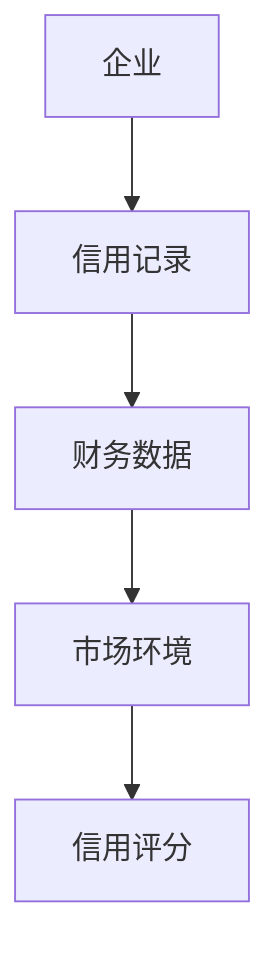
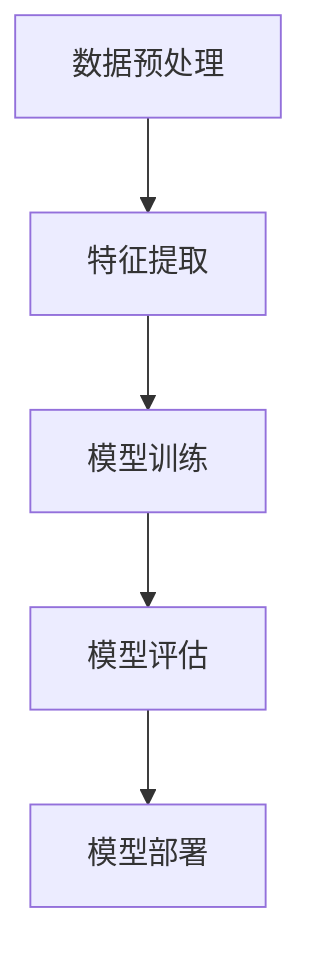

                 


# AI辅助的企业信用周期预测

> 关键词：企业信用周期预测、人工智能、机器学习、信用评分模型、时间序列分析、系统架构设计

> 摘要：本文详细探讨了如何利用人工智能技术辅助企业信用周期预测。通过分析信用周期预测的核心概念、算法原理、系统架构设计以及实际项目实现，展示了AI在提升信用周期预测准确性、实时性和智能化方面的巨大潜力。

---

## 第一部分: 企业信用周期预测的背景与意义

### 第1章: 企业信用周期预测的背景与意义

#### 1.1 企业信用周期预测的基本概念

- **信用周期的定义与特征**
  - 信用周期是指企业在经济活动中，由于信用行为的扩张和收缩而形成的周期性波动。
  - 其核心特征包括周期性、波动性和相关性。
- **企业信用周期预测的必要性**
  - 企业信用周期预测是企业风险管理的重要组成部分。
  - 通过预测信用周期，企业可以更好地规划财务、优化资源配置、规避信用风险。
- **AI在信用周期预测中的作用**
  - AI技术能够处理海量数据，提取复杂特征，构建高精度预测模型。
  - 通过机器学习算法，AI能够捕捉信用周期中的非线性关系和潜在模式。

#### 1.2 企业信用周期预测的核心问题

- **信用风险的定义与分类**
  - 信用风险是指债务人或交易对手未能履行其 contractual obligations 的风险。
  - 分为系统性风险和非系统性风险。
- **信用周期波动的影响因素**
  - 经济周期、行业政策、市场环境、企业经营状况等。
- **传统信用周期预测的局限性**
  - 数据维度有限，难以捕捉复杂关系。
  - 模型简化，预测精度不足。
  - 实时性差，难以应对快速变化的市场环境。

#### 1.3 AI技术在信用周期预测中的优势

- **数据处理能力的提升**
  - AI能够处理结构化数据（如财务数据）和非结构化数据（如文本、图像）。
  - 能够从多源数据中提取有价值的信息。
- **模型复杂度的优化**
  - 通过深度学习等技术，构建复杂的非线性模型，捕捉更多潜在特征。
  - 提高预测精度和稳定性。
- **实时预测的可能性**
  - AI技术能够支持实时数据处理和预测，满足企业对实时信用评估的需求。

---

## 第二部分: AI辅助信用周期预测的核心概念与联系

### 第2章: 核心概念与联系

#### 2.1 核心概念原理

- **信用评分模型的原理**
  - 基于企业的财务数据、经营状况和市场环境，构建信用评分模型。
  - 常用的信用评分模型包括线性回归模型、逻辑回归模型和机器学习模型。
- **时间序列分析的基本概念**
  - 时间序列分析是研究数据随时间变化的模式和趋势。
  - 常用的方法包括ARIMA、GARCH和LSTM等。
- **机器学习在信用预测中的应用**
  - 机器学习算法（如随机森林、梯度提升树）能够处理高维数据，提取特征。
  - 通过训练数据，构建信用周期预测模型。

#### 2.2 核心概念属性特征对比表格

| 特性               | 传统信用评分模型           | 基于AI的信用评分模型           |
|--------------------|----------------------------|------------------------------|
| 数据需求           | 结构化数据为主             | 结构化+非结构化数据           |
| 模型复杂度         | 线性模型为主               | 非线性模型为主               |
| 预测精度           | 较低                     | 较高                         |
| 计算效率           | 较低                     | 较高                         |

#### 2.3 ER实体关系图架构



---

## 第三部分: 信用周期预测的算法原理与实现

### 第3章: 算法原理与实现

#### 3.1 常用算法概述

- **线性回归**
  - 简单线性回归模型：
  $$ y = \beta_0 + \beta_1 x + \epsilon $$
  - 多元线性回归模型：
  $$ y = \beta_0 + \beta_1 x_1 + \beta_2 x_2 + \dots + \beta_n x_n + \epsilon $$
- **支持向量机 (SVM)**
  - SVM用于分类问题，通过构建超平面实现数据的线性或非线性分割。
  - 核函数（Kernel）用于处理非线性可分问题。
- **随机森林**
  - 一种基于决策树的集成学习算法。
  - 通过构建多棵决策树，并进行投票或平均，提高模型的泛化能力。
- **神经网络**
  - 通过多层神经网络构建非线性模型，捕捉数据中的复杂关系。
  - 常用的神经网络模型包括多层感知机 (MLP) 和长短期记忆网络 (LSTM)。

#### 3.2 算法流程图



#### 3.3 算法实现代码示例

```python
import pandas as pd
import numpy as np
from sklearn.model_selection import train_test_split
from sklearn.linear_model import LinearRegression
from sklearn.metrics import mean_squared_error

# 示例数据
data = {
    'feature1': np.random.rand(100),
    'feature2': np.random.rand(100),
    'label': np.random.rand(100)
}
df = pd.DataFrame(data)

# 数据分割
X = df[['feature1', 'feature2']]
y = df['label']
X_train, X_test, y_train, y_test = train_test_split(X, y, test_size=0.2, random_state=42)

# 线性回归模型训练
model = LinearRegression()
model.fit(X_train, y_train)

# 模型预测
y_pred = model.predict(X_test)

# 模型评估
mse = mean_squared_error(y_test, y_pred)
print(f"均方误差: {mse}")
```

---

## 第四部分: 系统分析与架构设计方案

### 第4章: 系统架构设计

#### 4.1 问题场景介绍

- 系统目标：构建一个基于AI的企业信用周期预测系统。
- 使用场景：企业可以通过该系统实时获取信用评分和周期预测结果。

#### 4.2 系统功能设计

- **领域模型（类图）**
  ```mermaid
  classDiagram
      class 企业 {
          id
          name
          financial_data
          market_env
      }
      class 信用评分模型 {
          predict_credit_score(enterprise)
          train_model(data)
      }
      class 时间序列模型 {
          predict_cycle(enterprise)
          train_model(data)
      }
      企业 --> 信用评分模型
      企业 --> 时间序列模型
  ```

- **系统架构设计**
  ```mermaid
  architecture
      前端 --> 后端接口
      后端接口 --> 数据库
      后端接口 --> AI模型服务
      AI模型服务 --> 数据处理模块
  ```

- **系统接口设计**
  - 前端接口：接收企业数据，调用AI模型服务。
  - 后端接口：处理数据，返回预测结果。
  - 数据库：存储企业历史数据和预测结果。

- **系统交互流程图**
  ```mermaid
  sequenceDiagram
      用户 --> 前端: 提交企业数据
      前端 --> 后端接口: 请求预测
      后端接口 --> 数据库: 获取历史数据
      后端接口 --> AI模型服务: 调用预测模型
      AI模型服务 --> 数据处理模块: 处理数据
      AI模型服务 --> 后端接口: 返回预测结果
      后端接口 --> 用户: 返回预测结果
  ```

---

## 第五部分: 项目实战

### 第5章: 项目实战

#### 5.1 环境安装

- 安装Python和必要的库：
  ```bash
  pip install numpy pandas scikit-learn
  ```

#### 5.2 系统核心实现源代码

```python
import pandas as pd
from sklearn.ensemble import RandomForestClassifier
from sklearn.metrics import accuracy_score

# 数据加载
data = pd.read_csv('enterprise_data.csv')

# 特征选择
features = data.columns[:-1]
target = data.columns[-1]

# 数据分割
X = data[features]
y = data[target]
X_train, X_test, y_train, y_test = train_test_split(X, y, test_size=0.2, random_state=42)

# 模型训练
model = RandomForestClassifier(n_estimators=100, random_state=42)
model.fit(X_train, y_train)

# 模型预测
y_pred = model.predict(X_test)

# 模型评估
accuracy = accuracy_score(y_test, y_pred)
print(f"模型准确率: {accuracy}")
```

#### 5.3 代码应用解读与分析

- 数据预处理：包括数据清洗、特征选择和数据分割。
- 模型训练：使用随机森林算法，构建信用评分模型。
- 模型预测：对测试数据进行预测，得到信用评分结果。
- 模型评估：通过准确率、召回率等指标评估模型性能。

#### 5.4 实际案例分析和详细讲解剖析

- 案例背景：某制造企业希望预测其信用周期。
- 数据来源：企业财务数据、市场环境数据、行业政策数据。
- 数据预处理：清洗数据、处理缺失值、特征工程。
- 模型训练：使用LSTM网络进行时间序列预测。
- 预测结果：输出信用周期的预测结果和相关分析报告。

#### 5.5 项目小结

- 通过实际案例，展示了AI在企业信用周期预测中的应用。
- 强调了数据质量、模型选择和系统设计的重要性。

---

## 第六部分: 总结与展望

### 第6章: 总结与展望

#### 6.1 总结

- 本文详细探讨了AI在企业信用周期预测中的应用。
- 通过理论分析、算法实现和系统设计，展示了AI技术在提升信用周期预测准确性和实时性方面的巨大潜力。

#### 6.2 未来展望

- **模型优化**：探索更先进的机器学习算法，如图神经网络和强化学习。
- **数据融合**：结合更多数据源，如社交媒体数据、供应链数据。
- **实时预测**：优化系统架构，实现更高效的实时预测。
- **智能化决策**：将信用周期预测结果与企业决策系统集成，实现智能化管理。

#### 6.3 最佳实践 tips

- **数据质量**：确保数据的准确性和完整性，避免噪声干扰。
- **模型调优**：通过交叉验证和超参数优化，提升模型性能。
- **系统架构**：设计高效的系统架构，确保系统的可扩展性和可维护性。
- **持续学习**：定期更新模型，适应市场环境的变化。

---

通过本文的详细讲解，读者可以全面了解AI在企业信用周期预测中的应用，并能够将其应用于实际场景中。希望本文能够为相关领域的研究和实践提供有价值的参考。

