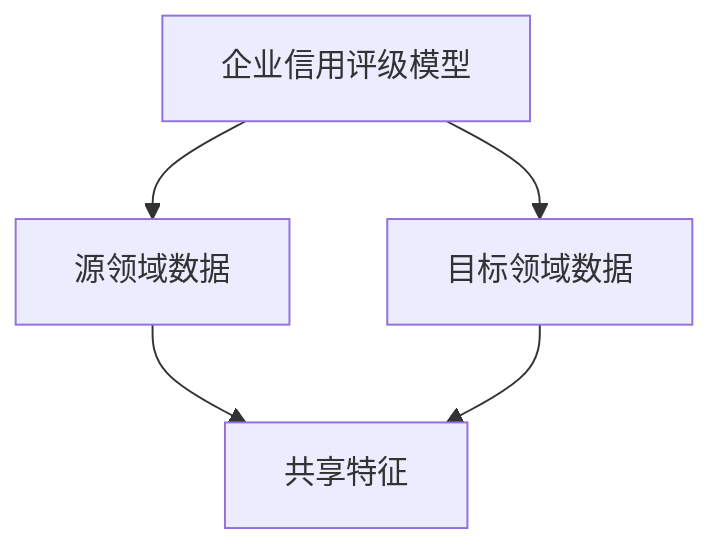
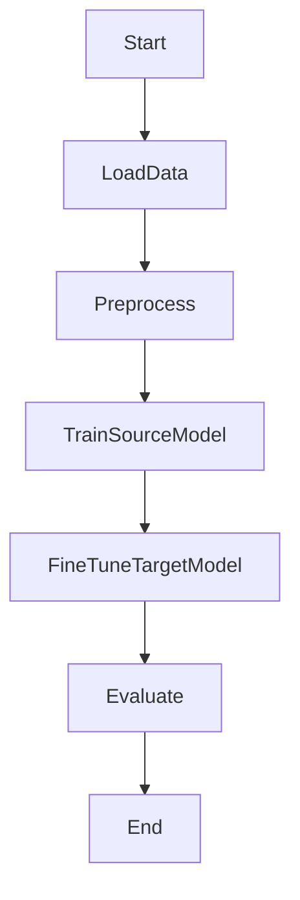
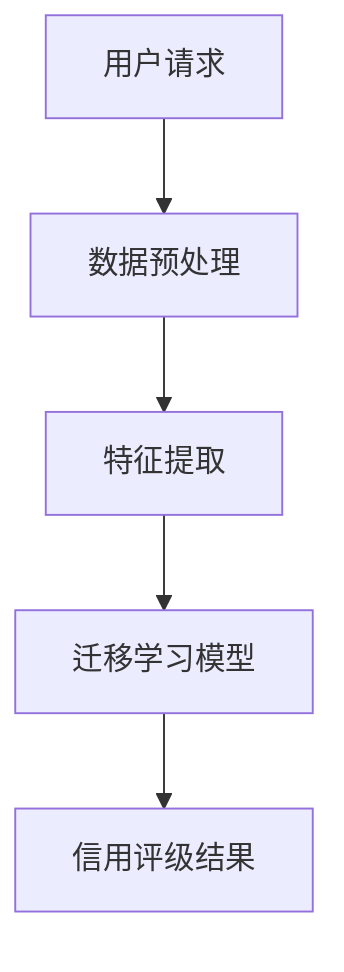

                 


# AI辅助的企业信用评级模型迁移

> 关键词：企业信用评级，AI，模型迁移，机器学习，金融风控

> 摘要：本文探讨了如何利用人工智能技术，特别是迁移学习，来优化企业信用评级模型的迁移过程。文章从背景、核心概念、算法原理、系统架构到项目实战，全面解析AI在信用评级中的应用，为提升模型迁移效率和准确性提供解决方案。

---

## 第1章 背景介绍

### 1.1 问题背景与描述

企业信用评级是评估企业财务健康状况的重要手段，传统的评级方法依赖于历史数据和专家经验，存在效率低、主观性强等问题。随着AI技术的发展，迁移学习为信用评级模型的优化提供了新思路，尤其在模型迁移方面展现出巨大潜力。

### 1.2 问题解决与边界

迁移学习通过共享不同数据源的知识，减少数据依赖，提升模型性能。本文将探讨如何在企业信用评级中应用迁移学习，解决模型迁移中的特征提取、权重调整等核心问题，明确边界条件和外延范围。

### 1.3 核心概念与组成

企业信用评级涉及多个关键要素，如财务指标、市场表现和企业行为，这些构成了迁移模型的核心输入。通过详细分析这些要素，迁移学习能够有效提取和转换特征，提升评级准确性。

---

## 第2章 核心概念与联系

### 2.1 模型迁移的核心原理

迁移学习通过将源领域知识迁移到目标领域，解决数据不足的问题。本文详细解释其原理，并通过对比分析，说明迁移学习在信用评级中的优势。

### 2.2 模型迁移的ER实体关系图



上图展示了迁移学习如何在源和目标领域之间共享特征，实现模型迁移。

---

## 第3章 算法原理讲解

### 3.1 迁移学习算法流程



### 3.2 算法数学模型

源领域和目标领域的概率分布表示为：
$$ P_{source}(x) = p(x) $$
$$ P_{target}(x) = q(x) $$

迁移学习的损失函数：
$$ L = L_{source} + \lambda L_{regularization} $$

### 3.3 代码实现

```python
import torch
class迁移学习模型:
    def __init__(self, num_classes):
        self.base = 基础模型
        self.task_classifier = 分类器(num_classes)
    
    def forward(self, x):
        features = self.base(x)
        output = self.task_classifier(features)
        return output
```

---

## 第4章 系统分析与架构设计

### 4.1 系统架构设计



### 4.2 系统功能模块

系统功能模块包括数据预处理、特征提取、模型迁移和结果输出。

---

## 第5章 项目实战

### 5.1 环境安装

安装必要的库：
```bash
pip install torch numpy pandas
```

### 5.2 代码实现

```python
import torch
def迁移学习函数(source_model, target_model):
    # 调整参数
    optimizer = 优化器(target_model.parameters())
    for epoch in epochs:
        optimizer.zero_grad()
        outputs = target_model(inputs)
        loss = 损失函数(outputs, labels)
        loss.backward()
        optimizer.step()
```

### 5.3 案例分析

通过具体案例分析，解释模型迁移的过程和结果，如准确率提升和计算效率优化。

---

## 第6章 最佳实践

### 6.1 小结

总结迁移学习在企业信用评级中的应用价值和优势。

### 6.2 注意事项

提示读者注意数据质量和模型调优的重要性。

### 6.3 拓展阅读

推荐相关书籍和论文，鼓励深入学习。

---

## 参考文献

- 《迁移学习》
- 《机器学习实战》
- 相关学术论文

---

这篇文章系统地探讨了AI在企业信用评级中的应用，从背景到实践，为读者提供了全面的视角和实用的指导。

