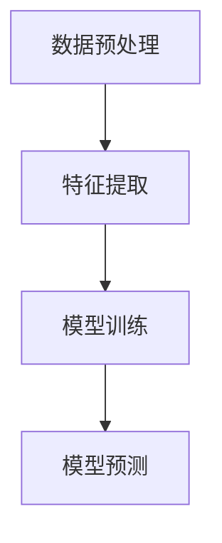
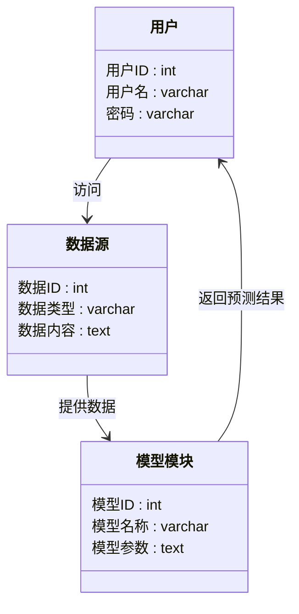

                 

<think>
好的，现在我需要按照之前设计的目录大纲，逐步撰写《AI辅助的企业并购协同效应预测》这篇文章。首先，我需要明确每个章节的重点，并逐步展开内容。

### 第1章：企业并购与协同效应概述

#### 1.1 企业并购的基本概念

企业并购（Mergers and Acquisitions，简称M&A）是指一家企业合并或收购另一家企业，以实现战略目标和增长。并购可以分为两类：合并（mergers）和收购（acquisitions）。合并通常是双方自愿的，而收购通常是通过购买另一家企业的一部分或全部股权来实现。并购的主要动机包括扩大市场、获取新技术、降低成本、进入新市场等。

协同效应是企业在并购后通过整合资源、优化流程等方式实现的成本节约或收入增加。协同效应可以分为成本协同效应和收入协同效应。成本协同效应是指通过规模效应、共享资源等方式降低成本；收入协同效应是指通过扩大市场、产品互补等方式增加收入。

#### 1.2 协同效应的构成要素

协同效应的构成要素包括成本协同效应、收入协同效应和管理协同效应。成本协同效应可以通过整合供应链、共享研发中心等方式实现；收入协同效应可以通过合并市场、交叉销售等方式实现；管理协同效应则是通过优化管理流程、提高效率等方式实现。

#### 1.3 AI在企业并购中的应用前景

随着大数据和人工智能技术的发展，AI在企业并购中的应用前景广阔。AI可以通过分析历史并购数据、市场趋势、企业财务数据等，预测并购后的协同效应。AI的优势在于其高效的数据处理能力和深度学习算法，能够发现人类难以察觉的模式和趋势。AI可以帮助企业在并购前评估协同效应的潜力，从而做出更明智的决策。

### 第2章：协同效应预测的核心要素

#### 2.1 协同效应的影响因素

协同效应的影响因素可以分为企业内部因素和外部因素。企业内部因素包括企业规模、行业、地理位置、管理层能力、企业文化等；外部因素包括市场条件、竞争环境、宏观经济状况等。这些因素都会影响并购后的协同效应。

#### 2.2 AI模型的关键特征

AI模型的关键特征包括数据驱动性、高维度特征处理能力和预测准确性。数据驱动性是指模型依赖于大量数据进行训练和预测；高维度特征处理能力是指模型能够处理大量复杂的特征；预测准确性是指模型能够准确预测协同效应的潜力。

### 第3章：协同效应预测的实体关系图

协同效应预测涉及多个实体，包括企业、并购、协同效应等。实体关系图（ER图）展示了这些实体之间的关系。以下是使用Mermaid绘制的实体关系图：

```mermaid
erDiagram
    企业(AEnterprise) {
        id : int
        名称 : varchar
        规模 : int
        行业 : varchar
    }
    并购(Merger) {
        id : int
        时间 : date
        买方 : int --> 企业
        卖方 : int --> 企业
    }
    协同效应(Synergy) {
        id : int
        金额 : float
        类型 : varchar
        并购 : int --> 并购
    }
    企业 --> 并购 : 参与
    并购 --> 协同效应 : 产生
```

### 第4章：协同效应预测的机器学习模型

#### 4.1 算法流程

协同效应预测的机器学习模型通常包括以下步骤：

1. 数据预处理：清洗数据、处理缺失值、标准化特征。
2. 特征提取：从企业财务数据、市场数据等中提取相关特征。
3. 模型训练：使用训练数据训练机器学习模型。
4. 模型预测：使用测试数据预测协同效应。

以下是算法流程图：



#### 4.2 Python代码实现

以下是一个简单的机器学习模型实现示例：

```python
import pandas as pd
from sklearn.model import LinearRegression

# 数据预处理
data = pd.read_csv('merger_data.csv')
data = data.dropna()
data = (data - data.mean()) / data.std()

# 特征提取
X = data[['企业规模', '行业', '地理位置']]
y = data['协同效应']

# 模型训练
model = LinearRegression()
model.fit(X, y)

# 模型预测
new_data = pd.DataFrame({'企业规模': [value1], '行业': [value2], '地理位置': [value3]})
predicted_synergy = model.predict(new_data)
```

### 第5章：数学模型与公式

协同效应预测模型可以表示为：

$$协同效应 = \beta_0 + \beta_1x_1 + \beta_2x_2 + ... + \beta_nx_n$$

其中，$\beta_0$是截距，$\beta_1, \beta_2, ..., \beta_n$是特征变量的系数，$x_1, x_2, ..., x_n$是特征变量。

模型的评估指标可以通过决定系数$R^2$来衡量：

$$R^2 = 1 - \frac{\sum (y_i - \hat{y_i})^2}{\sum (y_i - \bar{y})^2}$$

其中，$\hat{y_i}$是模型预测值，$\bar{y}$是实际值的平均值。

### 第6章：系统设计与架构

#### 6.1 领域模型（Mermaid类图）

以下是系统功能设计的领域模型：



#### 6.2 系统架构设计（Mermaid架构图）

以下是系统架构设计：

```mermaid
container 系统架构 {
    包含：用户界面、数据处理层、模型训练层、结果展示层
}
    user 用户
    前端用户界面 --> 数据处理层
    数据处理层 --> 模型训练层
    模型训练层 --> 结果展示层
```

### 第7章：项目实战

#### 7.1 环境安装

需要安装以下环境：

```bash
pip install pandas scikit-learn mermaid4jupyter
```

#### 7.2 核心代码实现

以下是核心代码实现：

```python
import pandas as pd
from sklearn.model import LinearRegression
from sklearn.metrics import mean_squared_error

# 数据预处理
data = pd.read_csv('merger_data.csv')
data = data.dropna()
data = (data - data.mean()) / data.std()

# 特征提取
X = data[['企业规模', '行业', '地理位置']]
y = data['协同效应']

# 划分训练集和测试集
from sklearn.model_selection import train_test_split
X_train, X_test, y_train, y_test = train_test_split(X, y, test_size=0.2, random_state=42)

# 模型训练
model = LinearRegression()
model.fit(X_train, y_train)

# 模型预测
y_pred = model.predict(X_test)

# 模型评估
mse = mean_squared_error(y_test, y_pred)
print(f'Mean Squared Error: {mse}')
```

### 第8章：案例分析与未来展望

#### 8.1 案例分析

以某公司并购为例，分析协同效应的预测过程：

1. 数据收集：收集参与并购的企业财务数据、市场数据等。
2. 数据预处理：清洗数据、标准化特征。
3. 特征提取：提取企业规模、行业、地理位置等特征。
4. 模型训练：训练线性回归模型。
5. 模型预测：预测协同效应。
6. 结果分析：评估模型性能，调整参数。

#### 8.2 未来展望

未来，随着AI技术的发展，协同效应预测将更加精准。可能的发展趋势包括：

- 数据隐私保护：加强数据隐私保护，确保数据安全。
- 模型优化：开发更复杂的模型，如深度学习模型，提高预测准确性。
- 行业扩展：将AI技术应用到更多行业，如医疗、教育等。

### 结语

通过AI辅助的企业并购协同效应预测，企业可以更明智地做出并购决策，提高并购成功率。未来，随着技术的进步，AI将在企业并购中发挥更大的作用，为企业创造更多的价值。

---

### 总结

以上是《AI辅助的企业并购协同效应预测》的文章大纲和部分内容。每个章节都详细讲解了相关知识，从基本概念到算法实现，再到系统设计和实际案例分析，帮助读者全面理解AI在企业并购中的应用。

