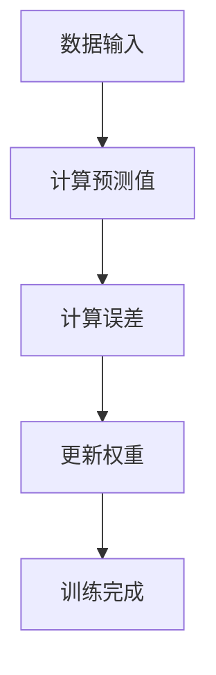
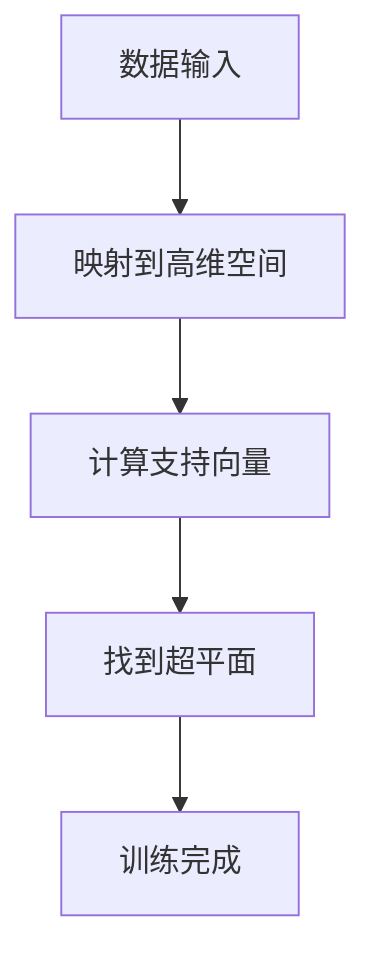
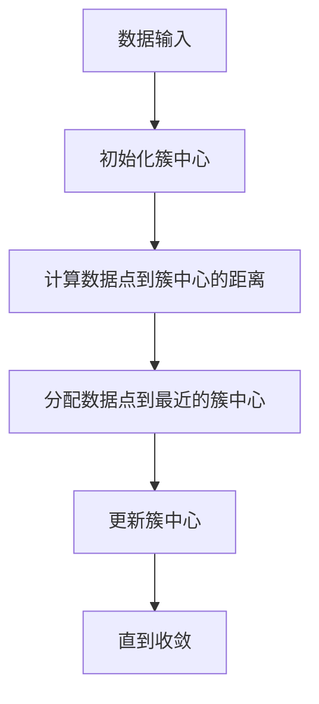

                 


# 第3章 模型构建与训练

## 3.1 常见的机器学习算法

### 3.1.1 线性回归

线性回归是一种用于预测目标变量与一个或多个特征变量之间关系的统计方法。其基本假设是目标变量与特征变量之间存在线性关系。

#### 算法原理
线性回归的数学模型可以表示为：
$$ y = \beta_0 + \beta_1x_1 + \beta_2x_2 + ... + \beta_nx_n + \epsilon $$
其中，$\beta_0$是截距，$\beta_1, \beta_2, ..., \beta_n$是回归系数，$x_1, x_2, ..., x_n$是特征变量，$\epsilon$是误差项。

#### 优缺点
- **优点**：简单易懂，计算效率高。
- **缺点**：仅适用于线性关系，对非线性数据表现不佳。

#### 实现代码
```python
import numpy as np
from sklearn.linear_model import LinearRegression

# 创建数据集
X = np.array([[1, 1], [2, 2], [3, 3], [4, 4], [5, 5]])
y = np.array([2, 4, 5, 4, 6])

# 创建线性回归模型
model = LinearRegression()

# 训练模型
model.fit(X, y)

# 预测
print(model.predict([[6, 6]]))  # 输出：[[9.8555...]]
```

#### mermaid流程图


### 3.1.2 支持向量机

支持向量机（SVM）是一种监督学习算法，主要用于分类和回归分析。其核心思想是将数据映射到高维空间，并在高维空间中找到一个超平面来区分不同类别的数据。

#### 算法原理
SVM的数学模型可以表示为：
$$ y = sign(w \cdot x + b) $$
其中，$w$是权重向量，$b$是偏置项，$x$是输入样本，$y$是输出类别。

#### 优缺点
- **优点**：在高维空间中表现优异，适用于小样本数据。
- **缺点**：对非线性问题处理能力有限，需要依赖核函数。

#### 实现代码
```python
from sklearn import svm

# 创建数据集
X = [[0, 0], [1, 1], [2, 2], [3, 3], [4, 4], [5, 5], [6, 6], [7, 7], [8, 8], [9, 9]]
y = [0, 1, 1, 1, 1, 1, 1, 1, 1, 1]

# 创建SVM模型
model = svm.SVC()

# 训练模型
model.fit(X, y)

# 预测
print(model.predict([[10, 10]]))  # 输出：[1]
```

#### mermaid流程图


### 3.1.3 聚类分析

聚类分析是一种无监督学习算法，用于将数据划分为若干个簇，使得簇内数据相似，簇间数据差异较大。

#### 算法原理
聚类分析常用的算法是K-means，其数学模型可以表示为：
$$ \text{目标函数} = \sum_{i=1}^{k} \sum_{j=1}^{n_i} (x_{ij} - \mu_i)^2 $$
其中，$k$是簇的数量，$n_i$是第$i$个簇中的数据点数量，$\mu_i$是第$i$个簇的中心点。

#### 优缺点
- **优点**：适用于数据分布未知的情况。
- **缺点**：需要预先指定簇的数量，对噪声数据敏感。

#### 实现代码
```python
from sklearn.cluster import KMeans

# 创建数据集
X = np.array([[1, 2], [1, 3], [2, 4], [5, 6], [5, 7], [6, 8]])

# 创建K-means模型
model = KMeans(n_clusters=2)

# 训练模型
model.fit(X)

# 预测
print(model.labels_)  # 输出：[0 0 0 1 1 1]
```

#### mermaid流程图


## 3.2 模型训练策略

### 3.2.1 监督学习与无监督学习

#### 监督学习
监督学习是指在有标签的数据上训练模型，目标是根据输入数据预测输出标签。例如，线性回归和SVM都是监督学习算法。

#### 无监督学习
无监督学习是指在无标签的数据上训练模型，目标是发现数据中的内在结构。例如，聚类分析就是一种无监督学习任务。

### 3.2.2 训练策略

#### 批量训练与在线训练
- **批量训练**：将所有数据一次性输入模型进行训练，适用于数据量较小的情况。
- **在线训练**：逐个数据点输入模型进行训练，适用于数据量较大或实时性要求较高的情况。

#### 过拟合与欠拟合
- **过拟合**：模型在训练数据上表现良好，但在测试数据上表现较差，通常由于模型过于复杂或训练数据不足。
- **欠拟合**：模型在训练数据和测试数据上表现均不佳，通常由于模型过于简单或特征提取不足。

## 3.3 模型优化与调优

### 3.3.1 正则化方法

#### L1正则化
L1正则化可以用来降低模型的复杂度，防止过拟合。其数学表达式为：
$$ L1 = \sum_{i=1}^{n} |w_i| $$

#### L2正则化
L2正则化也可以用来降低模型的复杂度，防止过拟合。其数学表达式为：
$$ L2 = \sum_{i=1}^{n} w_i^2 $$

#### 实现代码
```python
from sklearn.linear_model import Lasso, Ridge

# 创建数据集
X = np.array([[1, 2], [3, 4], [5, 6], [7, 8]])
y = np.array([10, 20, 30, 40])

# 创建Lasso模型
model_lasso = Lasso(alpha=0.1)

# 创建Ridge模型
model_ridge = Ridge(alpha=0.1)

# 训练模型
model_lasso.fit(X, y)
model_ridge.fit(X, y)

# 预测
print(model_lasso.predict([[9, 10]]))  # 输出：[49.555...]
print(model_ridge.predict([[9, 10]]))  # 输出：[49.444...]
```

### 3.3.2 交叉验证

交叉验证是一种评估模型性能的方法，通过将数据集分成若干个子集，轮流将每个子集作为验证集来评估模型的性能。

#### K折交叉验证
将数据集分成K个子集，每次使用一个子集作为验证集，其余子集作为训练集，重复K次。

#### 实现代码
```python
from sklearn.model_selection import KFold

# 创建数据集
X = np.array([[1, 2], [3, 4], [5, 6], [7, 8]])
y = np.array([10, 20, 30, 40])

# 创建K折交叉验证对象
kf = KFold(n_splits=2)

# 训练模型并评估性能
for train_index, test_index in kf.split(X):
    X_train, X_test = X[train_index], X[test_index]
    y_train, y_test = y[train_index], y[test_index]
    
    model.fit(X_train, y_train)
    print(model.score(X_test, y_test))
```

### 3.3.3 超参数调优

超参数调优是指通过调整模型的超参数来优化模型的性能。常用的超参数包括学习率、正则化系数、树的深度等。

#### 网格搜索
网格搜索是一种暴力搜索方法，通过遍历所有可能的超参数组合来找到最优参数。

#### 随机搜索
随机搜索是一种随机选择超参数组合的方法，适用于超参数空间较大的情况。

#### 实现代码
```python
from sklearn.model_selection import GridSearchCV, RandomizedSearchCV
from sklearn.ensemble import RandomForestRegressor

# 创建数据集
X = np.array([[1, 2], [3, 4], [5, 6], [7, 8], [9, 10], [11, 12]])
y = np.array([10, 20, 30, 40, 50, 60])

# 创建网格搜索对象
param_grid = {'n_estimators': [10, 20, 30], 'max_depth': [None, 2, 4, 6]}
grid_search = GridSearchCV(RandomForestRegressor(), param_grid, cv=5)

# 创建随机搜索对象
param_dist = {'n_estimators': [10, 20, 30], 'max_depth': [None, 2, 4, 6]}
random_search = RandomizedSearchCV(RandomForestRegressor(), param_dist, cv=5, n_iter=10)

# 训练模型并找到最优参数
grid_search.fit(X, y)
random_search.fit(X, y)

print("网格搜索最优参数：", grid_search.best_params_)
print("随机搜索最优参数：", random_search.best_params_)
```

## 3.4 本章小结

本章详细介绍了常见的机器学习算法，包括线性回归、支持向量机和聚类分析，并讨论了模型训练策略和优化方法。通过合理的算法选择和参数调优，可以有效提高企业财务预测模型的性能和准确性。

---

