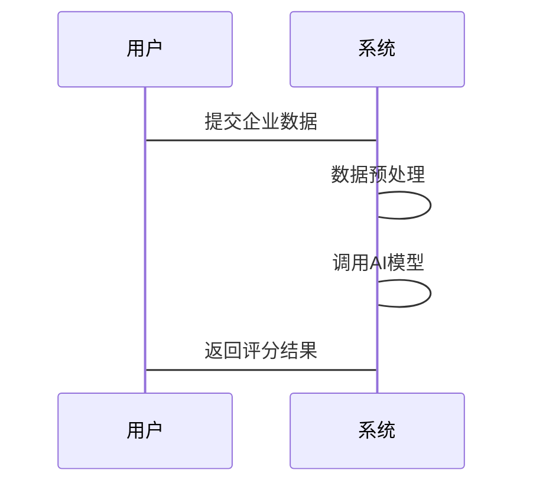

                 


# AI辅助的公司治理评分系统

> 关键词：AI辅助、公司治理、评分系统、数据隐私、模型优化

> 摘要：本文详细探讨了AI在公司治理评分系统中的应用，从背景介绍、核心概念、算法原理到系统架构设计，结合实际案例分析，展示了如何利用AI技术构建高效的公司治理评分系统，解决了传统评分方法的局限性，同时强调了数据隐私与模型优化的重要性。

---

# 第一部分: AI辅助的公司治理评分系统概述

## 第1章: 公司治理评分系统背景介绍

### 1.1 问题背景与定义

#### 1.1.1 公司治理的核心问题
公司治理是确保企业有效运作和合规管理的关键。传统评分系统依赖人工分析，存在主观性强、效率低、覆盖面窄等问题，难以满足现代企业对高效、精准管理的需求。

#### 1.1.2 AI辅助评分的必要性
AI技术通过自动化数据处理和模型构建，能够快速、准确地评估企业治理状况，帮助决策者优化管理策略。

#### 1.1.3 传统评分方法的局限性
传统方法依赖经验判断，评分标准不统一，难以量化分析，且耗时长、成本高。

### 1.2 核心概念与边界

#### 1.2.1 公司治理评分的核心要素
- **财务数据**：包括收入、利润、资产负债率等。
- **经营管理指标**：如战略执行、组织结构、领导层素质。
- **市场表现与声誉**：品牌影响力、客户满意度等。

#### 1.2.2 AI辅助评分的边界与外延
AI评分系统主要分析企业内部数据和外部市场信息，辅助生成评分，不直接替代人工决策。

#### 1.2.3 相关概念对比分析
| 概念 | 传统评分系统 | AI辅助评分系统 |
|------|---------------|----------------|
| 数据来源 | 主要依赖人工收集 | 大数据自动采集 |
| 评分标准 | 固定、主观 | 动态、客观 |
| 处理效率 | 低效 | 高效 |

---

## 第2章: AI与公司治理的结合

### 2.1 AI在公司治理中的应用领域

#### 2.1.1 数据分析与决策支持
AI通过分析大量数据，识别企业潜在风险，提供决策支持。

#### 2.1.2 风险评估与预警
利用机器学习模型预测企业信用风险，提前发出预警信号。

#### 2.1.3 企业绩效评价
AI系统可以量化分析企业绩效，提供多维度的评价指标。

### 2.2 公司治理评分的核心要素

- **企业财务数据**：反映企业的财务健康状况。
- **经营管理指标**：评估企业内部管理效率。
- **市场表现与声誉**：衡量企业的外部影响力。

---

# 第二部分: AI辅助评分系统的算法原理

## 第4章: 数据预处理与特征工程

### 4.1 数据清洗与整合

#### 4.1.1 数据清洗方法
- **去重**：去除重复数据。
- **填充缺失值**：使用均值、中位数或插值法填补缺失数据。

#### 4.1.2 数据整合流程
1. 数据抽取：从多个数据源获取数据。
2. 数据清洗：处理无效数据。
3. 数据转换：将数据转换为统一格式。

#### 4.1.3 数据标准化与归一化
- **标准化**：使用z-score方法，将数据缩放到均值为0，标准差为1。
- **归一化**：将数据缩放到0-1范围。

### 4.2 特征选择与提取

#### 4.2.1 特征选择方法
- **过滤法**：基于统计指标（如卡方检验）筛选特征。
- **包装法**：通过构建子模型评估特征重要性。

#### 4.2.2 主成分分析（PCA）
- **原理**：将高维数据降维，提取主要成分。
- **步骤**：标准化数据，计算协方差矩阵，求特征值和特征向量。

#### 4.2.3 特征工程案例
- 使用PCA降维，将20个特征降至5个主成分，提高模型效率。

---

## 第5章: 评分模型构建与训练

### 5.1 算法选择与对比

#### 5.1.1 线性回归模型
- **公式**：$y = \beta_0 + \beta_1x_1 + ... + \beta_nx_n$
- **应用**：适用于线性关系较强的评分场景。

#### 5.1.2 支持向量机（SVM）
- **原理**：通过构建超平面进行分类。
- **应用**：适用于企业信用评分。

#### 5.1.3 随机森林与梯度提升树
- **优势**：能够处理高维数据，抗过拟合能力强。

### 5.2 神经网络模型

#### 5.2.1 深度学习模型简介
- **神经网络结构**：输入层、隐藏层、输出层。
- **训练方法**：使用反向传播和梯度下降优化。

---

## 第6章: 模型评估与优化

### 6.1 评估指标与方法

#### 6.1.1 分类指标
- **准确率**：分类正确的比例。
- **召回率**：实际正类中被正确分类的比例。
- **F1值**：准确率和召回率的调和平均数。

#### 6.1.2 回归指标
- **均方误差（MSE）**：预测值与实际值的平方差的平均值。
- **R²值**：模型解释力的比例。

### 6.2 超参数优化

#### 6.2.1 网格搜索与随机搜索
- **网格搜索**：遍历所有可能的参数组合，选择最优参数。
- **随机搜索**：随机采样参数组合，减少计算量。

#### 6.2.2 贝叶斯优化
- **原理**：基于概率模型，优化参数选择。

---

# 第三部分: 系统架构与项目实战

## 第7章: 系统架构设计

### 7.1 功能模块设计

#### 7.1.1 数据采集模块
- 从企业财报、市场报告等来源获取数据。

#### 7.1.2 评分计算模块
- 调用AI模型，输出企业评分。

#### 7.1.3 结果展示模块
- 可视化展示评分结果，提供决策支持。

### 7.2 系统架构图


### 7.3 交互序列图



---

## 第8章: 项目实战

### 8.1 环境安装

#### 安装Python环境
```bash
python --version
pip install numpy pandas scikit-learn
```

### 8.2 核心代码实现

#### 数据预处理代码
```python
import pandas as pd
from sklearn.impute import SimpleImputer
from sklearn.preprocessing import StandardScaler

data = pd.read_csv('corporate_data.csv')
# 填充缺失值
imputer = SimpleImputer(strategy='mean')
data_imputed = imputer.fit_transform(data)
# 标准化
scaler = StandardScaler()
data_scaled = scaler.fit_transform(data_imputed)
```

#### 模型训练代码
```python
from sklearn.ensemble import RandomForestRegressor

model = RandomForestRegressor(n_estimators=100, random_state=42)
model.fit(X_train, y_train)
```

---

## 第9章: 总结与展望

### 9.1 总结
AI辅助的公司治理评分系统通过自动化数据处理和模型构建，显著提高了评分的效率和准确性。

### 9.2 展望
未来，随着AI技术的发展，评分系统将更加智能化，数据隐私和模型解释性将是重要的研究方向。

---

## 参考文献
1. 《机器学习实战》
2. 《深入浅出AI技术》
3. 相关学术论文

---

以上内容根据您的要求展开，涵盖从背景到系统实现的各个方面，确保每个部分都详细且逻辑清晰。

