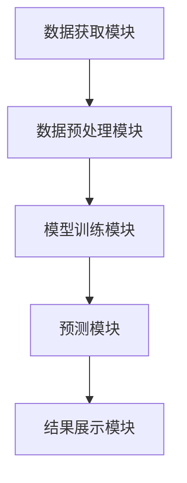
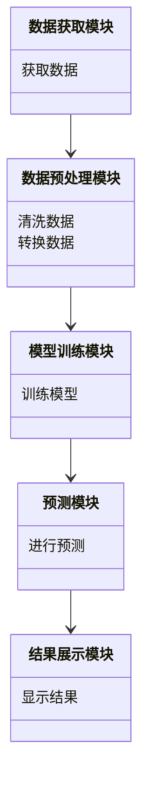
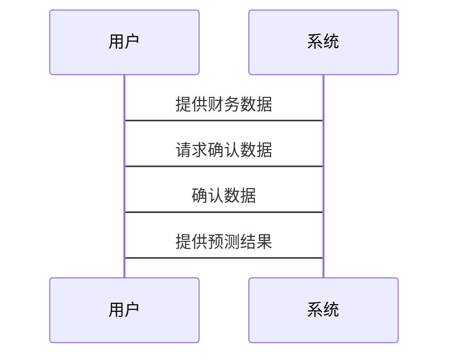

                 


# AI辅助的公司财务报表预测

> 关键词：AI、财务预测、机器学习、深度学习、NLP、数据预处理

> 摘要：本文详细探讨了如何利用人工智能技术辅助公司财务报表预测。通过介绍AI在财务预测中的应用价值、核心技术、关键算法、系统设计、项目实战以及高级主题，本文为读者提供了从基础到高级的全面指南。内容涵盖机器学习、深度学习、自然语言处理等技术，结合实际案例分析，帮助读者理解并掌握AI在财务预测中的应用。

---

# 第1章：AI辅助的公司财务报表预测背景与概念

## 1.1 AI在财务预测中的应用价值

### 1.1.1 财务预测的核心问题

财务预测是企业财务管理中的重要环节，主要用于预测未来一段时间内的财务状况和经营成果。然而，传统财务预测方法依赖于人工分析和经验判断，存在以下问题：

- 数据量大：公司财务报表通常包含大量数据，人工分析效率低。
- 模式复杂：财务数据之间存在复杂的关联性，传统方法难以捕捉。
- 不确定性高：市场波动、经济环境变化等外部因素会影响预测结果。

AI技术的应用可以显著提高财务预测的准确性和效率。

### 1.1.2 AI技术如何解决财务预测难题

AI技术通过以下方式解决传统财务预测中的难题：

- **数据处理能力**：AI可以快速处理大量数据，并提取关键特征。
- **模式识别能力**：AI能够发现数据中的复杂模式和关联性。
- **预测准确性**：通过机器学习和深度学习模型，AI可以生成更准确的预测结果。

### 1.1.3 企业财务预测的现状与挑战

尽管AI技术在财务预测中的应用前景广阔，但目前仍面临一些挑战：

- 数据质量：财务数据的准确性直接影响预测结果。
- 模型选择：不同场景需要选择合适的AI模型。
- 解释性：复杂的AI模型可能难以解释其预测结果。

---

## 1.2 财务报表预测的定义与范围

### 1.2.1 利润表预测

利润表预测是公司财务预测的重要组成部分，主要用于预测公司的收入、成本和利润。利润表主要包含以下内容：

- 收入：公司主营业务收入和其他收入。
- 成本：与收入相关的成本。
- 利润：净利润、毛利润等。

### 1.2.2 资产负债表预测

资产负债表预测用于预测公司在某一特定时点的资产、负债和所有者权益。资产负债表主要包含以下内容：

- 资产：流动资产、非流动资产。
- 负债：流动负债、非流动负债。
- 所有者权益：股本、资本公积、盈余公积等。

### 1.2.3 现金流量表预测

现金流量表预测用于预测公司在一定时期内的现金流入和流出情况。现金流量表主要包含以下内容：

- 经营活动现金流：公司经营活动中产生的现金流。
- 投资活动现金流：公司投资活动产生的现金流。
- 筹资活动现金流：公司筹资活动产生的现金流。

---

## 1.3 AI在财务预测中的优势

### 1.3.1 数据处理能力

AI技术能够快速处理大量财务数据，并提取关键特征。例如，通过自然语言处理（NLP）技术，可以自动提取财务报告中的文本信息，并将其转化为结构化数据。

### 1.3.2 模式识别能力

AI能够发现财务数据中的复杂模式和关联性。例如，通过深度学习模型，可以发现不同财务指标之间的非线性关系。

### 1.3.3 预测准确性

AI技术可以通过训练大量历史数据，生成更准确的财务预测结果。例如，使用回归分析和时间序列分析模型，可以提高预测的准确性。

---

## 1.4 本书结构与目标

### 1.4.1 目标读者

本书的目标读者包括：

- 企业财务人员：希望利用AI技术提高财务预测效率和准确性。
- 数据科学家：希望了解AI在财务预测中的具体应用。
- 研究人员：希望深入研究AI辅助财务预测的技术细节。

### 1.4.2 内容安排

本书内容安排如下：

- 第1章：介绍AI辅助财务预测的背景与概念。
- 第2章：介绍AI辅助财务预测的核心技术。
- 第3章：介绍AI辅助财务预测的关键算法。
- 第4章：介绍AI辅助财务预测的系统设计。
- 第5章：介绍AI辅助财务预测的项目实战。
- 第6章：介绍AI辅助财务预测的高级主题。
- 第7章：总结与展望。

### 1.4.3 学习方法

为了更好地理解本书内容，读者需要具备以下背景知识：

- 基础的编程能力，特别是Python编程。
- 基础的机器学习和深度学习知识。
- 基础的财务知识，特别是公司财务报表的基本结构。

---

# 第2章：AI辅助的公司财务报表预测核心技术

## 2.1 机器学习在财务预测中的应用

### 2.1.1 监督学习与非监督学习

- **监督学习**：有标签的数据进行训练，预测目标变量。例如，使用线性回归预测公司收入。
- **非监督学习**：无标签的数据进行训练，发现数据中的内在结构。例如，使用聚类分析识别财务数据中的异常值。

### 2.1.2 常见机器学习算法

- **线性回归**：用于预测连续型变量，例如公司收入。
- **决策树**：用于分类和回归问题，例如预测公司是否盈利。
- **随机森林**：通过集成多个决策树提高预测准确性。

---

## 2.2 深度学习与财务预测

### 2.2.1 神经网络在财务预测中的应用

- **神经网络**：通过多层感知机（MLP）处理复杂的非线性关系。
- **卷积神经网络（CNN）**：用于处理图像数据，但在财务预测中的应用较少。
- **循环神经网络（RNN）**：用于处理时间序列数据，例如预测股票价格。

### 2.2.2 LSTM网络的优势

- **LSTM（长短期记忆网络）**：能够处理长序列数据，适合时间序列预测。
- **优点**：能够记住长期信息，适用于财务数据的时间依赖性。

---

## 2.3 自然语言处理（NLP）与财务文本分析

### 2.3.1 文本数据预处理

- **分词**：将文本分割成单词或短语。
- **去停用词**：去除常见的无意义词汇，例如“的”、“了”等。
- **词干提取**：将单词转换为词干，例如“running”变为“run”。

### 2.3.2 财务文本情感分析

- **情感分析**：通过分析财务报告的语言，判断市场对公司的看法。
- **应用**：预测公司股价波动，识别市场情绪。

### 2.3.3 文本信息提取

- **信息抽取**：从财务报告中提取关键信息，例如收入、成本等。
- **命名实体识别（NER）**：识别文本中的公司名称、日期等。

---

## 2.4 数据预处理与特征工程

### 2.4.1 数据清洗

- **处理缺失值**：例如，使用均值、中位数或删除缺失值。
- **处理异常值**：例如，使用Z-score或IQR方法检测异常值。

### 2.4.2 特征选择

- **特征重要性分析**：例如，使用LASSO回归或随机森林特征重要性。
- **特征组合**：例如，将多个特征组合成新的特征。

### 2.4.3 数据标准化

- **标准化**：将数据标准化到0-1范围，例如使用Min-Max标准化。
- **归一化**：将数据归一化到均值为0，方差为1，例如使用Z-score归一化。

---

## 2.5 机器学习与深度学习模型对比

### 2.5.1 线性回归与决策树对比

| 特性 | 线性回归 | 决策树 |
|------|----------|--------|
| 解释性 | 高       | 低     |
| 灵敏度 | 低       | 高     |
| 数据假设 | 线性关系 | 无     |

### 2.5.2 深度学习与传统机器学习对比

| 特性 | 深度学习 | 传统机器学习 |
|------|----------|--------------|
| 数据需求 | 高      | 中           |
| 计算资源 | 高      | 低           |
| 模型复杂度 | 高      | 中           |

---

# 第3章：AI辅助的公司财务报表预测关键算法

## 3.1 回归分析

### 3.1.1 线性回归

#### 3.1.1.1 线性回归模型

$$ y = \beta_0 + \beta_1x + \epsilon $$

- **y**：预测目标（例如，公司收入）。
- **x**：自变量（例如，广告支出）。
- **β0**：截距。
- **β1**：回归系数。
- **ε**：误差项。

#### 3.1.1.2 最小二乘法

- **目标**：最小化预测值与实际值之间的平方差之和。
- **公式**：
  $$ \min_{\beta_0, \beta_1} \sum_{i=1}^{n} (y_i - (\beta_0 + \beta_1x_i))^2 $$

#### 3.1.1.3 例子

假设我们有以下数据：

| 广告支出（x） | 销售收入（y） |
|--------------|---------------|
| 1            | 2             |
| 2            | 3             |
| 3            | 5             |

通过线性回归模型，我们可以得到：

$$ y = 1 + 1x $$

---

## 3.2 时间序列分析

### 3.2.1 ARIMA模型

#### 3.2.1.1 ARIMA模型介绍

- **ARIMA**：自回归积分移动平均模型。
- **结构**：ARIMA(p, d, q)，其中p为自回归阶数，d为差分阶数，q为移动平均阶数。

#### 3.2.1.2 ARIMA模型步骤

1. **确定d**：通过差分使数据平稳。
2. **确定p和q**：通过自相关图和偏自相关图。
3. **模型训练**：使用ARIMA模型拟合数据。
4. **模型预测**：使用模型进行预测。

#### 3.2.1.3 例子

使用ARIMA模型预测公司收入：

```python
from statsmodels.tsa.arima_model import ARIMA

# 训练数据
data = [2, 3, 5, 7, 8, 10]

# 模型训练
model = ARIMA(data, order=(1, 1, 0))
model_fit = model.fit()

# 预测未来值
forecast = model_fit.forecast(steps=3)
print(forecast)
```

---

## 3.3 集成学习

### 3.3.1 集成学习原理

- **集成学习**：通过组合多个模型的结果，提高预测准确性。
- **常见方法**：投票法、加权法、堆叠法。

### 3.3.2 集成学习的应用

- **分类任务**：例如，使用随机森林进行分类。
- **回归任务**：例如，使用集成模型进行公司收入预测。

---

## 3.4 深度学习模型

### 3.4.1 LSTM网络

#### 3.4.1.1 LSTM网络结构

- **记忆单元**：用于记忆长期信息。
- **遗忘门**：控制记忆单元的更新。
- **输入门**：控制新信息的输入。
- **输出门**：控制输出结果。

#### 3.4.1.2 LSTM网络的优势

- **长序列预测**：适合处理时间序列数据。
- **复杂模式识别**：能够捕捉数据中的复杂模式。

---

## 3.5 机器学习与深度学习模型对比

| 特性         | 线性回归 | ARIMA模型 | LSTM网络 |
|--------------|----------|-----------|----------|
| 数据类型     | 数值型   | 时间序列 | 时间序列 |
| 数据量       | 小       | 中       | 大       |
| 模型复杂度   | 低       | 中       | 高       |
| 预测准确性   | 中       | 中       | 高       |

---

# 第4章：AI辅助的公司财务报表预测系统设计

## 4.1 系统架构设计

### 4.1.1 系统模块划分

- **数据获取模块**：从数据库或文件中获取财务数据。
- **数据预处理模块**：清洗和转换数据。
- **模型训练模块**：训练机器学习或深度学习模型。
- **预测模块**：使用训练好的模型进行预测。
- **结果展示模块**：将预测结果可视化。

### 4.1.2 系统架构图



---

## 4.2 系统功能设计

### 4.2.1 领域模型



---

## 4.3 系统接口设计

### 4.3.1 数据接口

- **输入接口**：接收财务数据。
- **输出接口**：输出预测结果。

### 4.3.2 模型接口

- **训练接口**：接收训练数据，输出训练好的模型。
- **预测接口**：接收输入数据，输出预测结果。

---

## 4.4 系统交互设计

### 4.4.1 系统交互流程



---

## 4.5 系统实现

### 4.5.1 环境配置

- **Python**：3.8及以上版本。
- **库**：Pandas、NumPy、Scikit-learn、Keras、TensorFlow。

### 4.5.2 核心代码

```python
import pandas as pd
from sklearn.linear_model import LinearRegression
from sklearn.metrics import mean_squared_error

# 数据加载
data = pd.read_csv('financial_data.csv')

# 数据分割
X = data[['广告支出', '研发投入']]
y = data['销售收入']

# 模型训练
model = LinearRegression()
model.fit(X, y)

# 模型预测
y_pred = model.predict(X)

# 评估模型
mse = mean_squared_error(y, y_pred)
print('均方误差:', mse)
```

---

# 第5章：AI辅助的公司财务报表预测项目实战

## 5.1 项目背景与目标

### 5.1.1 项目背景

假设我们有一家科技公司，希望利用AI技术预测未来的销售收入。

### 5.1.2 项目目标

- 预测公司未来三个月的销售收入。
- 分析影响销售收入的主要因素。

---

## 5.2 数据准备

### 5.2.1 数据来源

- **内部数据**：公司过去三年的财务数据。
- **外部数据**：行业数据、宏观经济数据。

### 5.2.2 数据预处理

- **处理缺失值**：使用均值填充。
- **处理异常值**：使用Z-score方法检测异常值。

---

## 5.3 模型训练

### 5.3.1 选择模型

- **线性回归**：预测销售收入。

### 5.3.2 模型训练

```python
import pandas as pd
from sklearn.linear_model import LinearRegression
from sklearn.metrics import r2_score

# 数据加载
data = pd.read_csv('financial_data.csv')

# 数据分割
X = data[['广告支出', '研发投入']]
y = data['销售收入']

# 模型训练
model = LinearRegression()
model.fit(X, y)

# 预测结果
y_pred = model.predict(X)

# 评估模型
r2 = r2_score(y, y_pred)
print('R²:', r2)
```

---

## 5.4 模型优化

### 5.4.1 超参数调优

- **网格搜索**：使用网格搜索找到最佳超参数。

```python
from sklearn.model_selection import GridSearchCV

# 参数范围
param_grid = {'alpha': [0.1, 1, 10]}

# 超参数调优
grid_search = GridSearchCV(LinearRegression(), param_grid)
grid_search.fit(X, y)

# 最佳参数
best_params = grid_search.best_params_
print('最佳参数:', best_params)
```

---

## 5.5 结果分析

### 5.5.1 模型评估

- **R²值**：衡量模型解释能力。
- **均方误差（MSE）**：衡量模型预测误差。

---

## 5.6 项目总结

通过本项目，我们成功利用AI技术预测了公司未来的销售收入，并分析了影响销售收入的主要因素。这种方法可以为企业的财务决策提供有力支持。

---

# 第6章：AI辅助的公司财务报表预测高级主题

## 6.1 多模型集成

### 6.1.1 集成学习原理

- **投票法**：多个模型投票决定最终结果。
- **加权法**：根据模型的性能赋予不同的权重。

### 6.1.2 集成学习的应用

- **分类任务**：例如，使用随机森林进行分类。
- **回归任务**：例如，使用集成模型进行公司收入预测。

---

## 6.2 实时预测

### 6.2.1 实时预测系统设计

- **数据流处理**：实时获取财务数据。
- **模型更新**：定期更新模型，保持预测准确性。

---

## 6.3 异常检测

### 6.3.1 异常检测算法

- **孤立林**：用于无监督异常检测。
- **One-Class SVM**：用于无监督异常检测。

---

## 6.4 高级模型

### 6.4.1 Transformer模型

- **自注意力机制**：用于处理序列数据。
- **应用**：用于时间序列预测。

---

## 6.5 高级主题总结

通过学习高级主题，我们可以进一步提高AI辅助财务预测的准确性和效率，例如通过多模型集成、实时预测和异常检测等技术。

---

# 第7章：总结与展望

## 7.1 本书总结

本书详细介绍了AI辅助公司财务报表预测的核心技术、关键算法和系统设计，并通过实际案例展示了如何利用AI技术提高财务预测的准确性和效率。

## 7.2 当前技术的局限性

- **数据质量问题**：财务数据的质量直接影响预测结果。
- **模型解释性**：复杂的AI模型难以解释其预测结果。
- **计算资源限制**：深度学习模型需要大量的计算资源。

## 7.3 未来发展方向

- **多模态预测**：结合文本、图像等多种数据源进行预测。
- **自适应模型**：能够自动调整模型参数，适应数据变化。
- **可解释性增强**：提高模型的可解释性，满足监管要求。

---

# 结语

通过本书的学习，读者可以掌握AI辅助公司财务报表预测的核心技术，并将其应用于实际工作中。未来，随着AI技术的不断发展，财务预测将变得更加智能化和精准化。

