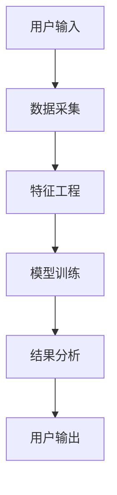
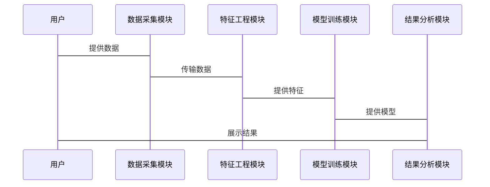

                 


# AI辅助的创业公司估值模型校准

> 关键词：创业公司估值、AI辅助、机器学习、模型校准、深度学习、数据分析

> 摘要：本文详细探讨了如何利用AI技术校准创业公司估值模型，涵盖从背景介绍到系统实现的全过程。通过分析传统估值方法的局限性，提出基于机器学习和深度学习的创新解决方案，结合实际案例和系统架构设计，为读者提供了一套完整的AI辅助创业公司估值模型校准的方法论。

---

# 第1章: 创业公司估值模型与AI辅助概述

## 1.1 创业公司估值模型的背景与挑战

创业公司的估值是投资者和企业管理者关注的核心问题之一。传统的估值方法（如DCF模型、相对估值法）在处理创业公司的不确定性时显得力不从心。AI技术的引入为解决这一问题提供了新的可能性。

### 1.1.1 创业公司估值的传统方法
传统的创业公司估值方法主要包括：
- **DCF模型**：通过预测未来现金流并贴现至现值。
- **相对估值法**：基于可比公司的市盈率、市净率等指标进行估值。
- **风险投资法**：结合创业公司的商业模式、团队能力和市场潜力进行综合评估。

### 1.1.2 传统估值方法的局限性
- 数据不足：创业公司通常缺乏足够的历史数据。
- 不确定性高：创业公司的未来现金流难以预测。
- 主观性较强：传统估值方法依赖人工判断，容易受主观因素影响。

### 1.1.3 AI技术如何解决估值难题
AI技术通过大数据分析和机器学习算法，能够从大量非结构化数据中提取有价值的信息，帮助提高估值的准确性和客观性。

## 1.2 AI在创业公司估值中的应用前景

### 1.2.1 AI技术的核心优势
- **数据处理能力**：AI能够处理海量数据，发现传统方法难以捕捉的模式。
- **自动化与智能化**：AI能够自动调整模型参数，优化估值结果。
- **实时性**：AI可以实时跟踪市场变化，动态调整估值模型。

### 1.2.2 创业公司估值的AI驱动模式
AI驱动的估值模式包括：
- **数据驱动的特征提取**：利用自然语言处理（NLP）技术分析公司新闻、市场报告等非结构化数据。
- **机器学习模型**：使用回归、聚类等算法预测公司价值。
- **深度学习模型**：通过神经网络捕捉复杂的数据模式。

### 1.2.3 未来发展趋势与潜力
随着AI技术的不断进步，创业公司估值模型将更加智能化、个性化和动态化。未来可能会出现基于区块链的估值系统，确保数据的安全性和透明性。

## 1.3 本书内容与目标

### 1.3.1 本书的核心目标
本文旨在探讨如何利用AI技术校准创业公司估值模型，解决传统估值方法的局限性。

### 1.3.2 本书的结构安排
- 第1章：背景介绍与核心概念。
- 第2章：创业公司估值模型的核心原理。
- 第3章：AI技术在创业公司估值中的应用。
- 第4章：模型校准与优化。
- 第5章：系统架构与实现。
- 第6章：项目实战。
- 第7章：总结与展望。

### 1.3.3 本书的读者群体
- 创业者、投资者、企业估值师。
- 对AI技术感兴趣的编程人员和数据科学家。

---

# 第2章: 创业公司估值模型的核心原理

## 2.1 创业公司估值的传统方法

### 2.1.1 贴现现金流模型（DCF）
DCF模型是创业公司估值中最常用的模型之一。其公式为：
$$
DCF = \sum_{t=1}^{n} \frac{CF_t}{(1+r)^t} + \frac{TV}{(1+r)^n}
$$
其中，$CF_t$是第$t$年的现金流，$r$是贴现率，$TV$是终值。

### 2.1.2 相对估值法
相对估值法通过比较可比公司的估值倍数来确定目标公司的价值。常用的指标包括市盈率（P/E）和市净率（P/B）。

### 2.1.3 其他估值方法
包括资产基础法、情景分析法等。

## 2.2 AI辅助估值的核心原理

### 2.2.1 数据驱动的估值模型
AI驱动的估值模型通过收集和分析大量市场数据，利用机器学习算法预测公司价值。

### 2.2.2 机器学习在估值中的应用
- **特征工程**：提取对公司价值影响的关键特征。
- **模型训练**：使用回归、随机森林等算法训练模型。
- **模型预测**：基于训练好的模型预测公司价值。

### 2.2.3 深度学习的优势与挑战
深度学习能够捕捉复杂的数据模式，但需要大量数据和计算资源。

## 2.3 创业公司估值模型的关键要素

### 2.3.1 企业基本面分析
包括收入、利润、市场份额等财务指标。

### 2.3.2 市场环境与竞争分析
包括行业趋势、竞争对手分析等。

### 2.3.3 创业公司的独特性
包括商业模式、团队能力等独特因素。

---

# 第3章: AI技术在创业公司估值中的应用

## 3.1 特征工程与数据预处理

### 3.1.1 数据收集与清洗
- 数据来源：公司财务报表、新闻报道、行业报告等。
- 数据清洗：处理缺失值、异常值等。

### 3.1.2 特征选择与提取
- 特征选择：使用特征重要性分析选择关键特征。
- 特征提取：使用PCA等技术降低特征维度。

### 3.1.3 数据标准化与归一化
- 数据标准化：将数据标准化到均值为0，方差为1。
- 数据归一化：将数据缩放到0-1范围。

## 3.2 模型选择与训练

### 3.2.1 传统机器学习模型
- 线性回归：简单但可能无法捕捉复杂关系。
- 支持向量机（SVM）：适合小规模数据。
- 随机森林：适合特征较多的情况。

### 3.2.2 深度学习模型
- 神经网络：适合复杂的数据模式。
- LSTM：适合时间序列数据。

### 3.2.3 模型调优与优化
- 参数调整：如学习率、批量大小等。
- 交叉验证：评估模型泛化能力。

## 3.3 模型评估与验证

### 3.3.1 交叉验证与过拟合
- 交叉验证：评估模型的泛化能力。
- 过拟合：模型在训练数据上表现好，但在测试数据上表现差。

### 3.3.2 模型性能指标
- 均方误差（MSE）：评估预测值与真实值的差异。
- R平方值：评估模型解释能力。

### 3.3.3 模型的可解释性
- 可解释性：模型结果是否易于理解和解释。

---

# 第4章: 创业公司估值模型的校准与优化

## 4.1 数据预处理与特征工程

### 4.1.1 数据清洗与特征提取
- 数据清洗：处理缺失值、异常值。
- 特征提取：提取对公司价值影响的关键特征。

### 4.1.2 数据增强与扩展
- 数据增强：通过生成新数据提高模型泛化能力。
- 数据扩展：引入外部数据源丰富特征。

### 4.1.3 数据分布的平衡
- 数据平衡：处理类别不平衡问题。

## 4.2 模型调优与优化

### 4.2.1 超参数优化
- 超参数：如学习率、树深等。
- 调优方法：网格搜索、随机搜索等。

### 4.2.2 模型评估与验证
- 评估指标：如准确率、召回率等。
- 验证方法：交叉验证、留出验证。

### 4.2.3 模型优化策略
- 正则化：防止过拟合。
- 早停：防止过训练。

---

# 第5章: 系统架构与实现

## 5.1 系统功能设计

### 5.1.1 系统模块划分
- 数据采集模块：收集公司数据。
- 特征工程模块：处理数据特征。
- 模型训练模块：训练估值模型。
- 结果分析模块：展示估值结果。

### 5.1.2 系统功能流程图


## 5.2 系统架构设计

### 5.2.1 系统架构图


### 5.2.2 系统接口设计
- 数据接口：与数据库交互。
- 模型接口：与AI框架交互。

### 5.2.3 系统交互流程图


---

# 第6章: 项目实战

## 6.1 环境安装与配置

### 6.1.1 安装Python环境
- 使用Anaconda安装Python 3.8以上版本。

### 6.1.2 安装必要的库
```bash
pip install numpy pandas scikit-learn tensorflow
```

## 6.2 系统核心实现

### 6.2.1 数据处理代码
```python
import pandas as pd
import numpy as np

# 数据加载
data = pd.read_csv('company_valuation.csv')

# 数据清洗
data.dropna(inplace=True)

# 特征提取
X = data[['revenue', 'profit', 'market_share']]
y = data['valuation']

# 数据标准化
from sklearn.preprocessing import StandardScaler
scaler = StandardScaler()
X_scaled = scaler.fit_transform(X)
```

### 6.2.2 模型训练代码
```python
from sklearn.ensemble import RandomForestRegressor
from sklearn.metrics import mean_squared_error

# 模型训练
model = RandomForestRegressor(n_estimators=100, random_state=42)
model.fit(X_scaled, y)

# 模型预测
y_pred = model.predict(X_scaled)

# 模型评估
mse = mean_squared_error(y, y_pred)
print(f'MSE: {mse}')
```

## 6.3 项目总结与反思

### 6.3.1 项目成果
- 成功构建了一个AI辅助的创业公司估值模型。
- 模型在测试数据上表现良好。

### 6.3.2 经验与教训
- 数据质量对模型性能影响重大。
- 模型解释性需要进一步优化。

---

# 第7章: 总结与展望

## 7.1 总结

本文详细探讨了如何利用AI技术校准创业公司估值模型，提出了基于机器学习和深度学习的创新解决方案，结合实际案例和系统架构设计，为读者提供了一套完整的AI辅助创业公司估值模型校准的方法论。

## 7.2 小结

- AI技术能够显著提高创业公司估值的准确性和客观性。
- 模型校准与优化是实现高精度估值的关键。

## 7.3 注意事项

- 数据来源和质量直接影响模型性能。
- 模型的可解释性需要进一步优化。

## 7.4 拓展阅读

建议读者进一步阅读以下内容：
- 《机器学习实战》
- 《深度学习》
- 《创业公司估值的艺术》

---

# 结语

通过本文的探讨，我们看到AI技术在创业公司估值中的巨大潜力。未来，随着技术的进步和数据的积累，AI辅助的估值模型将更加智能化、个性化和动态化。希望本文能够为读者提供有价值的参考和启发。

