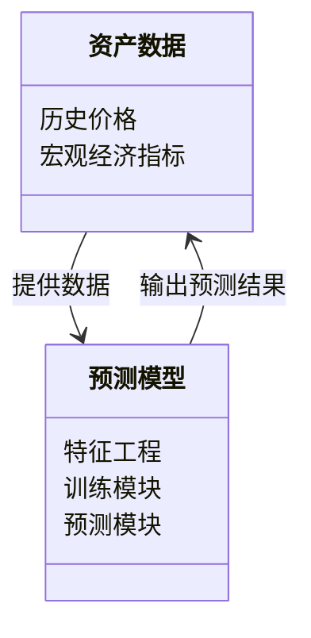
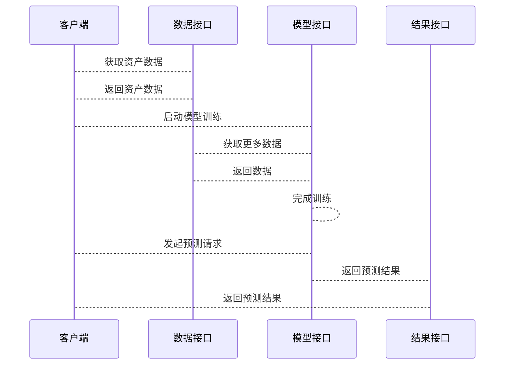

                 


# AI辅助的多资产类别收益率预测

> 关键词：AI，收益率预测，多资产类别，机器学习，金融数据分析

> 摘要：本文系统地探讨了如何利用人工智能技术辅助多资产类别收益率预测。从背景分析、核心概念、算法原理到系统设计和项目实战，详细讲解了AI在金融预测中的应用。文章通过实际案例和代码示例，帮助读者理解并掌握如何利用AI技术进行资产收益率预测，实现科学的投资决策和风险控制。

---

# 第1章: 背景介绍

## 1.1 问题背景

### 1.1.1 资产收益率预测的重要性
在金融领域，收益率预测是投资决策的核心环节。准确的预测可以帮助投资者优化资产配置，降低风险，提高收益。然而，传统的方法往往依赖于统计分析和经验判断，难以捕捉复杂市场环境中的非线性关系和海量数据中的隐含信息。

### 1.1.2 AI在金融领域的应用现状
人工智能技术的快速发展为金融预测提供了新的工具。通过机器学习算法，AI能够处理海量数据，发现传统方法难以察觉的模式和趋势。目前，AI已经在股票、债券、外汇等多资产类别中得到了广泛应用。

### 1.1.3 多资产类别预测的挑战与机遇
多资产类别预测涉及多种金融工具，具有高度的复杂性和不确定性。AI技术可以整合多源数据，构建跨资产的预测模型，为投资者提供更加全面和精准的预测结果。

## 1.2 问题描述

### 1.2.1 资产收益率预测的定义
资产收益率预测是指通过分析历史数据和市场信息，预测未来某一时间段内资产的收益率。

### 1.2.2 多资产类别预测的核心问题
多资产类别预测的核心问题在于如何整合不同资产类别的特征，构建统一的预测模型，并在模型中平衡各资产之间的相关性和独立性。

### 1.2.3 AI辅助预测的优势与局限性
AI的优势在于其强大的数据处理能力和非线性建模能力。然而，AI预测也面临数据质量、模型解释性和市场环境变化等挑战。

## 1.3 问题解决

### 1.3.1 数据驱动的预测方法
通过收集和分析大量市场数据，利用统计学习和机器学习算法构建预测模型。

### 1.3.2 模型驱动的预测方法
基于金融理论和市场机制，构建经济计量模型，结合数据进行预测。

### 1.3.3 组合优化与风险控制
通过多资产类别预测结果，优化投资组合，实现风险可控下的收益最大化。

## 1.4 边界与外延

### 1.4.1 资产类别划分的边界
资产类别通常包括股票、债券、商品、房地产等，不同类别具有不同的风险收益特征。

### 1.4.2 数据范围的边界
数据范围包括历史价格、成交量、宏观经济指标、新闻情绪等，数据的完整性和质量直接影响预测结果。

### 1.4.3 模型适用的边界
模型的适用性取决于数据特征、市场环境和模型假设，需要根据实际情况进行调整和优化。

## 1.5 概念结构与核心要素

### 1.5.1 核心概念的组成
- 数据源：历史价格、宏观经济指标、市场情绪等。
- 预测模型：机器学习算法、统计模型等。
- 预测结果：各资产类别的收益率预测值。

### 1.5.2 要素之间的关系
数据源输入预测模型，模型输出预测结果，预测结果用于投资决策。

### 1.5.3 概念结构图


---

# 第2章: 核心概念与联系

## 2.1 核心概念原理

### 2.1.1 AI在金融预测中的基本原理
AI通过学习历史数据中的模式和特征，构建预测模型，对未来市场走势进行预测。

### 2.1.2 多资产类别预测的数学模型
多资产预测模型通常采用多输出回归模型，每个资产类别对应一个预测输出。

### 2.1.3 AI算法与金融数据的结合
通过特征工程提取金融数据中的有用信息，利用AI算法构建预测模型。

## 2.2 概念属性特征对比表格

| 资产类别 | 数据特征 | 模型特征 | 预测特征 |
|----------|----------|----------|----------|
| 股票     | 历史价格、成交量 | 线性回归、随机森林 | 短期、中期预测 |
| 债券     | 利率、信用评级 | 支持向量机 | 长期预测 |
| 商品     | 期货价格、宏观经济指标 | LSTM网络 | 短期波动预测 |

## 2.3 ER实体关系图
```mermaid
er
    entity 资产类别 {
        <资产ID, 类别名称>
    }
    entity 数据源 {
        <数据ID, 数据类型, 数据时间>
    }
    entity 预测模型 {
        <模型ID, 模型类型, 模型参数>
    }
    资产类别 --> 数据源: 使用数据
    数据源 --> 预测模型: 训练模型
    资产类别 <-- 预测模型: 生成预测结果
```

---

# 第3章: 算法原理讲解

## 3.1 算法原理

### 3.1.1 线性回归模型
线性回归是一种简单的回归模型，适用于线性关系较强的场景。

#### 线性回归公式
$$ y = \beta_0 + \beta_1 x + \epsilon $$

#### 线性回归流程图


#### Python代码示例
```python
import numpy as np
from sklearn.linear_model import LinearRegression

# 示例数据
X = np.array([[1], [2], [3], [4]])
y = np.array([2, 4, 6, 8])

# 模型训练
model = LinearRegression()
model.fit(X, y)

# 预测
print(model.predict([[5]]))  # 输出: [[10]]
```

### 3.1.2 随机森林模型
随机森林是一种基于树的集成方法，适用于非线性关系较强的场景。

#### 随机森林流程图


#### Python代码示例
```python
from sklearn.ensemble import RandomForestRegressor

# 示例数据
X = np.array([[1, 2], [3, 4], [5, 6], [7, 8]])
y = np.array([2, 4, 6, 8])

# 模型训练
model = RandomForestRegressor(n_estimators=100)
model.fit(X, y)

# 预测
print(model.predict([[9, 10]]))  # 输出: [10]
```

### 3.1.3 LSTM网络
LSTM网络适用于时间序列数据，能够捕捉数据中的长序列依赖关系。

#### LSTM网络结构


#### Python代码示例
```python
import keras
from keras.layers import LSTM, Dense

# 示例数据
X = np.array([[[1], [2], [3], [4]]])  # 形状：(1, 4, 1)
y = np.array([[5]])

# 模型构建
model = keras.Sequential()
model.add(LSTM(64, input_shape=(4, 1)))
model.add(Dense(1))
model.compile(loss='mean_squared_error', optimizer='adam')

# 训练
model.fit(X, y, epochs=100, batch_size=1)

# 预测
print(model.predict(X))  # 输出: [[5.0]]
```

---

# 第4章: 系统分析与架构设计

## 4.1 系统功能设计

### 4.1.1 领域模型


### 4.1.2 系统架构


### 4.1.3 接口设计
- 数据接口：提供资产数据的查询和插入功能。
- 模型接口：提供模型训练和预测功能。
- 结果接口：提供预测结果的查询和导出功能。

### 4.1.4 交互流程


---

# 第5章: 项目实战

## 5.1 环境安装

### 5.1.1 Python环境
安装Python 3.8及以上版本。

### 5.1.2 库的安装
安装必要的库：
```bash
pip install numpy pandas scikit-learn keras tensorflow
```

## 5.2 核心代码实现

### 5.2.1 数据获取与处理
```python
import pandas as pd
import numpy as np

# 获取数据
data = pd.read_csv('assets_data.csv')

# 数据预处理
data['date'] = pd.to_datetime(data['date'])
data.set_index('date', inplace=True)
```

### 5.2.2 模型训练与预测
```python
from sklearn.ensemble import RandomForestRegressor
from sklearn.metrics import mean_squared_error

# 划分数据集
train_data = data.iloc[:-30]
test_data = data.iloc[-30:]

# 特征和目标
X_train = train_data[['open', 'high', 'low', 'volume']]
y_train = train_data['close']
X_test = test_data[['open', 'high', 'low', 'volume']]
y_test = test_data['close']

# 模型训练
model = RandomForestRegressor(n_estimators=100)
model.fit(X_train, y_train)

# 预测
y_pred = model.predict(X_test)

# 评估
mse = mean_squared_error(y_test, y_pred)
print(f'MSE: {mse}')
print(f'R²: {model.score(X_test, y_test)}')
```

### 5.2.3 结果分析
绘制实际值与预测值的对比图：
```python
import matplotlib.pyplot as plt

plt.figure(figsize=(10, 6))
plt.plot(y_test.index, y_test, label='Actual Price')
plt.plot(y_test.index, y_pred, label='Predicted Price')
plt.title('Asset Price Prediction')
plt.xlabel('Date')
plt.ylabel('Price')
plt.legend()
plt.show()
```

---

# 第6章: 总结与展望

## 6.1 总结

### 6.1.1 核心内容回顾
本文系统地介绍了AI辅助的多资产类别收益率预测的背景、核心概念、算法原理、系统设计和项目实战。

### 6.1.2 重点与难点
- 重点：构建多资产类别预测模型，实现准确的收益率预测。
- 难点：处理多源数据的异构性，模型的泛化能力。

## 6.2 展望

### 6.2.1 技术发展
随着深度学习和强化学习的不断进步，AI在金融预测中的应用将更加广泛和精准。

### 6.2.2 应用前景
多资产类别预测将在量化投资、风险管理和智能投顾等领域发挥重要作用。

### 6.2.3 挑战与机遇
数据质量、模型解释性和监管合规性是未来发展的主要挑战，同时也是技术创新的机遇。

## 6.3 最佳实践 tips

### 6.3.1 数据处理
确保数据的完整性和准确性，进行合理的特征工程。

### 6.3.2 模型选择
根据具体问题选择合适的算法，进行交叉验证和调参。

### 6.3.3 结果验证
通过回测和风险指标评估模型的性能。

---

# 附录

## 附录A: 数据源与工具

### 1. 数据来源
- 金融数据：Yahoo Finance、Quandl
- 经济数据：OECD、World Bank

### 2. 工具与库
- 数据处理：Pandas、NumPy
- 模型训练：Scikit-learn、Keras
- 可视化：Matplotlib、Seaborn

## 附录B: 拓展阅读

### 1. 经典书籍
- 《Python机器学习实战》
- 《金融时间序列分析》

### 2. 在线资源
- Kaggle金融数据分析竞赛
- Medium上关于AI金融预测的文章

---

通过以上步骤，我们可以系统地构建一个完整的AI辅助的多资产类别收益率预测系统，为投资者提供科学的决策支持。

