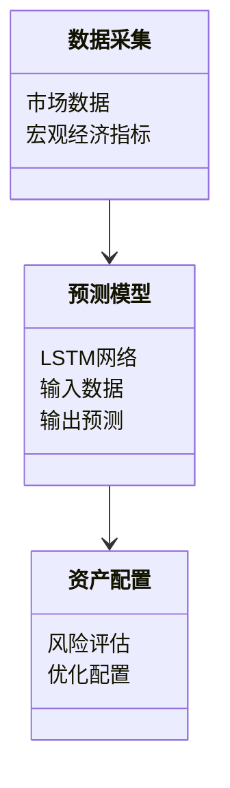

                 


# AI辅助的多资产类别收益率预测与资产配置

> 关键词：AI，收益率预测，资产配置，机器学习，金融

> 摘要：本文深入探讨了人工智能在多资产类别收益率预测与资产配置中的应用，结合实际案例和系统设计，分析了各种AI算法的工作原理，提供了详细的系统架构和代码实现，旨在为金融从业者和AI爱好者提供一份全面的指导手册。

---

# 第一部分: AI辅助的多资产类别收益率预测与资产配置背景介绍

## 第1章: AI在金融领域的应用现状

### 1.1 人工智能在金融领域的应用概述

人工智能（AI）作为现代科技的核心技术之一，正在迅速改变金融行业的运作方式。从高频交易到风险管理，AI的应用无处不在。本文将探讨AI在多资产类别收益率预测与资产配置中的具体应用。

#### 1.1.1 人工智能的基本概念与特点

人工智能是指通过计算机模拟人类智能的技术，其特点包括学习能力、自适应性和自动化。AI通过大量数据和算法，帮助金融机构做出更精准的决策。

#### 1.1.2 人工智能在金融中的应用现状

目前，AI在金融领域的应用主要集中在交易执行、风险管理、客户画像和欺诈检测等方面。例如，量化交易中，AI算法能够快速分析市场数据，制定交易策略。

#### 1.1.3 人工智能在金融领域的未来趋势

随着技术的进步，AI在金融中的应用将更加广泛和深入。未来，AI可能会在智能投顾、动态资产配置等领域发挥更大的作用。

### 1.2 收益率预测与资产配置的基本概念

#### 1.2.1 收益率预测的定义

收益率预测是指基于历史数据和市场信息，预测未来资产价格的变动趋势。多资产类别收益率预测涉及股票、债券、基金等多种资产。

#### 1.2.2 资产配置的定义与目的

资产配置是指将资金分配到不同资产类别中，以实现风险与收益的平衡。通过合理的资产配置，投资者可以在不同市场条件下优化投资回报。

#### 1.2.3 收益率预测的挑战与重要性

收益率预测面临数据噪声大、市场波动剧烈等挑战。然而，准确的预测能够帮助投资者制定更有效的投资策略，降低风险。

---

## 第2章: 多资产类别收益率预测与资产配置的核心概念

### 2.1 收益率预测的核心概念

#### 2.1.1 数据来源与特征分析

收益率预测的数据来源包括历史价格、宏观经济指标、市场情绪等。特征分析需要选择能够影响收益率的关键因素。

#### 2.1.2 时间序列预测的基本原理

时间序列预测通过分析过去的数据模式，预测未来的变化。AI模型如LSTM在时间序列预测中表现优异。

#### 2.1.3 AI在时间序列预测中的优势

AI能够处理高维数据，识别复杂模式，适用于金融市场数据的非线性特征。

### 2.2 资产配置的核心概念

#### 2.2.1 资产配置的目标与策略

资产配置的目标是实现收益最大化和风险最小化。常见的策略包括均配策略、动量策略等。

#### 2.2.2 风险分散与收益优化的平衡

通过将资金分配到不同资产类别，投资者可以在市场波动中分散风险，同时优化整体收益。

#### 2.2.3 资产配置的动态调整机制

根据市场变化，定期调整资产配置比例，以适应新的市场环境。

---

# 第二部分: AI辅助的多资产类别收益率预测与资产配置的核心概念

## 第3章: 收益率预测的核心概念与原理

### 3.1 收益率预测的核心概念

#### 3.1.1 数据来源与特征分析

收益率预测的数据来源包括市场数据、宏观经济指标和公司基本面数据。特征分析需要选择与收益率相关的变量。

#### 3.1.2 时间序列预测的基本原理

时间序列预测利用历史数据中的趋势和周期性，预测未来的变化。AI模型能够捕捉复杂的时间依赖性。

#### 3.1.3 AI在时间序列预测中的优势

AI模型如LSTM和GRU能够处理长期依赖关系，适用于金融市场数据的预测。

### 3.2 收益率预测的关键特征

#### 3.2.1 市场情绪与投资者行为

市场情绪影响资产价格，投资者行为可以通过情绪指标（如VIX指数）进行建模。

#### 3.2.2 宏观经济指标的影响

GDP增长率、利率水平等宏观经济指标对资产收益有重要影响。

#### 3.2.3 历史数据与模式识别

历史数据中的模式可以帮助预测未来走势，AI能够识别这些模式并进行外推。

---

## 第4章: 资产配置的核心概念与原理

### 4.1 资产配置的核心概念

#### 4.1.1 资产配置的目标与策略

资产配置的目标是平衡风险与收益，策略包括基于价值、动量和趋势的投资策略。

#### 4.1.2 风险分散与收益优化的平衡

通过分散投资，降低特定资产的风险，同时优化整体收益。

#### 4.1.3 资产配置的动态调整机制

根据市场变化和投资者目标，定期调整资产配置比例。

### 4.2 资产配置的关键因素

#### 4.2.1 投资者风险偏好与收益目标

投资者的风险承受能力和收益目标决定资产配置的比例。

#### 4.2.2 市场环境与经济周期的影响

经济周期波动会影响不同资产类别的表现，资产配置需要适应这些变化。

#### 4.2.3 资产类别之间的相关性分析

资产类别之间的相关性影响风险分散效果，相关性低的资产组合风险更小。

---

# 第三部分: AI辅助的多资产类别收益率预测与资产配置的核心算法

## 第5章: 常见的AI算法在收益率预测中的应用

### 5.1 机器学习算法概述

#### 5.1.1 线性回归模型

线性回归用于预测连续型变量，假设变量之间存在线性关系。

$$ y = \beta_0 + \beta_1x + \epsilon $$

#### 5.1.2 支持向量机（SVM）

SVM适用于分类和回归问题，通过构建超平面实现数据分割。

#### 5.1.3 随机森林与集成学习

随机森林通过组合多个决策树的结果，提高预测准确性和稳定性。

#### 5.1.4 神经网络与深度学习

神经网络能够处理复杂非线性关系，适用于金融市场数据的深度学习。

### 5.2 LSTM网络在时间序列预测中的应用

LSTM（长短期记忆网络）特别适用于时间序列数据，能够捕捉长期依赖关系。

#### 5.2.1 LSTM的工作原理

LSTM通过门控机制控制信息的流动，避免梯度消失问题。

#### 5.2.2 LSTM的时间序列预测流程

1. 数据预处理：归一化、分割训练集和测试集。
2. 模型构建：定义LSTM层、 Dense层和损失函数。
3. 训练模型：使用训练数据拟合模型。
4. 预测与评估：预测测试数据并评估模型性能。

#### 5.2.3 LSTM的Python代码实现

```python
import numpy as np
from keras.models import Sequential
from keras.layers import LSTM, Dense

# 示例数据
X = np.random.random((1000, 1))
Y = np.random.random((1000, 1))

model = Sequential()
model.add(LSTM(5, input_shape=(1, 1)))
model.add(Dense(1))
model.compile(loss='mean_squared_error', optimizer='adam')
model.fit(X, Y, epochs=10, batch_size=32)
```

---

## 第6章: AI在资产配置中的算法原理

### 6.1 基于机器学习的资产配置

#### 6.1.1 基于聚类分析的资产分类

聚类分析将相似的资产分为一类，帮助投资者进行组合管理。

#### 6.1.2 基于回归分析的风险评估

回归分析用于评估不同资产的风险收益关系，帮助确定最优配置比例。

### 6.2 基于AI的动态资产配置策略

#### 6.2.1 基于市场情绪的动态调整

根据市场情绪指标（如VIX指数），动态调整资产配置比例。

#### 6.2.2 基于因子模型的配置优化

使用因子模型识别影响收益的关键因素，优化资产配置。

---

## 第7章: 系统分析与架构设计

### 7.1 问题场景介绍

#### 7.1.1 收益率预测与资产配置的系统目标

构建一个AI驱动的系统，实现多资产类别收益率预测与动态配置。

#### 7.1.2 系统的主要功能

- 数据采集：获取市场数据和宏观经济指标。
- 预测模型：构建并训练AI模型，进行收益率预测。
- 资产配置：基于预测结果，优化资产配置方案。
- 系统监控：实时监控市场变化，动态调整配置。

### 7.2 系统功能设计

#### 7.2.1 领域模型

使用Mermaid绘制领域模型，展示系统各模块之间的关系。



#### 7.2.2 系统架构设计

使用Mermaid绘制系统架构图，展示系统的模块划分和交互流程。

```mermaid
container 服务器端 {
    数据采集模块
    预测模型模块
    资产配置模块
}
container 客户端 {
    用户界面
    请求处理
}
服务器端 --> 客户端
```

---

## 第8章: 项目实战

### 8.1 环境安装与配置

#### 8.1.1 安装Python环境

使用Anaconda安装Python 3.8及以上版本。

#### 8.1.2 安装必要的库

安装numpy、pandas、keras、tensorflow等库。

```bash
pip install numpy pandas keras tensorflow
```

### 8.2 系统核心代码实现

#### 8.2.1 数据预处理代码

```python
import pandas as pd
import numpy as np

# 加载数据
data = pd.read_csv('market_data.csv')

# 数据归一化
from sklearn.preprocessing import MinMaxScaler
scaler = MinMaxScaler()
data_scaled = scaler.fit_transform(data)
```

#### 8.2.2 LSTM模型实现

```python
from keras.models import Sequential
from keras.layers import LSTM, Dense

model = Sequential()
model.add(LSTM(50, input_shape=(1, 1)))
model.add(Dense(1))
model.compile(loss='mean_squared_error', optimizer='adam')
```

#### 8.2.3 资产配置优化代码

```python
import numpy as np
from scipy.optimize import minimize

def optimize_weights(weights, returns, risk_free_rate):
    # 定义目标函数：最大化夏普比率
    returns PortfolioReturn(weights, returns)
    risk PortfolioRisk(weights, returns)
    sharpe_ratio = (PortfolioReturn - risk_free_rate) / PortfolioRisk
    return -sharpe_ratio

# 使用遗传算法优化权重
```

### 8.3 案例分析与详细解读

#### 8.3.1 案例背景

假设我们有股票、债券和黄金三种资产，目标是预测它们的收益率并优化配置。

#### 8.3.2 数据分析与预测

使用历史数据训练LSTM模型，预测未来6个月的收益率。

#### 8.3.3 资产配置优化

基于预测收益率，使用优化算法确定最优的资产配置比例。

### 8.4 项目小结

通过本项目，我们实现了AI驱动的多资产类别收益率预测与资产配置系统，验证了AI在金融领域的有效性。

---

# 第四部分: 最佳实践与总结

## 第9章: 最佳实践与小结

### 9.1 小结

本文详细探讨了AI在多资产类别收益率预测与资产配置中的应用，从算法原理到系统设计，提供了完整的解决方案。

### 9.2 注意事项

在实际应用中，需注意数据质量、模型过拟合和市场变化等问题，定期调整模型和配置策略。

### 9.3 拓展阅读

建议读者深入学习时间序列分析、强化学习在金融中的应用等主题。

---

通过以上步骤，我们构建了一个完整的AI辅助的多资产类别收益率预测与资产配置系统，为读者提供了从理论到实践的全面指导。

