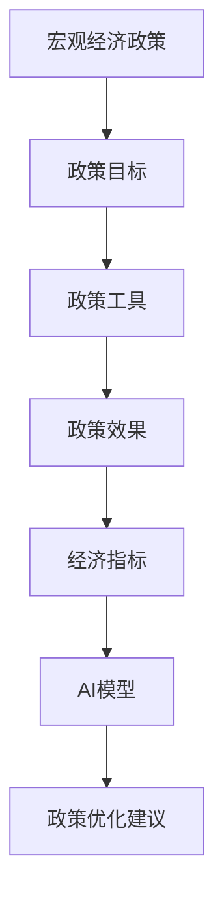
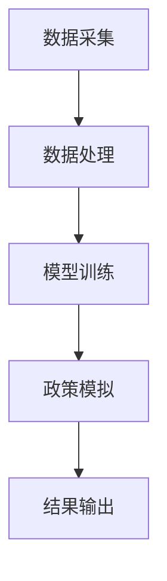

                 


# AI辅助的宏观经济政策效果量化评估

## 关键词：
宏观经济政策，人工智能，政策评估，量化分析，经济模型

## 摘要：
本文探讨了如何利用人工智能技术辅助宏观经济政策效果的量化评估。通过结合宏观经济理论与AI技术，提出了一种基于机器学习的政策效果评估框架，详细分析了AI在政策效果量化中的优势与挑战，展示了如何通过数据驱动的方法优化宏观经济政策设计与实施效果。

---

# 第一部分：宏观经济政策效果量化评估的背景与意义

## 第1章：宏观经济政策效果评估的基本概念

### 1.1 宏观经济政策的基本概念

#### 1.1.1 宏观经济政策的定义与分类
- **定义**：宏观经济政策是指政府通过调节经济变量（如GDP、通胀率、就业率等）来实现特定经济目标的政策工具。
- **分类**：
  - **货币政策**：由中央银行通过调整利率、货币供应量等手段影响经济活动。
  - **财政政策**：通过政府支出和税收调整经济运行。
  - **产业政策**：针对特定产业的扶持或限制政策。
  - **区域政策**：针对特定区域的经济支持政策。

#### 1.1.2 宏观经济政策的目标与工具
- **目标**：
  - 稳定经济：防止经济波动，保持GDP稳定增长。
  - 充分就业：减少失业率，提高劳动力利用率。
  - 控制通胀：保持物价稳定，防止通货膨胀或通货紧缩。
  - 可持续发展：促进资源合理配置，实现长期经济增长。
- **工具**：
  - 调整利率：通过央行基准利率影响市场资金成本。
  - 财政支出：增加政府投资或转移支付。
  - 税收调整：通过增税或减税影响企业和个人行为。
  - 产业补贴：对特定产业提供资金支持或税收优惠。

#### 1.1.3 宏观经济政策的实施机制
- **机制**：
  - 政策制定：基于经济数据和模型预测制定政策。
  - 政策执行：通过政府机构和中央银行落实政策。
  - 政策效果：通过经济指标变化评估政策效果。

---

### 1.2 宏观经济政策效果评估的必要性

#### 1.2.1 宏观经济政策效果评估的重要性
- **重要性**：
  - 政策效果评估是检验政策有效性的关键步骤。
  - 通过评估可以优化政策设计，提高政策实施效果。
  - 为未来政策制定提供数据支持和经验参考。

#### 1.2.2 传统政策评估方法的局限性
- **局限性**：
  - **因果关系难确定**：传统评估方法难以准确识别政策变量与其他经济变量之间的因果关系。
  - **数据不足**：传统方法依赖于少量统计数据，难以捕捉复杂经济现象。
  - **模型简化**：传统模型通常假设条件，导致评估结果偏差。

#### 1.2.3 AI辅助评估的优势与潜力
- **优势**：
  - **数据驱动**：AI能够处理海量数据，发现传统方法难以捕捉的模式和关系。
  - **实时分析**：AI可以实时跟踪经济指标变化，提供动态评估结果。
  - **高精度预测**：基于机器学习的模型能够提高政策效果预测的准确性。
- **潜力**：
  - 通过AI技术优化政策设计，提升政策实施效果。
  - 利用AI进行情景模拟，评估不同政策组合的效果。
  - 提供个性化政策建议，实现精准化政策实施。

---

### 1.3 宏观经济政策效果量化评估的核心问题

#### 1.3.1 政策效果的定义与度量
- **定义**：政策效果是指政策实施后对经济目标变量产生的实际影响。
- **度量**：通常通过对比政策实施前后的经济指标变化来衡量政策效果。

#### 1.3.2 政策干预的因果关系分析
- **因果关系**：政策效果评估的核心在于确定政策变量与其他经济变量之间的因果关系。
- **挑战**：政策变量通常与其他变量高度相关，难以分离因果关系。

#### 1.3.3 数据驱动的政策评估方法
- **数据驱动**：通过大量经济数据构建模型，识别政策变量与其他变量之间的关系。
- **方法**：利用回归分析、因果推断等方法量化政策效果。

---

## 第2章：AI辅助宏观经济政策效果量化评估的背景

### 2.1 宏观经济与AI技术的结合

#### 2.1.1 宏观经济数据分析的挑战
- **数据量大**：宏观经济数据通常涉及大量时间序列数据，数据清洗和处理复杂。
- **数据异质性**：不同经济指标之间的相关性较低，难以找到统一的数据模式。
- **数据动态性**：经济环境不断变化，数据特征可能随时间改变。

#### 2.1.2 AI技术在经济预测中的应用
- **应用领域**：
  - 经济预测：利用AI技术预测GDP增长率、通胀率等经济指标。
  - 金融分析：通过AI技术进行股票价格预测、风险评估等。
  - 政策模拟：利用AI技术模拟不同政策组合的效果。
- **优势**：
  - 高效性：AI能够快速处理大量数据，提供实时分析结果。
  - 精准性：AI技术能够捕捉复杂的数据模式，提高预测精度。

#### 2.1.3 宏观经济政策效果评估的AI化趋势
- **趋势**：
  - 随着AI技术的发展，越来越多的政策评估工作开始采用AI辅助方法。
  - AI技术的应用范围从单纯的经济预测扩展到政策设计和优化。

---

### 2.2 宏观经济政策效果量化评估的核心问题

#### 2.2.1 宏观经济政策的实施机制
- **实施机制**：
  - 政策制定：基于经济模型和数据分析制定政策。
  - 政策执行：通过政府机构和中央银行落实政策。
  - 政策效果：通过经济指标变化评估政策效果。

#### 2.2.2 政策效果的多维度评估
- **多维度评估**：
  - 短期效果：政策实施后的即时经济反应。
  - 长期效果：政策对经济的长期影响。
  - 间接效果：政策对相关产业和市场的连锁反应。

#### 2.2.3 数据驱动的政策评估方法
- **数据驱动方法**：
  - 通过大数据分析识别政策变量与其他变量之间的关系。
  - 利用机器学习模型进行政策效果预测。

---

### 2.3 宏观经济政策效果量化评估的边界与外延

#### 2.3.1 宏观经济政策的范围界定
- **范围界定**：
  - 宏观经济政策主要关注整体经济运行，不涉及具体企业或个人行为。
  - 政策效果评估需要考虑政策的外部性影响。

#### 2.3.2 政策效果的多维度评估
- **多维度评估**：
  - 经济增长：政策对GDP增长的促进作用。
  - 就业：政策对就业率的影响。
  - 通胀：政策对物价水平的控制效果。

#### 2.3.3 宏观经济政策与微观行为的关联
- **关联性**：
  - 宏观政策通过影响市场环境间接影响微观主体行为。
  - 微观主体行为的改变又会反过来影响宏观经济运行。

---

## 第3章：AI辅助宏观经济政策效果量化评估的核心概念与联系

### 3.1 核心概念原理

#### 3.1.1 宏观经济政策的实施机制
- **实施机制**：
  - 政策制定：基于经济模型和数据分析制定政策。
  - 政策执行：通过政府机构和中央银行落实政策。
  - 政策效果：通过经济指标变化评估政策效果。

#### 3.1.2 政策效果的多维度度量
- **度量方法**：
  - 单指标评估：如GDP增长率、通胀率等。
  - 多指标评估：综合考虑经济增长、就业、通胀等多个指标。

#### 3.1.3 AI技术在政策评估中的应用原理
- **应用原理**：
  - 通过AI技术分析大量经济数据，识别政策变量与其他变量之间的关系。
  - 利用机器学习模型预测政策实施后的经济效果。

---

### 3.2 核心概念属性特征对比表

| 概念           | 属性         | 特征                                                                 |
|----------------|--------------|----------------------------------------------------------------------|
| 宏观经济政策    | 数据驱动     | 大规模经济数据，包括GDP、通胀率、就业率等。                             |
| 政策效果       | 多维度       | 经济增长、就业、通胀等。                                               |
| AI辅助         | 智能化       | 自动学习、预测能力强，能够处理复杂数据模式。                             |

---

### 3.3 ER实体关系图



---

## 第4章：AI辅助宏观经济政策效果量化评估的核心算法与模型

### 4.1 核心算法与模型

#### 4.1.1 回归分析
- **回归分析**：
  - 用于分析政策变量与其他经济变量之间的关系。
  - 通过最小二乘法估计回归系数，量化政策变量对经济指标的影响。

#### 4.1.2 机器学习模型
- **机器学习模型**：
  - 使用随机森林、支持向量机等模型进行政策效果预测。
  - 通过特征工程提取重要经济指标，提高模型预测精度。

---

### 4.2 算法原理与实现

#### 4.2.1 回归分析的数学模型
- **线性回归模型**：
  $$ Y = \beta_0 + \beta_1 X + \epsilon $$
  - \( Y \)：经济指标（如GDP增长率）。
  - \( X \)：政策变量（如政府支出）。
  - \( \beta_0 \) 和 \( \beta_1 \)：回归系数。
  - \( \epsilon \)：误差项。

#### 4.2.2 机器学习模型的实现步骤
1. **数据准备**：
   - 收集宏观经济数据，包括政策变量和其他经济指标。
2. **特征选择**：
   - 通过统计方法或特征重要性分析选择关键经济指标。
3. **模型训练**：
   - 使用训练数据训练机器学习模型。
4. **模型评估**：
   - 通过交叉验证评估模型的预测精度。
5. **政策效果预测**：
   - 使用模型预测不同政策组合下的经济指标变化。

---

## 第5章：系统架构与实现

### 5.1 系统架构设计

#### 5.1.1 系统功能模块
- **数据采集模块**：
  - 从公开数据库获取宏观经济数据。
- **数据处理模块**：
  - 对数据进行清洗、标准化处理。
- **模型训练模块**：
  - 使用机器学习模型训练政策效果预测模型。
- **政策模拟模块**：
  - 输入政策参数，模拟政策实施后的经济效果。

#### 5.1.2 系统架构图



---

## 第6章：项目实战与案例分析

### 6.1 项目实战

#### 6.1.1 项目环境配置
- **工具安装**：
  - 安装Python、Pandas、Scikit-learn等库。
- **数据来源**：
  - 使用公开宏观经济数据集（如世界银行数据）。

#### 6.1.2 核心代码实现
```python
import pandas as pd
from sklearn.ensemble import RandomForestRegressor
from sklearn.metrics import mean_squared_error

# 数据加载
data = pd.read_csv('macroeconomic_data.csv')

# 特征选择
features = ['GDP', 'inflation', 'unemployment']
target = 'GDP_growth'

# 模型训练
model = RandomForestRegressor()
model.fit(data[features], data[target])

# 模型预测
predicted = model.predict(data[features])
print('预测值:', predicted)
print('均方误差:', mean_squared_error(data[target], predicted))
```

---

## 第7章：总结与展望

### 7.1 总结
- **总结**：
  - AI技术为宏观经济政策效果评估提供了新的方法和工具。
  - 基于机器学习的政策效果评估模型能够提高政策设计和实施的科学性。

### 7.2 展望
- **展望**：
  - 随着AI技术的不断发展，宏观经济政策效果评估将更加智能化和精准化。
  - 未来研究可以进一步探索AI在政策优化和情景模拟中的应用。

### 7.3 注意事项
- **数据质量**：宏观经济数据的准确性和完整性对政策评估结果有重要影响。
- **模型解释性**：复杂的AI模型可能难以解释政策变量的具体影响机制。
- **政策外部性**：宏观经济政策通常具有较强的外部性，需要综合考虑多方面因素。

### 7.4 拓展阅读
- 建议阅读《机器学习实战》、《经济学原理》等书籍，深入了解AI技术和宏观经济理论的结合应用。

---

# 结语
AI技术正在改变宏观经济政策效果评估的方式，通过数据驱动的方法，政策制定者能够更科学地设计和实施宏观经济政策，提升政策效果。未来，随着技术的进步，AI在宏观经济领域的应用将更加广泛和深入，为经济发展提供更强有力的支持。

