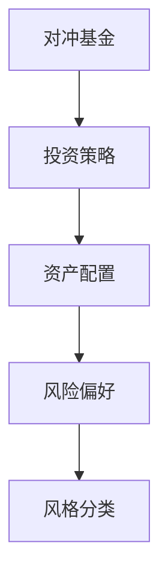
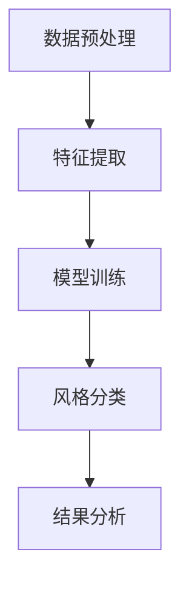
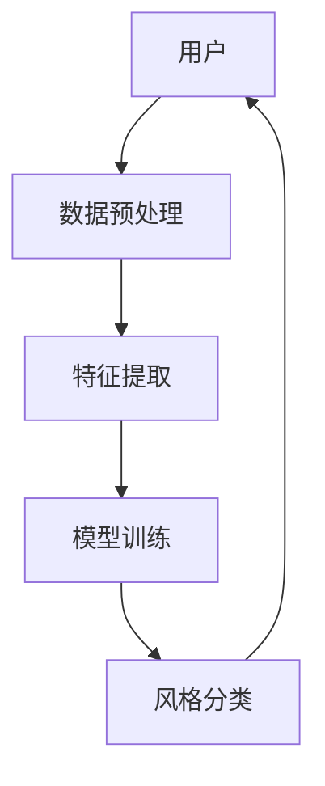

                 


# AI辅助的对冲基金风格分析

> 关键词：对冲基金，AI，风格分析，机器学习，投资策略

> 摘要：本文将详细介绍如何利用人工智能技术辅助对冲基金的风格分析。通过对对冲基金风格分析的背景、核心概念、算法原理、系统架构设计以及项目实战的全面解析，展示AI技术在金融领域的强大应用潜力。文章内容涵盖了从基础理论到实际应用的全过程，旨在为金融从业者和AI技术爱好者提供有价值的参考和指导。

---

## 第1章: 对冲基金与风格分析概述

### 1.1 对冲基金的基本概念

#### 1.1.1 对冲基金的定义与特点
对冲基金是一种通过利用市场波动，采取多种策略以实现正收益的投资基金。其特点包括：
- **多样化策略**：可以同时投资于股票、债券、衍生品等多种资产。
- **杠杆与对冲**：通过杠杆和对冲操作降低风险，提高收益。
- **高流动性**：通常允许投资者在开放期内赎回资金。

#### 1.1.2 对冲基金的主要策略类型
对冲基金的策略种类繁多，主要包括：
- **股票多空策略**：同时买入和卖出股票以获取价差。
- **量化策略**：利用数学模型进行交易决策。
- **套利策略**：通过市场价差获利。
- **事件驱动策略**：基于公司并购、重组等事件进行投资。

#### 1.1.3 对冲基金在金融市场的地位与作用
对冲基金在全球金融市场中扮演着重要角色，主要体现在：
- 提供流动性，稳定市场。
- 通过套利行为促进价格发现。
- 为投资者提供多样化投资渠道。

### 1.2 对冲基金风格分析的背景与意义

#### 1.2.1 风格分析的定义与目标
风格分析通过对基金的投资策略、风险偏好和历史表现的分析，将其归类到特定的风格中。目标在于：
- **风险控制**：识别基金的潜在风险。
- **业绩评估**：判断基金表现是否与其风格一致。
- **投资决策支持**：为投资者提供决策依据。

#### 1.2.2 对冲基金风格分析的重要性
对冲基金的风格分析可以帮助投资者：
- 理解基金的风险收益特征。
- 优化投资组合配置。
- 识别风格漂移（基金偏离预定风格）。

#### 1.2.3 AI技术在风格分析中的应用潜力
AI技术的引入为对冲基金风格分析带来了新的可能性，包括：
- **自动化特征提取**：通过机器学习算法自动识别数据中的特征。
- **高精度预测**：利用深度学习模型提高预测的准确性。
- **实时分析**：快速处理大量数据，实现实时风格监控。

### 1.3 AI辅助对冲基金风格分析的背景

#### 1.3.1 传统对冲基金风格分析的局限性
传统方法在对冲基金风格分析中存在以下问题：
- **数据维度单一**：主要依赖历史回报和简单的统计指标。
- **计算效率低**：面对海量数据时，传统方法效率低下。
- **人为干扰**：主观判断可能影响分析结果的客观性。

#### 1.3.2 AI技术如何提升风格分析的效率与精度
AI技术的优势在于：
- **多维度特征提取**：可以同时分析市场、行业、公司等多个维度的数据。
- **自动化与智能化**：通过机器学习模型自动识别和分类。
- **实时更新**：能够及时反映市场变化，保持分析的实时性。

#### 1.3.3 当前AI在金融领域的应用现状
AI在金融领域的应用已较为广泛，具体体现在：
- **量化交易**：利用算法进行高频交易。
- **风险控制**：通过AI模型识别和预测风险。
- **客户画像**：基于大数据进行客户细分。

### 1.4 本章小结
本章主要介绍了对冲基金的基本概念、风格分析的重要性和AI技术在其中的应用潜力。通过对传统方法的局限性和AI技术的优势的对比，为后续的详细分析奠定了基础。

---

## 第2章: 对冲基金风格分析的核心概念

### 2.1 对冲基金风格分析的关键要素

#### 2.1.1 风格分析的维度与指标
风格分析可以从以下几个维度进行：
- **投资策略**：如多空策略、套利策略等。
- **资产配置**：如股票、债券、衍生品的比例。
- **风险偏好**：如波动率、最大回撤等风险指标。
- **收益特征**：如夏普比率、最大回撤等。

#### 2.1.2 数据来源与特征提取
数据来源主要包括：
- **市场数据**：如股票价格、指数走势等。
- **基金数据**：如基金的历史回报、持仓信息等。
- **新闻数据**：如公司新闻、行业动态等。

特征提取的关键在于将原始数据转化为具有区分度的特征，例如：
- **统计特征**：均值、方差等。
- **技术指标**：如RSI、MACD等。
- **文本特征**：如关键词提取、情感分析等。

#### 2.1.3 风格分类与聚类
风格分类通常采用有监督学习方法，如支持向量机（SVM）、随机森林等。而风格聚类则更多采用无监督学习方法，如K-means、层次聚类等。

### 2.2 AI在对冲基金风格分析中的核心模型

#### 2.2.1 传统统计模型在风格分析中的应用
常用的统计模型包括：
- **主成分分析（PCA）**：用于降维和特征提取。
- **回归分析**：用于分析变量之间的关系。
- **时间序列分析**：用于分析数据的时序特征。

#### 2.2.2 机器学习模型在风格分析中的应用
机器学习模型在风格分析中表现优异，常见的模型包括：
- **支持向量机（SVM）**：适合小样本、高维数据的分类问题。
- **随机森林**：适合特征较多、数据量较大的情况。
- **XGBoost**：在分类和回归任务中表现优异。

#### 2.2.3 深度学习模型在风格分析中的应用
深度学习模型在处理非结构化数据（如文本、图像）时具有明显优势，常用模型包括：
- **卷积神经网络（CNN）**：用于处理图像和文本数据。
- **循环神经网络（RNN）**：用于处理序列数据。
- **变换器（Transformer）**：在自然语言处理中表现优异。

### 2.3 对冲基金风格分析的实体关系图



### 2.4 本章小结
本章重点介绍了对冲基金风格分析的关键要素和核心模型，通过对比分析，展示了AI技术在风格分析中的应用优势。

---

## 第3章: 基于AI的对冲基金风格分析算法

### 3.1 常见的风格分析算法

#### 3.1.1 主成分分析（PCA）

**原理**：
PCA是一种降维技术，通过线性变换将原始数据映射到低维空间，同时保留数据中最重要的信息。

**公式**：
$$
\text{PCA} = X \rightarrow X_{\text{centered}} \rightarrow \text{协方差矩阵} \rightarrow \text{特征值分解} \rightarrow \text{主成分}
$$

#### 3.1.2 聚类分析（K-means）

**原理**：
K-means是一种无监督学习算法，通过将数据点划分到K个簇中，实现数据的聚类。

**公式**：
$$
\text{目标函数} = \sum_{i=1}^K \sum_{j=1}^n (y_{ij})^2
$$

其中，$y_{ij}$表示第i个簇的第j个样本与簇中心的欧氏距离。

#### 3.1.3 分类算法（SVM、随机森林）

**支持向量机（SVM）**：
$$
\text{目标函数} = \min_{\theta, \alpha} \frac{1}{2} \|\theta\|^2 + C \sum_{i=1}^n \alpha_i (1 - y_i (x_i \cdot \theta + \theta_0))
$$

**随机森林**：
通过构建多个决策树并进行投票或平均，提高模型的准确性和稳定性。

### 3.2 基于深度学习的风格分析

#### 3.2.1 卷积神经网络（CNN）

**原理**：
CNN通过卷积操作提取图像特征，常用于处理图像数据。

**公式**：
$$
\text{CNN} = \text{卷积} \rightarrow \text{池化} \rightarrow \text{全连接层} \rightarrow \text{输出}
$$

#### 3.2.2 循环神经网络（RNN）

**原理**：
RNN适合处理序列数据，通过循环结构捕捉数据的时间依赖性。

**公式**：
$$
\text{RNN} = \text{状态转移} \rightarrow \text{输出}
$$

#### 3.2.3 图神经网络（GNN）

**原理**：
GNN用于处理图结构数据，通过聚合邻居节点的信息进行推理。

**公式**：
$$
\text{GNN} = \text{节点特征} \rightarrow \text{边特征} \rightarrow \text{图嵌入}
$$`

### 3.3 算法实现流程图



### 3.4 本章小结
本章详细讲解了常见的风格分析算法及其实现流程，展示了AI技术在对冲基金风格分析中的具体应用。

---

## 第4章: 对冲基金风格分析的系统架构设计

### 4.1 项目背景

#### 4.1.1 项目目标
通过AI技术实现对冲基金风格的自动分析与分类。

#### 4.1.2 项目范围
涵盖数据收集、特征提取、模型训练、结果分析等全过程。

### 4.2 系统功能设计

#### 4.2.1 数据预处理模块
功能：
- 数据清洗：处理缺失值、异常值。
- 数据标准化：归一化处理。

#### 4.2.2 特征提取模块
功能：
- 统计特征提取：如均值、方差。
- 文本特征提取：如TF-IDF、词袋模型。
- 图像特征提取：如边缘检测、纹理分析。

#### 4.2.3 模型训练模块
功能：
- 选择合适的机器学习或深度学习模型。
- 调参优化，提高模型性能。

#### 4.2.4 结果分析模块
功能：
- 可视化结果：如混淆矩阵、ROC曲线。
- 生成报告：如分类结果、性能指标。

### 4.3 系统架构设计

#### 4.3.1 系统架构图


#### 4.3.2 接口设计
- 数据输入接口：接收原始数据。
- 模型调用接口：调用训练好的模型进行预测。
- 结果输出接口：输出分类结果和性能指标。

#### 4.3.3 交互流程图



### 4.4 本章小结
本章详细描述了对冲基金风格分析系统的架构设计，包括功能模块、系统架构图和交互流程图。

---

## 第5章: 对冲基金风格分析的项目实战

### 5.1 环境安装与配置

#### 5.1.1 安装Python环境
推荐使用Anaconda，包含常用的Python和包管理工具。

#### 5.1.2 安装依赖库
```bash
pip install numpy pandas scikit-learn tensorflow matplotlib
```

### 5.2 核心代码实现

#### 5.2.1 数据预处理代码

```python
import pandas as pd
import numpy as np

# 加载数据
data = pd.read_csv('fund_data.csv')

# 数据清洗
data.dropna(inplace=True)

# 标准化处理
from sklearn.preprocessing import StandardScaler
scaler = StandardScaler()
data_scaled = scaler.fit_transform(data)
```

#### 5.2.2 特征提取代码

```python
from sklearn.decomposition import PCA

# PCA特征提取
pca = PCA(n_components=2)
principal_components = pca.fit_transform(data_scaled)
```

#### 5.2.3 模型训练代码

```python
from sklearn.svm import SVC

# 训练SVM模型
model = SVC()
model.fit(principal_components, labels)
```

#### 5.2.4 模型评估代码

```python
from sklearn.metrics import accuracy_score, confusion_matrix

# 预测结果
y_pred = model.predict(principal_components)

# 计算准确率
print(accuracy_score(labels, y_pred))

# 绘制混淆矩阵
print(confusion_matrix(labels, y_pred))
```

### 5.3 案例分析与解读

#### 5.3.1 数据来源与处理
以某对冲基金的历史回报和持仓数据为例，进行数据清洗和特征提取。

#### 5.3.2 模型训练与结果分析
通过训练好的模型，对基金进行风格分类，并分析其准确率和混淆矩阵。

### 5.4 本章小结
本章通过实际项目案例，详细讲解了对冲基金风格分析的环境配置、代码实现和结果分析过程。

---

## 第6章: 总结与展望

### 6.1 本章总结
本文详细介绍了AI技术在对冲基金风格分析中的应用，涵盖了从理论基础到实际应用的全过程。

### 6.2 当前研究的不足
- 数据质量：对冲基金数据通常具有高噪声和低流动性。
- 模型解释性：部分深度学习模型的可解释性较差。

### 6.3 未来研究方向
- 提高模型解释性：如使用可解释的机器学习模型。
- 结合自然语言处理：利用文本数据进行风格分析。
- 多模态数据融合：结合市场数据、新闻数据等多种数据源。

### 6.4 注意事项
- 数据隐私：确保数据的安全性和合规性。
- 模型鲁棒性：增强模型的抗干扰能力。
- 实时性：优化模型的运行效率，满足实时分析需求。

### 6.5 拓展阅读
- 《机器学习实战》：学习机器学习的基本概念和算法实现。
- 《深度学习》：深入了解深度学习的核心原理和应用场景。

### 6.6 本章小结
本章总结了全文的主要内容，并对未来的研究方向和注意事项进行了展望。

---

## 结语

通过对冲基金风格分析的实践，我们可以看到AI技术的强大应用潜力。随着技术的不断进步，AI在金融领域的应用将更加广泛和深入，为投资者和基金管理者提供更精准的决策支持。

---

**关键词**：对冲基金，AI，风格分析，机器学习，投资策略

**摘要**：本文详细探讨了AI技术在对冲基金风格分析中的应用，从背景、概念、算法原理到系统架构设计和项目实战，全面解析了如何利用AI技术提升对冲基金的风格分析效率与精度，为金融领域的创新应用提供了新的思路。

