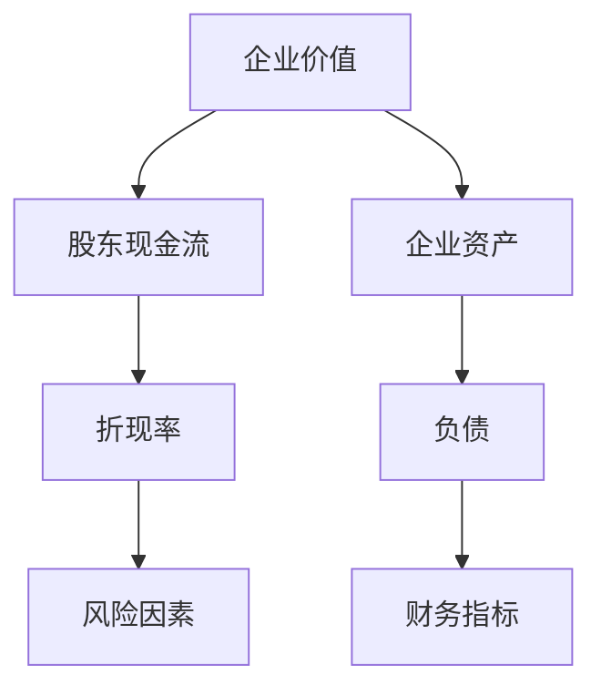
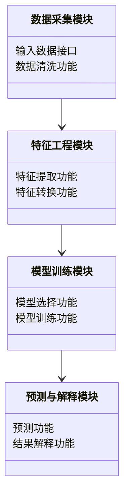
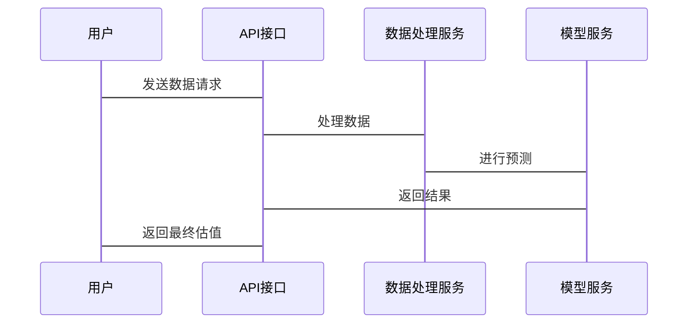

                 


# AI辅助的并购交易估值

## 关键词：并购交易，估值，人工智能，机器学习，金融分析

## 摘要：本文探讨AI在并购交易估值中的应用，涵盖背景、核心概念、算法原理、系统架构及项目实战。通过详细分析，揭示AI如何提升估值效率与准确性。

---

# 第1章: AI辅助的并购交易估值背景与概念

## 1.1 并购交易估值的定义与背景

### 1.1.1 并购交易的基本概念
并购交易指企业间的合并或收购，涉及复杂的财务分析和评估。传统估值方法依赖人工计算，耗时且易出错。

### 1.1.2 传统并购估值方法的局限性
- 数据依赖性强，处理复杂。
- 人工计算效率低，且主观因素多。
- 容易忽视市场动态和风险因素。

### 1.1.3 AI技术在金融领域的应用潜力
AI通过处理海量数据和模式识别，提升估值的准确性和效率，减少人为错误。

## 1.2 AI辅助并购估值的核心价值

### 1.2.1 提高估值效率
AI自动化处理数据，缩短估值时间。

### 1.2.2 增强估值准确性
利用机器学习模型分析更多变量，提高预测精度。

### 1.2.3 降低人为误差
AI减少人为因素干扰，提升结果客观性。

## 1.3 本书内容与目标

### 1.3.1 本书的核心目标
系统介绍AI辅助并购估值的方法，从理论到实践。

### 1.3.2 本书的结构安排
- 分章节讲解背景、概念、算法、系统架构和实战。

### 1.3.3 本书的读者群体
面向金融从业者、技术开发人员和学术研究人员。

## 1.4 本章小结
本章介绍了并购估值的背景和AI的辅助作用，为后续章节奠定基础。

---

# 第2章: 并购交易估值的核心概念与框架

## 2.1 并购估值的关键要素

### 2.1.1 企业价值评估
评估企业整体价值，包括资产、负债和未来现金流。

### 2.1.2 股东自由现金流
预测未来现金流，评估企业价值。

### 2.1.3 折现率与风险评估
确定合理的折现率，反映风险因素。

## 2.2 AI在并购估值中的应用框架

### 2.2.1 数据采集与处理
收集企业财务数据、市场信息和行业趋势。

### 2.2.2 特征提取与建模
识别关键特征，构建机器学习模型。

### 2.2.3 模型预测与结果解释
利用模型预测估值，解释结果并进行敏感性分析。

## 2.3 并购估值的边界与外延

### 2.3.1 并购估值的适用范围
适用于企业并购、资产定价等场景。

### 2.3.2 AI辅助估值的局限性
数据质量、模型泛化能力受限，需结合人工判断。

### 2.3.3 与其他估值方法的结合
AI可与DCF模型等传统方法结合，互补优势。

## 2.4 本章小结
本章详细阐述了并购估值的关键要素及AI的应用框架，为后续分析提供基础。

---

# 第3章: AI辅助并购估值的核心概念与联系

## 3.1 AI在并购估值中的核心概念

### 3.1.1 机器学习模型
用于预测企业价值，识别关键因素。

### 3.1.2 自然语言处理
分析财务报告和新闻，提取情绪和关键词。

### 3.1.3 时间序列分析
预测未来现金流和市场趋势。

## 3.2 核心概念的属性特征对比

| 模型类型 | 输入数据 | 输出结果 | 优势 | 局限 |
|----------|-----------|----------|------|------|
| 线性回归 | 结构化数据 | 数值预测 | 简单易懂 | 适合线性关系 |
| 支持向量机 | 结构化数据 | 分类/回归 | 高维数据表现好 | 参数敏感 |
| 随机森林 | 结构化+非结构化数据 | 分类/回归 | 高准确性 | �易过拟合 |

## 3.3 ER实体关系图架构



## 3.4 本章小结
本章分析了AI在并购估值中的核心概念及其相互关系，为后续算法选择提供依据。

---

# 第4章: AI辅助并购估值的算法原理

## 4.1 算法原理概述

### 4.1.1 算法选择的依据
数据类型、任务目标和模型解释性。

### 4.1.2 算法的优缺点
- 优点：高准确性和自动化。
- 缺点：数据依赖和模型维护。

### 4.1.3 算法的适用场景
结构化数据预测和非结构化数据处理。

## 4.2 算法原理的详细讲解

### 4.2.1 线性回归模型


数学公式：$$ y = \beta_0 + \beta_1 x + \epsilon $$

### 4.2.2 支持向量机模型


### 4.2.3 随机森林模型


数学公式：$$ y = \sum_{i=1}^{n} \text{Tree}(x_i) $$

## 4.3 算法原理的数学模型和公式

### 线性回归
$$ \hat{y} = \beta_0 + \beta_1 x_1 + \beta_2 x_2 + ... + \beta_n x_n $$

### 支持向量机
$$ \text{max} \sum_{i=1}^{n} y_i (a_i x_i \cdot x_j - b_i) \geq 1 $$
$$ \text{subject to} \quad y_i(a_i x_i \cdot x_j - b_i) \geq 1 $$

### 随机森林
$$ \text{Error Rate} = \frac{1}{n} \sum_{i=1}^{n} (y_i - \hat{y}_i) $$

## 4.4 本章小结
本章详细讲解了AI辅助并购估值的算法原理，包括线性回归、支持向量机和随机森林模型，并提供了数学公式和流程图。

---

# 第5章: 系统架构与设计方案

## 5.1 问题场景介绍
并购交易估值系统需处理大量数据，快速生成准确估值。

## 5.2 系统功能设计



## 5.3 系统架构设计


## 5.4 系统接口设计



## 5.5 本章小结
本章设计了一个模块化的系统架构，展示了如何通过接口进行数据处理和模型预测。

---

# 第6章: 项目实战与案例分析

## 6.1 环境安装与配置

### 6.1.1 安装Python
```bash
python --version
pip install --upgrade pip
```

### 6.1.2 安装依赖库
```bash
pip install numpy pandas scikit-learn
```

## 6.2 系统核心实现源代码

### 数据预处理
```python
import pandas as pd
import numpy as np

data = pd.read_csv('data.csv')
data = data.dropna().reset_index(drop=True)
```

### 特征工程
```python
from sklearn.preprocessing import StandardScaler

scaler = StandardScaler()
X_scaled = scaler.fit_transform(X)
```

### 模型训练与预测
```python
from sklearn.ensemble import RandomForestRegressor

model = RandomForestRegressor(n_estimators=100, random_state=42)
model.fit(X_scaled, y)
```

### 结果分析
```python
y_pred = model.predict(X_test_scaled)
print('预测值:', y_pred)
print('真实值:', y_test)
print('均方误差:', np.mean((y_pred - y_test) ** 2))
```

## 6.3 案例分析与结果解读

### 案例背景
某公司并购目标企业的历史数据和市场情况。

### 数据分析
预测结果与实际值对比，评估模型准确性。

## 6.4 本章小结
本章通过实际案例展示了AI辅助并购估值的实现过程，从数据预处理到模型训练，再到结果分析。

---

# 第7章: 总结与展望

## 7.1 本章小结
AI辅助并购估值的优势和应用场景，系统架构和实现方法。

## 7.2 注意事项与经验分享
- 数据质量至关重要。
- 模型需定期更新。
- 结果需结合人工判断。

## 7.3 拓展阅读与深入学习
推荐相关书籍和论文，鼓励读者深入研究。

---

# 结语

通过本文，读者可以全面了解AI在并购估值中的应用，从理论到实践，掌握核心算法和系统架构设计。未来，随着AI技术的发展，并购估值将更加智能化和高效化。

