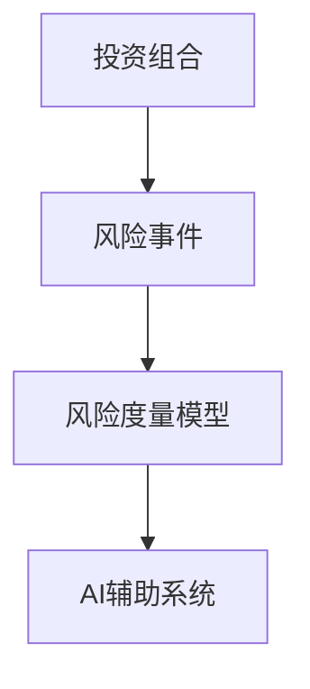
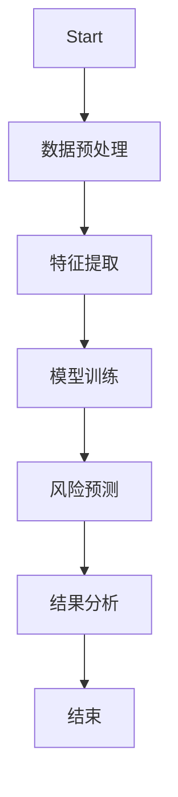
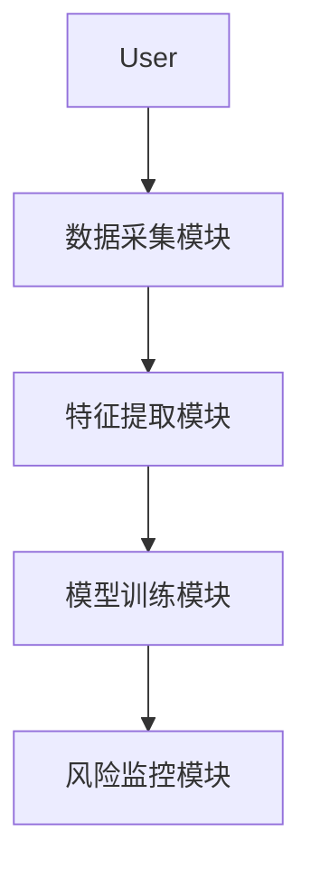

                 


# AI辅助的投资组合尾部风险度量

## 关键词：
投资组合，风险管理，尾部风险，人工智能，机器学习，深度学习，金融分析

## 摘要：
本文深入探讨了利用人工智能技术辅助投资组合尾部风险度量的方法。通过分析尾部风险的定义、特征及其对投资组合的影响，结合机器学习和深度学习算法，构建了AI辅助的风险度量系统。文章详细讲解了算法原理、系统架构设计及实际案例分析，为投资组合风险管理提供了新的思路和解决方案。

---

# 第一部分: 投资组合尾部风险度量的背景与概念

## 第1章: 问题背景与重要性

### 1.1 问题背景
#### 1.1.1 传统投资组合风险度量的局限性
传统投资组合风险度量方法（如VaR、CVaR）在处理尾部风险时存在以下问题：
- 忽略了极端事件的非线性特征
- 无法捕捉低概率但高损失的事件
- 计算复杂度高，难以实时更新

#### 1.1.2 尾部风险的定义与特征
尾部风险是指投资组合在极端市场条件下可能遭受的重大损失。其主要特征包括：
- 低概率性：尾部事件发生的概率较低
- 高损失性：一旦发生，可能导致重大损失
- 非线性：尾部风险与正常波动的关联性较弱

#### 1.1.3 尾部风险对投资组合的影响
尾部风险可能引发以下问题：
- 投资组合的稳定性受到威胁
- 投资者的信心下降
- 市场流动性枯竭

### 1.2 AI辅助的必要性与优势
#### 1.2.1 传统方法在尾部风险上的不足
- 参数化方法（如历史模拟法）难以捕捉复杂市场动态
- 统计模型假设过于简化，无法反映真实市场情况

#### 1.2.2 AI在尾部风险识别中的独特优势
- 机器学习模型能够自动提取数据中的非线性特征
- 深度学习模型可以处理高维数据，发现潜在风险模式

#### 1.2.3 技术融合的潜力与前景
- 通过AI技术提升尾部风险预测的准确性和及时性
- 结合实时市场数据，实现动态风险监控

## 第2章: 尾部风险度量的核心概念与联系

### 2.1 核心概念原理
#### 2.1.1 尾部风险的数学定义
尾部风险可以定义为投资组合在某一置信水平下的潜在损失，即：
$$ \text{Tail Risk} = P(L > L_{\text{VaR}}) $$
其中，\( L \) 是损失，\( L_{\text{VaR}} \) 是在置信水平下的VaR值。

#### 2.1.2 AI模型在风险预测中的作用
AI模型通过以下方式辅助尾部风险度量：
- **特征提取**：从历史数据中提取有用的特征
- **模式识别**：识别潜在的极端事件模式
- **预测模型**：构建预测尾部损失的模型

### 2.2 核心概念特征对比
#### 2.2.1 尾部风险与整体风险的对比分析
| 特征                | 尾部风险                | 整体风险                |
|---------------------|-------------------------|-------------------------|
| 定义                | 低概率、高损失的极端事件 | 包括所有可能的损失事件   |
| 计算复杂度          | 较高                    | 较低                    |
| 对投资组合的影响    | 可能导致重大损失        | 影响较为分散            |

#### 2.2.2 不同AI模型的性能对比
| 模型类型             | 优点                     | 缺点                     |
|----------------------|--------------------------|--------------------------|
| 传统机器学习         | 计算效率高               | 表达能力有限             |
| 深度学习             | 表达能力强               | 计算资源消耗大           |

### 2.3 ER实体关系图


---

# 第二部分: AI辅助的尾部风险度量算法原理

## 第3章: 算法原理概述

### 3.1 算法原理概述
#### 3.1.1 机器学习在风险预测中的应用
- **特征工程**：提取与尾部风险相关的特征
- **模型训练**：训练分类或回归模型预测尾部风险

#### 3.1.2 深度学习模型的优势
- **自动特征提取**：通过神经网络自动学习数据特征
- **非线性建模**：能够捕捉复杂市场动态

### 3.2 算法流程图


### 3.3 核心算法实现

#### 3.3.1 Python代码实现
```python
import numpy as np
from sklearn.model_selection import train_test_split
from sklearn.ensemble import RandomForestRegressor

# 示例数据集
X = np.random.rand(1000, 10)  # 10个特征，1000个样本
y = np.random.choice([0, 1], 1000, p=[0.8, 0.2])  # 尾部风险标签

# 划分训练集和测试集
X_train, X_test, y_train, y_test = train_test_split(X, y, test_size=0.2)

# 构建随机森林模型
model = RandomForestRegressor(n_estimators=100)
model.fit(X_train, y_train)

# 预测结果
y_pred = model.predict(X_test)
```

#### 3.3.2 算法数学模型
随机森林模型的数学表达式如下：
$$ y = \sum_{i=1}^{n} \text{Tree}(X) $$

---

# 第三部分: 系统分析与架构设计

## 第4章: 系统架构设计

### 4.1 系统功能设计
- **数据采集**：获取市场数据和投资组合信息
- **特征提取**：提取与尾部风险相关的特征
- **模型训练**：训练AI模型预测尾部风险
- **风险监控**：实时监控投资组合的尾部风险

### 4.2 系统架构图


### 4.3 接口与交互设计
- **数据接口**：与数据源对接，获取实时数据
- **用户接口**：提供用户友好的操作界面
- **API接口**：提供外部系统调用接口

---

# 第四部分: 项目实战

## 第5章: 项目实战

### 5.1 环境安装
```bash
pip install numpy scikit-learn matplotlib
```

### 5.2 核心代码实现
```python
import numpy as np
from sklearn.ensemble import RandomForestRegressor

# 示例数据集
X = np.random.rand(1000, 10)
y = np.random.choice([0, 1], 1000, p=[0.8, 0.2])

# 划分训练集和测试集
X_train, X_test, y_train, y_test = train_test_split(X, y, test_size=0.2)

# 构建随机森林模型
model = RandomForestRegressor(n_estimators=100)
model.fit(X_train, y_train)

# 预测结果
y_pred = model.predict(X_test)

# 可视化结果
import matplotlib.pyplot as plt
plt.scatter(y_test, y_pred)
plt.xlabel('真实值')
plt.ylabel('预测值')
plt.show()
```

### 5.3 实际案例分析
假设我们有一个包含10只股票的投资组合，我们可以通过上述代码预测其尾部风险。

---

# 第五部分: 最佳实践与总结

## 第6章: 最佳实践

### 6.1 小结
通过AI技术，我们可以显著提升投资组合尾部风险度量的效率和准确性。

### 6.2 注意事项
- 数据质量对模型性能至关重要
- 需要定期更新模型以适应市场变化

### 6.3 拓展阅读
- 《机器学习在金融中的应用》
- 《深度学习与风险管理》

---

## 总结

本文系统地探讨了AI辅助的投资组合尾部风险度量方法，从算法原理到系统设计，再到实际应用，为投资组合风险管理提供了新的思路。未来，随着AI技术的不断发展，尾部风险度量将更加精准和高效。

