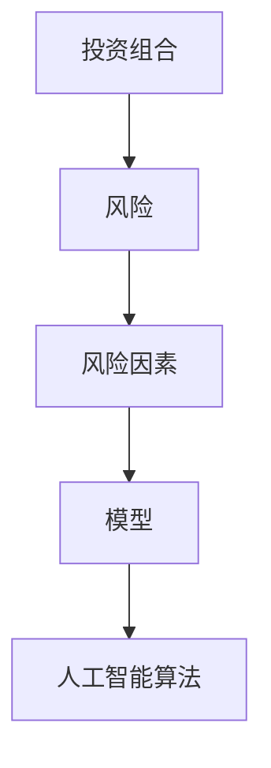
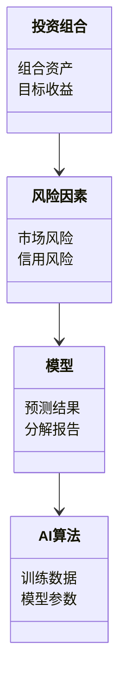
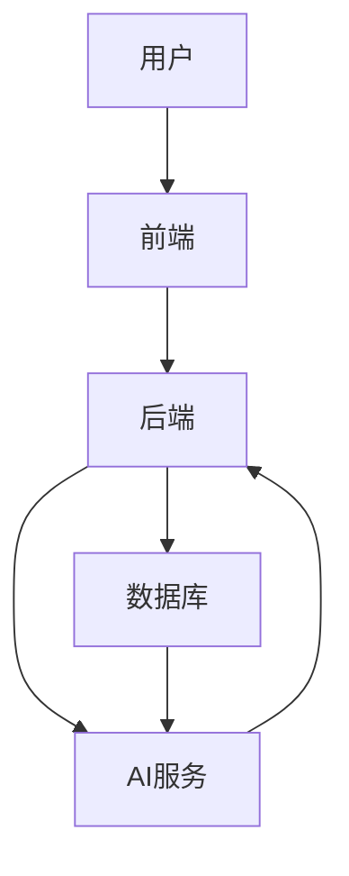
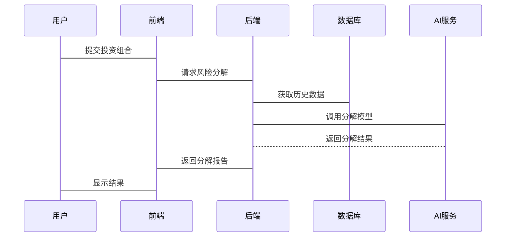

                 


# AI辅助的投资组合风险分解

## 关键词：
- AI辅助
- 投资组合
- 风险分解
- 机器学习
- 数学模型

## 摘要：
本文探讨了利用人工智能技术辅助投资组合风险分解的方法。通过分析投资组合风险分解的背景与意义，结合机器学习算法、数学模型和系统架构设计，详细阐述了AI在风险分解中的应用潜力和实现步骤。文章内容涵盖从理论到实践的各个方面，提供丰富的案例分析和代码实现，帮助读者全面理解和应用AI辅助投资组合风险分解的技术。

---

# 第一部分: AI辅助的投资组合风险分解概述

## 第1章: 投资组合风险分解的背景与意义

### 1.1 投资组合风险分解的背景
- 传统投资组合管理的局限性
- 风险分解在投资决策中的重要性
- AI技术带来的新机遇

### 1.2 AI在风险分解中的作用
- 数据处理与特征提取
- 模型优化与预测
- 结果解释与反馈

### 1.3 本章小结
- 理解投资组合风险分解的基本概念
- 明确AI技术在风险分解中的关键作用

---

# 第二部分: 投资组合风险分解的核心概念与联系

## 第2章: 投资组合风险分解的核心概念

### 2.1 风险分解的基本原理
- 风险的定义与分类
- 风险分解的关键步骤

### 2.2 AI在风险分解中的核心要素
- 数据来源与特征
- 模型选择与优化
- 结果解释与反馈机制

### 2.3 实体关系图


### 2.4 核心概念的对比分析
| 概念 | 描述 |
|------|------|
| 风险 | 可能导致投资损失的不确定性 |
| 风险因素 | 影响风险的具体变量 |
| 模型 | 描述变量间关系的数学工具 |
| AI算法 | 用于优化模型的算法 |

---

# 第三部分: AI辅助投资组合风险分解的算法原理

## 第3章: 基于机器学习的风险分解算法

### 3.1 机器学习在风险分解中的应用
- 监督学习与无监督学习对比
- 算法选择与优化

### 3.2 基于XGBoost的风险分解算法
- XGBoost算法原理
- 风险分解的实现步骤
- 代码实现与解读

### 3.3 基于LSTM的风险分解算法
- LSTM算法原理
- 时间序列数据的处理
- 代码实现与解读

### 3.4 算法对比与优化建议
- XGBoost与LSTM的对比
- 适用场景分析
- 模型优化建议

---

# 第四部分: 数学模型与公式详解

## 第4章: 投资组合风险分解的数学模型

### 4.1 风险分解的基本公式
$$ R = \sum_{i=1}^{n} w_i \cdot r_i $$

### 4.2 基于协方差的风险分解
- 协方差矩阵的构建
- 风险分解公式
$$ \text{Var}(R) = \sum_{i=1}^{n} \sum_{j=1}^{n} w_i w_j \cdot \text{Cov}(r_i, r_j) $$

### 4.3 数学模型的应用
- 如何使用数学模型进行风险预测
- 实际案例中的数学公式解读

---

# 第五部分: 系统分析与架构设计

## 第5章: 系统分析与架构设计

### 5.1 问题场景介绍
- 投资组合风险分解的典型问题场景
- 系统目标与功能需求

### 5.2 领域模型设计


### 5.3 系统架构设计


### 5.4 系统交互设计


---

# 第六部分: 项目实战

## 第6章: 项目实战与案例分析

### 6.1 环境安装
- 安装Python、机器学习库（如scikit-learn、XGBoost、Keras）
- 数据获取与预处理

### 6.2 核心代码实现
```python
import xgboost as xgb
from sklearn.model_selection import train_test_split

# 数据准备
X_train, X_test, y_train, y_test = train_test_split(features, target)

# 模型训练
model = xgb.XGBRegressor(n_estimators=100, learning_rate=0.1)
model.fit(X_train, y_train)

# 预测与评估
y_pred = model.predict(X_test)
```

### 6.3 代码解读与分析
- 数据预处理步骤
- 模型训练参数设置
- 预测结果的评估与分析

### 6.4 案例分析
- 实际案例背景
- 数据处理过程
- 模型训练与结果解读

### 6.5 项目小结
- 项目实现的关键点
- 遇到的问题与解决方案
- 改进建议

---

# 第七部分: 最佳实践与总结

## 第7章: 最佳实践与总结

### 7.1 最佳实践
- 数据清洗与特征工程的重要性
- 模型选择与调优的策略
- 结果解释与反馈机制的建立

### 7.2 小结
- AI辅助投资组合风险分解的优势
- 未来研究方向
- 实际应用中的注意事项

### 7.3 未来展望
- 新技术（如强化学习）的应用潜力
- 数据隐私与安全的挑战
- 多模态数据的融合趋势

---

通过以上目录结构，文章内容将系统地涵盖从理论到实践的各个方面，帮助读者全面理解和应用AI辅助投资组合风险分解的技术。

