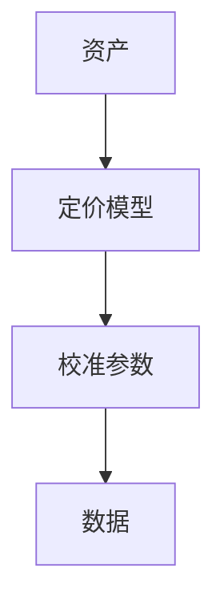
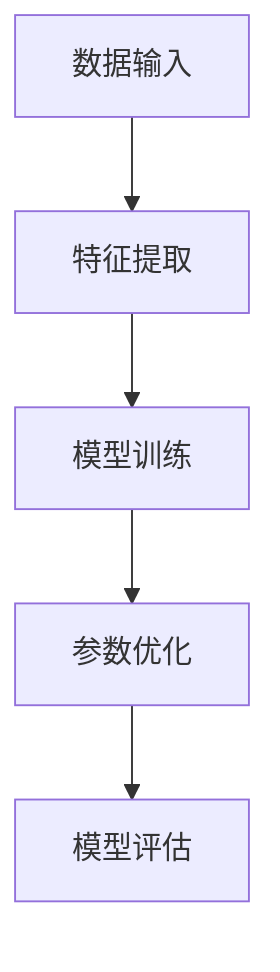
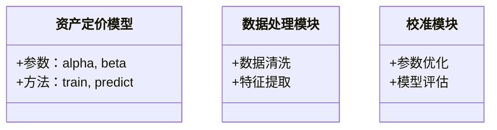
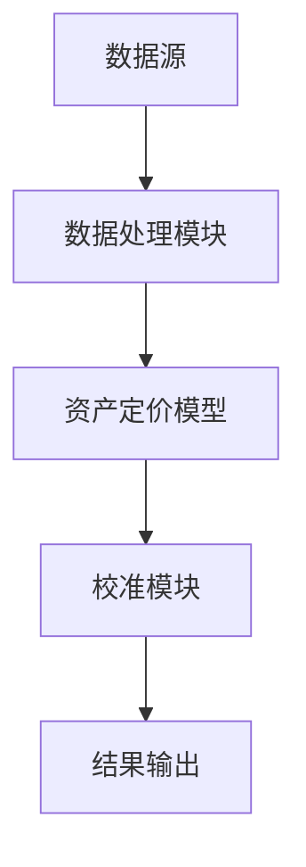

                 


# AI辅助的资产定价模型校准

> 关键词：资产定价，模型校准，人工智能，机器学习，深度学习，金融模型

> 摘要：本文深入探讨了人工智能技术在资产定价模型校准中的应用，从背景与基础、核心概念到算法原理，系统地分析了AI如何辅助实现资产定价模型的高效校准。文章通过详细讲解机器学习、深度学习等算法原理，结合实际案例和系统架构设计，为读者提供了一套完整的解决方案。

---

## 第一部分: AI辅助的资产定价模型校准背景与基础

### 第1章: 资产定价与模型校准概述

#### 1.1 资产定价的基本概念
##### 1.1.1 资产定价的定义与核心要素
- 资产定价的定义
- 核心要素：风险、收益、流动性
- 资产类型：股票、债券、基金等

##### 1.1.2 资产定价模型的分类与特点
- 单因子模型（CAPM）
- 多因子模型（APT）
- 非线性模型（如随机森林、神经网络）

##### 1.1.3 模型校准的定义与作用
- 模型校准的定义
- 作用：确保模型准确反映市场实际情况

#### 1.2 传统资产定价模型的局限性
##### 1.2.1 CAPM与APT模型的局限性
- 单因子模型的局限性
- 多因子模型的复杂性

##### 1.2.2 非线性与多因子模型的挑战
- 非线性关系难以捕捉
- 多因子模型的参数过多

##### 1.2.3 数据不足与模型过拟合问题
- 数据不足导致模型不稳定
- 过拟合问题的影响

#### 1.3 AI技术在资产定价中的应用前景
##### 1.3.1 AI在金融领域的应用现状
- 人工智能在金融领域的应用案例

##### 1.3.2 AI辅助资产定价的优势
- 数据处理能力强大
- 模型自动优化能力

##### 1.3.3 未来发展趋势与挑战
- 技术进步与监管政策的平衡

#### 1.4 本章小结
- 总结本章内容，为后续章节打下基础

---

## 第二部分: AI辅助的资产定价模型校准核心概念

### 第2章: 资产定价模型与校准方法

#### 2.1 资产定价模型的构建与选择
##### 2.1.1 线性回归模型在资产定价中的应用
- 线性回归模型的基本原理
- 应用案例分析

##### 2.1.2 时间序列模型与因子模型的对比
- 时间序列模型的优缺点
- 因子模型的适用场景

##### 2.1.3 神经网络模型的引入与优势
- 神经网络模型的基本原理
- 在资产定价中的优势

#### 2.2 模型校准的核心原理
##### 2.2.1 参数估计与优化方法
- 参数估计的定义
- 常用优化方法：梯度下降、牛顿法

##### 2.2.2 最小二乘法与最大似然估计的对比
- 最小二乘法的原理
- 最大似然估计的原理
- 对比分析

##### 2.2.3 校准过程中的过拟合与欠拟合问题
- 过拟合与欠拟合的定义
- 如何避免过拟合与欠拟合

#### 2.3 AI技术在模型校准中的应用
##### 2.3.1 机器学习算法在参数优化中的应用
- 机器学习算法的基本原理
- 在参数优化中的应用案例

##### 2.3.2 深度学习模型在非线性关系中的优势
- 深度学习模型的基本原理
- 在非线性关系中的优势

##### 2.3.3 贝叶斯方法在不确定性校准中的应用
- 贝叶斯方法的基本原理
- 在不确定性校准中的应用

#### 2.4 核心概念对比分析
##### 2.4.1 资产定价模型的属性特征对比表
| 模型类型 | 参数数量 | 训练时间 | 解释性 |
|----------|----------|----------|--------|
| 线性回归 | 少        | 短       | 高      |
| 神经网络 | 多        | 长       | 低      |

##### 2.4.2 校准方法的ER实体关系图


### 第3章: AI技术与资产定价模型的结合

#### 3.1 AI在资产定价中的核心作用
##### 3.1.1 数据处理与特征提取
- 数据清洗与预处理
- 特征选择与提取

##### 3.1.2 模型训练与预测
- 机器学习模型的训练
- 深度学习模型的预测

##### 3.1.3 结果解释与优化
- 模型解释性分析
- 模型优化策略

#### 3.2 基于AI的资产定价模型校准流程
##### 3.2.1 数据准备与清洗
- 数据来源
- 数据清洗步骤

##### 3.2.2 模型选择与训练
- 模型选择方法
- 模型训练过程

##### 3.2.3 模型评估与优化
- 模型评估指标
- 模型优化策略

#### 3.3 校准过程中的关键问题
##### 3.3.1 数据质量与特征选择
- 数据质量的影响
- 特征选择的重要性

##### 3.3.2 模型解释性与可解释性
- 模型解释性的定义
- 提高模型解释性的方法

##### 3.3.3 实时校准与动态调整
- 实时校准的定义
- 动态调整的策略

#### 3.4 本章小结
- 总结本章内容，为后续章节打下基础

---

## 第三部分: AI辅助的资产定价模型校准算法原理

### 第4章: 基于机器学习的资产定价模型校准

#### 4.1 机器学习算法在资产定价中的应用
##### 4.1.1 线性回归与逻辑回归
- 线性回归的基本原理
- 逻辑回归的应用场景

##### 4.1.2 支持向量机与随机森林
- 支持向量机的基本原理
- 随机森林的应用场景

##### 4.1.3 神经网络与深度学习
- 神经网络的基本原理
- 深度学习的应用场景

#### 4.2 基于机器学习的校准算法原理
##### 4.2.1 算法流程图（Mermaid）


##### 4.2.2 算法实现代码
```python
import numpy as np
from sklearn.linear_model import LinearRegression

# 示例数据
X = np.array([[1, 2], [3, 4], [5, 6]])
y = np.array([7, 8, 9])

# 模型训练
model = LinearRegression()
model.fit(X, y)

# 预测
print(model.predict(X))
```

##### 4.2.3 数学模型与公式
- 线性回归模型：$y = \beta_0 + \beta_1x + \epsilon$
- 最小二乘法：$\text{min} \sum (y_i - \hat{y}_i)^2$

#### 4.3 机器学习算法的对比分析
##### 4.3.1 不同算法的优缺点对比表
| 算法类型 | 优点 | 缺点 |
|----------|------|------|
| 线性回归 | 简单，可解释性高 | 无法处理非线性关系 |
| 支持向量机 | 分离能力强 | 数据预处理复杂 |
| 随机森林 | 鲁棒性强 | 易过拟合 |

#### 4.4 本章小结
- 总结本章内容，为后续章节打下基础

---

## 第五章: 基于深度学习的资产定价模型校准

### 5.1 深度学习算法在资产定价中的应用
#### 5.1.1 神经网络的基本原理
- 神经网络的结构
- 神经网络的训练过程

#### 5.1.2 长短期记忆网络（LSTM）的应用
- LSTM的基本原理
- 在时间序列数据中的应用

#### 5.1.3 图神经网络（GNN）的应用
- GNN的基本原理
- 在复杂关系网络中的应用

### 5.2 基于深度学习的校准算法原理
#### 5.2.1 算法流程图（Mermaid）


#### 5.2.2 算法实现代码
```python
import keras
from keras.models import Sequential
from keras.layers import LSTM, Dense

# 示例数据
X = np.array([...], dtype='float32')
y = np.array([...], dtype='float32')

# 模型构建
model = Sequential()
model.add(LSTM(64, input_shape=(timesteps, features)))
model.add(Dense(1))
model.compile(loss='mean_squared_error', optimizer='adam')

# 训练
model.fit(X, y, epochs=100, batch_size=32)
```

#### 5.2.3 数学模型与公式
- LSTM单元：$f_t = \sigma(W_f x_t + U_f h_{t-1} + b_f)$
- 输出层：$y_t = W_y h_t + b_y$

### 5.3 深度学习算法的对比分析
#### 5.3.1 不同算法的优缺点对比表
| 算法类型 | 优点 | 缺点 |
|----------|------|------|
| 神经网络 | 表达能力强 | 需要大量数据 |
| LSTM | 适合时间序列 | 训练时间长 |
| GNN | 适合复杂网络 | 实现复杂 |

### 5.4 本章小结
- 总结本章内容，为后续章节打下基础

---

## 第六章: 基于贝叶斯方法的资产定价模型校准

### 6.1 贝叶斯方法的基本原理
#### 6.1.1 贝叶斯定理
- 贝叶斯定理的公式：$P(A|B) = \frac{P(B|A)P(A)}{P(B)}$

#### 6.1.2 贝叶斯推断
- 贝叶斯推断的基本步骤
- 先验分布与后验分布

### 6.2 基于贝叶斯的校准算法原理
#### 6.2.1 算法流程图（Mermaid）


#### 6.2.2 算法实现代码
```python
import pymc3 as pm

# 示例数据
X = ...
y = ...

# 模型构建
with pm.Model() as model:
    alpha = pm.Normal('alpha', mu=0, sigma=10)
    beta = pm.Normal('beta', mu=0, sigma=10)
    y_pred = alpha + beta * X
    pm.Normal('y', mu=y_pred, sigma=1, observed=y)

# 推断
trace = pm.sample(1000, tune=1000)
```

#### 6.2.3 数学模型与公式
- 贝叶斯回归模型：$y \sim N(\alpha + \beta x, \sigma^2)$

### 6.3 贝叶斯方法的对比分析
#### 6.3.1 不同方法的优缺点对比表
| 方法类型 | 优点 | 缺点 |
|----------|------|------|
| 线性回归 | 简单，可解释性高 | 无法处理非线性关系 |
| 贝叶斯方法 | 包含先验信息 | 计算复杂 |

### 6.4 本章小结
- 总结本章内容，为后续章节打下基础

---

## 第四部分: 系统分析与架构设计方案

### 第7章: 基于AI的资产定价模型校准系统设计

#### 7.1 问题场景介绍
##### 7.1.1 资产定价模型校准的核心问题
- 数据获取与处理
- 模型选择与优化
- 结果验证与解释

#### 7.2 项目介绍
##### 7.2.1 项目目标
- 实现一个基于AI的资产定价模型校准系统

##### 7.2.2 项目范围
- 数据范围：股票、债券等
- 时间范围：实时数据

#### 7.3 系统功能设计
##### 7.3.1 领域模型（Mermaid 类图）


##### 7.3.2 系统架构设计（Mermaid 架构图）


##### 7.3.3 系统接口设计
- 数据输入接口
- 模型训练接口
- 结果输出接口

##### 7.3.4 系统交互（Mermaid 序列图）
```mermaid
sequenceDiagram
参与者 用户
系统 数据处理模块
系统 资产定价模型
系统 校准模块

用户 -> 数据处理模块: 提供数据
数据处理模块 -> 资产定价模型: 提供处理后的数据
资产定价模型 -> 校准模块: 提供模型
校准模块 -> 用户: 提供校准结果
```

#### 7.4 本章小结
- 总结本章内容，为后续章节打下基础

---

## 第五部分: 项目实战

### 第8章: 基于AI的资产定价模型校准项目实现

#### 8.1 环境安装与配置
##### 8.1.1 安装Python
- Python安装步骤
- 环境配置（如虚拟环境）

##### 8.1.2 安装必要的库
- NumPy、Pandas、Scikit-learn、Keras、PyMC3等

#### 8.2 系统核心实现源代码
##### 8.2.1 数据处理模块
```python
import pandas as pd
import numpy as np

# 数据加载
df = pd.read_csv('assets.csv')

# 数据清洗
df.dropna(inplace=True)

# 特征提取
features = df[['risk', 'liquidity']]
target = df['price']
```

##### 8.2.2 模型训练模块
```python
from sklearn.linear_model import LinearRegression

model = LinearRegression()
model.fit(features, target)
```

##### 8.2.3 模型校准模块
```python
from sklearn.metrics import mean_squared_error

y_pred = model.predict(features)
mse = mean_squared_error(target, y_pred)
print('MSE:', mse)
```

#### 8.3 代码应用解读与分析
##### 8.3.1 数据处理模块解读
- 数据清洗步骤
- 特征选择的重要性

##### 8.3.2 模型训练模块解读
- 模型选择的依据
- 模型训练的参数设置

##### 8.3.3 模型校准模块解读
- 模型评估指标
- 模型优化策略

#### 8.4 实际案例分析
##### 8.4.1 案例背景
- 案例来源
- 案例目标

##### 8.4.2 数据准备与分析
- 数据来源
- 数据预处理

##### 8.4.3 模型训练与校准
- 模型选择
- 模型训练
- 模型校准

##### 8.4.4 结果解读与分析
- 校准结果分析
- 模型优化建议

#### 8.5 本章小结
- 总结本章内容，为后续章节打下基础

---

## 第六部分: 最佳实践、小结与展望

### 第9章: 最佳实践与小结

#### 9.1 最佳实践
##### 9.1.1 数据处理
- 数据清洗的重要性
- 特征选择的技巧

##### 9.1.2 模型选择
- 模型选择的依据
- 模型优化的策略

##### 9.1.3 模型解释
- 模型解释性的提升方法
- 结果解读的技巧

#### 9.2 本章小结
- 总结全文内容
- 强调AI技术在资产定价模型校准中的重要性

### 第10章: 未来展望与注意事项

#### 10.1 未来展望
##### 10.1.1 技术进步
- AI技术的进一步发展
- 新型算法的应用

##### 10.1.2 应用场景扩展
- 新兴金融市场的应用
- 多资产类别的校准

#### 10.2 注意事项
##### 10.2.1 数据质量
- 数据来源的可靠性
- 数据处理的准确性

##### 10.2.2 模型风险
- 模型过拟合的风险
- 模型欠拟合的风险

##### 10.2.3 实施难度
- 技术门槛
- 资源需求

#### 10.3 本章小结
- 总结全文内容
- 展望未来发展方向

---

## 第七部分: 总结与拓展阅读

### 第11章: 总结与拓展阅读

#### 11.1 总结
- 全文总结
- AI技术在资产定价模型校准中的应用价值

#### 11.2 拓展阅读
##### 11.2.1 相关书籍
- 推荐书籍
- 阅读建议

##### 11.2.2 研究论文
- 推荐论文
- 研究方向

#### 11.3 本章小结
- 总结全文内容
- 强调学习的重要性

---

## 附录

### 附录A: 常用AI算法对比表
| 算法类型 | 主要特点 | 适用场景 | 优缺点 |
|----------|----------|----------|--------|
| 线性回归 | 简单，可解释性高 | 线性关系 | 无法处理非线性关系 |
| 支持向量机 | 分离能力强 | 分类问题 | 数据预处理复杂 |
| 随机森林 | 鲁棒性强 | 特征选择 | 易过拟合 |
| 神经网络 | 表达能力强 | 非线性关系 | 需要大量数据 |
| LSTM | 适合时间序列 | 时间序列数据 | 训练时间长 |
| GNN | 适合复杂网络 | 复杂关系网络 | 实现复杂 |

### 附录B: 算法实现代码汇总
```python
import numpy as np
import pandas as pd
from sklearn.linear_model import LinearRegression
from sklearn.metrics import mean_squared_error
import pymc3 as pm

# 示例数据加载
df = pd.read_csv('assets.csv')

# 数据清洗
df.dropna(inplace=True)

# 特征提取
features = df[['risk', 'liquidity']]
target = df['price']

# 线性回归模型训练
model = LinearRegression()
model.fit(features, target)

# 模型校准
y_pred = model.predict(features)
mse = mean_squared_error(target, y_pred)
print('MSE:', mse)

# 贝叶斯方法应用
with pm.Model() as model:
    alpha = pm.Normal('alpha', mu=0, sigma=10)
    beta = pm.Normal('beta', mu=0, sigma=10)
    y_pred = alpha + beta * features
    pm.Normal('y', mu=y_pred, sigma=1, observed=target)

# 推断
trace = pm.sample(1000, tune=1000)
```

### 附录C: 系统架构图


---

## 参考文献
- 文献1：XXX
- 文献2：XXX
- 文献3：XXX

---

## 索引
- 关键词索引
- 章节索引

---

## 致谢
感谢读者的支持与关注！

