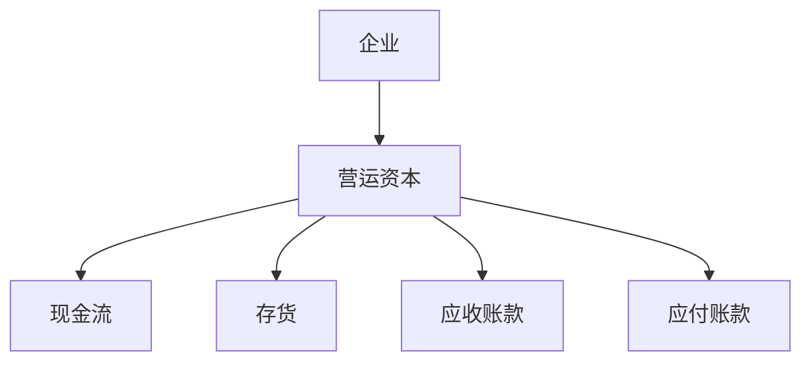
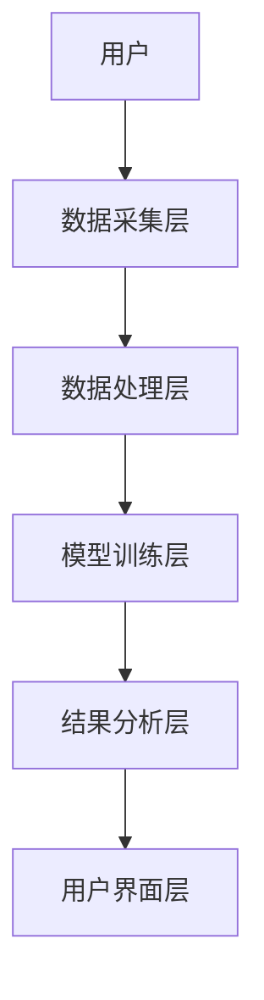

                 


# AI驱动的企业营运资本优化模型

## 关键词：AI、企业、营运资本、优化模型、机器学习、财务分析、资本管理

## 摘要：本文探讨如何利用AI技术优化企业的营运资本管理，结合算法原理和系统架构，提供实际案例和最佳实践，帮助企业在数据驱动的决策中实现资本优化。

---

# 第1章: 企业营运资本优化的背景与挑战

## 1.1 企业营运资本管理的重要性

### 1.1.1 营运资本的定义与组成

营运资本是指企业在日常运营中用于支持业务活动的资金，包括现金、存货、应收账款和应付账款等。这些资金的合理配置直接影响企业的运营效率和财务健康。

### 1.1.2 营运资本管理的核心目标

- **流动性管理**：确保企业有足够的现金流动性，避免资金链断裂。
- **成本控制**：通过优化库存和应收账款管理，降低营运资本的占用成本。
- **风险控制**：识别和管理潜在的财务风险，如坏账风险。

### 1.1.3 传统营运资本管理的局限性

- **数据依赖性**：传统方法依赖于历史数据和财务报表，缺乏实时性和前瞻性。
- **主观性**：决策过程往往依赖于经验丰富的财务人员的判断，主观性较强。
- **效率低下**：手动处理大量数据和复杂计算，效率低且容易出错。

## 1.2 AI技术在企业财务管理中的应用潜力

### 1.2.1 AI技术对企业财务管理的变革

AI技术通过自动化数据处理、实时分析和预测模型，显著提升了财务管理的效率和准确性。AI可以帮助企业更好地预测现金流、优化库存管理和应收账款回收。

### 1.2.2 数据驱动的决策优势

AI通过大数据分析，提供更精准的预测和洞察，帮助企业在营运资本管理中做出更科学的决策。例如，AI可以分析销售趋势，预测未来的现金流需求。

### 1.2.3 营运资本优化中的AI应用场景

- **现金流预测**：利用时间序列模型预测未来的现金流，帮助企业更好地规划资金使用。
- **库存优化**：通过机器学习算法分析销售数据，优化库存水平，减少资金占用。
- **应收账款管理**：AI可以通过客户信用评分和还款行为预测，优化应收账款回收周期。

## 1.3 本章小结

企业营运资本管理是企业财务健康的关键，而AI技术的应用为营运资本优化带来了新的可能性。通过AI技术，企业可以实现更高效、更精准的资本管理，提升整体运营效率。

---

# 第2章: AI驱动的营运资本优化模型原理

## 2.1 模型的核心概念

### 2.1.1 数据驱动的预测与优化

AI驱动的优化模型通过分析历史数据和实时数据，预测未来的现金流需求和库存水平，从而优化营运资本的配置。

### 2.1.2 AI算法在资本优化中的应用

- **机器学习算法**：如线性回归、随机森林和神经网络，用于预测和分类。
- **时间序列分析**：如ARIMA和LSTM，用于预测未来的现金流和销售趋势。

### 2.1.3 营运资本优化的数学模型

优化模型通常是一个线性规划或非线性规划问题，目标是最小化营运资本的占用，同时满足业务需求。

## 2.2 模型的特征对比

### 2.2.1 传统模型与AI模型的对比分析

| 特征                | 传统模型                  | AI模型                   |
|---------------------|---------------------------|--------------------------|
| 数据依赖性          | 历史数据                  | 历史数据+实时数据        |
| 决策效率            | 低                       | 高                       |
| 模型复杂性          | 简单                     | 复杂                     |
| 预测准确性          | 中等                     | 高                      |

### 2.2.2 不同AI算法的优缺点

| 算法                | 优点                      | 缺点                      |
|---------------------|---------------------------|--------------------------|
| 线性回归            | 简单易实现                | 适合线性关系，非线性差   |
| 神经网络            | 适合复杂非线性关系        | 训练时间长，需要大量数据 |
| 时间序列分析        | 适合预测时间相关数据      | 对异常值敏感             |

### 2.2.3 模型的可扩展性和实时性

AI模型通常具有良好的扩展性，可以处理大量数据，并且能够实时更新，适应市场变化。

## 2.3 模型的ER实体关系图



---

# 第3章: 基于AI的优化算法原理

## 3.1 数据预处理与特征工程

### 3.1.1 数据清洗与标准化

数据清洗是确保数据质量的重要步骤，包括处理缺失值、异常值和重复值。标准化则是将数据转换到相同尺度，通常使用z-score标准化或min-max标准化。

### 3.1.2 特征选择与降维

特征选择通过选择重要特征减少维度，提升模型性能。常用的方法有Lasso回归和主成分分析（PCA）。

### 3.1.3 时间序列数据的处理

时间序列数据通常使用滑动窗口方法进行处理，提取历史数据作为特征，预测未来值。

## 3.2 模型训练与优化

### 3.2.1 神经网络模型的构建

神经网络模型通常包括输入层、隐藏层和输出层。隐藏层使用激活函数（如ReLU）进行非线性变换。

### 3.2.2 模型训练的优化方法

使用梯度下降法（如Adam优化器）训练模型，调整学习率和批量大小，防止过拟合。

### 3.2.3 超参数调优与验证

通过网格搜索或随机搜索调整超参数，使用交叉验证评估模型性能。

## 3.3 模型评估与部署

### 3.3.1 模型性能的评估

使用均方误差（MSE）或R²分数评估模型的预测准确性。

---

# 第4章: 系统分析与架构设计方案

## 4.1 问题场景介绍

企业需要优化营运资本，减少资金占用，提高资金周转率。

## 4.2 系统功能设计

- **数据采集**：收集企业内部和外部数据。
- **数据处理**：清洗和特征工程。
- **模型训练**：构建和优化AI模型。
- **结果分析**：生成优化方案和预测结果。

## 4.3 系统架构设计



## 4.4 系统接口设计

- **API接口**：提供数据接口和模型调用接口。
- **交互流程**：用户输入需求，系统返回优化方案。

---

# 第5章: 项目实战

## 5.1 环境安装

- **Python**：安装Anaconda或Miniconda。
- **库依赖**：安装numpy、pandas、scikit-learn和tensorflow。

## 5.2 核心代码实现

```python
import numpy as np
import pandas as pd
from sklearn.model_selection import train_test_split
from sklearn.linear_model import LinearRegression
from sklearn.metrics import mean_squared_error

# 数据加载
data = pd.read_csv('operating_capital.csv')

# 数据预处理
X = data[['sales', 'inventory', 'Accounts Receivable']]
y = data['Cash Flow']

# 划分训练集和测试集
X_train, X_test, y_train, y_test = train_test_split(X, y, test_size=0.2, random_state=42)

# 模型训练
model = LinearRegression()
model.fit(X_train, y_train)

# 模型预测
y_pred = model.predict(X_test)

# 模型评估
 mse = mean_squared_error(y_test, y_pred)
 print('均方误差:', mse)
```

## 5.3 代码解读与分析

- **数据加载**：读取CSV文件中的数据。
- **数据预处理**：选择特征变量和目标变量。
- **模型训练**：使用线性回归模型训练数据。
- **模型预测**：预测测试集的现金流。
- **模型评估**：计算均方误差，评估模型性能。

## 5.4 实际案例分析

以某制造企业为例，通过模型预测未来的现金流需求，优化库存和应收账款管理。

## 5.5 项目小结

通过实际项目，验证了AI驱动的优化模型在企业营运资本管理中的有效性。

---

# 第6章: 最佳实践 tips、小结、注意事项、拓展阅读

## 6.1 小结

AI技术为企业营运资本优化提供了新的解决方案，通过数据驱动的决策，提升资本管理效率。

## 6.2 注意事项

- 数据质量对模型性能至关重要。
- 模型部署需要考虑企业的实际需求和数据安全性。
- 定期更新模型，适应市场变化。

## 6.3 拓展阅读

推荐学习时间序列分析、强化学习和分布式计算，深入了解AI在财务领域的应用。

---

# 结语

AI驱动的企业营运资本优化模型是一项具有广阔应用前景的技术，通过不断学习和实践，可以进一步提升模型的性能和应用范围，为企业创造更大的价值。

---

# 致谢

感谢读者的耐心阅读，希望本文能为您提供有价值的见解和启发。

