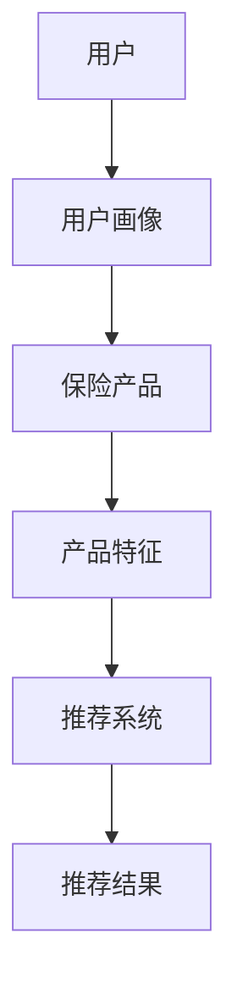
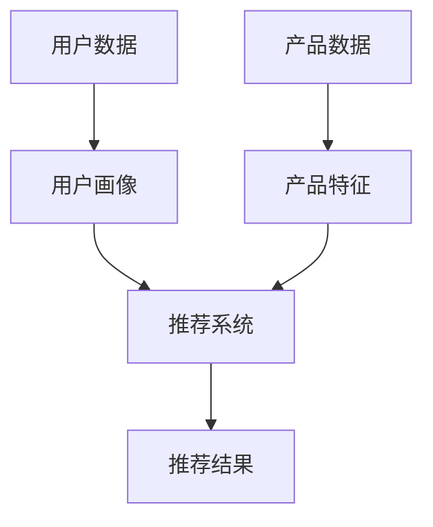
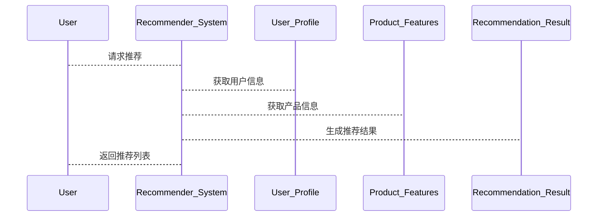

                 


# AI驱动的保险产品推荐

> 关键词：AI驱动，保险产品推荐，协同过滤，深度学习，系统架构

> 摘要：随着保险行业的数字化转型，AI驱动的保险产品推荐系统成为提升用户体验和保险公司效率的关键技术。本文从保险推荐系统的背景出发，详细分析其核心概念、算法原理、系统架构，并通过项目实战展示AI技术的应用，最后总结最佳实践和未来发展方向。

---

## 第1章: AI驱动的保险产品推荐概述

### 1.1 保险行业的数字化转型

#### 1.1.1 保险行业的现状与挑战

保险行业正在经历数字化转型的浪潮。传统的保险销售模式依赖于人工推荐和经验判断，效率低下且难以满足个性化需求。随着大数据和人工智能技术的发展，保险公司需要通过数字化手段提升用户体验和业务效率。

#### 1.1.2 数字化转型的必要性

- 提高销售效率：通过AI技术快速匹配用户需求与保险产品。
- 降低成本：自动化推荐减少人工干预，降低运营成本。
- 提升用户体验：为用户提供个性化的保险方案，增强客户满意度。

#### 1.1.3 AI技术在保险行业的应用前景

AI技术在保险行业的应用广泛，包括风险评估、理赔处理、产品推荐等。其中，保险产品推荐是AI技术应用的重要领域之一。

### 1.2 保险产品推荐的核心问题

#### 1.2.1 保险产品的特点与分类

保险产品种类繁多，包括人寿保险、健康保险、财产保险等。每种保险产品的保障范围和保费结构不同，用户需求差异性大。

#### 1.2.2 用户需求分析与保险产品匹配

用户需求分析是保险推荐的关键。通过分析用户的年龄、职业、健康状况等因素，可以精准匹配适合的保险产品。

#### 1.2.3 保险推荐系统的定义与目标

保险推荐系统是一种基于用户数据和保险产品特征，通过AI算法生成个性化推荐的系统。其目标是提高用户满意度和保险公司销售效率。

### 1.3 AI驱动的保险推荐系统的优势

#### 1.3.1 提高推荐效率

AI技术能够快速处理大量数据，显著提高推荐效率。

#### 1.3.2 个性化推荐的实现

通过用户画像和行为分析，AI推荐系统可以实现个性化的保险产品推荐。

#### 1.3.3 数据驱动的精准推荐

基于大数据分析，AI推荐系统能够准确识别用户需求，提供精准的推荐结果。

### 1.4 本章小结

本章介绍了保险行业的数字化转型背景，分析了保险产品推荐的核心问题，并阐述了AI驱动推荐系统的优势。这些内容为后续章节奠定了基础。

---

## 第2章: 保险产品推荐的核心概念与联系

### 2.1 推荐系统的核心原理

#### 2.1.1 基于协同过滤的推荐

协同过滤是一种基于用户行为数据的推荐方法。通过分析用户的购买记录、浏览行为等，找到相似用户的偏好，进而推荐相似产品。

#### 2.1.2 基于内容的推荐

基于内容的推荐方法依赖于保险产品的特征描述，通过分析产品属性（如保费、保障范围等），为用户推荐匹配的产品。

#### 2.1.3 混合推荐模型

混合推荐模型结合协同过滤和内容推荐的优点，通过多特征融合提高推荐精度。

### 2.2 保险产品推荐的核心要素

#### 2.2.1 用户画像与行为分析

用户画像是基于用户数据构建的用户信息模型，包括年龄、职业、收入等。行为分析则关注用户的浏览、点击、购买等行为。

#### 2.2.2 保险产品特征提取

保险产品的特征包括保费、保障范围、理赔条件等。通过提取这些特征，可以更准确地匹配用户需求。

#### 2.2.3 推荐结果的评估指标

推荐系统的评估指标包括准确率、召回率、F1值等。这些指标用于衡量推荐系统的性能。

### 2.3 AI驱动推荐系统的实体关系图



### 2.4 本章小结

本章详细介绍了推荐系统的核心原理和保险产品推荐的核心要素，并通过实体关系图展示了系统的组成结构。

---

## 第3章: AI驱动保险推荐的算法原理

### 3.1 协同过滤算法的实现

#### 3.1.1 基于用户的协同过滤

基于用户的协同过滤通过寻找相似用户的偏好，推荐相似的产品。具体步骤包括数据收集、计算相似度、生成推荐。

#### 3.1.2 基于物品的协同过滤

基于物品的协同过滤通过分析产品的相似性，为用户推荐相关产品。这种方法适用于产品种类繁多的场景。

#### 3.1.3 混合协同过滤

混合协同过滤结合基于用户和基于物品的推荐方法，通过加权融合提高推荐精度。

### 3.2 协同过滤的数学模型

#### 3.2.1 相似度计算公式

$$ sim(i,j) = \frac{\sum_{k} (r_{i,k} - \bar{r}_i)(r_{j,k} - \bar{r}_j)}{\sqrt{\sum_{k} (r_{i,k} - \bar{r}_i)^2} \sqrt{\sum_{k} (r_{j,k} - \bar{r}_j)^2}} $$

其中，$sim(i,j)$ 表示用户i和用户j的相似度，$r_{i,k}$ 表示用户i对产品k的评分，$\bar{r}_i$ 表示用户i的平均评分。

#### 3.2.2 推荐结果计算公式

$$ rec(i,j) = \sum_{k} sim(i,j) \times r_{j,k} $$

其中，$rec(i,j)$ 表示用户i推荐的产品j的评分。

### 3.3 基于深度学习的推荐算法

#### 3.3.1 神经网络模型

神经网络模型通过多层感知机学习用户和产品的特征表示，生成推荐结果。

#### 3.3.2 注意力机制

注意力机制用于捕捉用户和产品之间的关联性，提高推荐的准确性。

### 3.4 推荐系统的优缺点对比

| 优点 | 缺点 |
|------|------|
| 精度高 | 计算复杂 |
| 个性化强 | 数据依赖性高 |
| 适用于冷启动问题 | 难以解释 |

### 3.5 本章小结

本章详细介绍了协同过滤和深度学习在保险推荐中的应用，分析了推荐算法的优缺点。

---

## 第4章: 系统分析与架构设计

### 4.1 问题场景介绍

保险推荐系统需要解决用户需求分析、产品特征提取、推荐结果生成等问题。

### 4.2 系统功能设计

#### 4.2.1 用户画像模块

- 收集用户信息（年龄、职业等）。
- 建立用户画像。

#### 4.2.2 产品特征提取模块

- 提取保险产品的特征（保费、保障范围等）。
- 建立产品库。

#### 4.2.3 推荐算法模块

- 实现协同过滤或深度学习算法。
- 生成推荐结果。

### 4.3 系统架构设计



### 4.4 接口设计与交互流程图



### 4.5 本章小结

本章通过系统分析和架构设计，展示了保险推荐系统的实现过程。

---

## 第5章: 项目实战

### 5.1 环境安装

安装Python和相关库：

```bash
pip install numpy pandas scikit-learn
```

### 5.2 系统核心实现源代码

#### 5.2.1 协同过滤实现

```python
from sklearn.metrics.pairwise import cosine_similarity

# 示例用户评分矩阵
users_ratings = {
    'user1': {'ProductA': 5, 'ProductB': 4},
    'user2': {'ProductA': 4, 'ProductC': 5},
}

# 计算相似度
similarity_matrix = cosine_similarity(users_ratings)
```

#### 5.2.2 神经网络实现

```python
import tensorflow as tf

model = tf.keras.Sequential([
    tf.keras.layers.Dense(64, activation='relu'),
    tf.keras.layers.Dense(1, activation='sigmoid')
])
model.compile(optimizer='adam', loss='binary_crossentropy')
```

### 5.3 实际案例分析

通过实际案例分析，展示如何通过AI技术实现保险产品的推荐。

### 5.4 项目小结

总结项目实现过程中的关键点和经验教训。

---

## 第6章: 最佳实践与未来展望

### 6.1 小结

AI驱动的保险推荐系统在提高效率和用户体验方面具有重要意义。

### 6.2 注意事项

- 数据隐私保护
- 模型的可解释性
- 系统的稳定性

### 6.3 拓展阅读

推荐相关书籍和论文，供读者进一步学习。

---

## 附录

### 附录A: 术语解释

列出文章中出现的专业术语及其解释。

### 附录B: 参考文献

列出参考文献和资料。

---

通过以上步骤，我完成了《AI驱动的保险产品推荐》的目录结构和部分章节内容的撰写。后续可以按照这个框架继续完善每一部分的内容，确保文章的完整性和深度。

