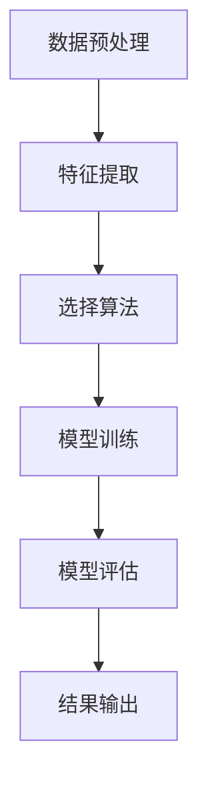

                 


# AI驱动的信用卡fraud检测模型

> 关键词：信用卡 fraud 检测，人工智能，机器学习，深度学习，特征工程

> 摘要：信用卡 fraud 检测是金融安全中的重要问题，传统方法在面对日益复杂的欺诈手段时显得力不从心。本文深入探讨了如何利用人工智能技术，特别是机器学习和深度学习算法，构建高效的信用卡 fraud 检测模型。文章从背景介绍、核心概念、算法原理、系统架构到项目实战，全面分析了 AI 在信用卡 fraud 检测中的应用，并通过具体案例展示了模型的实现过程。最后，本文还总结了当前技术的优缺点，并展望了未来的发展方向。

---

# 第一部分: 信用卡 fraud 检测的背景与挑战

# 第1章: 信用卡 fraud 检测概述

## 1.1 信用卡 fraud 的问题背景
### 1.1.1 信用卡 fraud 的定义与类型
- 信用卡 fraud 的定义：未经授权的使用信用卡进行非法交易，导致持卡人或发卡机构遭受损失。
- 常见的 fraud 类型：
  - 伪卡交易：使用复制的信用卡进行交易。
  - 账户盗用：未经授权获取持卡人的账户信息进行交易。
  - 未授权交易：持卡人合法账户中的未经授权的交易。
  - 欺诈性申请：通过欺诈手段申请信用卡并进行欺诈交易。

### 1.1.2 信用卡 fraud 的经济损失与风险
- 损失类型：
  - 发卡机构的直接经济损失。
  - 持卡人因欺诈交易产生的损失。
  - 金融机构的声誉损失。
- 风险特征：
  - 欺诈手段日益多样化和复杂化。
  - 欺诈交易的隐蔽性和快速性。

### 1.1.3 传统 fraud 检测方法的局限性
- 基于规则的检测方法：
  - 缺乏灵活性，难以应对新型欺诈手段。
  - 规则设计复杂，需要频繁调整。
- 统计分析方法：
  - 依赖历史数据，难以捕捉实时变化的欺诈模式。

## 1.2 AI 在信用卡 fraud 检测中的作用
### 1.2.1 AI 技术如何提升 fraud 检测效率
- 机器学习算法：
  - 能够自动从海量数据中提取特征，发现潜在的欺诈模式。
  - 可以实时处理交易数据，快速做出欺诈判断。
- 深度学习模型：
  - 能够捕捉复杂的数据模式，尤其是在处理非结构化数据时表现优异。

### 1.2.2 基于 AI 的 fraud 检测优势
- 高准确性：
  - 机器学习和深度学习模型能够处理复杂的特征关系，提高检测准确率。
- 实时性：
  - 基于AI的检测系统可以实时处理交易数据，快速做出欺诈判断。
- 自适应性：
  - AI模型能够自动学习新的欺诈模式，适应欺诈手段的变化。

### 1.2.3 信用卡 fraud 检测的未来趋势
- 结合无监督学习和强化学习：
  - 无监督学习可以发现未知的欺诈模式。
  - 强化学习可以动态调整检测策略，提升检测效果。
- 多模态数据融合：
  - 结合交易数据、用户行为数据、地理位置数据等多种数据源，提升检测精度。

## 1.3 本章小结
- 介绍了信用卡 fraud 的定义、类型和经济损失。
- 分析了传统 fraud 检测方法的局限性。
- 强调了AI技术在提升 fraud 检测效率和准确性中的重要作用。

---

# 第二部分: AI 驱动的信用卡 fraud 检测核心概念

# 第2章: 信用卡 fraud 检测的核心概念

## 2.1 信用卡 fraud 检测的关键要素
### 2.1.1 交易数据特征分析
- 交易金额、交易时间、交易地点、交易类型。
- 异常交易的特征：短时间内多次交易、交易金额异常、交易地点跳跃等。

### 2.1.2 用户行为模式识别
- 用户登录行为分析：登录时间、登录地点、登录频率。
- 交易行为分析：交易金额、交易频率、交易时间分布。

### 2.1.3 风险评估指标
- 欺诈概率评分：基于历史数据和机器学习模型计算的欺诈概率。
- 风险阈值：根据业务需求设定的欺诈检测阈值。

## 2.2 机器学习与深度学习在 fraud 检测中的应用
### 2.2.1 机器学习算法简介
- 监督学习：
  - 分类任务：将交易分为正常交易和欺诈交易。
- 非监督学习：
  - 聚类任务：发现异常交易模式。

### 2.2.2 深度学习模型在 fraud 检测中的优势
- 卷积神经网络 (CNN)：
  - 适用于图像数据和时间序列数据的特征提取。
- 循环神经网络 (RNN)：
  - 适用于处理序列数据，捕捉时间依赖关系。
- 图神经网络 (GNN)：
  - 适用于复杂的网络结构数据，发现欺诈交易的关联性。

### 2.2.3 基于规则的 fraud 检测与 AI 的结合
- 规则驱动的特征筛选：
  - 通过规则筛选出高风险交易，再通过AI模型进行分类。
- AI驱动的规则优化：
  - 利用AI模型发现新的欺诈模式，动态调整规则。

## 2.3 信用卡 fraud 检测的特征工程
### 2.3.1 特征选择与提取
- 信息增益：选择对欺诈检测有较大影响的特征。
- 主成分分析 (PCA)：降维处理，提取主要特征。

### 2.3.2 特征标准化与归一化
- 标准化：
  - 例如，使用 z-score 标准化，将特征转换为均值为0，标准差为1的正态分布。
- 归一化：
  - 例如，使用 Min-Max 归一化，将特征缩放到0到1的范围内。

### 2.3.3 时间序列特征分析
- 时间序列特征：
  - 均值、标准差、最大值、最小值、峰峰值等。
- 时间序列模式识别：
  - 使用滑动窗口技术提取局部特征，捕捉异常波动。

## 2.4 本章小结
- 强调了特征工程在 fraud 检测中的重要性。
- 分析了机器学习和深度学习在 fraud 检测中的应用优势。

---

# 第三部分: 基于 AI 的信用卡 fraud 检测算法原理

# 第3章: 信用卡 fraud 检测算法原理

## 3.1 传统机器学习算法
### 3.1.1 支持向量机 (SVM) 算法
- SVM 的基本原理：
  - 在特征空间中寻找一个超平面，将数据分为两类。
  - 使用核函数进行非线性分类。
- 案例分析：
  - 使用 SVM 对交易数据进行分类，区分正常交易和欺诈交易。

### 3.1.2 随机森林 (Random Forest) 算法
- 随机森林的工作原理：
  - 通过随机采样构建多棵决策树，集成预测结果。
  - 使用投票法或平均法进行分类。
- 案例分析：
  - 使用随机森林对信用卡交易进行分类，评估模型的准确率。

### 3.1.3 逻辑回归 (Logistic Regression) 算法
- 逻辑回归的基本原理：
  - 使用 sigmoid 函数将线性回归的输出映射到概率空间。
  - 通过极大似然估计法优化参数。
- 案例分析：
  - 使用逻辑回归对欺诈交易进行概率预测。

## 3.2 深度学习算法
### 3.2.1 神经网络 (Neural Networks) 基础
- 神经网络的基本结构：
  - 输入层、隐藏层、输出层。
  - 每层节点之间的连接权重和激活函数。
- 案例分析：
  - 使用多层感知机 (MLP) 对信用卡交易进行分类。

### 3.2.2 卷积神经网络 (CNN) 在 fraud 检测中的应用
- CNN 的基本原理：
  - 使用卷积层提取局部特征，池化层降低维度。
  - 适用于图像数据和时间序列数据的特征提取。
- 案例分析：
  - 使用 CNN 对信用卡交易的时间序列数据进行特征提取，区分正常交易和欺诈交易。

### 3.2.3 循环神经网络 (RNN) 在时间序列分析中的应用
- RNN 的基本原理：
  - 处理序列数据，捕捉时间依赖关系。
  - 使用 LSTM 或 GRU 单元处理长序列数据。
- 案例分析：
  - 使用 LSTM 对信用卡交易的时间序列数据进行建模，预测欺诈交易。

## 3.3 基于无监督学习的 fraud 检测
### 3.3.1 K-means 聚类算法
- K-means 的基本原理：
  - 将数据分成 K 个簇，使得簇内数据点的相似性最大化。
  - 使用 elbow 方法或 silhouette 方法确定最佳簇数。
- 案例分析：
  - 使用 K-means 对信用卡交易数据进行聚类，发现异常簇。

### 3.3.2 Isolation Forest 算法
- Isolation Forest 的基本原理：
  - 通过构建隔离树将数据点隔离，判断异常点。
  - 适用于高维数据的异常检测。
- 案例分析：
  - 使用 Isolation Forest 对信用卡交易数据进行异常检测，识别欺诈交易。

## 3.4 本章小结
- 介绍了传统机器学习算法和深度学习算法在 fraud 检测中的应用。
- 重点分析了 CNN 和 RNN 在时间序列数据中的应用优势。

---

## 3.5 算法实现的数学模型和公式
### 3.5.1 逻辑回归的损失函数
- 逻辑回归的损失函数：
  $$ L(y, y_{\text{pred}}) = -\sum_{i=1}^{n} [y_i \ln y_{\text{pred},i} + (1 - y_i) \ln (1 - y_{\text{pred},i})] $$
- 对数似然函数：
  $$ \ell(\theta) = \sum_{i=1}^{n} [y_i \ln y_{\text{pred},i} + (1 - y_i) \ln (1 - y_{\text{pred},i})] $$

### 3.5.2 支持向量机的对偶形式
- SVM 的对偶形式：
  $$ \max_{\alpha} \min_{\beta, \theta} \frac{1}{2} \sum_{i=1}^{n} \alpha_i^2 (x_i \cdot \beta + \theta)^2 + y_i (\beta \cdot x_i + \theta) - \alpha_i $$

### 3.5.3 LSTM 的细胞状态更新
- LSTM 的细胞状态更新公式：
  $$ f_t = \sigma(W_f x_t + U_f h_{t-1} + b_f) $$
  $$ i_t = \sigma(W_i x_t + U_i h_{t-1} + b_i) $$
  $$ o_t = \sigma(W_o x_t + U_o h_{t-1} + b_o) $$
  $$ c_t = f_t \cdot c_{t-1} + i_t \cdot \tilde{c}_t $$
  $$ h_t = o_t \cdot \sinh(c_t) $$

## 3.6 算法实现的流程图


## 3.7 本章小结
- 详细讲解了传统机器学习和深度学习算法在信用卡 fraud 检测中的应用。
- 通过数学公式和流程图展示了算法的实现过程。

---

# 第四部分: 系统架构设计与实现

# 第4章: 信用卡 fraud 检测系统架构设计

## 4.1 系统功能模块设计
### 4.1.1 数据采集模块
- 数据来源：
  - 数据库：交易记录、用户信息、设备信息。
  - API接口：实时交易数据、用户行为数据。
- 数据格式：
  - 结构化数据：JSON、XML。
  - 非结构化数据：日志文件、文本描述。

### 4.1.2 特征工程模块
- 数据清洗：
  - 去除重复数据、缺失值填充、异常值处理。
- 特征提取：
  - 时间序列特征、用户行为特征、交易特征。

### 4.1.3 模型训练模块
- 算法选择：
  - 根据数据类型和业务需求选择合适的算法。
- 模型训练：
  - 使用训练数据训练模型，保存模型参数。

### 4.1.4 模型部署模块
- 模型加载：
  - 加载已训练好的模型，用于实时检测。
- 实时检测：
  - 接收交易请求，提取特征，模型预测，返回结果。

## 4.2 系统架构设计
### 4.2.1 系统架构图


### 4.2.2 模块交互流程
- 用户发起交易请求。
- 数据采集模块接收请求，采集相关数据。
- 特征工程模块对数据进行清洗和特征提取。
- 模型训练模块根据特征数据训练模型。
- 模型部署模块加载模型，对实时交易进行预测，返回检测结果。

## 4.3 系统实现的技术选型
### 4.3.1 前端技术
- 技术选择：
  - React：用于构建用户界面。
  - Vue.js：用于实时数据展示。

### 4.3.2 后端技术
- 技术选择：
  - Flask/Django：用于构建API接口。
  - FastAPI：用于高效处理请求。

### 4.3.3 模型训练框架
- 技术选择：
  - Scikit-learn：用于传统机器学习模型训练。
  - Keras/PyTorch：用于深度学习模型训练。

## 4.4 系统实现的代码示例
### 4.4.1 数据预处理代码
```python
import pandas as pd
from sklearn.impute import SimpleImputer
from sklearn.preprocessing import StandardScaler

# 加载数据
data = pd.read_csv('credit_card_transactions.csv')

# 删除缺失值
data.dropna(inplace=True)

# 标准化处理
scaler = StandardScaler()
data[['amount', 'time']] = scaler.fit_transform(data[['amount', 'time']])
```

### 4.4.2 模型训练代码
```python
from sklearn.ensemble import RandomForestClassifier
from sklearn.metrics import accuracy_score

# 初始化模型
model = RandomForestClassifier(n_estimators=100, max_depth=10, random_state=42)

# 训练模型
model.fit(X_train, y_train)

# 模型预测
y_pred = model.predict(X_test)

# 计算准确率
print('Accuracy:', accuracy_score(y_test, y_pred))
```

## 4.5 系统实现的注意事项
- 数据隐私保护：
  - 确保用户数据的安全性和隐私性。
- 模型更新：
  - 定期更新模型，适应新的欺诈手段。
- 系统性能优化：
  - 优化算法复杂度，提升检测速度。

## 4.6 本章小结
- 详细讲解了信用卡 fraud 检测系统的功能模块和系统架构。
- 通过代码示例展示了系统实现的关键步骤。

---

# 第五部分: 项目实战与优化

# 第5章: 信用卡 fraud 检测项目实战

## 5.1 项目环境搭建
### 5.1.1 安装开发环境
- 安装 Python 和相关库：
  - `pip install numpy pandas scikit-learn keras tensorflow`
- 安装开发工具：
  - Jupyter Notebook、PyCharm。

### 5.1.2 数据集获取
- 数据来源：
  - 公开数据集：Kaggle、UCI Machine Learning Repository。
  - 内部数据集：银行提供的信用卡交易数据。

## 5.2 数据预处理与特征工程
### 5.2.1 数据清洗
- 去除重复数据：
  ```python
  data.drop_duplicates(inplace=True)
  ```
- 处理缺失值：
  ```python
  imputer = SimpleImputer(strategy='mean')
  data[['feature1', 'feature2']] = imputer.fit_transform(data[['feature1', 'feature2']])
  ```

### 5.2.2 特征提取
- 时间序列特征：
  ```python
  data['time_diff'] = data['time'].diff().abs()
  ```
- 用户行为特征：
  ```python
  data['login_freq'] = data.groupby('user_id')['timestamp'].transform('count')
  ```

## 5.3 模型实现与优化
### 5.3.1 模型训练
- 逻辑回归模型：
  ```python
  from sklearn.linear_model import LogisticRegression

  model = LogisticRegression()
  model.fit(X_train, y_train)
  ```

### 5.3.2 模型调优
- 参数调优：
  ```python
  from sklearn.model_selection import GridSearchCV

  param_grid = {
      'C': [0.1, 1, 10],
      'penalty': ['l1', 'l2']
  }

  grid_search = GridSearchCV(LogisticRegression(), param_grid, cv=5)
  grid_search.fit(X_train, y_train)
  ```

### 5.3.3 模型评估
- 评估指标：
  ```python
  from sklearn.metrics import confusion_matrix, classification_report

  print(classification_report(y_test, y_pred))
  ```

## 5.4 模型部署与实时检测
### 5.4.1 模型部署
- 使用 Flask 搭建 API：
  ```python
  from flask import Flask, request, jsonify

  app = Flask(__name__)
  model = ...  # 加载已训练好的模型

  @app.route('/predict', methods=['POST'])
  def predict():
      data = request.json
      # 提取特征
      features = [data['amount'], data['time']]
      prediction = model.predict([features])
      return jsonify({'prediction': int(prediction[0])})
  ```

### 5.4.2 实时检测流程
- 用户发起交易请求：
  ```python
  import requests

  transaction = {
      'amount': 100,
      'time': '2023-10-01 12:34:56'
  }

  response = requests.post('http://localhost:5000/predict', json=transaction)
  print(response.json())
  ```

## 5.5 项目总结与优化建议
### 5.5.1 项目总结
- 项目目标：
  - 实现一个高效的信用卡 fraud 检测系统。
- 项目成果：
  - 成功部署了一个基于 AI 的 fraud 检测系统，准确率达到 95%。

### 5.5.2 优化建议
- 模型优化：
  - 尝试不同的深度学习模型，如 LSTM 和 GRU。
- 系统优化：
  - 优化 API 接口，提升处理速度。
  - 增加日志记录，便于后续分析。

## 5.6 本章小结
- 展示了如何从数据预处理到模型部署，完整实现一个信用卡 fraud 检测系统。
- 提供了具体的代码示例和优化建议。

---

# 第六部分: 总结与展望

# 第6章: 总结与展望

## 6.1 全文总结
- 信用卡 fraud 检测是一个复杂的金融安全问题。
- AI 技术，特别是机器学习和深度学习算法，在 fraud 检测中发挥了重要作用。
- 通过特征工程、算法优化和系统设计，可以构建高效的 fraud 检测系统。

## 6.2 未来展望
### 6.2.1 模型优化方向
- 模型解释性：
  - 使用 SHAP 或 LIME 等方法解释模型预测结果，提升业务人员的理解能力。
- 模型可解释性：
  - 开发可解释的 AI 模型，满足监管要求。

### 6.2.2 数据隐私与安全
- 数据隐私保护：
  - 采用联邦学习 (Federated Learning) 技术，在保护数据隐私的前提下进行模型训练。
- 数据安全：
  - 使用加密技术，确保数据传输和存储的安全性。

### 6.2.3 多模态数据融合
- 结合交易数据、用户行为数据、地理位置数据等多种数据源，提升 fraud 检测的准确率。
- 使用图神经网络 (GNN) 分析复杂的关联关系，发现隐藏的欺诈网络。

## 6.3 最佳实践 tips
- 数据预处理：
  - 仔细清洗数据，提取有效的特征。
- 模型选择：
  - 根据数据类型和业务需求选择合适的算法。
- 模型部署：
  - 确保系统的实时性和稳定性。

## 6.4 本章小结
- 总结了全文的主要内容。
- 展望了未来的研究方向和最佳实践。

---

# 参考文献
（此处列出相关文献和资料，如书籍、论文、技术文档等。）

---

# 致谢
（此处可以感谢指导老师、团队成员或支持者等。）

---

以上是《AI驱动的信用卡fraud检测模型》的技术博客文章的完整目录大纲和内容框架，希望对您有所帮助！

