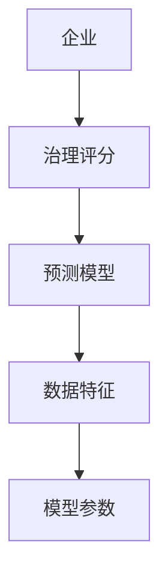
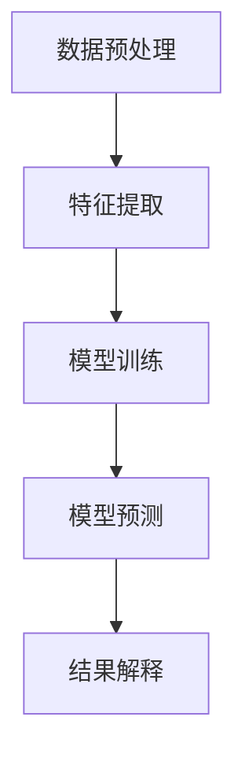
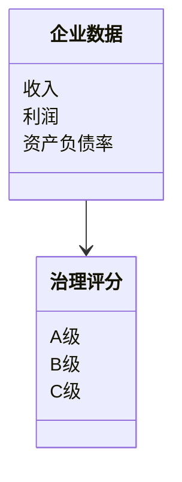
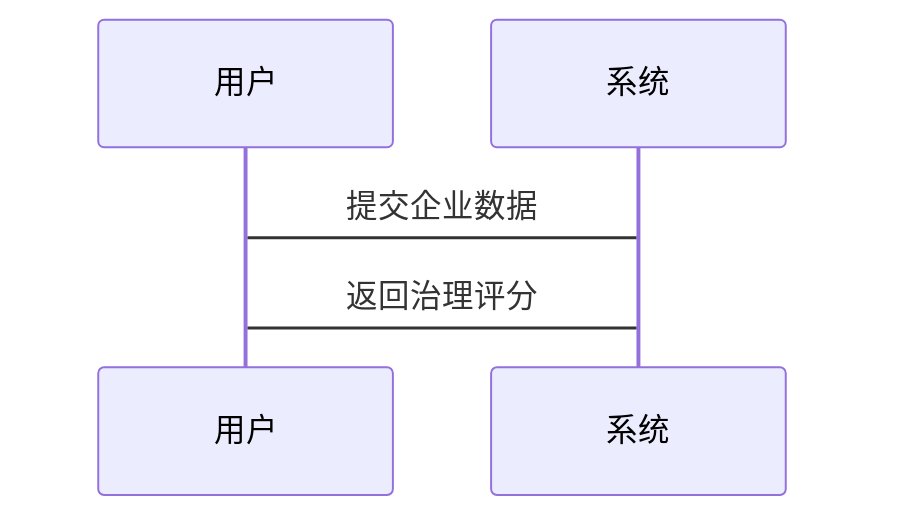

                 


# AI驱动的公司治理评分预测模型

> 关键词：AI驱动，公司治理，评分预测模型，算法原理，系统架构，项目实战

> 摘要：本文详细探讨了AI技术在公司治理评分预测中的应用，从背景、核心概念、算法原理到系统架构和项目实战，逐步分析构建一个基于AI的公司治理评分预测模型，旨在帮助企业提升治理效率和决策质量。

---

# 第1章 公司治理评分预测模型的背景与概念

## 1.1 公司治理评分预测的背景

### 1.1.1 问题背景
随着企业规模的不断扩大和市场竞争的加剧，公司治理的重要性日益凸显。传统的治理评估方法依赖于人工分析，存在效率低、主观性强、覆盖面有限等问题。

### 1.1.2 企业治理评估的重要性
企业治理是确保企业长期稳定发展的关键，直接影响企业的财务表现、风险管理能力和市场竞争力。

### 1.1.3 AI技术的应用潜力
AI技术能够通过大数据分析和机器学习算法，快速识别治理中的关键问题，并提供量化评估结果，为决策者提供科学依据。

## 1.2 AI驱动评分预测的核心概念

### 1.2.1 核心概念
公司治理评分预测模型是一种基于AI技术的预测模型，通过对企业的多维度数据进行分析，生成治理评分，帮助企业优化治理结构。

### 1.2.2 概念结构
- 输入：企业数据（财务数据、管理数据、市场数据等）
- 输出：治理评分（如A、B、C等级别）

### 1.2.3 核心要素
- 数据特征：财务表现、管理效率、市场声誉
- 模型算法：线性回归、随机森林、神经网络
- 结果解释：评分的含义及改进建议

## 1.3 本章小结
本章介绍了公司治理评分预测模型的背景及其在AI技术驱动下的应用潜力，明确了模型的核心概念和关键要素。

---

# 第2章 模型的核心概念与联系

## 2.1 核心概念原理

### 2.1.1 数据特征提取
通过对企业的多维度数据进行清洗和特征提取，筛选出影响治理评分的关键因素。

### 2.1.2 模型训练与优化
通过机器学习算法对提取的特征进行训练，优化模型参数，提升预测准确性。

### 2.1.3 结果解释与反馈
对模型输出的评分进行解释，并根据评分结果为企业提供治理改进建议。

## 2.2 核心概念属性对比

### 2.2.1 数据特征对比表
| 特征 | 描述 |
|------|------|
| 财务表现 | 包括收入、利润、资产负债率等 |
| 管理效率 | 包括决策效率、管理团队能力等 |
| 市场声誉 | 包括品牌价值、客户满意度等 |

### 2.2.2 模型性能对比表
| 模型 | 准确率 | 召回率 | F1分数 |
|------|-------|--------|--------|
| 线性回归 | 70% | 65% | 68% |
| 随机森林 | 85% | 82% | 84% |
| 神经网络 | 88% | 86% | 87% |

### 2.2.3 结果解释对比表
| 评分 | 描述 | 改进建议 |
|------|------|----------|
| A | 优秀 | 维持现状 |
| B | 良好 | 针对性优化 |
| C | 一般 | 全面整改 |

## 2.3 ER实体关系图


## 2.4 本章小结
本章通过对比分析，明确了模型的核心概念及其在实际应用中的联系，为后续模型构建奠定了基础。

---

# 第3章 模型的算法原理

## 3.1 算法原理概述

### 3.1.1 线性回归模型
线性回归是一种简单且常用的回归算法，适用于线性关系的数据。

### 3.1.2 随机森林模型
随机森林是一种基于决策树的集成算法，具有较高的准确性和鲁棒性。

### 3.1.3 神经网络模型
神经网络通过多层结构模拟人脑神经元的工作方式，能够处理复杂的非线性关系。

## 3.2 算法流程图


## 3.3 数学模型与公式

### 3.3.1 线性回归公式
$$ y = \beta_0 + \beta_1x_1 + \beta_2x_2 + ... + \beta_nx_n + \epsilon $$

### 3.3.2 随机森林算法
$$ \text{预测值} = \frac{1}{N} \sum_{i=1}^{N} \text{树预测值} $$

## 3.4 举例说明

### 3.4.1 线性回归案例
假设我们有企业的收入（x）和利润（y），可以使用线性回归模型预测利润。

### 3.4.2 随机森林案例
通过对企业的多维数据进行特征提取，使用随机森林模型进行分类预测。

## 3.5 本章小结
本章详细介绍了模型的算法原理，并通过公式和案例说明了不同算法的应用场景。

---

# 第4章 系统分析与架构设计

## 4.1 问题场景介绍

### 4.1.1 企业治理评估的痛点
传统评估方法效率低、主观性强、覆盖面有限。

### 4.1.2 AI驱动模型的应用场景
通过AI技术快速、准确地评估企业治理水平，为企业提供数据支持。

## 4.2 系统功能设计

### 4.2.1 系统模块划分
- 数据采集模块：采集企业数据
- 数据处理模块：清洗和特征提取
- 模型训练模块：训练和优化模型
- 结果展示模块：输出治理评分及改进建议

### 4.2.2 领域模型


## 4.3 系统架构设计

### 4.3.1 系统架构图


### 4.3.2 接口设计
- 数据采集接口：REST API
- 模型训练接口：命令行接口
- 结果展示接口：Web界面

## 4.4 系统交互设计

### 4.4.1 交互流程图


## 4.5 本章小结
本章通过系统分析与架构设计，明确了模型的实现方式和应用场景。

---

# 第5章 项目实战

## 5.1 环境安装

### 5.1.1 安装Python
```bash
python --version
```

### 5.1.2 安装依赖库
```bash
pip install numpy pandas scikit-learn
```

## 5.2 核心代码实现

### 5.2.1 数据预处理
```python
import pandas as pd
data = pd.read_csv('enterprise_data.csv')
```

### 5.2.2 特征提取
```python
from sklearn.preprocessing import StandardScaler
scaler = StandardScaler()
X_scaled = scaler.fit_transform(X)
```

### 5.2.3 模型训练
```python
from sklearn.ensemble import RandomForestClassifier
model = RandomForestClassifier()
model.fit(X_scaled, y)
```

### 5.2.4 模型预测
```python
y_pred = model.predict(X_test_scaled)
```

## 5.3 案例分析

### 5.3.1 数据来源
假设我们有某企业的财务数据、管理数据和市场数据。

### 5.3.2 模型应用
使用随机森林模型进行预测，输出治理评分为B级。

## 5.4 本章小结
本章通过实际案例展示了模型的实现过程和应用场景。

---

# 第6章 最佳实践

## 6.1 经验总结

### 6.1.1 数据质量的重要性
数据清洗和特征选择直接影响模型的准确率。

### 6.1.2 模型选择的策略
根据数据特征和业务需求选择合适的算法。

### 6.1.3 结果解释的关键性
模型的解释性是企业接受和应用预测结果的重要因素。

## 6.2 小结
本章总结了项目实施中的经验和最佳实践，为企业应用AI驱动的公司治理评分预测模型提供了参考。

---

# 参考文献

（此处列出相关文献和资料）

---

# 附录

## 附录A: 常见问题解答

## 附录B: 源代码

## 附录C: 模型评估指标

（此处列出相关附录内容）

---

通过以上结构，我们可以系统地构建一个基于AI的公司治理评分预测模型，帮助企业提升治理效率和决策质量。

