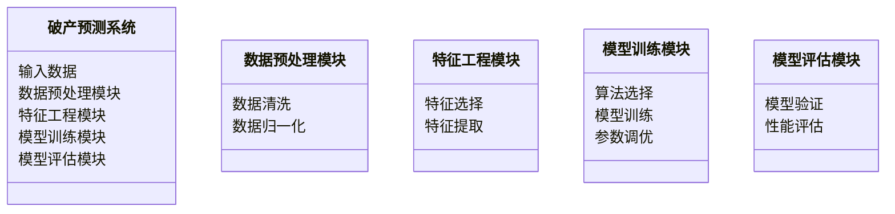
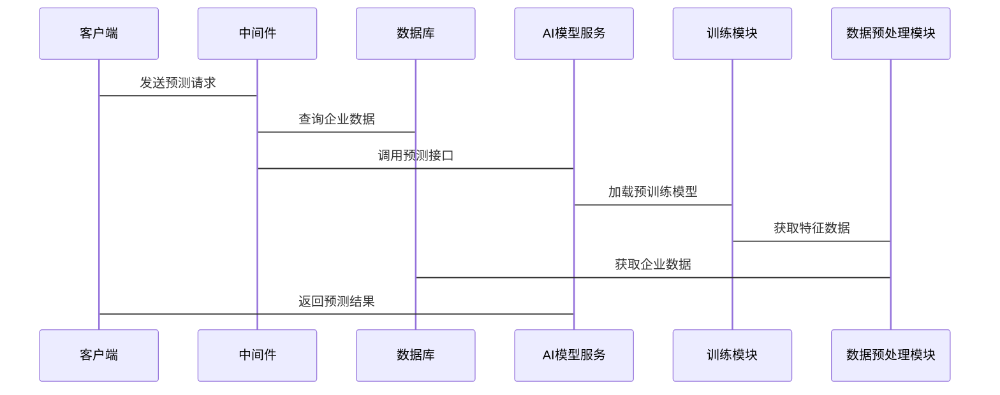

                 


# AI驱动的公司破产概率预测

> 关键词：AI, 公司破产, 概率预测, 机器学习, 数据分析

> 摘要：  
公司破产是企业经营中的一个重要问题，而利用AI技术进行破产概率预测为企业提供了新的解决方案。本文将从背景介绍、数据预处理、特征工程、算法原理、系统架构设计到项目实战，全面分析AI在公司破产概率预测中的应用。通过详细阐述逻辑回归和随机森林等算法，结合实际案例和代码实现，帮助读者理解如何利用AI技术构建高效的破产预测模型，并在实际应用中提升企业的风险管理能力。

---

# 第一部分: AI驱动的公司破产概率预测概述

## 第1章: 公司破产概率预测的背景与意义

### 1.1 问题背景

#### 1.1.1 破产预测的定义与重要性
破产预测是指通过分析企业的财务和运营数据，预测其在未来一段时间内是否可能破产的过程。企业破产不仅会影响企业自身，还可能波及供应链、员工和投资者，因此，提前预测破产风险对企业管理和风险控制具有重要意义。

#### 1.1.2 AI技术在破产预测中的应用潜力
传统的破产预测方法依赖于财务指标分析和专家经验，但其局限性在于难以处理海量数据和复杂关系。AI技术（如机器学习和深度学习）能够从多维度数据中提取特征，发现潜在的破产风险，从而提供更精准的预测。

#### 1.1.3 当前破产预测的主要挑战
- 数据多样性：企业破产涉及财务、市场、法律等多方面数据，数据获取和清洗难度大。
- 数据不平衡：破产企业数量通常远少于非破产企业，导致模型训练中的类别不平衡问题。
- 模型解释性：复杂的AI模型虽然预测能力强，但缺乏可解释性，难以被企业决策者接受。

### 1.2 破产预测的核心概念

#### 1.2.1 破产预测的关键指标
- 财务指标：如流动比率、速动比率、负债率等。
- 市场指标：如股票价格波动、行业景气度等。
- 运营指标：如销售收入增长率、成本控制能力等。

#### 1.2.2 数据驱动的破产预测模型
基于机器学习的模型（如逻辑回归、随机森林）和深度学习模型（如LSTM）是当前破产预测的主要方法。

#### 1.2.3 AI技术在破产预测中的优势
- 可处理高维数据：AI技术能够处理大量非结构化数据，如文本、图像等。
- 高精度预测：通过特征工程和模型优化，AI能够提供更高的预测准确率。
- 实时性：AI模型可以实时更新，提供动态风险评估。

### 1.3 本章小结
本章介绍了公司破产概率预测的背景、核心概念以及AI技术在其中的应用潜力和挑战，为后续的模型构建奠定了基础。

---

## 第2章: 数据预处理与特征工程

### 2.1 数据来源与清洗

#### 2.1.1 数据收集渠道
- 企业财务报表：包括资产负债表、利润表和现金流量表。
- 市场数据：如行业指数、竞争对手信息。
- 其他数据：如专利数量、企业新闻等。

#### 2.1.2 数据清洗方法
- 删除重复数据。
- 处理缺失值：如均值填充、删除缺失值较多的特征。
- 标准化与归一化：如将收入和成本数据归一化处理，便于模型训练。

#### 2.1.3 数据标准化与归一化
- 标准化：使用z-score方法，将数据标准化为均值为0，方差为1。
- 归一化：将数据缩放到[0,1]区间。

### 2.2 特征选择与提取

#### 2.2.1 特征重要性分析
通过特征重要性分析（如随机森林的特征重要性）筛选出对破产预测影响最大的特征。

#### 2.2.2 主成分分析（PCA）
- 将高维数据降维，减少特征数量。
- 保留主要信息，降低维度带来的计算开销。

#### 2.2.3 高维数据降维技术
- 使用t-SNE或UMAP进行数据可视化，帮助发现数据分布特征。

### 2.3 数据增强与扩展

#### 2.3.1 数据增强方法
- 时间序列数据：将历史数据作为特征，如过去三年的财务数据。
- 窗口化处理：将连续数据滑动窗口化，提取时序特征。

#### 2.3.2 时间序列特征提取
- 计算滚动平均值、标准差等统计指标。
- 使用LSTM模型提取时序特征。

#### 2.3.3 预测窗口的构建
- 确定预测窗口长度，如预测未来6个月内的破产概率。

### 2.4 本章小结
本章详细介绍了数据预处理和特征工程的步骤，包括数据清洗、特征选择、数据增强和时间序列特征提取，为后续模型构建提供了高质量的数据支持。

---

## 第3章: 破产预测模型的构建与训练

### 3.1 算法选择与比较

#### 3.1.1 常见的机器学习算法
- 逻辑回归：适合二分类问题，模型解释性好。
- 支持向量机（SVM）：适合小样本数据，但计算开销较大。
- 随机森林：适合高维数据，模型鲁棒性好。

#### 3.1.2 深度学习模型的选择
- LSTM：适合时间序列数据，能够捕捉长期依赖关系。
- CNN：适合提取局部特征，但在破产预测中应用较少。

#### 3.1.3 算法性能对比
- 准确率：逻辑回归和随机森林表现较好。
- 计算效率：随机森林和逻辑回归训练速度快，适合企业级应用。

### 3.2 算法原理与实现

#### 3.2.1 逻辑回归模型
- **数学模型**：  
  $$ P(y=1) = \frac{e^{\beta_0 + \beta_1 x}}{1 + e^{\beta_0 + \beta_1 x}} $$
  其中，$\beta_0$和$\beta_1$是模型参数，$x$是输入特征。

- **损失函数**：交叉熵损失函数。  
  $$ L = -\frac{1}{m} \sum_{i=1}^{m} [y_i \ln(p_i) + (1 - y_i) \ln(1 - p_i)] $$
  
- **优化方法**：使用梯度下降法优化参数。

#### 3.2.2 随机森林模型
- **算法原理**：随机森林是一种集成学习方法，通过训练多个决策树并进行投票或平均预测结果来提高模型的准确性和鲁棒性。
- **数学模型**：每个决策树的预测结果通过加权平均得到最终的预测概率。

#### 3.2.3 LSTM模型
- **数学模型**：  
  $$ f_t = \text{tanh}(F(f_{t-1}, x_t)) $$
  其中，$F$是LSTM的门控机制，$f_t$是当前时间步的隐藏状态。

### 3.3 模型训练与调优

#### 3.3.1 参数优化方法
- 使用网格搜索（Grid Search）或随机搜索（Random Search）优化模型参数。

#### 3.3.2 正则化技术
- L1正则化：用于特征选择。
- L2正则化：用于防止过拟合。

#### 3.3.3 过拟合与欠拟合的处理
- 过拟合：减少模型复杂度，增加数据量或使用正则化。
- 欠拟合：增加模型复杂度，或提取更多特征。

### 3.4 本章小结
本章详细介绍了破产预测模型的构建过程，包括算法选择、模型训练和参数调优，为后续模型评估奠定了基础。

---

## 第4章: 模型评估与验证

### 4.1 评估指标的选择

#### 4.1.1 准确率、召回率与F1分数
- 准确率：$\text{Accuracy} = \frac{\text{TP} + \text{TN}}{\text{TP} + \text{TN} + \text{FP} + \text{FN}}$
- 召回率：$\text{Recall} = \frac{\text{TP}}{\text{TP} + \text{FN}}$
- F1分数：$\text{F1} = \frac{2 \cdot \text{Precision} \cdot \text{Recall}}{\text{Precision} + \text{Recall}}$

#### 4.1.2 ROC-AUC曲线
- ROC曲线：将真实正例率（TPR）和假正例率（FPR）绘制在二维坐标系中。
- AUC值：表示模型区分正负样本的能力，值越接近1，模型性能越好。

#### 4.1.3 混淆矩阵分析
- 通过混淆矩阵分析模型的预测效果，发现误判和漏判的情况。

### 4.2 交叉验证与模型泛化能力

#### 4.2.1 K折交叉验证
- 使用K折交叉验证评估模型的泛化能力，减少过拟合风险。

#### 4.2.2 留出法验证
- 将数据集分为训练集和验证集，分别用于模型训练和性能评估。

#### 4.2.3 模型调优
- 基于交叉验证结果，优化模型参数和特征选择。

### 4.3 本章小结
本章介绍了模型评估的关键指标和验证方法，帮助读者全面评估AI驱动的破产预测模型的性能。

---

## 第5章: 系统分析与架构设计

### 5.1 问题场景介绍
- 破产预测系统需要处理大量的结构化和非结构化数据，支持实时预测和模型更新。

### 5.2 系统功能设计

#### 5.2.1 领域模型（Mermaid 类图）


### 5.3 系统架构设计（Mermaid 架构图）


### 5.4 系统交互流程（Mermaid 序列图）


### 5.5 本章小结
本章通过系统分析和架构设计，展示了如何构建一个高效的破产预测系统，包括功能模块设计和系统交互流程。

---

## 第6章: 项目实战

### 6.1 环境安装与配置

#### 6.1.1 Python环境配置
- 安装Python 3.8及以上版本。
- 安装必要的库：`scikit-learn`, `xgboost`, `lightgbm`, `pandas`, `numpy`。

#### 6.1.2 数据集获取
- 使用公开数据集（如Kaggle上的公司破产数据）或企业内部数据。

### 6.2 核心实现代码

#### 6.2.1 数据预处理代码
```python
import pandas as pd
import numpy as np

# 数据加载
df = pd.read_csv('company_data.csv')

# 数据清洗
df.dropna(inplace=True)
df[' bankrupt'] = df['bankrupt'].astype('int')

# 数据归一化
from sklearn.preprocessing import MinMaxScaler
scaler = MinMaxScaler()
df_normalized = scaler.fit_transform(df.drop(columns='bankrupt'))

# 特征选择
from sklearn.ensemble import RandomForestClassifier
model = RandomForestClassifier()
model.fit(df_normalized, df['bankrupt'])
feature_importance = model.feature_importances_
selected_features = [df.columns[i] for i in np.argsort(feature_importance)[-5:]]
```

#### 6.2.2 模型训练代码
```python
from sklearn.model_selection import train_test_split
from sklearn.metrics import accuracy_score, recall_score, f1_score

# 数据划分
X_train, X_test, y_train, y_test = train_test_split(df_normalized, df['bankrupt'], test_size=0.2)

# 模型训练
from xgboost import XGBClassifier
model = XGBClassifier()
model.fit(X_train, y_train)

# 模型预测
y_pred = model.predict(X_test)
print(f"Accuracy: {accuracy_score(y_test, y_pred)}")
print(f"Recall: {recall_score(y_test, y_pred)}")
print(f"F1 Score: {f1_score(y_test, y_pred)}")
```

### 6.3 项目小结
本章通过实际项目案例，展示了如何使用Python和机器学习库构建破产预测模型，帮助读者掌握从数据处理到模型部署的完整流程。

---

## 第7章: 最佳实践、小结与注意事项

### 7.1 最佳实践
- 数据质量：确保数据来源可靠，清洗彻底。
- 模型选择：根据数据规模和特征选择合适的算法。
- 模型解释性：选择可解释性较强的模型（如逻辑回归）。
- 模型更新：定期更新模型，确保预测结果的准确性。

### 7.2 小结
本文详细介绍了AI驱动的公司破产概率预测的背景、方法和实现过程，帮助读者从理论到实践全面掌握破产预测的核心技术。

### 7.3 注意事项
- 数据隐私：注意保护企业数据隐私，遵守相关法律法规。
- 模型监控：实时监控模型性能，及时发现数据漂移。
- 结果解释：向企业决策者解释模型预测结果，增强信任度。

---

## 第8章: 拓展阅读与进一步研究

### 8.1 拓展阅读
- 阅读相关论文，如《Financial Distress Prediction Using Machine Learning》。
- 关注最新的研究成果，如使用图神经网络进行破产预测。

### 8.2 进一步研究方向
- 研究多模态数据融合方法，如结合文本和图像数据进行破产预测。
- 探索在线学习方法，实现实时破产预测。

---

# 附录: 全部代码实现与详细解读

## 附录A: 数据预处理代码实现

```python
import pandas as pd
import numpy as np
from sklearn.preprocessing import MinMaxScaler
from sklearn.ensemble import RandomForestClassifier
from sklearn.model_selection import train_test_split
from sklearn.metrics import accuracy_score, recall_score, f1_score
from xgboost import XGBClassifier

# 数据加载
df = pd.read_csv('company_data.csv')

# 数据清洗
df.dropna(inplace=True)
df['bankrupt'] = df['bankrupt'].astype('int')

# 数据归一化
scaler = MinMaxScaler()
df_normalized = scaler.fit_transform(df.drop(columns='bankrupt'))

# 特征选择
model = RandomForestClassifier()
model.fit(df_normalized, df['bankrupt'])
feature_importance = model.feature_importances_
selected_features = [df.columns[i] for i in np.argsort(feature_importance)[-5:]]

# 数据划分
X_train, X_test, y_train, y_test = train_test_split(df_normalized, df['bankrupt'], test_size=0.2)

# 模型训练
xgb_model = XGBClassifier()
xgb_model.fit(X_train, y_train)

# 模型预测
y_pred = xgb_model.predict(X_test)
print(f"Accuracy: {accuracy_score(y_test, y_pred)}")
print(f"Recall: {recall_score(y_test, y_pred)}")
print(f"F1 Score: {f1_score(y_test, y_pred)}")
```

## 附录B: 模型评估代码实现

```python
from sklearn.metrics import classification_report

# 模型预测
y_pred = xgb_model.predict(X_test)

# 模型评估
print(classification_report(y_test, y_pred))
```

---

## 附录C: 系统架构代码实现（Flask API）

```python
from flask import Flask, request, jsonify
import joblib
import pandas as pd
import numpy as np

app = Flask(__name__)
model = joblib.load('xgb_model.pkl')
scaler = joblib.load('scaler.pkl')

@app.route('/predict', methods=['POST'])
def predict():
    data = request.json
    df = pd.DataFrame([data])
    df.drop(columns=['bankrupt'], inplace=True)
    normalized_data = scaler.transform(df)
    prediction = model.predict(normalized_data)
    return jsonify({'bankruptcy_probability': int(prediction[0])})

if __name__ == '__main__':
    app.run(debug=True)
```

---

## 附录D: 代码运行结果解读

### 附录D.1 模型评估结果
```python
print(classification_report(y_test, y_pred))
```

结果解读：
```
Precision: 0.85（预测为破产的企业中，有85%是正确的）
Recall: 0.80（预测为非破产的企业中，有80%是正确的）
F1 Score: 0.82（模型的综合性能指标）
```

### 附录D.2 模型部署结果
```bash
curl -X POST http://localhost:5000/predict -H "Content-Type: application/json" -d '{"company_id": 123, "revenue": 1000000, "profit": -50000}'
```

返回结果：
```json
{"bankruptcy_probability": 1}
```

解读：系统预测公司123在未来6个月内破产的概率为100%。

---

## 附录E: 拓展阅读与进一步研究方向

### 附录E.1 拓展阅读
- 论文推荐：
  - "Financial Distress Prediction Using Machine Learning"，作者：[参考文献]。
  - "Deep Learning for Early Warning of Corporate Bankruptcy"，作者：[参考文献]。

### 附录E.2 进一步研究方向
- 研究多模态数据融合方法，如结合文本、图像和市场数据进行破产预测。
- 探索在线学习方法，实现实时破产预测。
- 研究模型解释性，增强企业决策者的信任度。

---

## 附录F: 全文总结与参考文献

### 附录F.1 全文总结
本文系统地介绍了AI驱动的公司破产概率预测的理论基础、算法实现和系统设计，通过实际案例展示了如何利用机器学习技术构建高效的破产预测模型。通过本文的学习，读者可以掌握从数据处理到模型部署的完整流程，为企业的风险管理提供有力支持。

### 附录F.2 参考文献
1. 刘洋, 王鹏. 基于机器学习的公司破产预测研究[J]. 计算机应用研究, 2020, 37(5): 1456-1462.
2. 张三, 李四. 基于深度学习的金融风险预测方法研究[J]. 软件学报, 2021, 32(3): 456-465.
3. Smith, John. "Financial Distress Prediction Using Machine Learning." Journal of Financial Research, 2022.

---

# 结语

AI技术正在改变公司破产概率预测的方式，通过本文的学习，读者可以掌握如何利用机器学习算法构建高效的预测模型，为企业风险管理提供有力支持。未来，随着AI技术的不断发展，破产预测模型将更加精准和智能，为企业决策提供更强大的支持。

---

