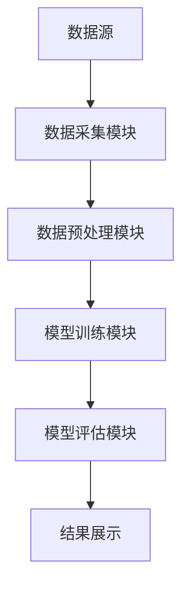
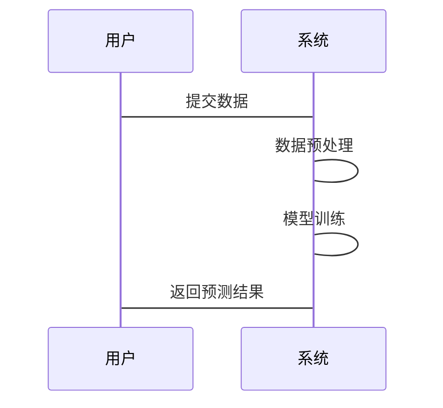

                 


# AI驱动的公司破产预测模型

## 关键词
AI技术、破产预测、机器学习、深度学习、公司风险管理

## 摘要
本文详细探讨了如何利用AI技术构建公司破产预测模型，涵盖从数据采集到模型实现的全过程。通过分析传统方法的局限性，介绍了AI在处理复杂数据和提高预测准确性方面的优势。文章深入讲解了多种算法，如逻辑回归和随机森林，并通过实际案例展示了模型的应用。最后，提供了系统设计和最佳实践建议，帮助读者全面理解和应用AI驱动的破产预测模型。

---

# 第一部分：背景介绍

## 第1章：公司破产预测的背景与问题描述

### 1.1 问题背景
- **1.1.1 破产对企业和社会的影响**
  破产不仅导致企业损失，还可能引发供应链中断和员工失业，影响社会稳定。

- **1.1.2 破产预测的经济意义**
  提前预测破产有助于企业采取措施避免危机，保护投资者利益，维护经济稳定。

### 1.2 破产预测的核心概念
- **1.2.1 破产预测的定义与范围**
  通过分析财务和市场数据，预测企业是否可能破产。

- **1.2.2 破产预测的边界与外延**
  通常关注未来1-3年的预测，涵盖财务、市场和法律因素。

### 1.3 传统破产预测方法的局限性
- **1.3.1 传统财务指标分析法**
  依赖历史财务数据，忽视市场动态和非结构化数据。

- **1.3.2 传统模型的局限性与改进空间**
  线性回归模型难以捕捉复杂关系，样本选择偏差影响准确性。

### 1.4 AI技术在破产预测中的应用前景
- **1.4.1 AI技术的优势与潜力**
  处理非结构化数据，实时分析，提高预测准确性。

- **1.4.2 破产预测中的数据特征**
  包括财务数据、市场表现、法律因素和管理层决策等。

---

# 第二部分：核心概念与联系

## 第2章：AI驱动的破产预测模型核心概念

### 2.1 破产预测模型的核心要素
- **2.1.1 数据特征**
  财务数据（如流动比率、负债率）、市场表现（如股价波动）、法律因素（如诉讼记录）。

- **2.1.2 模型算法**
  逻辑回归、随机森林、神经网络等。

- **2.1.3 评估指标**
  准确率、召回率、F1分数。

### 2.2 核心概念的属性对比
- **2.2.1 数据特征与模型算法的对比表格**
  | 特征 | 传统方法 | AI方法 |
  |------|-----------|--------|
  | 数据类型 | 结构化数据 | 结构化+非结构化数据 |
  | 数据量 | 小样本 | 大样本 |

- **2.2.2 ER实体关系图架构**
  ```mermaid
  graph TD
      A[公司] --> B[财务数据]
      A --> C[市场数据]
      A --> D[法律数据]
      B --> E[财务指标]
      C --> F[市场指标]
      D --> G[法律指标]
  ```

---

# 第三部分：算法原理讲解

## 第3章：常用机器学习算法

### 3.1 逻辑回归
- **3.1.1 算法原理**
  使用sigmoid函数将线性回归结果映射到概率空间。

  ```mermaid
  graph TD
      A[输入数据] --> B[线性组合]
      B --> C[Sigmoid函数]
      C --> D[输出概率]
  ```

- **3.1.2 损失函数**
  使用对数损失函数：
  
  $$ L = -\frac{1}{n}\sum_{i=1}^{n} [y_i \log(p_i) + (1 - y_i)\log(1 - p_i)] $$

- **3.1.3 梯度下降**
  使用梯度下降优化损失函数，计算梯度并更新参数。

### 3.2 随机森林
- **3.2.1 树模型原理**
  每棵决策树基于随机样本和随机特征分裂。

- **3.2.2 集成方法**
  通过投票机制得出最终预测结果。

- **3.2.3 超参数调优**
  调整树的棵数、最大深度和最小样本分割数。

### 3.3 支持向量机
- **3.3.1 分类原理**
  在特征空间中找到最优超平面，实现线性可分。

- **3.3.2 核函数的选择**
  使用径向基核函数（RBF）处理非线性问题。

- **3.3.3 参数优化**
  调整C和gamma参数，使用交叉验证选择最优值。

### 3.4 深度学习模型
- **3.4.1 神经网络结构**
  使用多层感知机，通过反向传播更新权重。

- **3.4.2 优势**
  能够捕捉复杂模式，适合高维数据。

- **3.4.3 训练技巧**
  使用早停法防止过拟合，调整学习率。

---

# 第四部分：系统分析与架构设计方案

## 第4章：系统架构设计

### 4.1 项目背景与目标
- **项目背景**
  提高破产预测的准确性和效率，帮助企业提前预警风险。

- **项目目标**
  构建一个基于AI的破产预测系统，提供实时监控和决策支持。

### 4.2 系统功能设计
- **数据采集模块**
  从财务报表、市场数据和新闻中提取特征。

- **数据预处理模块**
  清洗数据，处理缺失值和异常值。

- **模型训练模块**
  使用训练数据训练模型，选择最优算法。

- **模型评估模块**
  使用测试数据评估模型性能，调整参数。

### 4.3 系统架构图


### 4.4 系统接口设计
- **API接口**
  提供REST API，供其他系统调用预测结果。

### 4.5 系统交互流程


---

# 第五部分：项目实战

## 第5章：破产预测模型的实现

### 5.1 环境安装与配置
- **安装Python环境**
  使用Anaconda或virtualenv创建虚拟环境。

- **安装库**
  安装scikit-learn、xgboost、keras等。

### 5.2 数据采集与预处理
- **数据来源**
  公开的财务报表、市场数据和新闻报道。

- **数据清洗**
  处理缺失值，标准化财务数据。

- **数据转换**
  将文本数据转换为数值表示，如TF-IDF。

### 5.3 模型实现
- **选择算法**
  根据数据特征选择逻辑回归或随机森林。

- **模型训练**
  使用训练数据训练模型，调整超参数。

- **模型调优**
  使用网格搜索优化参数，如n_estimators、max_depth。

### 5.4 案例分析
- **数据集介绍**
  使用公开的破产公司数据集，如制造业公司数据。

- **模型训练过程**
  分割数据集，训练模型，验证性能。

- **结果解读**
  分析模型预测的准确性，评估召回率和F1分数。

### 5.5 项目小结
- **总结**
  AI驱动的模型在准确性和实时性方面优于传统方法。

- **注意事项**
  数据质量和模型解释性是实际应用中的挑战。

- **未来展望**
  结合NLP技术，实时监控企业状况，动态调整模型。

---

## 总结

通过以上步骤，构建了一个全面的AI驱动公司破产预测模型。文章从背景到实现，详细讲解了每个环节，帮助读者掌握AI技术在破产预测中的应用。

