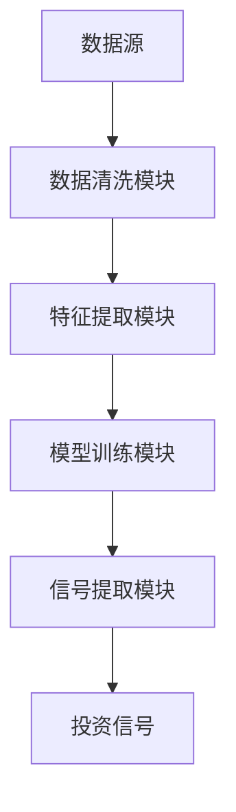
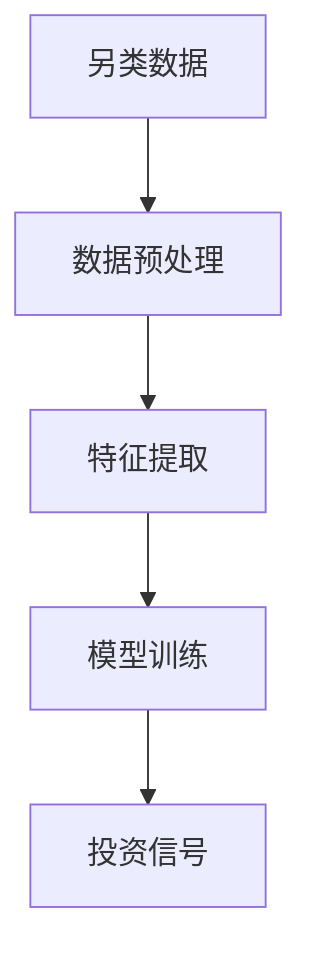
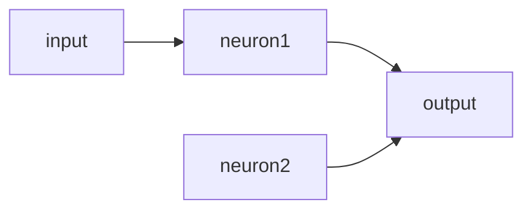
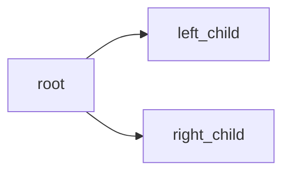
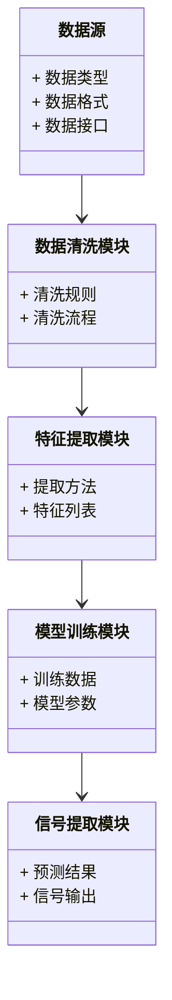
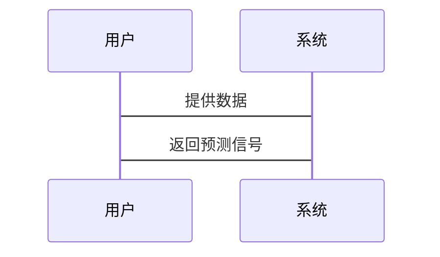

                 


# AI驱动的另类数据投资信号提取

**关键词：** AI技术，另类数据，投资信号提取，机器学习，金融分析

**摘要：**  
本文探讨了如何利用人工智能技术从另类数据中提取投资信号，分析了传统方法的局限性，介绍了AI在金融领域的应用潜力，详细讲解了另类数据的特点、AI算法的核心原理，以及如何通过系统设计和项目实战实现投资信号的自动化提取。文章还提供了具体的代码实现和案例分析，帮助读者全面理解并掌握这一前沿技术。

---

# 第1章 问题背景与核心概念

## 1.1 问题背景

### 1.1.1 投资信号提取的传统方法与局限性
传统的投资信号提取主要依赖于市场数据（如价格、成交量等）和基本面分析。然而，这些方法存在以下局限性：
- 数据维度有限，难以捕捉市场全貌。
- 人工分析耗时且主观性强，难以实现自动化。
- 市场波动和突发事件难以提前预测。

### 1.1.2 另类数据的定义与特点
另类数据是指传统金融数据之外的其他数据源，例如：
- **社交媒体数据**：分析投资者情绪。
- **卫星数据**：监测物流、库存变化。
- **专利数据**：评估企业创新能力。
- **网络搜索数据**：反映市场关注度。

另类数据的特点包括：
- 数据量大，覆盖范围广。
- 数据类型多样（文本、图像、结构化数据等）。
- 数据更新频率高，实时性强。

### 1.1.3 AI技术在投资领域的应用潜力
AI技术（如机器学习、深度学习）能够处理非结构化数据，挖掘隐含信息，帮助投资者做出更明智的决策。AI在投资中的应用包括：
- 自动化交易策略。
- 风险评估与预测。
- 市场情绪分析。

## 1.2 问题描述

### 1.2.1 投资信号提取的核心目标
从海量数据中提取有价值的信号，帮助投资者做出决策。例如：
- 通过社交媒体预测市场情绪。
- 通过卫星数据监测物流变化。

### 1.2.2 另类数据在投资中的独特价值
另类数据能够捕捉传统数据无法反映的市场信息，例如：
- 社交媒体上的投资者情绪可以预测市场波动。
- 卫星数据可以帮助预测库存变化和供应链问题。

### 1.2.3 当前投资信号提取的主要挑战
- 数据质量参差不齐，清洗难度大。
- 数据量大，计算资源需求高。
- 模型解释性差，难以验证信号的有效性。

## 1.3 问题解决与边界

### 1.3.1 AI驱动的另类数据投资信号提取的解决方案
通过结合AI技术和另类数据，构建自动化、智能化的投资信号提取系统。具体步骤包括：
1. 数据采集：从多种来源获取另类数据。
2. 数据清洗：处理噪声和缺失值。
3. 特征提取：将数据转换为可分析的特征。
4. 模型训练：使用机器学习算法训练模型。
5. 信号提取：从模型输出中提取投资信号。

### 1.3.2 解决方案的边界与适用场景
- 边界：仅处理结构化和半结构化数据，不涉及完全非结构化的数据。
- 适用场景：适用于需要实时监控和预测的金融场景，如高频交易、市场情绪分析。

### 1.3.3 解决方案的局限性与改进方向
- 局限性：模型可能受数据偏差影响，导致信号提取不准确。
- 改进方向：引入更先进的AI算法，如图神经网络，提升模型的泛化能力。

## 1.4 核心概念与组成

### 1.4.1 另类数据的分类与特征
| 数据类型 | 描述 | 示例 |
|----------|------|------|
| 文本数据 | 包括社交媒体帖子、新闻文章等。 | Twitter上的股票相关推文。 |
| 图像数据 | 包括卫星图像、产品图片等。 | 卫星图像用于监测库存水平。 |
| 结构化数据 | 包括表格数据，如专利申请数据。 | 专利数据库中的申请数量。 |

### 1.4.2 AI技术的核心要素
| 要素 | 描述 | 示例 |
|------|------|------|
| 数据 | 输入数据 | 文本、图像等。 |
| 模型 | 算法 | 神经网络、随机森林。 |
| 特征 | 输入特征 | 词语向量、图像特征。 |
| 标签 | 输出标签 | 市场情绪（正面、负面、中性）。 |

### 1.4.3 投资信号提取的系统架构


---

# 第2章 另类数据与AI的基本原理

## 2.1 另类数据的核心原理

### 2.1.1 另类数据的来源与分类
- **社交媒体数据**：Twitter、Reddit等平台上的用户评论。
- **卫星数据**：用于监测物流、库存变化。
- **网络搜索数据**：Google Trends、Bing Search。

### 2.1.2 另类数据的特征提取方法
- 文本数据：使用NLP技术提取关键词、情感分析。
- 图像数据：使用计算机视觉技术提取特征。
- 结构化数据：通过数据预处理提取统计特征。

### 2.1.3 另类数据的质量评估标准
- 数据的完整性和准确性。
- 数据的实时性和相关性。
- 数据的可处理性（是否易于清洗和分析）。

## 2.2 AI技术的核心原理

### 2.2.1 机器学习的基本原理
机器学习的核心是通过数据训练模型，使其能够自动学习规律并进行预测。常用算法包括：
- 线性回归：用于回归问题。
- 支持向量机（SVM）：用于分类问题。
- 随机森林：用于分类和回归问题。

### 2.2.2 深度学习的核心机制
深度学习通过多层神经网络提取数据的高层次特征。常用模型包括：
- 卷积神经网络（CNN）：用于图像识别。
- 循环神经网络（RNN）：用于处理序列数据。
- Transformer模型：用于自然语言处理。

### 2.2.3 自然语言处理与图像识别在投资中的应用
- 自然语言处理：分析新闻标题、社交媒体情绪。
- 图像识别：分析卫星图像、产品图片。

## 2.3 核心概念的联系

### 2.3.1 另类数据与AI技术的结合方式


### 2.3.2 另类数据在投资信号提取中的作用
- 提供额外的市场信息。
- 帮助预测市场波动。
- 优化投资策略。

### 2.3.3 另类数据与传统数据的对比
| 特性 | 另类数据 | 传统数据 |
|------|----------|----------|
| 类型 | 文本、图像、结构化 | 价格、成交量 |
| 优势 | 捕捉市场情绪 | 数据维度丰富 |
| 动态性 | 实时性强 | 实时性较弱 |

---

## 2.4 AI驱动的另类数据投资信号提取流程

### 2.4.1 数据预处理
```python
import pandas as pd

# 读取数据
data = pd.read_csv('alternative_data.csv')

# 清洗数据
data.dropna()
data = data.drop_duplicates()
```

### 2.4.2 特征提取
```python
from sklearn.feature_extraction.text import TfidfVectorizer

# 文本数据特征提取
vectorizer = TfidfVectorizer()
features = vectorizer.fit_transform(data['text'])
```

### 2.4.3 模型训练
```python
from sklearn.ensemble import RandomForestClassifier

# 训练模型
model = RandomForestClassifier()
model.fit(features, data['label'])
```

### 2.4.4 信号提取
```python
# 预测信号
predictions = model.predict(new_features)
```

### 2.4.5 信号解释
- 预测结果：市场情绪为正面。
- 投资决策：建议买入股票。

---

# 第3章 算法原理讲解

## 3.1 神经网络算法原理

### 3.1.1 神经网络的结构


### 3.1.2 损失函数
$$\text{损失函数} = \sum (y - \hat{y})^2$$

### 3.1.3 优化器
- 随机梯度下降（SGD）：$$\theta = \theta - \eta \cdot \nabla J(\theta)$$

## 3.2 随机森林算法原理

### 3.2.1 树的构建


### 3.2.2 集成预测
$$\text{最终预测} = \text{多数投票}$$

## 3.3 算法对比

| 算法 | 优点 | 缺点 |
|------|------|------|
| 神经网络 | 高精度 | 需要大量数据 |
| 随机森林 | 鲁棒性好 | 解释性差 |

---

# 第4章 系统分析与架构设计

## 4.1 问题场景介绍

### 4.1.1 项目背景
通过社交媒体数据预测市场情绪，辅助投资决策。

## 4.2 系统功能设计

### 4.2.1 领域模型


## 4.3 系统架构设计

### 4.3.1 系统架构图


### 4.3.2 接口设计
- 数据源接口：提供数据输入。
- 模型接口：提供预测结果。

## 4.4 系统交互流程

### 4.4.1 交互流程图


---

# 第5章 项目实战

## 5.1 环境安装

### 5.1.1 安装Python
```bash
python --version
pip install --upgrade pip
```

### 5.1.2 安装依赖库
```bash
pip install numpy pandas scikit-learn
```

## 5.2 核心代码实现

### 5.2.1 数据预处理
```python
import pandas as pd

data = pd.read_csv('alternative_data.csv')
data = data.dropna()
data = data.drop_duplicates()
```

### 5.2.2 特征提取
```python
from sklearn.feature_extraction.text import TfidfVectorizer

vectorizer = TfidfVectorizer()
features = vectorizer.fit_transform(data['text'])
```

### 5.2.3 模型训练
```python
from sklearn.ensemble import RandomForestClassifier

model = RandomForestClassifier()
model.fit(features, data['label'])
```

### 5.2.4 信号提取
```python
new_features = vectorizer.transform(new_data['text'])
predictions = model.predict(new_features)
```

## 5.3 项目小结

### 5.3.1 实践经验
- 数据预处理是关键。
- 模型选择影响结果。

### 5.3.2 注意事项
- 数据质量和数量影响模型性能。
- 模型需要不断更新。

---

# 第6章 最佳实践

## 6.1 小结

### 6.1.1 核心知识点总结
- 另类数据的特点。
- AI算法的核心原理。
- 系统设计与实现。

## 6.2 注意事项

### 6.2.1 数据隐私与合规性
- 确保数据使用符合法规。
- 避免侵犯用户隐私。

### 6.2.2 模型的可解释性
- 提高模型的透明度。
- 验证信号的有效性。

## 6.3 拓展阅读

### 6.3.1 推荐书目
- 《机器学习实战》。
- 《深度学习》。

### 6.3.2 在线资源
- TensorFlow官方文档。
- PyTorch官方文档。

---

# 结语

通过本文的系统讲解，读者可以全面掌握AI驱动的另类数据投资信号提取的核心技术，并能够将其应用到实际项目中。未来，随着AI技术的不断发展，这一领域将有更广阔的应用前景。

