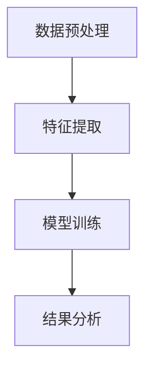
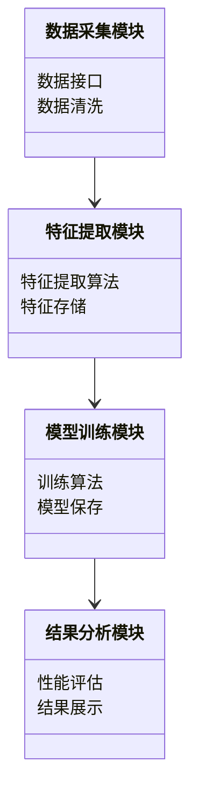

                 


---

# AI驱动的另类数据投资信号提取与验证

> 关键词：AI驱动、另类数据、投资信号、特征提取、机器学习、深度学习

> 摘要：  
本文探讨了如何利用人工智能技术从另类数据中提取和验证投资信号。通过分析不同数据类型的特点，结合机器学习和深度学习算法，本文详细介绍了信号提取的流程、验证方法以及系统实现。同时，通过实际案例分析和项目实战，展示了如何在投资领域中应用这些技术，为投资者提供更精准的决策支持。

---

## 第一部分：背景与核心概念

### 第1章：投资信号与另类数据的定义

#### 1.1 投资信号的基本概念
投资信号是指在金融市场中，能够预示某种资产价格变化的指标或模式。这些信号可以来自传统的财务数据，也可以来自非传统的另类数据。

#### 1.2 另类数据的定义与特点
另类数据是指传统金融数据之外的其他数据类型，如社交媒体文本、卫星图像、音频数据等。这些数据具有实时性、多样性、非结构化等特点。

#### 1.3 AI驱动投资信号的背景与意义
随着科技的进步，AI技术在金融领域的应用越来越广泛。通过分析另类数据，AI可以帮助投资者发现传统方法难以察觉的信号，从而做出更精准的投资决策。

### 第2章：AI驱动的信号提取与验证的核心要素

#### 2.1 数据来源与类型
- 文本数据：社交媒体、新闻、公司财报等。
- 图像数据：卫星图像、图表数据。
- 音频数据：电话会议录音、市场广播。

#### 2.2 信号提取的关键技术
- 特征提取：从数据中提取有用的特征。
- 模型训练：使用机器学习和深度学习模型进行预测。

#### 2.3 信号验证的流程与方法
- 数据清洗：去除噪声数据。
- 模型验证：通过回测和风险控制来验证信号的有效性。

---

## 第二部分：AI驱动的信号提取方法

### 第3章：特征提取与模型训练

#### 3.1 特征提取的关键技术
- 文本特征提取：使用TF-IDF或BERT进行词嵌入。
- 图像特征提取：使用卷积神经网络提取图像特征。
- 音频特征提取：使用傅里叶变换提取音频特征。

#### 3.2 模型训练与优化
- 传统机器学习模型：逻辑回归、随机森林。
- 深度学习模型：神经网络、LSTM。
- 超参数调优：使用网格搜索优化模型性能。

### 第4章：信号提取的算法实现

#### 4.1 信号提取的算法流程
1. 数据预处理：清洗、标准化。
2. 特征提取：提取有用特征。
3. 模型训练：训练分类或回归模型。
4. 结果分析：评估模型性能。

#### 4.2 信号提取的数学模型
- 逻辑回归模型：
  $$ P(y=1) = \frac{e^{\beta_0 + \beta_1 x}}{1 + e^{\beta_0 + \beta_1 x}} $$
- 随机森林模型：通过集成学习提升模型鲁棒性。

#### 4.3 使用mermaid展示信号提取流程



---

## 第三部分：基于机器学习的信号验证

### 第5章：分类模型与风险控制

#### 5.1 分类模型的应用
- 二分类问题：预测股票价格的上涨或下跌。
- 多分类问题：预测多个市场状态。

#### 5.2 风险控制策略
- 资金分配：根据预测结果调整投资组合。
- 止损策略：设定止损点以减少损失。

### 第6章：回测策略与因子分析

#### 6.1 回测策略的实现
- 回测框架：使用回测平台验证模型。
- 回测指标：计算夏普比率、最大回撤等指标。

#### 6.2 因子分析
- 因子构建：将特征转化为因子。
- 因子验证：分析因子的有效性。

---

## 第四部分：系统架构与实现

### 第7章：系统功能设计

#### 7.1 系统模块划分
- 数据采集模块：负责数据的获取。
- 特征提取模块：提取有用特征。
- 模型训练模块：训练预测模型。
- 结果分析模块：评估模型性能。

#### 7.2 使用mermaid展示系统架构



---

## 第五部分：项目实战

### 第8章：环境配置与核心实现

#### 8.1 环境配置
- Python版本：3.8以上。
- 库的安装：pandas、numpy、scikit-learn、tensorflow。

#### 8.2 核心代码实现

```python
import pandas as pd
from sklearn.model import LogisticRegression
from sklearn.feature_extraction.text import TfidfVectorizer

# 数据预处理
data = pd.read_csv('data.csv')
data_cleaned = data.dropna()

# 特征提取
vectorizer = TfidfVectorizer()
features = vectorizer.fit_transform(data_cleaned['text'])

# 模型训练
model = LogisticRegression()
model.fit(features, data_cleaned['label'])

# 结果分析
print("Accuracy:", model.score(features, data_cleaned['label']))
```

---

## 第六部分：高级主题与案例分析

### 第9章：NLP在投资中的应用

#### 9.1 文本数据的情感分析
- 使用BERT模型分析社交媒体情绪。

#### 9.2 文本生成与预测
- 使用GPT模型生成市场预测报告。

### 第10章：强化学习与投资策略优化

#### 10.1 强化学习的基本概念
- 状态、动作、奖励：在投资中的应用。

#### 10.2 强化学习的策略优化
- 使用DQN算法优化投资组合。

---

## 第七部分：总结与展望

### 第11章：总结与展望

#### 11.1 全文总结
- 本文介绍了AI驱动的另类数据投资信号提取与验证的全过程，从数据获取到模型训练，再到结果分析，详细展示了如何利用AI技术提升投资决策的准确性。

#### 11.2 未来展望
- 随着AI技术的不断进步，未来可以通过更复杂的数据分析方法，如图神经网络和自监督学习，进一步提升投资信号的提取与验证能力。

---

通过以上内容，本文为读者提供了一个全面的视角，从理论到实践，详细讲解了如何利用AI技术从另类数据中提取和验证投资信号。希望读者能够通过本文，掌握AI在投资领域的应用，并在实际操作中取得更好的效果。

