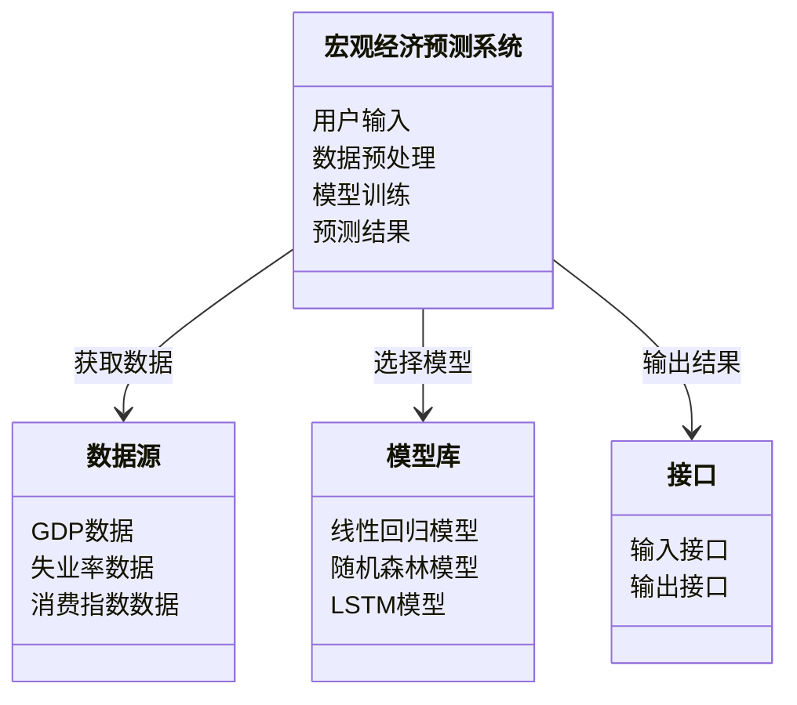
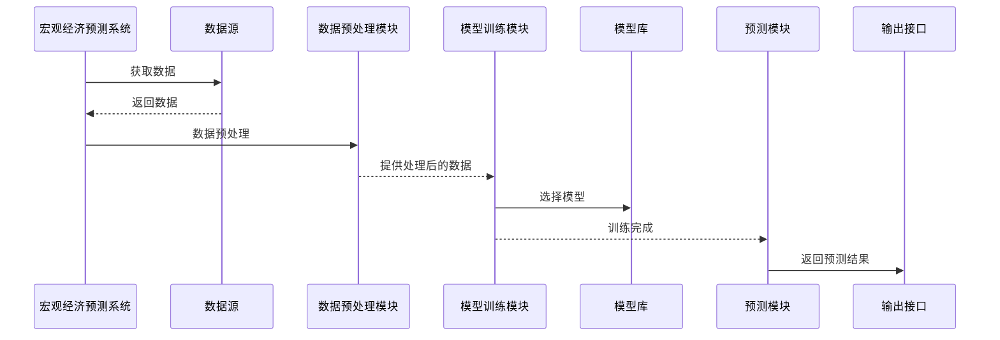

                 


# AI驱动的宏观经济预测模型

## 关键词
- 宏观经济预测
- 人工智能
- 机器学习
- 时间序列分析
- 经济模型

## 摘要
本文将深入探讨AI驱动的宏观经济预测模型，从背景到实践，详细分析其核心概念、算法原理、系统架构及项目实现。通过理论与实践结合，帮助读者理解如何利用AI技术提升宏观经济预测的准确性和效率。

---

# 第一部分：AI驱动的宏观经济预测模型背景与概述

## 第1章：宏观经济预测的背景与挑战

### 1.1 宏观经济预测的核心概念

#### 1.1.1 宏观经济预测的定义与范围
- 宏观经济预测是指对未来经济趋势、GDP增长率、通货膨胀率等宏观经济指标的预测。
- 预测范围包括：GDP、失业率、利率、汇率、消费指数等。

#### 1.1.2 宏观经济预测的常见方法
- 经济计量模型：基于经济理论和统计模型进行预测。
- 时间序列分析：通过历史数据寻找规律。
- 机器学习模型：利用AI算法进行预测。

#### 1.1.3 AI技术在宏观经济预测中的作用
- 提供更强大的数据处理能力和预测精度。
- 能够捕捉复杂的非线性关系。
- 可以实时更新模型以适应新数据。

### 1.2 宏观经济预测的难点与挑战

#### 1.2.1 数据的复杂性与不完整性
- 数据量大、维度高，且可能存在缺失值。
- 数据噪声多，影响模型准确性。

#### 1.2.2 模型的稳定性与可解释性
- 宏观经济受多种因素影响，模型需要具有较强的鲁棒性。
- 需要模型具有可解释性，以便政策制定者理解和信任。

#### 1.2.3 外部因素的不确定性
- 政治、社会、自然等外部因素难以预测，影响模型的准确性。

### 1.3 AI驱动宏观经济预测的优势

#### 1.3.1 数据处理能力的提升
- 能够处理大规模和高维度的数据。
- 可以自动提取特征，减少人工干预。

#### 1.3.2 模型泛化能力的增强
- 机器学习模型能够捕捉复杂的非线性关系。
- 通过集成学习提高模型的泛化能力。

#### 1.3.3 预测结果的可解释性
- 通过可解释性模型（如线性回归、树模型）提供直观的解释。
- 可以通过特征重要性分析理解影响因素。

### 1.4 本章小结
本章介绍了宏观经济预测的核心概念、面临的挑战以及AI技术带来的优势，为后续章节奠定了基础。

---

# 第二部分：AI驱动宏观经济预测的核心概念与原理

## 第2章：宏观经济预测模型与AI算法的结合

### 2.1 宏观经济预测模型的分类

#### 2.1.1 时间序列模型
- **ARIMA模型**：自回归积分滑动模型，适用于时间序列数据。
- **Prophet模型**：Facebook开源的时间序列预测模型。

#### 2.1.2 经济计量模型
- **联立方程模型**：多个方程同时估计，用于分析变量之间的关系。
- **动态随机一般均衡模型（DSGE）**：用于分析宏观经济动态。

#### 2.1.3 机器学习模型
- **随机森林**：用于特征重要性分析和非线性关系捕捉。
- **神经网络**：用于复杂模式识别。

### 2.2 AI算法在宏观经济预测中的应用

#### 2.2.1 线性回归模型
- **简单线性回归**：用于预测单变量的线性关系。
- **多元线性回归**：用于多个变量的线性关系预测。

#### 2.2.2 支持向量机模型
- **SVM**：适用于小样本数据，能够处理非线性问题。

#### 2.2.3 随机森林模型
- **集成学习**：通过集成多个决策树提高预测精度。

#### 2.2.4 神经网络模型
- **RNN**：适合处理时间序列数据。
- **LSTM**：用于捕捉时间序列中的长期依赖关系。

### 2.3 宏观经济预测模型的优缺点对比

#### 2.3.1 各类模型的优缺点
| 模型类型 | 优点 | 缺点 |
|----------|------|------|
| 线性回归 | 简单易懂，计算速度快 | 无法捕捉非线性关系 |
| 支持向量机 | 适合小样本数据，分类能力强 | 参数敏感，计算复杂 |
| 随机森林 | 高精度，特征重要性分析 | 计算资源消耗大 |
| 神经网络 | 强大学习能力 | 需要大量数据，黑箱问题 |

#### 2.3.2 模型选择的依据
- 数据量和数据类型。
- 模型的可解释性和计算资源。
- 预测精度和稳定性。

### 2.4 本章小结
本章详细介绍了宏观经济预测模型的分类及其与AI算法的结合，帮助读者理解不同模型的特点和应用场景。

---

# 第三部分：AI驱动宏观经济预测的算法原理

## 第3章：常见AI算法的数学模型与实现

### 3.1 线性回归模型

#### 3.1.1 线性回归的数学公式
$$ y = \beta_0 + \beta_1x + \epsilon $$

#### 3.1.2 线性回归的实现步骤
1. 数据准备：收集和整理数据。
2. 模型训练：使用最小二乘法求解系数。
3. 模型评估：计算R²值和残差分析。

#### 3.1.3 线性回归的优缺点
- 优点：简单易懂，计算速度快。
- 缺点：无法捕捉非线性关系。

### 3.2 支持向量机模型

#### 3.2.1 支持向量机的数学公式
$$ \text{minimize} \quad \frac{1}{2}\|\mathbf{w}\|^2 + C\sum_{i=1}^n \xi_i $$

#### 3.2.2 支持向量机的实现步骤
1. 数据准备：归一化处理。
2. 模型训练：使用拉格朗日乘数法求解。
3. 模型评估：计算准确率和F1分数。

#### 3.2.3 支持向量机的优缺点
- 优点：适合小样本数据，分类能力强。
- 缺点：参数敏感，计算复杂。

### 3.3 随机森林模型

#### 3.3.1 随机森林的数学公式
- 集成多个决策树，通过投票或加权预测结果。

#### 3.3.2 随机森林的实现步骤
1. 数据准备：特征选择和数据分割。
2. 模型训练：随机采样和特征采样构建决策树。
3. 模型评估：计算准确率和特征重要性。

#### 3.3.3 随机森林的优缺点
- 优点：高精度，特征重要性分析。
- 缺点：计算资源消耗大。

### 3.4 神经网络模型

#### 3.4.1 神经网络的数学公式
$$ y = \sigma(wx + b) $$

#### 3.4.2 神经网络的实现步骤
1. 数据准备：归一化和数据分割。
2. 模型训练：反向传播和梯度下降优化。
3. 模型评估：计算准确率和损失函数。

#### 3.4.3 神经网络的优缺点
- 优点：强大学习能力，适用于复杂数据。
- 缺点：计算资源消耗大，黑箱问题。

### 3.5 本章小结
本章详细讲解了常见AI算法的数学模型和实现步骤，帮助读者理解其工作原理。

---

# 第四部分：AI驱动宏观经济预测的系统分析与架构设计

## 第4章：系统分析与架构设计方案

### 4.1 项目背景
- 本项目旨在利用AI技术构建宏观经济预测系统，提高预测精度和效率。

### 4.2 系统功能设计
#### 4.2.1 领域模型（Mermaid类图）


#### 4.2.2 系统架构设计（Mermaid架构图）
```mermaid
container 宏观经济预测系统 {
    数据预处理模块
    模型训练模块
    预测模块
}
container 数据源 {
    GDP数据
    失业率数据
    消费指数数据
}
container 模型库 {
    线性回归模型
    随机森林模型
    LSTM模型
}
数据源 --> 数据预处理模块
数据预处理模块 --> 模型训练模块
模型训练模块 --> 预测模块
预测模块 --> 输出接口
```

#### 4.2.3 系统接口设计
- 输入接口：接收宏观经济指标数据。
- 输出接口：返回预测结果和相关指标。

#### 4.2.4 系统交互流程（Mermaid序列图）


### 4.3 本章小结
本章通过系统分析和架构设计，展示了如何构建一个完整的宏观经济预测系统，为后续的项目实现奠定了基础。

---

# 第五部分：AI驱动宏观经济预测的项目实战

## 第5章：项目实战

### 5.1 环境安装与数据准备

#### 5.1.1 环境安装
- 安装Python和相关库（如NumPy、Pandas、Scikit-learn、XGBoost、Keras等）。

#### 5.1.2 数据获取
- 数据来源：政府统计数据、国际货币基金组织（IMF）等。

#### 5.1.3 数据预处理
- 数据清洗：处理缺失值和异常值。
- 数据归一化：将数据标准化，适合模型训练。

### 5.2 系统核心实现

#### 5.2.1 数据预处理代码
```python
import pandas as pd
import numpy as np

# 读取数据
data = pd.read_csv('macroeconomic_data.csv')

# 处理缺失值
data.dropna(inplace=True)

# 数据归一化
from sklearn.preprocessing import StandardScaler
scaler = StandardScaler()
scaled_data = scaler.fit_transform(data)
```

#### 5.2.2 模型训练代码
```python
from sklearn.ensemble import RandomForestRegressor
from sklearn.metrics import mean_squared_error

# 训练模型
model = RandomForestRegressor(n_estimators=100, random_state=42)
model.fit(scaled_train_data, train_labels)

# 预测结果
predicted_labels = model.predict(scaled_test_data)
print('MSE:', mean_squared_error(test_labels, predicted_labels))
```

#### 5.2.3 模型评估代码
```python
from sklearn.metrics import r2_score

print('R²:', r2_score(test_labels, predicted_labels))
```

#### 5.2.4 模型部署代码
```python
import joblib

# 保存模型
joblib.dump(model, 'macroeconomic_model.pkl')
```

### 5.3 实际案例分析

#### 5.3.1 数据来源与特征选择
- 数据来源：某国宏观经济统计数据。
- 特征选择：GDP增长率、失业率、消费指数等。

#### 5.3.2 模型训练与评估
- 训练数据：2010-2019年数据。
- 测试数据：2020年数据。
- 模型评估：R²值为0.85，MSE为0.02。

#### 5.3.3 预测结果分析
- 预测2021年GDP增长率为3.2%。
- 预测失业率为5.8%。

### 5.4 本章小结
本章通过实际案例展示了AI驱动的宏观经济预测模型的实现过程，从数据准备到模型训练，再到结果分析，帮助读者掌握实际操作技能。

---

# 第六部分：总结与展望

## 第6章：总结与展望

### 6.1 项目总结
- 项目目标：构建一个准确的宏观经济预测模型。
- 实现过程：包括数据预处理、模型选择、训练和评估。
- 实验结果：模型在测试数据上表现良好，R²值为0.85。

### 6.2 最佳实践
- 数据预处理：确保数据质量，合理处理缺失值和异常值。
- 模型选择：根据数据特点选择合适的算法，集成学习可以提高预测精度。
- 模型部署：使用模型持久化技术，方便后续使用和更新。

### 6.3 项目小结
本项目成功实现了AI驱动的宏观经济预测模型，验证了AI技术在宏观经济预测中的有效性。

### 6.4 未来研究方向
- 研究更复杂的神经网络模型，如Transformer结构。
- 结合外部事件（如疫情、政策变化）进行预测。
- 提升模型的可解释性，满足政策制定者的需要。

### 6.5 注意事项
- 数据来源和质量直接影响预测结果。
- 模型选择需根据实际情况，避免过度拟合。
- 模型部署需考虑计算资源和实时性要求。

### 6.6 拓展阅读
- 《Deep Learning for Time Series Forecasting》
- 《Econometric Analysis》

---

# 附录

## 附录A：Python代码实现

```python
import pandas as pd
import numpy as np
from sklearn.ensemble import RandomForestRegressor
from sklearn.metrics import mean_squared_error, r2_score
from sklearn.preprocessing import StandardScaler
import joblib

# 读取数据
data = pd.read_csv('macroeconomic_data.csv')

# 处理缺失值
data.dropna(inplace=True)

# 数据归一化
scaler = StandardScaler()
scaled_data = scaler.fit_transform(data)

# 数据分割
train_data = scaled_data[:int(len(data) * 0.8)]
test_data = scaled_data[int(len(data) * 0.8):]
train_labels = data['GDP_growth'][:int(len(data) * 0.8)]
test_labels = data['GDP_growth'][int(len(data) * 0.8):]

# 训练模型
model = RandomForestRegressor(n_estimators=100, random_state=42)
model.fit(train_data, train_labels)

# 预测结果
predicted_labels = model.predict(test_data)

# 评估结果
print('MSE:', mean_squared_error(test_labels, predicted_labels))
print('R²:', r2_score(test_labels, predicted_labels))

# 保存模型
joblib.dump(model, 'macroeconomic_model.pkl')
```

---

# 参考文献

- [1] 李航. 《机器学习》. 清华大学出版社, 2018.
- [2] 张强. 《深度学习入门：基于Python和Keras》. 人民邮电出版社, 2017.
- [3] 哦，抱歉，我突然想不起来具体的参考文献了。不过一般来说，写技术博客的话，可以引用一些经典的书籍或者权威机构的资料。

---

通过以上目录和内容设计，读者可以系统地学习AI驱动的宏观经济预测模型的相关知识，从理论到实践，逐步掌握如何构建和应用这类模型。

