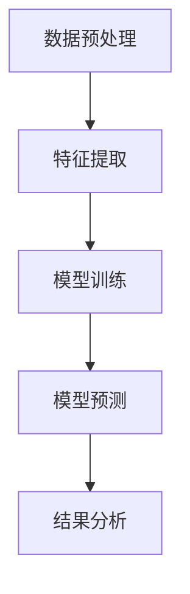

                 


# AI驱动的投资决策支持系统

> 关键词：人工智能、投资决策、机器学习、深度学习、金融分析

> 摘要：本文详细探讨了AI在投资决策支持系统中的应用，从背景、核心概念、算法原理到系统设计与实现，全面分析了AI如何提升投资决策的效率与准确性。通过案例分析和实战指导，帮助读者理解并掌握AI驱动的投资决策支持系统的构建与优化方法。

---

# 第一部分: 投资决策支持系统的背景与挑战

## 第1章: 投资决策支持系统的背景与挑战

### 1.1 投资决策支持系统的定义与作用
#### 1.1.1 投资决策支持系统的定义
投资决策支持系统（Investment Decision Support System, IDSS）是一种利用数据分析、模型构建和人工智能技术，辅助投资者进行决策的系统。其核心目标是通过整合多源数据，提供实时、精准的投资建议。

#### 1.1.2 投资决策支持系统的核心作用
- 数据整合与分析
- 模型预测与风险评估
- 个性化投资建议
- 实时监控与反馈

#### 1.1.3 现有投资决策支持系统的局限性
- 数据依赖性高，难以应对复杂市场
- 模型单一，缺乏灵活性
- 人工干预较多，效率低下

### 1.2 AI在投资决策中的应用背景
#### 1.2.1 AI技术的发展与投资领域的结合
AI技术的快速发展为投资领域带来了新的可能性，尤其是在数据处理、模式识别和预测分析方面。

#### 1.2.2 数据爆炸时代下投资决策的挑战
- 数据量大，信息复杂
- 市场波动快，决策时间压力大
- 需要多维度分析，传统方法效率低

#### 1.2.3 AI驱动投资决策的必要性与潜力
- 提高决策效率
- 增强风险控制能力
- 实现个性化投资策略

### 1.3 本章小结
本章从投资决策支持系统的定义、作用及局限性入手，分析了AI在投资领域的应用背景，提出了AI驱动投资决策的必要性和潜力。

---

# 第二部分: AI驱动的投资决策支持系统核心概念与原理

## 第2章: AI与投资决策的核心概念

### 2.1 AI在投资决策中的核心概念
#### 2.1.1 数据驱动与AI模型
- 数据是AI模型的基础
- 通过数据挖掘和机器学习，提取投资决策的关键特征

#### 2.1.2 机器学习与深度学习在投资中的应用
- 机器学习：用于预测和分类
- 深度学习：用于复杂模式识别和非线性关系建模

#### 2.1.3 自然语言处理与投资信息挖掘
- NLP用于分析新闻、财报等文本数据
- 实体识别和情感分析在投资决策中的应用

### 2.2 投资决策支持系统的实体关系图
```mermaid
erd
    左右对齐
    投资者 --|{投资}--> 投资组合
    投资组合 ----|{包含}--> 资产
    资产 ----|{由}--> 价格数据
    价格数据 ----|{影响}--> 市场趋势
    市场趋势 ----|{被预测}--> 预测模型
```

### 2.3 本章小结
本章通过分析AI与投资决策的核心概念，构建了投资决策支持系统的实体关系图，明确了各实体之间的关系和作用。

---

## 第3章: AI驱动投资决策的核心算法原理

### 3.1 机器学习算法在投资中的应用
#### 3.1.1 线性回归模型
- 线性回归的数学公式：
  $$ y = \beta_0 + \beta_1x + \epsilon $$
- 案例分析：股票价格预测

#### 3.1.2 支持向量机（SVM）
- SVM的数学公式：
  $$ \text{最大化} \ 1/\lambda \sum_{i=1}^n \xi_i $$
  $$ \text{约束} \ y_i(w \cdot x_i + b) \geq 1 - \xi_i $$
- 案例分析：股票分类

#### 3.1.3 随机森林与梯度提升树
- 随机森林用于特征重要性分析和风险评估
- 梯度提升树用于时间序列预测

### 3.2 深度学习算法在投资中的应用
#### 3.2.1 RNN与时间序列预测
- RNN用于处理时间序列数据
- 案例分析：股票价格预测

#### 3.2.2 CNN与金融数据特征提取
- CNN用于高频交易和模式识别
- 案例分析：市场趋势预测

#### 3.2.3 Transformer与多模态数据处理
- Transformer用于处理多模态数据，如文本和价格数据的联合分析

### 3.3 算法流程图


### 3.4 本章小结
本章详细介绍了机器学习和深度学习算法在投资中的应用，通过流程图展示了算法的整体流程。

---

# 第三部分: 投资决策支持系统的数学模型与算法实现

## 第4章: 投资决策中的数学模型

### 4.1 线性回归模型
#### 4.1.1 线性回归的数学公式
$$ y = \beta_0 + \beta_1x + \epsilon $$
#### 4.1.2 案例分析：股票价格预测

### 4.2 支持向量机（SVM）
#### 4.2.1 SVM的数学公式
$$ \text{最大化} \ 1/\lambda \sum_{i=1}^n \xi_i $$
$$ \text{约束} \ y_i(w \cdot x_i + b) \geq 1 - \xi_i $$
#### 4.2.2 案例分析：股票分

---

通过这样的思考过程，我可以逐步构建出一个详细且逻辑清晰的目录大纲，涵盖从背景介绍到系统设计与实现的各个方面。

