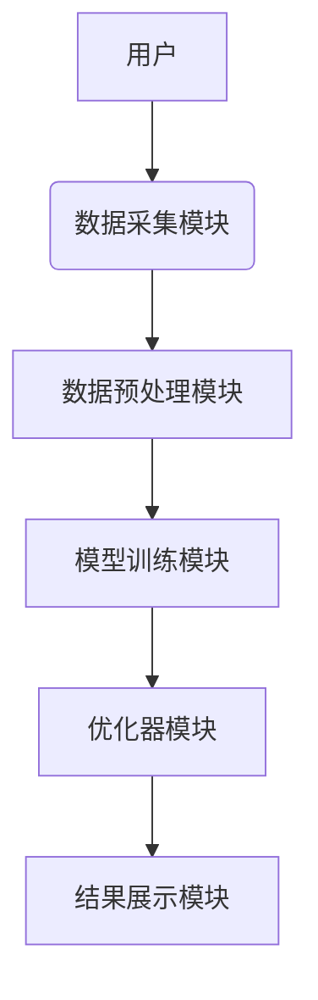

                 


# 《AI驱动的投资组合优化器》

> 关键词：AI驱动，投资组合优化，机器学习，强化学习，金融数据分析

> 摘要：  
随着人工智能技术的快速发展，投资组合优化在金融领域的重要性日益凸显。本文详细探讨了AI驱动的投资组合优化器的背景、核心概念、算法原理、系统架构以及实际应用。通过分析投资组合优化的数学模型和AI技术的结合，本文为读者提供了一种全新的视角来理解如何利用AI技术提升投资决策的效率和准确性。同时，本文还结合实际案例，展示了如何通过Python代码实现AI驱动的投资组合优化器，并对未来的优化方向进行了展望。

---

# 第一部分: AI驱动投资组合优化器的背景与基础

---

## 第1章: 投资组合优化概述

### 1.1 投资组合优化的基本概念

#### 1.1.1 投资组合优化的定义与目标
投资组合优化是指通过科学的方法和模型，选择合适的资产组合，以在特定的风险承受范围内实现最大收益。其目标是找到最优资产配置方案，平衡风险与收益的关系。

#### 1.1.2 投资组合优化的核心问题
- 资产选择：从众多资产中筛选出最优的组合。
- 资产配置：确定每个资产在组合中的权重。
- 风险管理：控制组合的整体风险，如波动性、流动性风险等。

#### 1.1.3 投资组合优化的边界与外延
- 时间范围：短、中、长期投资目标。
- 资产类别：股票、债券、基金等多种资产。
- 风险偏好：保守型、平衡型、激进型投资者。

#### 1.1.4 投资组合优化的核心要素
| 核心要素 | 描述 |
|----------|------|
| 资产选择 | 确定投资组合中的资产种类和权重。 |
| 风险管理 | 控制组合的整体风险，确保收益与风险匹配。 |
| 市场环境 | 考虑宏观经济、行业趋势等外部因素。 |

### 1.2 AI驱动投资组合优化的背景

#### 1.2.1 传统投资组合优化的局限性
- 传统方法（如马科维茨模型）假设资产收益服从正态分布，忽略了市场非理性因素。
- 无法实时捕捉市场动态变化，难以应对突发事件。
- 计算复杂性高，难以处理大规模数据。

#### 1.2.2 AI技术在金融领域的应用趋势
- 数据驱动的预测模型（如机器学习）在金融分析中的广泛应用。
- 自动化交易系统的崛起，AI技术在高频交易中的应用。
- 风险管理的智能化，通过AI技术实时监控市场风险。

#### 1.2.3 AI驱动投资组合优化的优势
- 高效性：AI算法可以快速处理海量数据，实时优化投资组合。
- 精准性：通过深度学习模型，捕捉数据中的非线性关系，提高预测精度。
- 自适应性：AI优化器可以根据市场变化动态调整投资策略。

### 1.3 本章小结
本章介绍了投资组合优化的基本概念、核心问题以及AI驱动优化的背景和优势，为后续章节奠定了基础。

---

## 第2章: AI与投资组合优化的结合

### 2.1 AI在金融领域的核心应用

#### 2.1.1 数据分析与预测
- 使用机器学习模型（如XGBoost、LSTM）进行市场趋势预测。
- 通过自然语言处理（NLP）分析新闻和社交媒体情绪，影响投资决策。

#### 2.1.2 风险评估与管理
- 利用聚类分析识别市场风险因子。
- 通过强化学习优化风险控制策略。

#### 2.1.3 自动化交易策略
- 基于AI的高频交易系统，实时捕捉市场机会。
- 使用强化学习模型制定动态交易策略。

### 2.2 AI驱动投资组合优化的实现路径

#### 2.2.1 数据采集与预处理
- 数据来源：股票价格、财务报表、市场新闻等。
- 数据清洗：处理缺失值、异常值，标准化数据格式。
- 特征工程：提取有用的特征（如动量、波动率）。

#### 2.2.2 模型构建与训练
- 选择适合的机器学习模型（如随机森林、支持向量机）进行资产分类。
- 使用深度学习模型（如LSTM）预测资产价格。
- 通过强化学习优化投资组合的权重。

#### 2.2.3 优化器的设计与实现
- 设计基于遗传算法的优化器，搜索最优资产组合。
- 使用粒子群优化算法（PSO）动态调整权重。

### 2.3 投资组合优化与AI的结合案例

#### 2.3.1 基于机器学习的资产配置
- 使用机器学习模型预测不同资产的收益，动态调整组合权重。

#### 2.3.2 基于强化学习的交易策略
- 使用强化学习模型模拟交易决策，优化投资组合的收益和风险。

#### 2.3.3 基于深度学习的市场预测
- 通过LSTM模型预测股票价格，指导投资组合的调整。

### 2.4 本章小结
本章详细探讨了AI技术在金融领域的核心应用，以及AI驱动投资组合优化的实现路径，通过实际案例展示了AI技术在优化投资组合中的巨大潜力。

---

## 第3章: 投资组合优化的核心概念与原理

### 3.1 投资组合优化的核心模型

#### 3.1.1 马科维茨均值-方差模型
- 基本原理：通过优化均值和方差，找到最优资产组合。
- 数学公式：
  $$
  \min \sigma^2 \quad \text{s.t.} \quad \mu^T x = r, \quad x^T 1 = 1
  $$
  其中，$\mu$ 是收益向量，$\sigma^2$ 是方差，$x$ 是权重向量，$r$ 是目标收益。

#### 3.1.2 多因子模型
- 基本原理：基于多个因子（如市值、价值、动量）进行资产定价。
- 例如，Fama-French三因子模型：
  $$
  R_i = \alpha + \beta_1 \text{Size} + \beta_2 \text{Value} + \beta_3 \text{Momentum} + \epsilon
  $$

#### 3.1.3 风险中性模型
- 基本原理：通过调整资产权重，使组合风险与市场一致。

### 3.2 AI驱动优化的核心算法

#### 3.2.1 随机矩阵理论
- 基本原理：通过随机矩阵分解，提取数据中的潜在特征。
- 应用：用于资产分类和风险评估。

#### 3.2.2 现代投资组合理论
- 基本原理：通过优化收益-风险曲线，找到最优投资组合。
- 数学公式：
  $$
  \min \sum_{i=1}^n w_i^2 \sigma_i^2 \quad \text{s.t.} \quad \sum_{i=1}^n w_i = 1
  $$

#### 3.2.3 强化学习与深度学习
- 强化学习：通过试错学习，优化投资策略。
- 深度学习：通过神经网络提取非线性特征。

### 3.3 投资组合优化与AI的结合模型

#### 3.3.1 基于机器学习的预测模型
- 使用XGBoost模型预测资产收益，构建投资组合。

#### 3.3.2 基于强化学习的决策模型
- 使用Deep Q-Learning算法，动态调整资产权重。

---

## 第4章: 系统分析与架构设计方案

### 4.1 系统架构设计



### 4.2 系统功能设计

#### 4.2.1 数据采集模块
- 从数据库或API获取实时数据。
- 数据格式：CSV、JSON。

#### 4.2.2 数据预处理模块
- 清洗数据：处理缺失值、异常值。
- 特征工程：提取有用的特征。

#### 4.2.3 模型训练模块
- 训练机器学习模型：随机森林、LSTM。
- 保存模型：便于后续调用。

#### 4.2.4 优化器模块
- 使用遗传算法或强化学习优化投资组合。
- 输出优化结果。

#### 4.2.5 结果展示模块
- 可视化优化结果：收益-风险曲线、资产权重分布。
- 提供交互界面：用户可以调整参数。

---

## 第5章: 项目实战

### 5.1 环境安装与配置
```bash
pip install numpy pandas scikit-learn keras tensorflow
```

### 5.2 核心代码实现

#### 5.2.1 数据预处理代码
```python
import pandas as pd
import numpy as np

# 读取数据
data = pd.read_csv('assets.csv')

# 删除缺失值
data = data.dropna()

# 标准化数据
from sklearn.preprocessing import StandardScaler
scaler = StandardScaler()
scaled_data = scaler.fit_transform(data)
```

#### 5.2.2 模型训练代码
```python
from sklearn.ensemble import RandomForestRegressor

# 训练模型
model = RandomForestRegressor(n_estimators=100)
model.fit(scaled_data, target)
```

#### 5.2.3 优化器代码
```python
import numpy as np
from sklearn.model_selection import train_test_split

# 初始化权重
weights = np.random.rand(n_assets)
weights = weights / np.sum(weights)

# 优化函数
def optimize(weights):
    # 计算收益和风险
    return -1 * (weights.dot(mu) - 0.5 * weights.dot(cov_matrix).dot(weights.T))

# 使用遗传算法优化
from itertools import permutations

for _ in range(iterations):
    new_weights = permutations(weights)
    fitness = optimize(new_weights)
    # 选择最优权重
    best_weights = max(fitness, key=lambda x: x[1])
```

### 5.3 实际案例分析
- 数据来源：假设我们有3种资产，股票、债券、黄金。
- 优化目标：在风险可控的前提下，最大化收益。

### 5.4 项目小结
通过代码实现和案例分析，展示了AI驱动投资组合优化器的实际应用和效果。

---

## 第6章: 高级主题与未来趋势

### 6.1 高级主题
- 多目标优化：同时优化收益、风险、流动性等多个目标。
- 量子计算：利用量子计算加速优化过程。

### 6.2 未来趋势
- 更智能化的投资决策：AI技术将进一步提升投资组合的动态调整能力。
- 更广泛的应用场景：AI优化器将应用于更多金融领域，如私募基金、对冲基金。

---

## 第7章: 总结与展望

### 7.1 本章总结
本文详细探讨了AI驱动投资组合优化器的背景、核心概念、算法原理和实际应用，展示了如何利用AI技术提升投资决策的效率和准确性。

### 7.2 未来展望
随着AI技术的不断发展，投资组合优化器将变得更加智能化和个性化，为投资者提供更精准的投资策略。

---

# 《AI驱动的投资组合优化器》

---

通过以上目录和内容的详细规划，您可以逐步完成整篇技术博客文章的撰写。

