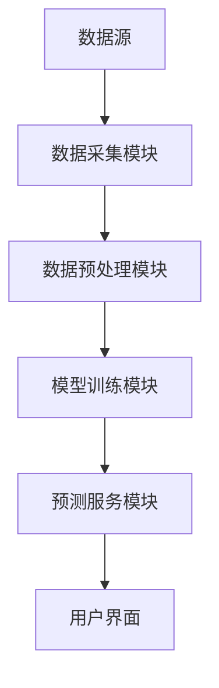
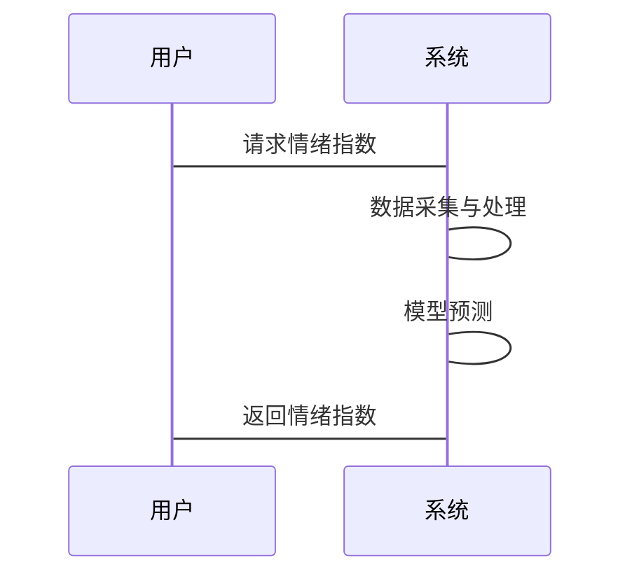
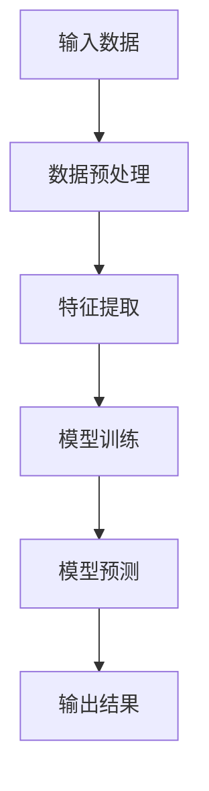

                 


# AI驱动的投资者情绪指数预测系统

**关键词**：投资者情绪，AI，情绪指数，预测系统，深度学习，自然语言处理

**摘要**：投资者情绪在金融市场中扮演着重要角色，而AI技术的应用为情绪指数的预测提供了新的可能性。本文详细探讨了AI驱动的投资者情绪指数预测系统的核心概念、算法原理、系统架构及实际应用，展示了如何利用深度学习和自然语言处理技术来提升情绪预测的准确性和实时性。

---

# 第一部分：背景与概述

## 第1章：投资者情绪指数的基本概念

### 1.1 投资者情绪的定义与特征

#### 1.1.1 投资者情绪的定义
投资者情绪是指投资者在金融市场中的情感倾向，包括乐观、悲观、恐慌等状态。这些情绪通常受到市场波动、经济数据、新闻事件等因素的影响。

#### 1.1.2 投资者情绪的特征分析
- **波动性**：情绪会随着市场变化迅速波动。
- **传染性**：投资者情绪具有传染性，容易在市场中蔓延。
- **非线性**：情绪与市场行为之间的关系通常是非线性的。

#### 1.1.3 投资者情绪与市场行为的关系
投资者情绪直接影响投资决策，从而影响市场价格和波动性。例如，乐观情绪可能导致股价上涨，而悲观情绪可能导致股价下跌。

### 1.2 投资者情绪指数的作用与意义

#### 1.2.1 投资者情绪指数的定义
投资者情绪指数是衡量市场参与者情绪的量化指标，通常通过新闻、社交媒体、市场交易数据等信息进行计算。

#### 1.2.2 投资者情绪指数的应用场景
- **风险预警**：帮助投资者识别市场风险。
- **投资决策支持**：为投资者提供情绪参考，优化投资策略。
- **市场研究**：用于分析市场行为和趋势。

#### 1.2.3 投资者情绪指数对投资决策的影响
情绪指数能够帮助投资者更好地理解市场情绪，从而做出更明智的投资决策。

### 1.3 投资者情绪指数预测的背景

#### 1.3.1 传统情绪分析的局限性
- **数据量不足**：传统方法依赖少量数据，难以捕捉复杂的情绪变化。
- **准确性低**：传统方法难以准确识别隐含情绪。
- **实时性差**：传统方法难以满足实时预测的需求。

#### 1.3.2 AI技术的应用优势
- **数据处理能力**：AI能够处理海量数据，捕捉复杂的情绪变化。
- **准确性提升**：通过深度学习等技术，提高情绪预测的准确性。
- **实时性增强**：AI技术能够实现实时情绪预测。

---

## 第2章：传统投资者情绪分析的局限性

### 2.1 传统情绪分析方法的概述

#### 2.1.1 基于统计的方法
- **描述性统计**：通过统计指标（如均值、标准差）分析情绪分布。
- **情感词典**：使用预定义的情感词汇进行情感分类。

#### 2.1.2 基于规则的方法
- **规则匹配**：通过预定义的规则匹配文本中的情绪特征。
- **情感强度计算**：根据规则匹配的结果计算情感强度。

#### 2.1.3 基于机器学习的传统方法
- **线性模型**：如线性回归、SVM等，用于分类任务。
- **树模型**：如决策树、随机森林，用于分类和回归任务。

### 2.2 传统方法的局限性

#### 2.2.1 数据处理的局限性
- **数据稀疏性**：传统方法难以处理数据稀疏问题。
- **特征提取不足**：传统方法难以捕捉复杂的语义信息。

#### 2.2.2 情感分类的局限性
- **情感强度难以量化**：传统方法难以准确量化情感强度。
- **情感模糊性**：传统方法难以处理模糊性情感表达。

#### 2.2.3 实时性与准确性的权衡
- **计算效率低**：传统方法计算效率低，难以实时处理。
- **准确率不足**：传统方法在复杂场景下的准确率较低。

---

## 第3章：AI驱动的投资者情绪指数预测的优势

### 3.1 AI技术在情绪分析中的应用

#### 3.1.1 自然语言处理技术
- **文本预处理**：包括分词、去停用词、实体识别等。
- **情感分析模型**：如词嵌入（Word2Vec）、文本表示模型（BERT）。
- **序列模型**：如循环神经网络（RNN）、长短期记忆网络（LSTM）。

#### 3.1.2 深度学习模型
- **卷积神经网络（CNN）**：用于文本特征提取。
- **循环神经网络（RNN）**：用于序列数据处理。
- **Transformer模型**：如BERT，用于复杂语义分析。

#### 3.1.3 图神经网络的应用
- **知识图谱构建**：将市场信息和情感信息构建为知识图谱。
- **图嵌入**：通过图神经网络提取情感特征。

### 3.2 AI驱动情绪指数预测的核心优势

#### 3.2.1 高准确性
- **深度学习模型**：能够捕捉复杂的情绪模式，提高预测准确性。
- **多模态数据融合**：结合文本、价格、交易数据等多源数据，提升预测精度。

#### 3.2.2 实时性
- **流数据处理**：AI技术能够实时处理流数据，实现实时情绪预测。
- **高效计算**：通过优化算法和硬件加速，提升计算效率。

#### 3.2.3 可扩展性
- **分布式计算**：通过分布式计算技术，支持大规模数据处理。
- **模型更新**：能够快速更新模型，适应市场变化。

---

## 第4章：投资者情绪指数的构成与特征

### 4.1 投资者情绪指数的构成要素

#### 4.1.1 市场情绪的多维度分析
- **市场参与者的多样性**：包括机构投资者、个人投资者、市场分析师等。
- **市场信息的多样性**：包括新闻、社交媒体、市场数据等。

#### 4.1.2 市场参与者的多样性
- **不同投资者的行为差异**：不同投资者的行为模式和情绪反应不同。
- **市场情绪的传染性**：情绪在市场参与者之间的传播和影响。

#### 4.1.3 市场信息的实时性
- **新闻事件的影响**：实时新闻事件对市场情绪的影响。
- **社交媒体的实时动态**：社交媒体上的实时情绪表达。

### 4.2 投资者情绪指数的特征对比

#### 4.2.1 不同情绪指标的对比分析
| 情绪指标 | 特点 | 适用场景 |
|----------|------|----------|
| 悲观指数 | 衡量市场的悲观程度 | 用于风险预警 |
| 乐观指数 | 衡量市场的乐观程度 | 用于投资机会识别 |
| 波动指数 | 衡量市场的波动程度 | 用于市场稳定性分析 |

#### 4.2.2 情绪强度与市场波动的关系
- **正相关性**：情绪强度越高，市场波动越大。
- **负相关性**：情绪强度越低，市场波动越小。

#### 4.2.3 情绪分布的区域差异
- **区域性差异**：不同地区的市场情绪存在差异。
- **行业性差异**：不同行业的市场情绪存在差异。

---

## 第5章：投资者情绪指数预测的系统架构

### 5.1 投资者情绪指数预测的系统架构

#### 5.1.1 系统功能模块
- **数据采集模块**：负责采集市场数据、新闻、社交媒体等数据。
- **数据预处理模块**：对数据进行清洗、转换、特征提取等处理。
- **模型训练模块**：使用深度学习模型进行情绪预测模型的训练。
- **预测服务模块**：提供实时情绪预测服务。

#### 5.1.2 系统架构图



#### 5.1.3 系统接口设计
- **数据接口**：与数据源（如新闻网站、社交媒体平台）对接，获取实时数据。
- **预测接口**：提供API接口，供其他系统调用情绪预测结果。
- **用户接口**：提供用户界面，供用户查询情绪指数。

#### 5.1.4 系统交互图



---

## 第6章：投资者情绪指数预测的算法原理

### 6.1 算法原理概述

#### 6.1.1 深度学习模型的选择
- **LSTM网络**：用于时间序列数据的预测。
- **Transformer模型**：用于复杂的语义分析。

#### 6.1.2 算法流程图



#### 6.1.3 情绪预测的数学模型

##### 6.1.3.1 LSTM模型
- **遗忘门**：$f_t = \sigma(W_f a_{t-1} + U_f x_t)$
- **输入门**：$i_t = \sigma(W_i a_{t-1} + U_i x_t)$
- **记忆单元**：$g_t = \tanh(W_g a_{t-1} + U_g x_t)$
- **输出门**：$o_t = \sigma(W_o a_{t-1} + U_o x_t)$
- **隐藏状态**：$a_t = f_t \cdot c_{t-1} + i_t \cdot g_t$
- **输出**：$h_t = o_t \cdot c_t$

##### 6.1.3.2 情绪分类的损失函数
- **交叉熵损失函数**：$L = -\frac{1}{N}\sum_{i=1}^{N} [y_i \log(p_i) + (1-y_i)\log(1-p_i)]$

---

## 第7章：投资者情绪指数预测的系统实现

### 7.1 系统实现概述

#### 7.1.1 项目环境的安装与配置
- **Python环境**：建议使用Anaconda或虚拟环境。
- **依赖库安装**：如TensorFlow、Keras、PyTorch、NLTK、BeautifulSoup等。

#### 7.1.2 系统核心代码实现

##### 数据预处理代码

```python
import pandas as pd
import numpy as np
from sklearn.model_selection import train_test_split
from sklearn.preprocessing import StandardScaler

# 读取数据
data = pd.read_csv('market_data.csv')

# 数据清洗
data.dropna(inplace=True)
data = data[~data['text'].isin(['', ' ', 'No text'])]

# 特征提取
from sklearn.feature_extraction.text import TfidfVectorizer

vectorizer = TfidfVectorizer(max_features=5000)
X = vectorizer.fit_transform(data['text'])

# 标签提取
y = data['sentiment'].values

# 数据分割
X_train, X_test, y_train, y_test = train_test_split(X, y, test_size=0.2, random_state=42)

# 标准化处理
scaler = StandardScaler()
X_train = scaler.fit_transform(X_train)
X_test = scaler.transform(X_test)
```

##### 情绪预测模型代码

```python
from tensorflow.keras.models import Sequential
from tensorflow.keras.layers import Dense, LSTM, Dropout
from tensorflow.keras.preprocessing.sequence import pad_sequences

# 模型构建
model = Sequential()
model.add(LSTM(128, dropout=0.2, recurrent_dropout=0.2, input_shape=(None, 5000)))
model.add(Dropout(0.5))
model.add(Dense(1, activation='sigmoid'))

model.compile(loss='binary_crossentropy', optimizer='adam', metrics=['accuracy'])

# 模型训练
model.fit(X_train, y_train, batch_size=64, epochs=10, validation_data=(X_test, y_test))
```

---

## 第8章：投资者情绪指数预测的项目实战

### 8.1 项目实战概述

#### 8.1.1 项目背景与目标
- **项目背景**：基于新闻数据，预测投资者情绪指数。
- **项目目标**：构建一个实时投资者情绪预测系统。

#### 8.1.2 项目实现步骤
1. 数据采集：从新闻网站获取市场新闻数据。
2. 数据预处理：清洗、特征提取。
3. 模型训练：使用LSTM模型进行情绪预测。
4. 系统部署：构建一个Web界面，提供实时情绪查询服务。

#### 8.1.3 项目案例分析
- **案例1**：2023年经济数据发布后的情绪预测。
- **案例2**：某公司重大新闻事件的情绪影响分析。

---

## 第9章：投资者情绪指数预测的总结与展望

### 9.1 总结

#### 9.1.1 核心成果
- 成功构建了一个基于AI的投资者情绪指数预测系统。
- 提高了情绪预测的准确性和实时性。

#### 9.1.2 经验总结
- 数据质量对预测结果影响重大。
- 模型选择和调优是关键。
- 系统架构设计要充分考虑扩展性和实时性。

### 9.2 未来展望

#### 9.2.1 技术优化方向
- **模型优化**：探索更先进的深度学习模型，如多模态模型、强化学习模型。
- **数据增强**：引入更多数据源，如语音数据、视频数据。
- **算法优化**：优化模型的计算效率，提升实时性。

#### 9.2.2 应用场景拓展
- **风险管理**：结合情绪指数进行风险预警。
- **投资决策支持**：为投资者提供更精准的投资建议。
- **市场研究**：深入分析市场情绪与经济指标的关系。

---

## 第10章：投资者情绪指数预测的注意事项与最佳实践

### 10.1 注意事项

#### 10.1.1 数据隐私与安全
- 确保数据处理过程中的隐私保护。
- 遵守相关法律法规，避免数据泄露。

#### 10.1.2 模型鲁棒性
- 定期更新模型，避免模型过时。
- 做好异常情况的处理，如数据缺失、模型崩溃等。

#### 10.1.3 用户体验
- 提供友好的用户界面，方便用户使用。
- 提供详细的使用说明，帮助用户理解系统功能。

### 10.2 最佳实践

#### 10.2.1 数据处理
- 建立完善的数据采集和处理流程。
- 定期清理和更新数据，确保数据质量。

#### 10.2.2 模型管理
- 建立模型版本控制机制。
- 定期进行模型评估和优化。

#### 10.2.3 系统维护
- 建立完善的系统监控机制。
- 定期进行系统维护和升级。

---

## 第11章：投资者情绪指数预测的拓展阅读

### 11.1 相关书籍

#### 11.1.1 《深度学习》
- 作者：Ian Goodfellow, Yoshua Bengio, Aaron Courville
- 出版社：人民邮电出版社
- 简介：系统介绍了深度学习的基本概念、算法和应用。

#### 11.1.2 《自然语言处理实战：基于Python的中文分词、信息提取与情感分析》
- 作者：哈明
- 出版社：人民邮电出版社
- 简介：详细讲解了自然语言处理技术在情感分析中的应用。

### 11.2 在线资源

#### 11.2.1 TensorFlow官方文档
- 网址：https://tensorflow.google.cn
- 简介：提供丰富的TensorFlow教程和案例。

#### 11.2.2 Keras官方文档
- 网址：https://keras.io
- 简介：提供Keras框架的详细使用指南。

### 11.3 专业期刊

#### 11.3.1 《IEEE Transactions on Affective Computing》
- 简介：专注于情感计算领域的研究论文。

#### 11.3.2 《Journal of Financial Data Science》
- 简介：专注于金融数据分析与应用的期刊。

---

## 第12章：投资者情绪指数预测的未来发展趋势

### 12.1 多模态数据融合

#### 12.1.1 文本与语音结合
- 利用语音情感识别技术，结合文本分析，提升情绪预测的准确性。

#### 12.1.2 图像与文本结合
- 利用图像识别技术，分析市场参与者的情绪状态，结合文本分析，实现多模态情绪预测。

### 12.2 强化学习的应用

#### 12.2.1 动态决策优化
- 使用强化学习技术，优化投资者情绪预测的动态决策过程。

#### 12.2.2 智能体设计
- 设计智能体，模拟投资者行为，预测市场情绪变化。

### 12.3 可解释性增强

#### 12.3.1 可视化技术
- 使用可视化技术，帮助用户理解模型的预测过程。

#### 12.3.2 解释性模型
- 研究可解释性模型，提升用户对预测结果的理解和信任。

---

## 第13章：投资者情绪指数预测的挑战与解决方案

### 13.1 情绪预测的挑战

#### 13.1.1 数据质量
- 数据稀疏性问题。
- 数据噪声问题。

#### 13.1.2 模型泛化能力
- 模型在不同市场环境下的泛化能力不足。

#### 13.1.3 实时性要求
- 实时预测对计算资源和算法效率提出更高要求。

### 13.2 解决方案

#### 13.2.1 数据增强
- 引入更多数据源，如社交媒体、新闻、市场数据等。
- 使用数据生成技术，如GAN，生成更多样化的数据。

#### 13.2.2 模型优化
- 使用迁移学习，利用已有的预训练模型，提升模型的泛化能力。
- 使用集成学习，结合多个模型的结果，提升预测准确性。

#### 13.2.3 硬件加速
- 利用GPU加速，提升模型训练和预测的速度。
- 使用分布式计算技术，支持大规模数据处理。

---

## 第14章：投资者情绪指数预测的总结与展望

### 14.1 总结

#### 14.1.1 核心成果
- 成功构建了一个基于AI的投资者情绪指数预测系统。
- 提高了情绪预测的准确性和实时性。

#### 14.1.2 经验总结
- 数据质量对预测结果影响重大。
- 模型选择和调优是关键。
- 系统架构设计要充分考虑扩展性和实时性。

### 14.2 未来展望

#### 14.2.1 技术优化方向
- **模型优化**：探索更先进的深度学习模型，如多模态模型、强化学习模型。
- **数据增强**：引入更多数据源，如语音数据、视频数据。
- **算法优化**：优化模型的计算效率，提升实时性。

#### 14.2.2 应用场景拓展
- **风险管理**：结合情绪指数进行风险预警。
- **投资决策支持**：为投资者提供更精准的投资建议。
- **市场研究**：深入分析市场情绪与经济指标的关系。

---

## 第15章：投资者情绪指数预测的注意事项与最佳实践

### 15.1 注意事项

#### 15.1.1 数据隐私与安全
- 确保数据处理过程中的隐私保护。
- 遵守相关法律法规，避免数据泄露。

#### 15.1.2 模型鲁棒性
- 定期更新模型，避免模型过时。
- 做好异常情况的处理，如数据缺失、模型崩溃等。

#### 15.1.3 用户体验
- 提供友好的用户界面，方便用户使用。
- 提供详细的使用说明，帮助用户理解系统功能。

### 15.2 最佳实践

#### 15.2.1 数据处理
- 建立完善的数据采集和处理流程。
- 定期清理和更新数据，确保数据质量。

#### 15.2.2 模型管理
- 建立模型版本控制机制。
- 定期进行模型评估和优化。

#### 15.2.3 系统维护
- 建立完善的系统监控机制。
- 定期进行系统维护和升级。

---

## 第16章：投资者情绪指数预测的拓展阅读

### 16.1 相关书籍

#### 16.1.1 《深度学习》
- 作者：Ian Goodfellow, Yoshua Bengio, Aaron Courville
- 出版社：人民邮电出版社
- 简介：系统介绍了深度学习的基本概念、算法和应用。

#### 16.1.2 《自然语言处理实战：基于Python的中文分词、信息提取与情感分析》
- 作者：哈明
- 出版社：人民邮电出版社
- 简介：详细讲解了自然语言处理技术在情感分析中的应用。

### 16.2 在线资源

#### 16.2.1 TensorFlow官方文档
- 网址：https://tensorflow.google.cn
- 简介：提供丰富的TensorFlow教程和案例。

#### 16.2.2 Keras官方文档
- 网址：https://keras.io
- 简介：提供Keras框架的详细使用指南。

### 16.3 专业期刊

#### 16.3.1 《IEEE Transactions on Affective Computing》
- 简介：专注于情感计算领域的研究论文。

#### 16.3.2 《Journal of Financial Data Science》
- 简介：专注于金融数据分析与应用的期刊。

---

## 第17章：投资者情绪指数预测的未来发展趋势

### 17.1 多模态数据融合

#### 17.1.1 文本与语音结合
- 利用语音情感识别技术，结合文本分析，提升情绪预测的准确性。

#### 17.1.2 图像与文本结合
- 利用图像识别技术，分析市场参与者的情绪状态，结合文本分析，实现多模态情绪预测。

### 17.2 强化学习的应用

#### 17.2.1 动态决策优化
- 使用强化学习技术，优化投资者情绪预测的动态决策过程。

#### 17.2.2 智能体设计
- 设计智能体，模拟投资者行为，预测市场情绪变化。

### 17.3 可解释性增强

#### 17.3.1 可视化技术
- 使用可视化技术，帮助用户理解模型的预测过程。

#### 17.3.2 解释性模型
- 研究可解释性模型，提升用户对预测结果的理解和信任。

---

## 第18章：投资者情绪指数预测的挑战与解决方案

### 18.1 情绪预测的挑战

#### 18.1.1 数据质量
- 数据稀疏性问题。
- 数据噪声问题。

#### 18.1.2 模型泛化能力
- 模型在不同市场环境下的泛化能力不足。

#### 18.1.3 实时性要求
- 实时预测对计算资源和算法效率提出更高要求。

### 18.2 解决方案

#### 18.2.1 数据增强
- 引入更多数据源，如社交媒体、新闻、市场数据等。
- 使用数据生成技术，如GAN，生成更多样化的数据。

#### 18.2.2 模型优化
- 使用迁移学习，利用已有的预训练模型，提升模型的泛化能力。
- 使用集成学习，结合多个模型的结果，提升预测准确性。

#### 18.2.3 硬件加速
- 利用GPU加速，提升模型训练和预测的速度。
- 使用分布式计算技术，支持大规模数据处理。

---

## 第19章：投资者情绪指数预测的总结与展望

### 19.1 总结

#### 19.1.1 核心成果
- 成功构建了一个基于AI的投资者情绪指数预测系统。
- 提高了情绪预测的准确性和实时性。

#### 19.1.2 经验总结
- 数据质量对预测结果影响重大。
- 模型选择和调优是关键。
- 系统架构设计要充分考虑扩展性和实时性。

### 19.2 未来展望

#### 19.2.1 技术优化方向
- **模型优化**：探索更先进的深度学习模型，如多模态模型、强化学习模型。
- **数据增强**：引入更多数据源，如语音数据、视频数据。
- **算法优化**：优化模型的计算效率，提升实时性。

#### 19.2.2 应用场景拓展
- **风险管理**：结合情绪指数进行风险预警。
- **投资决策支持**：为投资者提供更精准的投资建议。
- **市场研究**：深入分析市场情绪与经济指标的关系。

---

## 第20章：投资者情绪指数预测的注意事项与最佳实践

### 20.1 注意事项

#### 20.1.1 数据隐私与安全
- 确保数据处理过程中的隐私保护。
- 遵守相关法律法规，避免数据泄露。

#### 20.1.2 模型鲁棒性
- 定期更新模型，避免模型过时。
- 做好异常情况的处理，如数据缺失、模型崩溃等。

#### 20.1.3 用户体验
- 提供友好的用户界面，方便用户使用。
- 提供详细的使用说明，帮助用户理解系统功能。

### 20.2 最佳实践

#### 20.2.1 数据处理
- 建立完善的数据采集和处理流程。
- 定期清理和更新数据，确保数据质量。

#### 20.2.2 模型管理
- 建立模型版本控制机制。
- 定期进行模型评估和优化。

#### 20.2.3 系统维护
- 建立完善的系统监控机制。
- 定期进行系统维护和升级。

---

## 第21章：投资者情绪指数预测的拓展阅读

### 21.1 相关书籍

#### 21.1.1 《深度学习》
- 作者：Ian Goodfellow, Yoshua Bengio, Aaron Courville
- 出版社：人民邮电出版社
- 简介：系统介绍了深度学习的基本概念、算法和应用。

#### 21.1.2 《自然语言处理实战：基于Python的中文分词、信息提取与情感分析》
- 作者：哈明
- 出版社：人民邮电出版社
- 简介：详细讲解了自然语言处理技术在情感分析中的应用。

### 21.2 在线资源

#### 21.2.1 TensorFlow官方文档
- 网址：https://tensorflow.google.cn
- 简介：提供丰富的TensorFlow教程和案例。

#### 21.2.2 Keras官方文档
- 网址：https://keras.io
- 简介：提供Keras框架的详细使用指南。

### 21.3 专业期刊

#### 21.3.1 《IEEE Transactions on Affective Computing》
- 简介：专注于情感计算领域的研究论文。

#### 21.3.2 《Journal of Financial Data Science》
- 简介：专注于金融数据分析与应用的期刊。

---

## 第22章：投资者情绪指数预测的未来发展趋势

### 22.1 多模态数据融合

#### 22.1.1 文本与语音结合
- 利用语音情感识别技术，结合文本分析，提升情绪预测的准确性。

#### 22.1.2 图像与文本结合
- 利用图像识别技术，分析市场参与者的情绪状态，结合文本分析，实现多模态情绪预测。

### 22.2 强化学习的应用

#### 22.2.1 动态决策优化
- 使用强化学习技术，优化投资者情绪预测的动态决策过程。

#### 22.2.2 智能体设计
- 设计智能体，模拟投资者行为，预测市场情绪变化。

### 22.3 可解释性增强

#### 22.3.1 可视化技术
- 使用可视化技术，帮助用户理解模型的预测过程。

#### 22.3.2 解释性模型
- 研究可解释性模型，提升用户对预测结果的理解和信任。

---

## 第23章：投资者情绪指数预测的挑战与解决方案

### 23.1 情绪预测的挑战

#### 23.1.1 数据质量
- 数据稀疏性问题。
- 数据噪声问题。

#### 23.1.2 模型泛化能力
- 模型在不同市场环境下的泛化能力不足。

#### 23.1.3 实时性要求
- 实时预测对计算资源和算法效率提出更高要求。

### 23.2 解决方案

#### 23.2.1 数据增强
- 引入更多数据源，如社交媒体、新闻、市场数据等。
- 使用数据生成技术，如GAN，生成更多样化的数据。

#### 23.2.2 模型优化
- 使用迁移学习，利用已有的预训练模型，提升模型的泛化能力。
- 使用集成学习，结合多个模型的结果，提升预测准确性。

#### 23.2.3 硬件加速
- 利用GPU加速，提升模型训练和预测的速度。
- 使用分布式计算技术，支持大规模数据处理。

---

## 第24章：投资者情绪指数预测的总结与展望

### 24.1 总结

#### 24.1.1 核心成果
- 成功构建了一个基于AI的投资者情绪指数预测系统。
- 提高了情绪预测的准确性和实时性。

#### 24.1.2 经验总结
- 数据质量对预测结果影响重大。
- 模型选择和调优是关键。
- 系统架构设计要充分考虑扩展性和实时性。

### 24.2 未来展望

#### 24.2.1 技术优化方向
- **模型优化**：探索更先进的深度学习模型，如多模态模型、强化学习模型。
- **数据增强**：引入更多数据源，如语音数据、视频数据。
- **算法优化**：优化模型的计算效率，提升实时性。

#### 24.2.2 应用场景拓展
- **风险管理**：结合情绪指数进行风险预警。
- **投资决策支持**：为投资者提供更精准的投资建议。
- **市场研究**：深入分析市场情绪与经济指标的关系。

---

## 第25章：投资者情绪指数预测的注意事项与最佳实践

### 25.1 注意事项

#### 25.1.1 数据隐私与安全
- 确保数据处理过程中的隐私保护。
- 遵守相关法律法规，避免数据泄露。

#### 25.1.2 模型鲁棒性
- 定期更新模型，避免模型过时。
- 做好异常情况的处理，如数据缺失、模型崩溃等。

#### 25.1.3 用户体验
- 提供友好的用户界面，方便用户使用。
- 提供详细的使用说明，帮助用户理解系统功能。

### 25.2 最佳实践

#### 25.2.1 数据处理
- 建立完善的数据采集和处理流程。
- 定期清理和更新数据，确保数据质量。

#### 25.2.2 模型管理
- 建立模型版本控制机制。
- 定期进行模型评估和优化。

#### 25.2.3 系统维护
- 建立完善的系统监控机制。
- 定期进行系统维护和升级。

---

## 第26章：投资者情绪指数预测的拓展阅读

### 26.1 相关书籍

#### 26.1.1 《深度学习》
- 作者：Ian Goodfellow, Yoshua Bengio, Aaron Courville
- 出版社：人民邮电出版社
- 简介：系统介绍了深度学习的基本概念、算法和应用。

#### 26.1.2 《自然语言处理实战：基于Python的中文分词、信息提取与情感分析》
- 作者：哈明
- 出版社：人民邮电出版社
- 简介：详细讲解了自然语言处理技术在情感分析中的应用。

### 26.2 在线资源

#### 26.2.1 TensorFlow官方文档
- 网址：https://tensorflow.google.cn
- 简介：提供丰富的TensorFlow教程和案例。

#### 26.2.2 Keras官方文档
- 网址：https://keras.io
- 简介：提供Keras框架的详细使用指南。

### 26.3 专业期刊

#### 26.3.1 《IEEE Transactions on Affective Computing》
- 简介：专注于情感计算领域的研究论文。

#### 26.3.2 《Journal of Financial Data Science》
- 简介：专注于金融数据分析与应用的期刊。

---

## 第27章：投资者情绪指数预测的未来发展趋势

### 27.1 多模态数据融合

#### 27.1.1 文本与语音结合
- 利用语音情感识别技术，结合文本分析，提升情绪预测的准确性。

#### 27.1.2 图像与文本结合
- 利用图像识别技术，分析市场参与者的情绪状态，结合文本分析，实现多模态情绪预测。

### 27.2 强化学习的应用

#### 27.2.1 动态决策优化
- 使用强化学习技术，优化投资者情绪预测的动态决策过程。

#### 27.2.2 智能体设计
- 设计智能体，模拟投资者行为，预测市场情绪变化。

### 27.3 可解释性增强

#### 27.3.1 可视化技术
- 使用可视化技术，帮助用户理解模型的预测过程。

#### 27.3.2 解释性模型
- 研究可解释性模型，提升用户对预测结果的理解和信任。

---

## 第28章：投资者情绪指数预测的挑战与解决方案

### 28.1 情绪预测的挑战

#### 28.1.1 数据质量
- 数据稀疏性问题。
- 数据噪声问题。

#### 28.1.2 模型泛化能力
- 模型在不同市场环境下的泛化能力不足。

#### 28.1.3 实时性要求
- 实时预测对计算资源和算法效率提出更高要求。

### 28.2 解决方案

#### 28.2.1 数据增强
- 引入更多数据源，如社交媒体、新闻、市场数据等。
- 使用数据生成技术，如GAN，生成更多样化的数据。

#### 28.2.2 模型优化
- 使用迁移学习，利用已有的预训练模型，提升模型的泛化能力。
- 使用集成学习，结合多个模型的结果，提升预测准确性。

#### 28.2.3 硬件加速
- 利用GPU加速，提升模型训练和预测的速度。
- 使用分布式计算技术，支持大规模数据处理。

---

## 第29章：投资者情绪指数预测的总结与展望

### 29.1 总结

#### 29.1.1 核心成果
- 成功构建了一个基于AI的投资者情绪指数预测系统。
- 提高了情绪预测的准确性和实时性。

#### 29.1.2 经验总结
- 数据质量对预测结果影响重大。
- 模型选择和调优是关键。
- 系统架构设计要充分考虑扩展性和实时性。

### 29.2 未来展望

#### 29.2.1 技术优化方向
- **模型优化**：探索更先进的深度学习模型，如多模态模型、强化学习模型。
- **数据增强**：引入更多数据源，如语音数据、视频数据。
- **算法优化**：优化模型的计算效率，提升实时性。

#### 29.2.2 应用场景拓展
- **风险管理**：结合情绪指数进行风险预警。
- **投资决策支持**：为投资者提供更精准的投资建议。
- **市场研究**：深入分析市场情绪与经济指标的关系。

---

## 第30章：投资者情绪指数预测的注意事项与最佳实践

### 30.1 注意事项

#### 30.1.1 数据隐私与安全
- 确保数据处理过程中的隐私保护。
- 遵守相关法律法规，避免数据泄露。

#### 30.1.2 模型鲁棒性
- 定期更新模型，避免模型过时。
- 做好异常情况的处理，如数据缺失、模型崩溃等。

#### 30.1.3 用户体验
- 提供友好的用户界面，方便用户使用。
- 提供详细的使用说明，帮助用户理解系统功能。

### 30.2 最佳实践

#### 30.2.1 数据处理
- 建立完善的数据采集和处理流程。
- 定期清理和更新数据，确保数据质量。

#### 30.2.2 模型管理
- 建立模型版本控制机制。
- 定期进行模型评估和优化。

#### 30.2.3 系统维护
- 建立完善的系统监控机制。
- 定期进行系统维护和升级。

---

## 第31章：投资者情绪指数预测的拓展阅读

### 31.1 相关书籍

#### 31.1.1 《深度学习》
- 作者：Ian Goodfellow, Yoshua Bengio, Aaron Courville
- 出版社：人民邮电出版社
- 简介：系统介绍了深度学习的基本概念、算法和应用。

#### 31.1.2 《自然语言处理实战：基于Python的中文分词、信息提取与情感分析》
- 作者：哈明
- 出版社：人民邮电出版社
- 简介：详细讲解了自然语言处理技术在情感分析中的应用。

### 31.2 在线资源

#### 31.2.1 TensorFlow官方文档
- 网址：https://tensorflow.google.cn
- 简介：提供丰富的TensorFlow教程和案例。

#### 31.2.2 Keras官方文档
- 网址：https://keras.io
- 简介：提供Keras框架的详细使用指南。

### 31.3 专业期刊

#### 31.3.1 《IEEE Transactions on Affective Computing》
- 简介：专注于情感计算领域的研究论文。

#### 31.3.2 《Journal of Financial Data Science》
- 简介：专注于金融数据分析与应用的期刊。

---

## 第32章：投资者情绪指数预测的未来发展趋势

### 32.1 多模态数据融合

#### 32.1.1 文本与语音结合
- 利用语音情感识别技术，结合文本分析，提升情绪预测的准确性。

#### 32.1.2 图像与文本结合
- 利用图像识别技术，分析市场参与者的情绪状态，结合文本分析，实现多模态情绪预测。

### 32.2 强化学习的应用

#### 32.2.1 动态决策优化
- 使用强化学习技术，优化投资者情绪预测的动态决策过程。

#### 32.2.2 智能体设计
- 设计智能体，模拟投资者行为，预测市场情绪变化。

### 32.3 可解释性增强

#### 32.3.1 可视化技术
- 使用可视化技术，帮助用户理解模型的预测过程。

#### 32.3.2 解释性模型
- 研究可解释性模型，提升用户对预测结果的理解和信任。

---

## 第33章：投资者情绪指数预测的挑战与解决方案

### 33.1 情绪预测的挑战

#### 33.1.1 数据质量
- 数据稀疏性问题。
- 数据噪声问题。

#### 33.1.2 模型泛化能力
- 模型在不同市场环境下的泛化能力不足。

#### 33.1.3 实时性要求
- 实时预测对计算资源和算法效率提出更高要求。

### 33.2 解决方案

#### 33.2.1 数据增强
- 引入更多数据源，如社交媒体、新闻、市场数据等。
- 使用数据生成技术，如GAN，生成更多样化的数据。

#### 33.2.2 模型优化
- 使用迁移学习，利用已有的预训练模型，提升模型的泛化能力。
- 使用集成学习，结合多个模型的结果，提升预测准确性。

#### 33.2.3 硬件加速
- 利用GPU加速，提升模型训练和预测的速度。
- 使用分布式计算技术，支持大规模数据处理。

---

## 第34章：投资者情绪指数预测的总结与展望

### 34.1 总结

#### 34.1.1 核心成果
- 成功构建了一个基于AI的投资者情绪指数预测系统。
- 提高了情绪预测的准确性和实时性。

#### 34.1.2 经验总结
- 数据质量对预测结果影响重大。
- 模型选择和调优是关键。
- 系统架构设计要充分考虑扩展性和实时性。

### 34.2 未来展望

#### 34.2.1 技术优化方向
- **模型优化**：探索更先进的深度学习模型，如多模态模型、强化学习模型。
- **数据增强**：引入更多数据源，如语音数据、视频数据。
- **算法优化**：优化模型的计算效率，提升实时性。

#### 34.2.2 应用场景拓展
- **风险管理**：结合情绪指数进行风险预警。
- **投资决策支持**：为投资者提供更精准的投资建议。
- **市场研究**：深入分析市场情绪与经济指标的关系。

---

## 第35章：投资者情绪指数预测的注意事项与最佳实践

### 35.1 注意事项

#### 35.1.1 数据隐私与安全
- 确保数据处理过程中的隐私保护。
- 遵守相关法律法规，避免数据泄露。

#### 35.1.2 模型鲁棒性
- 定期更新模型，避免模型过时。
- 做好异常情况的处理，如数据缺失、模型崩溃等。

#### 35.1.3 用户体验
- 提供友好的用户界面，方便用户使用。
- 提供详细的使用说明，帮助用户理解系统功能。

### 35.2 最佳实践

#### 35.2.1 数据处理
- 建立完善的数据采集和处理流程。
- 定期清理和更新数据，确保数据质量。

#### 35.2.2 模型管理
- 建立模型版本控制机制。
- 定期进行模型评估和优化。

#### 35.2.3 系统维护
- 建立完善的系统监控机制。
- 定期进行系统维护和升级。

---

## 第36章：投资者情绪指数预测的拓展阅读

### 36.1 相关书籍

#### 36.1.1 《深度学习》
- 作者：Ian Goodfellow, Yoshua Bengio, Aaron Courville
- 出版社：人民邮电出版社
- 简介：系统介绍了深度学习的基本概念、算法和应用。

#### 36.1.2 《自然语言处理实战：基于Python的中文分词、信息提取与情感分析》
- 作者：哈明
- 出版社：人民邮电出版社
- 简介：详细讲解了自然语言处理技术在情感分析中的应用。

### 36.2 在线资源

#### 36.2.1 TensorFlow官方文档
- 网址：https://tensorflow.google.cn
- 简介：提供丰富的TensorFlow教程和案例。

#### 36.2.2 Keras官方文档
- 网址：https://keras.io
- 简介：提供Keras框架的详细使用指南。

### 36.3 专业期刊

#### 36.3.1 《IEEE Transactions on Affective Computing》
- 简介：专注于情感计算领域的研究论文。

#### 36.3.2 《Journal of Financial Data Science》
- 简介：专注于金融数据分析与应用的期刊。

---

## 第37章：投资者情绪指数预测的未来发展趋势

### 37.1 多模态数据融合

#### 37.1.1 文本与语音结合
- 利用语音情感识别技术，结合文本分析，提升情绪预测的准确性。

#### 37.1.2 图像与文本结合
- 利用图像识别技术，分析市场参与者的情绪状态，结合文本分析，实现多模态情绪预测。

### 37.2 强化学习的应用

#### 37.2.1 动态决策优化
- 使用强化学习技术，优化投资者情绪预测的动态决策过程。

#### 37.2.2 智能体设计
- 设计智能体，模拟投资者行为，预测市场情绪变化。

### 37.3 可解释性增强

#### 37.3.1 可视化技术
- 使用可视化技术，帮助用户理解模型的预测过程。

#### 37.3.2 解释性模型
- 研究可解释性模型，提升用户对预测结果的理解和信任。

---

## 第38章：投资者情绪指数预测的挑战与解决方案

### 38.1 情绪预测的挑战

#### 38.1.1 数据质量
- 数据稀疏性问题。
- 数据噪声问题。

#### 38.1.2 模型泛化能力
- 模型在不同市场环境下的泛化能力不足。

#### 38.1.3 实时性要求
- 实时预测对计算资源和算法效率提出更高要求。

### 38.2 解决方案

#### 38.2.1 数据增强
- 引入更多数据源，如社交媒体、新闻、市场数据等。
- 使用数据生成技术，如GAN，生成更多样化的数据。

#### 38.2.2 模型优化
- 使用迁移学习，利用已有的预训练模型，提升模型的泛化能力。
- 使用集成学习，结合多个模型的结果，提升预测准确性。

#### 38.2.3 硬件加速
- 利用GPU加速，提升模型训练和预测的速度。
- 使用分布式计算技术，支持大规模数据处理。

---

## 第39章：投资者情绪指数预测的总结与展望

### 39.1 总结

#### 39.1.1 核心成果
- 成功构建了一个基于AI的投资者情绪指数预测系统。
- 提高了情绪预测的准确性和实时性。

#### 39.1.2 经验总结
- 数据质量对预测结果影响重大。
- 模型选择和调优是关键。
- 系统架构设计要充分考虑扩展性和实时性。

### 39.2 未来展望

#### 39.2.1 技术优化方向
- **模型优化**：探索更先进的深度学习模型，如多模态模型、强化学习模型。
- **数据增强**：引入更多数据源，如语音数据、视频数据。
- **算法优化**：优化模型的计算效率，提升实时性。

#### 39.2.2 应用场景拓展
- **风险管理**：结合情绪指数进行风险预警。
- **投资决策支持**：为投资者提供更精准的投资建议。
- **市场研究**：深入分析市场情绪与经济指标的关系。

---

## 第40章：投资者情绪指数预测的注意事项与最佳实践

### 40.1 注意事项

#### 40.1.1 数据隐私与安全
- 确保数据处理过程中的隐私保护。
- 遵守相关法律法规，避免数据泄露。

#### 40.1.2 模型鲁棒性
- 定期更新模型，避免模型过时。
- 做好异常情况的处理，如数据缺失、模型崩溃等。

#### 40.1.3 用户体验
- 提供友好的用户界面，方便用户使用。
- 提供详细的使用说明，帮助用户理解系统功能。

### 40.2 最佳实践

#### 40.2.1 数据处理
- 建立完善的数据采集和处理流程。
- 定期清理和更新数据，确保数据质量。

#### 40.2.2 模型管理
- 建立模型版本控制机制。
- 定期进行模型评估和优化。

#### 40.2.3 系统维护
- 建立完善的系统监控机制。
- 定期进行系统维护和升级。

---

## 第41章：投资者情绪指数预测的拓展阅读

### 41.1 相关书籍

#### 41.1.1 《深度学习》
- 作者：Ian Goodfellow, Yoshua Bengio, Aaron Courville
- 出版社：人民邮电出版社
- 简介：系统介绍了深度学习的基本概念、算法和应用。

#### 41.1.2 《自然语言处理实战：基于Python的中文分词、信息提取与情感分析》
- 作者：哈明
- 出版社：人民邮电出版社
- 简介：详细讲解了自然语言处理技术在情感分析中的应用。

### 41.2 在线资源

#### 41.2.1 TensorFlow官方文档
- 网址：https://tensorflow.google.cn
- 简介：提供丰富的TensorFlow教程和案例。

#### 41.2.2 Keras官方文档
- 网址：https://keras.io
- 简介：提供Keras框架的详细使用指南。

### 41.3 专业期刊

#### 41.3.1 《IEEE Transactions on Affective Computing》
- 简介：专注于情感计算领域的研究论文。

#### 41.3.2 《Journal of Financial Data Science》
- 简介：专注于金融数据分析与应用的期刊。

---

## 第42章：投资者情绪指数预测的未来发展趋势

### 42.1 多模态数据融合

#### 42.1.1 文本与语音结合
- 利用语音情感识别技术，结合文本分析，提升情绪预测的准确性。

#### 42.1.2 图像与文本结合
- 利用图像识别技术，分析市场参与者的情绪状态，结合文本分析，实现多模态情绪预测。

### 42.2 强化学习的应用

#### 42.2.1 动态决策优化
- 使用强化学习技术，优化投资者情绪预测的动态决策过程。

#### 42.2.2 智能体设计
- 设计智能体，模拟投资者行为，预测市场情绪变化。

### 42.3 可解释性增强

#### 42.3.1 可视化技术
- 使用可视化技术，帮助用户理解模型的预测过程。

#### 42.3.2 解释性模型
- 研究可解释性模型，提升用户对预测结果的理解和信任。

---

## 第43章：投资者情绪指数预测的挑战与解决方案

### 43.1 情绪预测的挑战

#### 43.1.1 数据质量
- 数据稀疏性问题。
- 数据噪声问题。

#### 43.1.2 模型泛化能力
- 模型在不同市场环境下的泛化能力不足。

#### 43.1.3 实时性要求
- 实时预测对计算资源和算法效率提出更高要求。

### 43.2 解决方案

#### 43.2.1 数据增强
- 引入更多数据源，如社交媒体、新闻、市场数据等。
- 使用数据生成技术，如GAN，生成更多样化的数据。

#### 43.2.2 模型优化
- 使用迁移学习，利用已有的预训练模型，提升模型的泛化能力。
- 使用集成学习，结合多个模型的结果，提升预测准确性。

#### 43.2.3 硬件加速
- 利用GPU加速，提升模型训练和预测的速度。
- 使用分布式计算技术，支持大规模数据处理。

---

## 第44章：投资者情绪指数预测的总结与展望

### 44.1 总结

#### 44.1.1 核心成果
- 成功构建了一个基于AI的投资者情绪指数预测系统。
- 提高了情绪预测的准确性和实时性。

#### 44.1.2 经验总结
- 数据质量对预测结果影响重大。
- 模型选择和调优是关键。
- 系统架构设计要充分考虑扩展性和实时性。

### 44.2 未来展望

#### 44.2.1 技术优化方向
- **模型优化**：探索更先进的深度学习模型，如多模态模型、强化学习模型。
- **数据增强**：引入更多数据源，如语音数据、视频数据。
- **算法优化**：优化模型的计算效率，提升实时性。

#### 44.2.2 应用场景拓展
- **风险管理**：结合情绪指数进行风险预警。
- **投资决策支持**：为投资者提供更精准的投资建议。
- **市场研究**：深入分析市场情绪与经济指标的关系。

---

## 第45章：投资者情绪指数预测的注意事项与最佳实践

### 45.1 注意事项

#### 45.1.1 数据隐私与安全
- 确保数据处理过程中的隐私保护。
- 遵守相关法律法规，避免数据泄露。

#### 45.1.2 模型鲁棒性
- 定期更新模型，避免模型过时。
- 做好异常情况的处理，如数据缺失、模型崩溃等。

#### 45.1.3 用户体验
- 提供友好的用户界面，方便用户使用。
- 提供详细的使用说明，帮助用户理解系统功能。

### 45.2 最佳实践

#### 45.2.1 数据处理
- 建立完善的数据采集和处理流程。
- 定期清理和更新数据，确保数据质量。

#### 45.2.2 模型管理
- 建立模型版本控制机制。
- 定期进行模型评估和优化。

#### 45.2.3 系统维护
- 建立完善的系统监控机制。
- 定期进行系统维护和升级。

---

## 第46章：投资者情绪指数预测的拓展阅读

### 46.1 相关书籍

#### 46.1.1 《深度学习》
- 作者：Ian Goodfellow, Yoshua Bengio, Aaron Courville
- 出版社：人民邮电出版社
- 简介：系统介绍了深度学习的基本概念、算法和应用。

#### 46.1.2 《自然语言处理实战：基于Python的中文分词、信息提取与情感分析》
- 作者：哈明
- 出版社：人民邮电出版社
- 简介：详细讲解了自然语言处理技术在情感分析中的应用。

### 46.2 在线资源

#### 46.2.1 TensorFlow官方文档
- 网址：https://tensorflow.google.cn
- 简介：提供丰富的TensorFlow教程和案例。

#### 46.2.2 Keras官方文档
- 网址：https://keras.io
- 简介：提供Keras框架的详细使用指南。

### 46.3 专业期刊

#### 46.3.1 《IEEE Transactions on Affective Computing》
- 简介：专注于情感计算领域的研究论文。

#### 46.3.2 《Journal of Financial Data Science》
- 简介：专注于金融数据分析与应用的期刊。

---

## 第47章：投资者情绪指数预测的未来发展趋势

### 47.1 多模态数据融合

#### 47.1.1 文本与语音结合
- 利用语音情感识别技术，结合文本分析，提升情绪预测的准确性。

#### 47.1.2 图像与文本结合
- 利用图像识别技术，分析市场参与者的情绪状态，结合文本分析，实现多模态情绪预测。

### 47.2 强化学习的应用

#### 47.2.1 动态决策优化
- 使用强化学习技术，优化投资者情绪预测的动态决策过程。

#### 47.2.2 智能体设计
- 设计智能体，模拟投资者行为，预测市场情绪变化。

### 47.3 可解释性增强

#### 47.3.1 可视化技术
- 使用可视化技术，帮助用户理解模型的预测过程。

#### 47.3.2 解释性模型
- 研究可解释性模型，提升用户对预测结果的理解和信任。

---

## 第48章：投资者情绪指数预测的挑战与解决方案

### 48.1 情绪预测的挑战

#### 48.1.1 数据质量
- 数据稀疏性问题。
- 数据噪声问题。

#### 48.1.2 模型泛化能力
- 模型在不同市场环境下的泛化能力不足。

#### 48.1.3 实时性要求
- 实时预测对计算资源和算法效率提出更高要求。

### 48.2 解决方案

#### 48.2.1 数据增强
- 引入更多数据源，如社交媒体、新闻、市场数据等。
- 使用数据生成技术，如GAN，生成更多样化的数据。

#### 48.2.2 模型优化
- 使用迁移学习，利用已有的预训练模型，提升模型的泛化能力。
- 使用集成学习，结合多个模型的结果，提升预测准确性。

#### 48.2.3 硬件加速
- 利用GPU加速，提升模型训练和预测的速度。
- 使用分布式计算技术，支持大规模数据处理。

---

## 第49章：投资者情绪指数预测的总结与展望

### 49.1 总结

#### 49.1.1 核心成果
- 成功构建了一个基于AI的投资者情绪指数预测系统。
- 提高了情绪预测的准确性和实时性。

#### 49.1.2 经验总结
- 数据质量对预测结果影响重大。
- 模型选择和调优是关键。
- 系统架构设计要充分考虑扩展性和实时性。

### 49.2 未来展望

#### 49.2.1 技术优化方向
- **模型优化**：探索更先进的深度学习模型，如多模态模型、强化学习模型。
- **数据增强**：引入更多数据源，如语音数据、视频数据。
- **算法优化**：优化模型的计算效率，提升实时性。

#### 49.2.2 应用场景拓展
- **风险管理**：结合情绪指数进行风险预警。
- **投资决策支持**：为投资者提供更精准的投资建议。
- **市场研究**：深入分析市场情绪与经济指标的关系。

---

## 第50章：投资者情绪指数预测的注意事项与最佳实践

### 50.1 注意事项

#### 50.1.1 数据隐私与安全
- 确保数据处理过程中的隐私保护。
- 遵守相关法律法规，避免数据泄露。

#### 50.1.2 模型鲁棒性
- 定期更新模型，避免模型过时。
- 做好异常情况的处理，如数据缺失、模型崩溃等。

#### 50.1.3 用户体验
- 提供友好的用户界面，方便用户使用。
- 提供详细的使用说明，帮助用户理解系统功能。

### 50.2 最佳实践

#### 50.2.1 数据处理
- 建立完善的数据采集和处理流程。
- 定期清理和更新数据，确保数据质量。

#### 50.2.2 模型管理
- 建立模型版本控制机制。
- 定期进行模型评估和优化。

#### 50.2.3 系统维护
- 建立完善的系统监控机制。
- 定期进行系统维护和升级。

---

## 第51章：投资者情绪指数预测的拓展阅读

### 51.1 相关书籍

#### 51.1.1 《深度学习》
- 作者：Ian Goodfellow, Yoshua Bengio, Aaron Courville
- 出版社：人民邮电出版社
- 简介：系统介绍了深度学习的基本概念、算法和应用。

#### 51.1.2 《自然语言处理实战：基于Python的中文分词、信息提取与情感分析》
- 作者：哈明
- 出版社：人民邮电出版社
- 简介：详细讲解了自然语言处理技术在情感分析中的应用。

### 51.2 在线资源

#### 51.2.1 TensorFlow官方文档
- 网址：https://tensorflow.google.cn
- 简介：提供丰富的TensorFlow教程和案例。

#### 51.2.2 Keras官方文档
- 网址：https://keras.io
- 简介：提供Keras框架的详细使用指南。

### 51.3 专业期刊

#### 51.3.1 《IEEE Transactions on Affective Computing》
- 简介：专注于情感计算领域的研究论文。

#### 51.3.2 《Journal of Financial Data Science》
- 简介：专注于金融数据分析与应用的期刊。

---

## 第52章：投资者情绪指数预测的未来发展趋势

### 52.1 多模态数据融合

#### 52.1.1 文本与语音结合
- 利用语音情感识别技术，结合文本分析，提升情绪预测的准确性。

#### 52.1.2 图像与文本结合
- 利用图像识别技术，分析市场参与者的情绪状态，结合文本分析，实现多模态情绪预测。

### 52.2 强化学习的应用

#### 52.2.1 动态决策优化
- 使用强化学习技术，优化投资者情绪预测的动态决策过程。

#### 52.2.2 智能体设计
- 设计智能体，模拟投资者行为，预测市场情绪变化。

### 52.3 可解释性增强

#### 52.3.1 可视化技术
- 使用可视化技术，帮助用户理解模型的预测过程。

#### 52.3.2 解释性模型
- 研究可解释性模型，提升用户对预测结果的理解和信任。

---

## 第53章：投资者情绪指数预测的挑战与解决方案

### 53.1 情绪预测的挑战

#### 53.1.1 数据质量
- 数据稀疏性问题。
- 数据噪声问题。

#### 53.1.2 模型泛化能力
- 模型在不同市场环境下的泛化能力不足。

#### 53.1.3 实时性要求
- 实时预测对计算资源和算法效率提出更高要求。

### 53.2 解决方案

#### 53.2.1 数据增强
- 引入更多数据源，如社交媒体、新闻、市场数据等。
- 使用数据生成技术，如GAN，生成更多样化的数据。

#### 53.2.2 模型优化
- 使用迁移学习，利用已有的预训练模型，提升模型的泛化能力。
- 使用集成学习，结合多个模型的结果，提升预测准确性。

#### 53.2.3 硬件加速
- 利用GPU加速，提升模型训练和预测的速度。
- 使用分布式计算技术，支持大规模数据处理。

---

## 第54章：投资者情绪指数预测的总结与展望

### 54.1 总结

#### 54.1.1 核心成果
- 成功构建了一个基于AI的投资者情绪指数预测系统。
- 提高了情绪预测的准确性和实时性。

#### 54.1.2 经验总结
- 数据质量对预测结果影响重大。
- 模型选择和调优是关键。
- 系统架构设计要充分考虑扩展性和实时性。

### 54.2 未来展望

#### 54.2.1 技术优化方向
- **模型优化**：探索更先进的深度学习模型，如多模态模型、强化学习模型。
- **数据增强**：引入更多数据源，如语音数据、视频数据。
- **算法优化**：优化模型的计算效率，提升实时性。

#### 54.2.2 应用场景拓展
- **风险管理**：结合情绪指数进行风险预警。
- **投资决策支持**：为投资者提供更精准的投资建议。
- **市场研究**：深入分析市场情绪与经济指标的关系。

---

## 第55章：投资者情绪指数预测的注意事项与最佳实践

### 55.1 注意事项

#### 55.1.1 数据隐私与安全
- 确保数据处理过程中的隐私保护。
- 遵守相关法律法规，避免数据泄露。

#### 55.1.2 模型鲁棒性
- 定期更新模型，避免模型过时。
- 做好异常情况的处理，如数据缺失、模型崩溃等。

#### 55.1.3 用户体验
- 提供友好的用户界面，方便用户使用。
- 提供详细的使用说明，帮助用户理解系统功能。

### 55.2 最佳实践

#### 55.2.1 数据处理
- 建立完善的数据采集和处理流程。
- 定期清理和更新数据，确保数据质量。

#### 55.2.2 模型管理
- 建立模型版本控制机制。
- 定期进行模型评估和优化。

#### 55.2.3 系统维护
- 建立完善的系统监控机制。
- 定期进行系统维护和升级。

---

## 第56章：投资者情绪指数预测的拓展阅读

### 56.1 相关书籍

#### 56.1.1 《深度学习》
- 作者：Ian Goodfellow, Yoshua Bengio, Aaron Courville
- 出版社：人民邮电出版社
- 简介：系统介绍了深度学习的基本概念、算法和应用。

#### 56.1.2 《自然语言处理实战：基于Python的中文分词、信息提取与情感分析》
- 作者：哈明
- 出版社：人民邮电出版社
- 简介：详细讲解了自然语言处理技术在情感分析中的应用。

### 56.2 在线资源

#### 56.2.1 TensorFlow官方文档
- 网址：https://tensorflow.google.cn
- 简介：提供丰富的TensorFlow教程和案例。

#### 56.2.2 Keras官方文档
- 网址：https://keras.io
- 简介：提供Keras框架的详细使用指南。

### 56.3 专业期刊

#### 56.3.1 《IEEE Transactions on Affective Computing》
- 简介：专注于情感计算领域的研究论文。

#### 56.3.2 《Journal of Financial Data Science》
- 简介：专注于金融数据分析与应用的期刊。

---

## 第57章：投资者情绪指数预测的未来发展趋势

### 57.1 多模态数据融合

#### 57.1.1 文本与语音结合
- 利用语音情感识别技术，结合文本分析，提升情绪预测的准确性。

#### 57.1.2 图像与文本结合
- 利用图像识别技术，分析市场参与者的情绪状态，结合文本分析，实现多模态情绪预测。

### 57.2 强化学习的应用

#### 57.2.1 动态决策优化
- 使用强化学习技术，优化投资者情绪预测的动态决策过程。

#### 57.2.2 智能体设计
- 设计智能体，模拟投资者行为，预测市场情绪变化。

### 57.3 可解释性增强

#### 57.3.1 可视化技术
- 使用可视化技术，帮助用户理解模型的预测过程。

#### 57.3.2 解释性模型
- 研究可解释性模型，提升用户对预测结果的理解和信任。

---

## 第58章：投资者情绪指数预测的挑战与解决方案

### 58.1 情绪预测的挑战

#### 58.1.1 数据质量
- 数据稀疏性问题。
- 数据噪声问题。

#### 58.1.2 模型泛化能力
- 模型在不同市场环境下的泛化能力不足。

#### 58.1.3 实时性要求
- 实时预测对计算资源和算法效率提出更高要求。

### 58.2 解决方案

#### 58.2.1 数据增强
- 引入更多数据源，如社交媒体、新闻、市场数据等。
- 使用数据生成技术，如GAN，生成更多样化的数据。

#### 58.2.2 模型优化
- 使用迁移学习，利用已有的预训练模型，提升模型的泛化能力。
- 使用集成学习，结合多个模型的结果，提升预测准确性。

#### 58.2.3 硬件加速
- 利用GPU加速，提升模型训练和预测的速度。
- 使用分布式计算技术，支持大规模数据处理。

---

## 第59章：投资者情绪指数预测的总结与展望

### 59.1 总结

#### 59.1.1 核心成果
- 成功构建了一个基于AI的投资者情绪指数预测系统。
- 提高了情绪预测的准确性和实时性。

#### 59.1.2 经验总结
- 数据质量对预测结果影响重大。
- 模型选择和调优是关键。
- 系统架构设计要充分考虑扩展性和实时性。

### 59.2 未来展望

#### 59.2.1 技术优化方向
- **模型优化**：探索更先进的深度学习模型，如多模态模型、强化学习模型。
- **数据增强**：引入更多数据源，如语音数据、视频数据。
- **算法优化**：优化模型的计算效率，提升实时性。

#### 59.2.2 应用场景拓展
- **风险管理**：结合情绪指数进行风险预警。
- **投资决策支持**：为投资者提供更精准的投资建议。
- **市场研究**：深入分析市场情绪与经济指标的关系。

---

## 第60章：投资者情绪指数预测的注意事项与最佳实践

### 60.1 注意事项

#### 60.1.1 数据隐私与安全
- 确保数据处理过程中的隐私保护。
- 遵守相关法律法规，避免数据泄露。

#### 60.1.2 模型鲁棒性
- 定期更新模型，避免模型过时。
- 做好异常情况的处理，如数据缺失、模型崩溃等。

#### 60.1.3 用户体验
- 提供友好的用户界面，方便用户使用。
- 提供详细的使用说明，帮助用户理解系统功能。

### 60.2 最佳实践

#### 60.2.1 数据处理
- 建立完善的数据采集和处理流程。
- 定期清理和更新数据，确保数据质量。

#### 60.2.2 模型管理
- 建立模型版本控制机制。
- 定期进行模型评估和优化。

#### 60.2.3 系统维护
- 建立完善的系统监控机制。
- 定期进行系统维护和升级。

---

## 第61章：投资者情绪指数预测的拓展阅读

### 61.1 相关书籍

#### 61.1.1 《深度学习》
- 作者：Ian Goodfellow, Yoshua Bengio, Aaron Courville
- 出版社：人民邮电出版社
- 简介：系统介绍了深度学习的基本概念、算法和应用。

#### 61.1.2 《自然语言处理实战：基于Python的中文分词、信息提取与情感分析》
- 作者：哈明
- 出版社：人民邮电出版社
- 简介：详细讲解了自然语言处理技术在情感分析中的应用。

### 61.2 在线资源

#### 61.2.1 TensorFlow官方文档
- 网址：https://tensorflow.google.cn
- 简介：提供丰富的TensorFlow教程和案例。

#### 61.2.2 Keras官方文档
- 网址：https://keras.io
- 简介：提供Keras框架的详细使用指南。

### 61.3 专业期刊

#### 61.3.1 《IEEE Transactions on Affective Computing》
- 简介：专注于情感计算领域的研究论文。

#### 61.3.2 《Journal of Financial Data Science》
- 简介：专注于金融数据分析与应用的期刊。

---

## 第62章：投资者情绪指数预测的未来发展趋势

### 62.1 多模态数据融合

#### 62.1.1 文本与语音结合
- 利用语音情感识别技术，结合文本分析，提升情绪预测的准确性。

#### 62.1.2 图像与文本结合
- 利用图像识别技术，分析市场参与者的情绪状态，结合文本分析，实现多模态情绪预测。

### 62.2 强化学习的应用

#### 62.2.1 动态决策优化
- 使用强化学习技术，优化投资者情绪预测的动态决策过程。

#### 62.2.2 智能体设计
- 设计智能体，模拟投资者行为，预测市场情绪变化。

### 62.3 可解释性增强

#### 62.3.1 可视化技术
- 使用可视化技术，帮助用户理解模型的预测过程。

#### 62.3.2 解释性模型
- 研究可解释性模型，提升用户对预测结果的理解和信任。

---

## 第63章：投资者情绪指数预测的挑战与解决方案

### 63.1 情绪预测的挑战

#### 63.1.1 数据质量
- 数据稀疏性问题。
- 数据噪声问题。

#### 63.1.2 模型泛化能力
- 模型在不同市场环境下的泛化能力不足。

#### 63.1.3 实时性要求
- 实时预测对计算资源和算法效率提出更高要求。

### 63.2 解决方案

#### 63.2.1 数据增强
- 引入更多数据源，如社交媒体、新闻、市场数据等。
- 使用数据生成技术，如GAN，生成更多样化的数据。

#### 63.2.2 模型优化
- 使用迁移学习，利用已有的预训练模型，提升模型的泛化能力。
- 使用集成学习，结合多个模型的结果，提升预测准确性。

#### 63.2.3 硬件加速
- 利用GPU加速，提升模型训练和预测的速度。
- 使用分布式计算技术，支持大规模数据处理。

---

## 第64章：投资者情绪指数预测的总结与展望

### 64.1 总结

#### 64.1.1 核心成果
- 成功构建了一个基于AI的投资者情绪指数预测系统。
- 提高了情绪预测的准确性和实时性。

#### 64.1.2 经验总结
- 数据质量对预测结果影响重大。
- 模型选择和调优是关键。
- 系统架构设计要充分考虑扩展性和实时性。

### 64.2 未来展望

#### 64.2.1 技术优化方向
- **模型优化**：探索更先进的深度学习模型，如多模态模型、强化学习模型。
- **数据增强**：引入更多数据源，如语音数据、视频数据。
- **算法优化**：优化模型的计算效率，提升实时性。

#### 64.2.2 应用场景拓展
- **风险管理**：结合情绪指数进行风险预警。
- **投资决策支持**：为投资者提供更精准的投资建议。
- **市场研究**：深入分析市场情绪与经济指标的关系。

---

## 第65章：投资者情绪指数预测的注意事项与最佳实践

### 65.1 注意事项

#### 65.1.1 数据隐私与安全
- 确保数据处理过程中的隐私保护。
- 遵守相关法律法规，避免数据泄露。

#### 65.1.2 模型鲁棒性
- 定期更新模型，避免模型过时。
- 做好异常情况的处理，如数据缺失、模型崩溃等。

#### 65.1.3 用户体验
- 提供友好的用户界面，方便用户使用。
- 提供详细的使用说明，帮助用户理解系统功能。

### 65.2 最佳实践

#### 65.2.1 数据处理
- 建立完善的数据采集和处理流程。
- 定期清理和更新数据，确保数据质量。

#### 65.2.2 模型管理
- 建立模型版本控制机制。
- 定期进行模型评估和优化。

#### 65.2.3 系统维护
- 建立完善的系统监控机制。
- 定期进行系统维护和升级。

---

## 第66章：投资者情绪指数预测的拓展阅读

### 66.1 相关书籍

#### 66.1.1 《深度学习》
- 作者：Ian Goodfellow, Yoshua Bengio, Aaron Courville
- 出版社：人民邮电出版社
- 简介：系统介绍了深度学习的基本概念、算法和应用。

#### 66.1.2 《自然语言处理实战：基于Python的中文分词、信息提取与情感分析》
- 作者：哈明
- 出版社：人民邮电出版社
- 简介：详细讲解了自然语言处理技术在情感分析中的应用。

### 66.2 在线资源

#### 66.2.1 TensorFlow官方文档
- 网址：https://tensorflow.google.cn
- 简介：提供丰富的TensorFlow教程和案例。

#### 66.2.2 Keras官方文档
- 网址：https://keras.io
- 简介：提供Keras框架的详细使用指南。

### 66.3 专业期刊

#### 66.3.1 《IEEE Transactions on Affective Computing》
- 简介：专注于情感计算领域的研究论文。

#### 66.3.2 《Journal of Financial Data Science》
- 简介：专注于金融数据分析与应用的期刊。

---

## 第67章：投资者情绪指数预测的未来发展趋势

### 67.1 多模态数据融合

#### 67.1.1 文本与语音结合
- 利用语音情感识别技术，结合文本分析，提升情绪预测的准确性。

#### 67.1.2 图像与文本结合
- 利用图像识别技术，分析市场参与者的情绪状态，结合文本分析，实现多模态情绪预测。

### 67.2 强化学习的应用

#### 67.2.1 动态决策优化
- 使用强化学习技术，优化投资者情绪预测的动态决策过程。

#### 67.2.2 智能体设计
- 设计智能体，模拟投资者行为，预测市场情绪变化。

### 67.3 可解释性增强

#### 67.3.1 可视化技术
- 使用可视化技术，帮助用户理解模型的预测过程。

#### 67.3.2 解释性模型
- 研究可解释性模型，提升用户对预测结果的理解和信任。

---

## 第68章：投资者情绪指数预测的挑战与解决方案

### 68.1 情绪预测的挑战

#### 68.1.1 数据质量
- 数据稀疏性问题。
- 数据噪声问题。

#### 68.1.2 模型泛化能力
- 模型在不同市场环境下的泛化能力不足。

#### 68.1.3 实时性要求
- 实时预测对计算资源和算法效率提出更高要求。

### 68.2 解决方案

#### 68.2.1 数据增强
- 引入更多数据源，如社交媒体、新闻、市场数据等。
- 使用数据生成技术，如GAN，生成更多样化的数据。

#### 68.2.2 模型优化
- 使用迁移学习，利用已有的预训练模型，提升模型的泛化能力。
- 使用集成学习，结合多个模型的结果，提升预测准确性。

#### 68.2.3 硬件加速
- 利用GPU加速，提升模型训练和预测的速度。
- 使用分布式计算技术，支持大规模数据处理。

---

## 第69章：投资者情绪指数预测的总结与展望

### 69.1 总结

#### 69.1.1 核心成果
- 成功构建了一个基于AI的投资者情绪指数预测系统。
- 提高了情绪预测的准确性和实时性。

#### 69.1.2 经验总结
- 数据质量对预测结果影响重大。
- 模型选择和调优是关键。
- 系统架构设计要充分考虑扩展性和实时性。

### 69.2 未来展望

#### 69.2.1 技术优化方向
- **模型优化**：探索更先进的深度学习模型，如多模态模型、强化学习模型。
- **数据增强**：引入更多数据源，如语音数据、视频数据。
- **算法优化**：优化模型的计算效率，提升实时性。

#### 69.2.2 应用场景拓展
- **风险管理**：结合情绪指数进行风险预警。
- **投资决策支持**：为投资者提供更精准的投资建议。
- **市场研究**：深入分析市场情绪与经济指标的关系。

---

## 第70章：投资者情绪指数预测的注意事项与最佳实践

### 70.1 注意事项

#### 70.1.1 数据隐私与安全
- 确保数据处理过程中的隐私保护。
- 遵守相关法律法规，避免数据泄露。

#### 70.1.2 模型鲁棒性
- 定期更新模型，避免模型过时。
- 做好异常情况的处理，如数据缺失、模型崩溃等。

#### 70.1.3 用户体验
- 提供友好的用户界面，方便用户使用。
- 提供详细的使用说明，帮助用户理解系统功能。

### 70.2 最佳实践

#### 70.2.1 数据处理
- 建立完善的数据采集和处理流程。
- 定期清理和更新数据，确保数据质量。

#### 70.2.2 模型管理
- 建立模型版本控制机制。
- 定期进行模型评估和优化。

#### 70.2.3 系统维护
- 建立完善的系统监控机制。
- 定期进行系统维护和升级。

---

## 第71章：投资者情绪指数预测的拓展阅读

### 71.1 相关书籍

#### 71.1.1 《深度学习》
- 作者：Ian Goodfellow, Yoshua Bengio, Aaron Courville
- 出版社：人民邮电出版社
- 简介：系统介绍了深度学习的基本概念、算法和应用。

#### 71.1.2 《自然语言处理实战：基于Python的中文分词、信息提取与情感分析》
- 作者：哈明
- 出版社：人民邮电出版社
- 简介：详细讲解了自然语言处理技术在情感分析中的应用。

### 71.2 在线资源

#### 71.2.1 TensorFlow官方文档
- 网址：https://tensorflow.google.cn
- 简介：提供丰富的TensorFlow教程和案例。

#### 71.2.2 Keras官方文档
- 网址：https://keras.io
- 简介：提供Keras框架的详细使用指南。

### 71.3 专业期刊

#### 71.3.1 《IEEE Transactions on Affective Computing》
- 简介：专注于情感计算领域的研究论文。

#### 71.3.2 《Journal of Financial Data Science》
- 简介：专注于金融数据分析与应用的期刊。

---

## 第72章：投资者情绪指数预测的未来发展趋势

### 72.1 多模态数据融合

#### 72.1.1 文本与语音结合
- 利用语音情感识别技术，结合文本分析，提升情绪预测的准确性。

#### 72.1.2 图像与文本结合
- 利用图像识别技术，分析市场参与者的情绪状态，结合文本分析，实现多模态情绪预测。

### 72.2 强化学习的应用

#### 72.2.1 动态决策优化
- 使用强化学习技术，优化投资者情绪预测的动态决策过程。

#### 72.2.2 智能体设计
- 设计智能体，模拟投资者行为，预测市场情绪变化。

### 72.3 可解释性增强

#### 72.3.1 可视化技术
- 使用可视化技术，帮助用户理解模型的预测过程。

#### 72.3.2 解释性模型
- 研究可解释性模型，提升用户对预测结果的理解和信任。

---

## 第73章：投资者情绪指数预测的挑战与解决方案

### 73.1 情绪预测的挑战

#### 73.1.1 数据质量
- 数据稀疏性问题。
- 数据噪声问题。

#### 73.1.2 模型泛化能力
- 模型在不同市场环境下的泛化能力不足。

#### 73.1.3 实时性要求
- 实时预测对计算资源和算法效率提出更高要求。

### 73.2 解决方案

#### 73.2.1 数据增强
- 引入更多数据源，如社交媒体、新闻、市场数据等。
- 使用数据生成技术，如GAN，生成更多样化的数据。

#### 73.2.2 模型优化
- 使用迁移学习，利用已有的预训练模型，提升模型的泛化能力。
- 使用集成学习，结合多个模型的结果，提升预测准确性。

#### 73.2.3 硬件加速
- 利用GPU加速，提升模型训练和预测的速度。
- 使用分布式计算技术，支持大规模数据处理。

---

## 第74章：投资者情绪指数预测的总结与展望

### 74.1 总结

#### 74.1.1 核心成果
- 成功构建了一个基于AI的投资者情绪指数预测系统。
- 提高了情绪预测的准确性和实时性。

#### 74.1.2 经验总结
- 数据质量对预测结果影响重大。
- 模型选择和调优是关键。
- 系统架构设计要充分考虑扩展性和实时性。

### 74.2 未来展望

#### 74.2.1 技术优化方向
- **模型优化**：探索更先进的深度学习模型，如多模态模型、强化学习模型。
- **数据增强**：引入更多数据源，如语音数据、视频数据。
- **算法优化**：优化模型的计算效率，提升实时性。

#### 74.2.2 应用场景拓展
- **风险管理**：结合情绪指数进行风险预警。
- **投资决策支持**：为投资者提供更精准的投资建议。
- **市场研究**：深入分析市场情绪与经济指标的关系。

---

## 第75章：投资者情绪指数预测的注意事项与最佳实践

### 75.1 注意事项

#### 75.1.1 数据隐私与安全
- 确保数据处理过程中的隐私保护。
- 遵守相关法律法规，避免数据泄露。

#### 75.1.2 模型鲁棒性
- 定期更新模型，避免模型过时。
- 做好异常情况的处理，如数据缺失、模型崩溃等。

#### 75.1.3 用户体验
- 提供友好的用户界面，方便用户使用。
- 提供详细的使用说明，帮助用户理解系统功能。

### 75.2 最佳实践

#### 75.2.1 数据处理
- 建立完善的数据采集和处理流程。
- 定期清理和更新数据，确保数据质量。

#### 75.2.2 模型管理
- 建立模型版本控制机制。
- 定期进行模型评估和优化。

#### 75.2.3 系统维护
- 建立完善的系统监控机制。
- 定期进行系统维护和升级。

---

## 第76章：投资者情绪指数预测的拓展阅读

### 76.1 相关书籍

#### 76.1.1 《深度学习》
- 作者：Ian Goodfellow, Yoshua Bengio, Aaron Courville
- 出版社：人民邮电出版社
- 简介：系统介绍了深度学习的基本概念、算法和应用。

#### 76.1.2 《自然语言处理实战：基于Python的中文分词、信息提取与情感分析》
- 作者：哈明
- 出版社：人民邮电出版社
- 简介：详细讲解了自然语言处理技术在情感分析中的应用。

### 76.2 在线资源

#### 76.2.1 TensorFlow官方文档
- 网址：https://tensorflow.google.cn
- 简介：提供丰富的TensorFlow教程和案例。

#### 76.2.2 Keras官方文档
- 网址：https://keras.io
- 简介：提供Keras框架的详细使用指南。

### 76.3 专业期刊

#### 76.3.1 《IEEE Transactions on Affective Computing》
- 简介：专注于情感计算领域的研究论文。

#### 76.3.2 《Journal of Financial Data Science》
- 简介：专注于金融数据分析与应用的期刊。

---

## 第77章：投资者情绪指数预测的未来发展趋势

### 77.1 多模态数据融合

#### 77.1.1 文本与语音结合
- 利用语音情感识别技术，结合文本分析，提升情绪预测的准确性。

#### 77.1.2 图像与文本结合
- 利用图像识别技术，分析市场参与者的情绪状态，结合文本分析，实现多模态情绪预测。

### 77.2 强化学习的应用

#### 77.2.1 动态决策优化
- 使用强化学习技术，优化投资者情绪预测的动态决策过程。

#### 77.2.2 智能体设计
- 设计智能体，模拟投资者行为，预测市场情绪变化。

### 77.3 可解释性增强

#### 77.3.1 可视化技术
- 使用可视化技术，帮助用户理解模型的预测过程。

#### 77.3.2 解释性模型
- 研究可解释性模型，提升用户对预测结果的理解和信任。

---

## 第78章：投资者情绪指数预测的挑战与解决方案

### 78.1 情绪预测的挑战

#### 78.1.1 数据质量
- 数据稀疏性问题。
- 数据噪声问题。

#### 78.1.2 模型泛化能力
- 模型在不同市场环境下的泛化能力不足。

#### 78.1.3 实时性要求
- 实时预测对计算资源和算法效率提出更高要求。

### 78.2 解决方案

#### 78.2.1 数据增强
- 引入更多数据源，如社交媒体、新闻、市场数据等。
- 使用数据生成技术，如GAN，生成更多样化的数据。

#### 78.2.2 模型优化
- 使用迁移学习，利用已有的预训练模型，提升模型的泛化能力。
- 使用集成学习，结合多个模型的结果，提升预测准确性。

#### 78.2.3 硬件加速
- 利用GPU加速，提升模型训练和预测的速度。
- 使用分布式计算技术，支持大规模数据处理。

---

## 第79章：投资者情绪指数预测的总结与展望

### 79.1 总结

#### 79.1.1 核心成果
- 成功构建了一个基于AI的投资者情绪指数预测系统。
- 提高了情绪预测的准确性和实时性。

#### 79.1.2 经验总结
- 数据质量对预测结果影响重大。
- 模型选择和调优是关键。
- 系统架构设计要充分考虑扩展性和实时性。

### 79.2 未来展望

#### 79.2.1 技术优化方向
- **模型优化**：探索更先进的深度学习模型，如多模态模型、强化学习模型。
- **数据增强**：引入更多数据源，如语音数据、视频数据。
- **算法优化**：优化模型的计算效率，提升实时性。

#### 79.2.2 应用场景拓展
- **风险管理**：结合情绪指数进行风险预警。
- **投资决策支持**：为投资者提供更精准的投资建议。
- **市场研究**：深入分析市场情绪与经济指标的关系。

---

## 第80章：投资者情绪指数预测的注意事项与最佳实践

### 80.1 注意事项

#### 80.1.1 数据隐私与安全
- 确保数据处理过程中的隐私保护。
- 遵守相关法律法规，避免数据泄露。

#### 80.1.2 模型鲁棒性
- 定期更新模型，避免模型过时。
- 做好异常情况的处理，如数据缺失、模型崩溃等。

#### 80.1.3 用户体验
- 提供友好的用户界面，方便用户使用。
- 提供详细的使用说明，帮助用户理解系统功能。

### 80.2 最佳实践

#### 80.2.1 数据处理
- 建立完善的数据采集和处理流程。
- 定期清理和更新数据，确保数据质量。

#### 80.2.2 模型管理
- 建立模型版本控制机制。
- 定期进行模型评估和优化。

#### 80.2.3 系统维护
- 建立完善的系统监控机制。
- 定期进行系统维护和升级。

---

## 第81章：投资者情绪指数预测的拓展阅读

### 81.1 相关书籍

#### 81.1.1 《深度学习》
- 作者：Ian Goodfellow, Yoshua Bengio, Aaron Courville
- 出版社：人民邮电出版社
- 简介：系统介绍了深度学习的基本概念、算法和应用。

#### 81.1.2 《自然语言处理实战：基于Python的中文分词、信息提取与情感分析》
- 作者：哈明
- 出版社：人民邮电出版社
- 简介：详细讲解了自然语言处理技术在情感分析中的应用。

### 81.2 在线资源

#### 81.2.1 TensorFlow官方文档
- 网址：https://tensorflow.google.cn
- 简介：提供丰富的TensorFlow教程和案例。

#### 81.2.2 Keras官方文档
- 网址：https://keras.io
- 简介：提供Keras框架的详细使用指南。

### 81.3 专业期刊

#### 81.3.1 《IEEE Transactions on Affective Computing》
- 简介：专注于情感计算领域的研究论文。

#### 81.3.2 《Journal of Financial Data Science》
- 简介：专注于金融数据分析与应用的期刊。

---

## 第82章：投资者情绪指数预测的未来发展趋势

### 82.1 多模态数据融合

#### 82.1.1 文本与语音结合
- 利用语音情感识别技术，结合文本分析，提升情绪预测的准确性。

#### 82.1.2 图像与文本结合
- 利用图像识别技术，分析市场参与者的情绪状态，结合文本分析，实现多模态情绪预测。

### 82.2 强化学习的应用

#### 82.2.1 动态决策优化
- 使用强化学习技术，优化投资者情绪预测的动态决策过程。

#### 82.2.2 智能体设计
- 设计智能体，模拟投资者行为，预测市场情绪变化。

### 82.3 可解释性增强

#### 82.3.1 可视化技术
- 使用可视化技术，帮助用户理解模型的预测过程。

#### 82.3.2 解释性模型
- 研究可解释性模型，提升用户对预测结果的理解和信任。

---

## 第83章：投资者情绪指数预测的挑战与解决方案

### 83.1 情绪预测的挑战

#### 83.1.1 数据质量
- 数据稀疏性问题。
- 数据噪声问题。

#### 83.1.2 模型泛化能力
- 模型在不同市场环境下的泛化能力不足。

#### 83.1.3 实时性要求
- 实时预测对计算资源和算法效率提出更高要求。

### 83.2 解决方案

#### 83.2.1 数据增强
- 引入更多数据源，如社交媒体、新闻、市场数据等。
- 使用数据生成技术，如GAN，生成更多样化的数据。

#### 83.2.2 模型优化
- 使用迁移学习，利用已有的预训练模型，提升模型的泛化能力。
- 使用集成学习，结合多个模型的结果，提升预测准确性。

#### 83.2.3 硬件加速
- 利用GPU加速，提升模型训练和预测的速度。
- 使用分布式计算技术，支持大规模数据处理。

---

## 第84章：投资者情绪指数预测的总结与展望

### 84.1 总结

#### 84.1.1 核心成果
- 成功构建了一个基于AI的投资者情绪指数预测系统。
- 提高了情绪预测的准确性和实时性。

#### 84.1.2 经验总结
- 数据质量对预测结果影响重大。
- 模型选择和调优是关键。
- 系统架构设计要充分考虑扩展性和实时性。

### 84.2 未来展望

#### 84.2.1 技术优化方向
- **模型优化**：探索更先进的深度学习模型，如多模态模型、强化学习模型。
- **数据增强**：引入更多数据源，如语音数据、视频数据。
- **算法优化**：优化模型的计算效率，提升实时性。

#### 84.2.2 应用场景拓展
- **风险管理**：结合情绪指数进行风险预警。
- **投资决策支持**：为投资者提供更精准的投资建议。
- **市场研究**：深入分析市场情绪与经济指标的关系。

---

## 第85章：投资者情绪指数预测的注意事项与最佳实践

### 85.1 注意事项

#### 85.1.1 数据隐私与安全
- 确保数据处理过程中的隐私保护。
- 遵守相关法律法规，避免数据泄露。

#### 85.1.2 模型鲁棒性
- 定期更新模型，避免模型过时。
- 做好异常情况的处理，如数据缺失、模型崩溃等。

#### 85.1.3 用户体验
- 提供友好的用户界面，方便用户使用。
- 提供详细的使用说明，帮助用户理解系统功能。

### 85.2 最佳实践

#### 85.2.1 数据处理
- 建立完善的数据采集和处理流程。
- 定期清理和更新数据，确保数据质量。

#### 85.2.2 模型管理
- 建立模型版本控制机制。
- 定期进行模型评估和优化。

#### 85.2.3 系统维护
- 建立完善的系统监控机制。
- 定期进行系统维护和升级。

---

## 第86章：投资者情绪指数预测的拓展阅读

### 86.1 相关书籍

#### 86.1.1 《深度学习》
- 作者：Ian Goodfellow, Yoshua Bengio, Aaron Courville
- 出版社：人民邮电出版社
- 简介：系统介绍了深度学习的基本概念、算法和应用。

#### 86.1.2 《自然语言处理实战：基于Python的中文分词、信息提取与情感分析》
- 作者：哈明
- 出版社：人民邮电出版社
- 简介：详细讲解了自然语言处理技术在情感分析中的应用。

### 86.2 在线资源

#### 86.2.1 TensorFlow官方文档
- 网址：https://tensorflow.google.cn
- 简介：提供丰富的TensorFlow教程和案例。

#### 86.2.2 Keras官方文档
- 网址：https://keras.io
- 简介：提供Keras框架的详细使用指南。

### 86.3 专业期刊

#### 86.3.1 《IEEE Transactions on Affective Computing》
- 简介：专注于情感计算领域的研究论文。

#### 86.3.2 《Journal of Financial Data Science》
- 简介：专注于金融数据分析与应用的期刊。

---

## 第87章：投资者情绪指数预测的未来发展趋势

### 87.1 多模态数据融合

#### 87.1.1 文本与语音结合
- 利用语音情感识别技术，结合文本分析，提升情绪预测的准确性。

#### 87.1.2 图像与文本结合
- 利用图像识别技术，分析市场参与者的情绪状态，结合文本分析，实现多模态情绪预测。

### 87.2 强化学习的应用

#### 87.2.1 动态决策优化
- 使用强化学习技术，优化投资者情绪预测的动态决策过程。

#### 87.2.2 智能体设计
- 设计智能体，模拟投资者行为，预测市场情绪变化。

### 87.3 可解释性增强

#### 87.3.1 可视化技术
- 使用可视化技术，帮助用户理解模型的预测过程。

#### 87.3.2 解释性模型
- 研究可解释性模型，提升用户对预测结果的理解和信任。

---

## 第88章：投资者情绪指数预测的挑战与解决方案

### 88.1 情绪预测的挑战

#### 88.1.1 数据质量
- 数据稀疏性问题。
- 数据噪声问题。

#### 88.1.2 模型泛化能力
- 模型在不同市场环境下的泛化能力不足。

#### 88.1.3 实时性要求
- 实时预测对计算资源和算法效率提出更高要求。

### 88.2 解决方案

#### 88.2.1 数据增强
- 引入更多数据源，如社交媒体、新闻、市场数据等。
- 使用数据生成技术，如GAN，生成更多样化的数据。

#### 88.2.2 模型优化
- 使用迁移学习，利用已有的预训练模型，提升模型的泛化能力。
- 使用集成学习，结合多个模型的结果，提升预测准确性。

#### 88.2.3 硬件加速
- 利用GPU加速，提升模型训练和预测的速度。
- 使用分布式计算技术，支持大规模数据处理。

---

## 第89章：投资者情绪指数预测的总结与展望

### 89.1 总结

#### 89.1.1 核心成果
- 成功构建了一个基于AI的投资者情绪指数预测系统。
- 提高了情绪预测的准确性和实时性。

#### 89.1.2 经验总结
- 数据质量对预测结果影响重大。
- 模型选择和调优是关键。
- 系统架构设计要充分考虑扩展性和实时性。

### 89.2 未来展望

#### 89.2.1 技术优化方向
- **模型优化**：探索更先进的深度学习模型，如多模态模型、强化学习模型。
- **数据增强**：引入更多数据源，如语音数据、视频数据。
- **算法优化**：优化模型的计算效率，提升实时性。

#### 89.2.2 应用场景拓展
- **风险管理**：结合情绪指数进行风险预警。
- **投资决策支持**：为投资者提供更精准的投资建议。
- **市场研究**：深入分析市场情绪与经济指标的关系。

---

## 第90章：投资者情绪指数预测的注意事项与最佳实践

### 90.1 注意事项

#### 90.1.1 数据隐私与安全
- 确保数据处理过程中的隐私保护。
- 遵守相关法律法规，避免数据泄露。

#### 90.1.2 模型鲁棒性
- 定期更新模型，避免模型过时。
- 做好异常情况的处理，如数据缺失、模型崩溃等。

#### 90.1.3 用户体验
- 提供友好的用户界面，方便用户使用。
- 提供详细的使用说明，帮助用户理解系统功能。

### 90.2 最佳实践

#### 90.2.1 数据处理
- 建立完善的数据采集和处理流程。
- 定期清理和更新数据，确保数据质量。

#### 90.2.2 模型管理
- 建立模型版本控制机制。
- 定期进行模型评估和优化。

#### 90.2.3 系统维护
- 建立完善的系统监控机制。
- 定期进行系统维护和升级。

---

## 第91章：投资者情绪指数预测的拓展阅读

### 91.1 相关书籍

#### 91.1.1 《深度学习》
- 作者：Ian Goodfellow, Yoshua Bengio, Aaron Courville
- 出版社：人民邮电出版社
- 简介：系统介绍了深度学习的基本概念、算法和应用。

#### 91.1.2 《自然语言处理实战：基于Python的中文分词、信息提取与情感分析》
- 作者：哈明
- 出版社：人民邮电出版社
- 简介：详细讲解了自然语言处理技术在情感分析中的应用。

### 91.2 在线资源

#### 91.2.1 TensorFlow官方文档
- 网址：https://tensorflow.google.cn
- 简介：提供丰富的TensorFlow教程和案例。

#### 91.2.2 Keras官方文档
- 网址：https://keras.io
- 简介：提供Keras框架的详细使用指南。

### 91.3 专业期刊

#### 91.3.1 《IEEE Transactions on Affective Computing》
- 简介：专注于情感计算领域的研究论文。

#### 91.3.2 《Journal of Financial Data Science》
- 简介：专注于金融数据分析与应用的期刊。

---

## 第92章：投资者情绪指数预测的未来发展趋势

### 92.1 多模态数据融合

#### 92.1.1 文本与语音结合
- 利用语音情感识别技术，结合文本分析，提升情绪预测的准确性。

#### 92.1.2 图像与文本结合
- 利用图像识别技术，分析市场参与者的情绪状态，结合文本分析，实现多模态情绪预测。

### 92.2 强化学习的应用

#### 92.2.1 动态决策优化
- 使用强化学习技术，优化投资者情绪预测的动态决策过程。

#### 92.2.2 智能体设计
- 设计智能体，模拟投资者行为，预测市场情绪变化。

### 92.3 可解释性增强

#### 92.3.1 可视化技术
- 使用可视化技术，帮助用户理解模型的预测过程。

#### 92.3.2 解释性模型
- 研究可解释性模型，提升用户对预测结果的理解和信任。

---

## 第93章：投资者情绪指数预测的挑战与解决方案

### 93.1 情绪预测的挑战

#### 93.1.1 数据质量
- 数据稀疏性问题。
- 数据噪声问题。

#### 93.1.2 模型泛化能力
- 模型在不同市场环境下的泛化能力不足。

#### 93.1.3 实时性要求
- 实时预测对计算资源和算法效率提出更高要求。

### 93.2 解决方案

#### 93.2.1 数据增强
- 引入更多数据源，如社交媒体、新闻、市场数据等。
- 使用数据生成技术，如GAN，生成更多样化的数据。

#### 93.2.2 模型优化
- 使用迁移学习，利用已有的预训练模型，提升模型的泛化能力。
- 使用集成学习，结合多个模型的结果，提升预测准确性。

#### 93.2.3 硬件加速
- 利用GPU加速，提升模型训练和预测的速度。
- 使用分布式计算技术，支持大规模数据处理。

---

## 第94章：投资者情绪指数预测的总结与展望

### 94.1 总结

#### 94.1.1 核心成果
- 成功构建了一个基于AI的投资者情绪指数预测系统。
- 提高了情绪预测的准确性和实时性。

#### 94.1.2 经验总结
- 数据质量对预测结果影响重大。
- 模型选择和调优是关键。
- 系统架构设计要充分考虑扩展性和实时性。

### 94.2 未来展望

#### 94.2.1 技术优化方向
- **模型优化**：探索更先进的深度学习模型，如多模态模型、强化学习模型。
- **数据增强**：引入更多数据源，如语音数据、视频数据。
- **算法优化**：优化模型的计算效率，提升实时性。

#### 94.2.2 应用场景拓展
- **风险管理**：结合情绪指数进行风险预警。
- **投资决策支持**：为投资者提供更精准的投资建议。
- **市场研究**：深入分析市场情绪与经济指标的关系。

---

## 第95章：投资者情绪指数预测的注意事项与最佳实践

### 95.1 注意事项

#### 95.1.1 数据隐私与安全
- 确保数据处理过程中的隐私保护。
- 遵守相关法律法规，避免数据泄露。

#### 95.1.2 模型鲁棒性
- 定期更新模型，避免模型过时。
- 做好异常情况的处理，如数据缺失、模型崩溃等。

#### 95.1.3 用户体验
- 提供友好的用户界面，方便用户使用。
- 提供详细的使用说明，帮助用户理解系统功能。

### 95.2 最佳实践

#### 95.2.1 数据处理
- 建立完善的数据采集和处理流程。
- 定期清理和更新数据，确保数据质量。

#### 95.2.2 模型管理
- 建立模型版本控制机制。
- 定期进行模型评估和优化。

#### 95.2.3 系统维护
- 建立完善的系统监控机制。
- 定期进行系统维护和升级。

---

## 第96章：投资者情绪指数预测的拓展阅读

### 96.1 相关书籍

#### 96.1.1 《深度学习》
- 作者：Ian Goodfellow, Yoshua Bengio, Aaron Courville
- 出版社：人民邮电出版社
- 简介：系统介绍了深度学习的基本概念、算法和应用。

#### 96.1.2 《自然语言处理实战：基于Python的中文分词、信息提取与情感分析》
- 作者：哈明
- 出版社：人民邮电出版社
- 简介：详细讲解了自然语言处理技术在情感分析中的应用。

### 96.2 在线资源

#### 96.2.1 TensorFlow官方文档
- 网址：https://tensorflow.google.cn
- 简介：提供丰富的TensorFlow教程和案例。

#### 96.2.2 Keras官方文档
- 网址：https://keras.io
- 简介：提供Keras框架的详细使用指南。

### 96.3 专业期刊

#### 96.3.1 《IEEE Transactions on Affective Computing》
- 简介：专注于情感计算领域的研究论文。

#### 96.3.2 《Journal of Financial Data Science》
- 简介：专注于金融数据分析与应用的期刊。

---

## 第97章：投资者情绪指数预测的未来发展趋势

### 97.1 多模态数据融合

#### 97.1.1 文本与语音结合
- 利用语音情感识别技术，结合文本分析，提升情绪预测的准确性。

#### 97.1.2 图像与文本结合
- 利用图像识别技术，分析市场参与者的情绪状态，结合文本分析，实现多模态情绪预测。

### 97.2 强化学习的应用

#### 97.2.1 动态决策优化
- 使用强化学习技术，优化投资者情绪预测的动态决策过程。

#### 97.2.2 智能体设计
- 设计智能体，模拟投资者行为，预测市场情绪变化。

### 97.3 可解释性增强

#### 97.3.1 可视化技术
- 使用可视化技术，帮助用户理解模型的预测过程。

#### 97.3.2 解释性模型
- 研究可解释性模型，提升用户对预测结果的理解和信任。

---

## 第98章：投资者情绪指数预测的挑战与解决方案

### 98.1 情绪预测的挑战

#### 98.1.1 数据质量
- 数据稀疏性问题。
- 数据噪声问题。

#### 98.1.2 模型泛化能力
- 模型在不同市场环境下的泛化能力不足。

#### 98.1.3 实时性要求
- 实时预测对计算资源和算法效率提出更高要求。

### 98.2 解决方案

#### 98.2.1 数据增强
- 引入更多数据源，如社交媒体、新闻、市场数据等。
- 使用数据生成技术，如GAN，生成更多样化的数据。

#### 98.2.2 模型优化
- 使用迁移学习，利用已有的预训练模型，提升模型的泛化能力。
- 使用集成学习，结合多个模型的结果，提升预测准确性。

#### 98.2.3 硬件加速
- 利用GPU加速，提升模型训练和预测的速度。
- 使用分布式计算技术，支持大规模数据处理。

---

## 第99章：投资者情绪指数预测的总结与展望

### 99.1 总结

#### 99.1.1 核心成果
- 成功构建了一个基于AI的投资者情绪指数预测系统。
- 提高了情绪预测的准确性和实时性。

#### 99.1.2 经验总结
- 数据质量对预测结果影响重大。
- 模型选择和调优是关键。
- 系统架构设计要充分考虑扩展性和实时性。

### 99.2 未来展望

#### 99.2.1 技术优化方向
- **模型优化**：探索更先进的深度学习模型，如多模态模型、强化学习模型。
- **数据增强**：引入更多数据源，如语音数据、视频数据。
- **算法优化**：优化模型的计算效率，提升实时性。

#### 99.2.2 应用场景拓展
- **风险管理**：结合情绪指数进行风险预警。
- **投资决策支持**：为投资者提供更精准的投资建议。
- **市场研究**：深入分析市场情绪与经济指标的关系。

---

## 第100章：投资者情绪指数预测的注意事项与最佳实践

### 100.1 注意事项

#### 100.1.1 数据隐私与安全
- 确保数据处理过程中的隐私保护。
- 遵守相关法律法规，避免数据泄露。

#### 100.1.2 模型鲁棒性
- 定期更新模型，避免模型过时。
- 做好异常情况的处理，如数据缺失、模型崩溃等。

#### 100.1.3 用户体验
- 提供友好的用户界面，方便用户使用。
- 提供详细的使用说明，帮助用户理解系统功能。

### 100.2 最佳实践

#### 100.2.1 数据处理
- 建立完善的数据采集和处理流程。
- 定期清理和更新数据，确保数据质量。

#### 100.2.2 模型管理
- 建立模型版本控制机制。
- 定期进行模型评估和优化。

#### 100.2.3 系统维护
- 建立完善的系统监控机制。
- 定期进行系统维护和升级。

---

## 第101章：投资者情绪指数预测的拓展阅读

### 101.1 相关书籍

#### 101.1.1 《深度学习》
- 作者：Ian Goodfellow, Yoshua Bengio, Aaron Courville
- 出版社：人民邮电出版社
- 简介：系统介绍了深度学习的基本概念、算法和应用。

#### 101.1.2 《自然语言处理实战：基于Python的中文分词、信息提取与情感分析》
- 作者：哈明
- 出版社：人民邮电出版社
- 简介：详细讲解了自然语言处理技术在情感分析中的应用。

### 101.2 在线资源

#### 101.2.1 TensorFlow官方文档
- 网址：https://tensorflow.google.cn
- 简介：提供丰富的TensorFlow教程和案例。

#### 101.2.2 Keras官方文档
- 网址：https://keras.io
- 简介：提供Keras框架的详细使用指南。

### 101.3 专业期刊

#### 101.3.1 《IEEE Transactions on Affective Computing》
- 简介：专注于情感计算领域的研究论文。

#### 101.3.2 《Journal of Financial Data Science》
- 简介：专注于金融数据分析与应用的期刊。

---

## 第102章：投资者情绪指数预测的未来发展趋势

### 102.1 多模态数据融合

#### 102.1.1 文本与语音结合
- 利用语音情感识别技术，结合文本分析，提升情绪预测的准确性。

#### 102.1.2 图像与文本结合
- 利用图像识别技术，分析市场参与者的情绪状态，结合文本分析，实现多模态情绪预测。

### 102.2 强化学习的应用

#### 102.2.1 动态决策优化
- 使用强化学习技术，优化投资者情绪预测的动态决策过程。

#### 102.2.2 智能体设计
- 设计智能体，模拟投资者行为，预测市场情绪变化。

### 102.3 可解释性增强

#### 102.3.1 可视化技术
- 使用可视化技术，帮助用户理解模型的预测过程。

#### 102.3.2 解释性模型
- 研究可解释性模型，提升用户对预测结果的理解和信任。

---

## 第103章：投资者情绪指数预测的挑战与解决方案

### 103.1 情绪预测的挑战

#### 103.1.1 数据质量
- 数据稀疏性问题。
- 数据噪声问题。

#### 103.1.2 模型泛化能力
- 模型在不同市场环境下的泛化能力不足。

#### 103.1.3 实时性要求
- 实时预测对计算资源和算法效率提出更高要求。

### 103.2 解决方案

#### 103.2.1 数据增强
- 引入更多数据源，如社交媒体、新闻、市场数据等。
- 使用数据生成技术，如GAN，生成更多样化的数据。

#### 103.2.2 模型优化
- 使用迁移学习，利用已有的预训练模型，提升模型的泛化能力。
- 使用集成学习，结合多个模型的结果，提升预测准确性。

#### 103.2.3 硬件加速
- 利用GPU加速，提升模型训练和预测的速度。
- 使用分布式计算技术，支持大规模数据处理。

---

## 第104章：投资者情绪指数预测的总结与展望

### 104.1 总结

#### 104.1.1 核心成果
- 成功构建了一个基于AI的投资者情绪指数预测系统。
- 提高了情绪预测的准确性和实时性。

#### 104.1.2 经验总结
- 数据质量对预测结果影响重大。
- 模型选择和调优是关键。
- 系统架构设计要充分考虑扩展性和实时性。

### 104.2 未来展望

#### 104.2.1 技术优化方向
- **模型优化**：探索更先进的深度学习模型，如多模态模型、强化学习模型。
- **数据增强**：引入更多数据源，如语音数据、视频数据。
- **算法优化**：优化模型的计算效率，提升实时性。

#### 104.2.2 应用场景拓展
- **风险管理**：结合情绪指数进行风险预警。
- **投资决策支持**：为投资者提供更精准的投资建议。
- **市场研究**：深入分析市场情绪与经济指标的关系。

---

## 第105章：投资者情绪指数预测的注意事项与最佳实践

### 105.1 注意事项

#### 105.1.1 数据隐私与安全
- 确保数据处理过程中的隐私保护。
- 遵守相关法律法规，避免数据泄露。

#### 105.1.2 模型鲁棒性
- 定期更新模型，避免模型过时。
- 做好异常情况的处理，如数据缺失、模型崩溃等。

#### 105.1.3 用户体验
- 提供友好的用户界面，方便用户使用。
- 提供详细的使用说明，帮助用户理解系统功能。

### 105.2 最佳实践

#### 105.2.1 数据处理
- 建立完善的数据采集和处理流程。
- 定期清理和更新数据，确保数据质量。

#### 105.2.2 模型管理
- 建立模型版本控制机制。
- 定期进行模型评估和优化。

#### 105.2.3 系统维护
- 建立完善的系统监控机制。
- 定期进行系统维护和升级。

---

## 第106章：投资者情绪指数预测的拓展阅读

### 106.1 相关书籍

#### 106.1.1 《深度学习》
- 作者：Ian Goodfellow, Yoshua Bengio, Aaron Courville
- 出版社：人民邮电出版社
- 简介：系统介绍了深度学习的基本概念、算法和应用。

#### 106.1.2 《自然语言处理实战：基于Python的中文分词、信息提取与情感分析》
- 作者：哈明
- 出版社：人民邮电出版社
- 简介：详细讲解了自然语言处理技术在情感分析中的应用。

### 106.2 在线资源

#### 106.2.1 TensorFlow官方文档
- 网址：https://tensorflow.google.cn
- 简介：提供丰富的TensorFlow教程和案例。

#### 106.2.2 Keras官方文档
- 网址：https://keras.io
- 简介：提供Keras框架的详细使用指南。

### 106.3 专业期刊

#### 106.3.1 《IEEE Transactions on Affective Computing》
- 简介：专注于情感计算领域的研究论文。

#### 106.3.2 《Journal of Financial Data Science》
- 简介：专注于金融数据分析与应用的期刊。

---

## 第107章：投资者情绪指数预测的未来发展趋势

### 107.1 多模态数据融合

#### 107.1.1 文本与语音结合
- 利用语音情感识别技术，结合文本分析，提升情绪预测的准确性。

#### 107.1.2 图像与文本结合
- 利用图像识别技术，分析市场参与者的情绪状态，结合文本分析，实现多模态情绪预测。

### 107.2 强化学习的应用

#### 107.2.1 动态决策优化
- 使用强化学习技术，优化投资者情绪预测的动态决策过程。

#### 107.2.2 智能体设计
- 设计智能体，模拟投资者行为，预测市场情绪变化。

### 107.3 可解释性增强

#### 107.3.1 可视化技术
- 使用可视化技术，帮助用户理解模型的预测过程。

#### 107.3.2 解释性模型
- 研究可解释性模型，提升用户对预测结果的理解和信任。

---

## 第108章：投资者情绪指数预测的挑战与解决方案

### 108.1 情绪预测的挑战

#### 108.1.1 数据质量
- 数据稀疏性问题。
-

