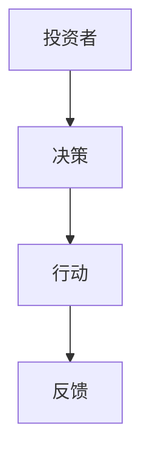
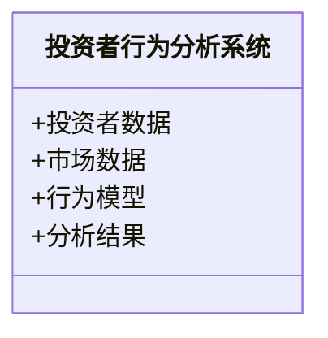
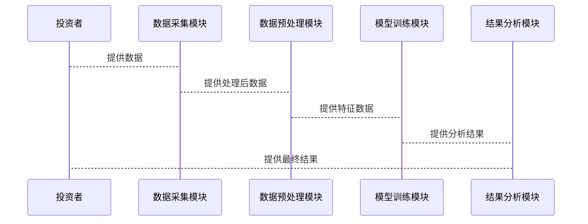

                 


# AI驱动的投资者行为分析

> 关键词：投资者行为分析, AI, 机器学习, 情感分析, 强化学习, 自然语言处理

> 摘要：AI驱动的投资者行为分析通过结合机器学习、自然语言处理和强化学习等技术，分析投资者的行为模式和决策过程，以辅助投资决策。本文从投资者行为分析的背景、核心概念、算法原理、系统架构到项目实战，全面阐述了AI在投资者行为分析中的应用。

---

# 第1章: 投资者行为分析的背景与现状

## 1.1 投资者行为分析的定义与目标

### 1.1.1 投资者行为分析的定义

投资者行为分析（Investor Behavioral Analysis）是研究投资者在金融市场中的决策过程、情绪变化和行为模式的学科。通过对投资者行为的分析，可以揭示其决策背后的规律，从而帮助机构和投资者做出更明智的投资决策。

### 1.1.2 投资者行为分析的目标

- 描述投资者的决策模式
- 预测投资者的行为趋势
- 优化投资策略
- 提高投资收益

### 1.1.3 投资者行为分析的边界与外延

- 边界：投资者的个体行为、交易数据、市场环境
- 外延：宏观经济因素、政策变化、市场结构

## 1.2 AI技术在投资者行为分析中的应用背景

### 1.2.1 传统投资者行为分析的局限性

- 数据量有限
- 分析方法单一
- 难以实时分析

### 1.2.2 AI技术如何解决投资者行为分析的难点

- 处理海量数据
- 实现实时分析
- 提供个性化建议

### 1.2.3 投资者行为分析的技术驱动力

- 大数据技术的发展
- 机器学习算法的进步
- 自然语言处理技术的突破

## 1.3 本章小结

---

# 第2章: AI驱动投资者行为分析的核心概念与联系

## 2.1 投资者行为分析的核心要素

### 2.1.1 投资者情绪分析

- 情绪分类：正面、负面、中性
- 情绪强度：情绪的强烈程度
- 情绪变化：情绪随时间的变化趋势

### 2.1.2 投资者决策模式

- 决策风格：保守型、激进型
- 决策依据：基本面分析、技术分析
- 决策过程：信息收集、分析、决策

### 2.1.3 投资者行为数据特征

- 交易频率
- 交易时间
- 交易金额

## 2.2 AI技术在投资者行为分析中的核心原理

### 2.2.1 机器学习在投资者行为预测中的应用

- 监督学习：预测投资者行为
- 非监督学习：发现投资者行为模式

### 2.2.2 自然语言处理在投资者情绪分析中的应用

- 文本分类：判断文本情绪
- 实体识别：识别投资者行为中的关键实体

### 2.2.3 图神经网络在投资者关系网络中的应用

- 构建投资者关系图
- 分析投资者之间的关系
- 预测投资者行为

## 2.3 投资者行为分析的核心概念对比表

| 对比维度 | 传统投资者行为分析 | AI驱动投资者行为分析 |
|----------|--------------------|----------------------|
| 数据来源 | 历史数据            | 历史数据+实时数据    |
| 分析方法 | 统计分析            | 机器学习+深度学习    |
| 分析速度 | 离线分析            | 实时分析             |

## 2.4 投资者行为分析的实体关系图



## 2.5 本章小结

---

# 第3章: AI驱动投资者行为分析的算法原理

## 3.1 情感分析算法

### 3.1.1 基于词袋模型的情感分析

- 词袋模型：将文本表示为词袋，忽略词序
- 情感分类：使用机器学习模型（如SVM）进行分类

示例代码：
```python
from sklearn.feature_extraction.text import TfidfVectorizer
from sklearn.svm import SVC

# 数据预处理
vectorizer = TfidfVectorizer()
X = vectorizer.fit_transform(texts)
y = [0, 1]  # 0表示负面，1表示正面

# 训练模型
model = SVC()
model.fit(X, y)
```

### 3.1.2 基于深度学习的情感分析

- LSTM网络：处理序列数据
- Transformer：捕捉长距离依赖

数学公式：
$$
\text{LSTM}(x_t) = \text{f}(x_t, \text{state}_{t-1})
$$

### 3.1.3 基于预训练语言模型的情感分析

- 使用BERT、GPT等预训练模型
- 微调模型以适应特定任务

## 3.2 强化学习在投资者决策模拟中的应用

### 3.2.1 强化学习的基本原理

- 状态空间：市场状态、投资者状态
- 行动空间：投资者可能的决策
- 奖励函数：衡量决策的优劣

数学公式：
$$
R(s, a) = \text{奖励函数}
$$

### 3.2.2 在投资者行为模拟中的应用

- 模拟投资者决策过程
- 学习最优投资策略

### 3.2.3 强化学习在投资组合优化中的应用

- 构建投资组合
- 优化风险和收益

## 3.3

---

# 第4章: AI驱动投资者行为分析的系统分析与架构设计

## 4.1 系统功能设计

### 4.1.1 领域模型设计



### 4.1.2 功能模块设计

- 数据采集模块
- 数据预处理模块
- 模型训练模块
- 结果分析模块

## 4.2 系统架构设计

### 4.2.1 分层架构设计

- 数据层
- 业务逻辑层
- 表现层

### 4.2.2 接口设计

- API接口
- 数据接口

### 4.2.3 交互流程图



## 4.3 本章小结

---

# 第5章: AI驱动投资者行为分析的项目实战

## 5.1 环境安装与配置

- 安装Python
- 安装机器学习库（如scikit-learn、TensorFlow）
- 安装NLP库（如NLTK、spaCy）

## 5.2 系统核心实现

### 5.2.1 数据采集

- 从数据库中读取投资者数据
- 从网络爬取市场数据

### 5.2.2 情感分析实现

```python
from textblob import TextBlob

text = "The stock market is expected to rise."
blob = TextBlob(text)
print(blob.sentiment.polarity)  # 输出情感极性
```

### 5.2.3 强化学习实现

```python
import gym

env = gym.make('StockTrading-v0')
state = env.reset()
while True:
    action = env.action_space.sample()  # 随机选择动作
    next_state, reward, done, info = env.step(action)
    if done:
        break
```

### 5.2.4 模型训练与优化

- 使用Keras进行模型构建
- 使用超参数调优优化模型

## 5.3 项目实战案例分析

### 5.3.1 案例背景

- 数据来源：某金融公司投资者数据
- 分析目标：预测投资者行为

### 5.3.2 数据预处理

- 清洗数据
- 特征提取

### 5.3.3 模型训练

- 训练情感分析模型
- 预测投资者行为

### 5.3.4 结果分析

- 评估模型性能
- 调整模型参数

## 5.4 本章小结

---

# 第6章: AI驱动投资者行为分析的最佳实践与小结

## 6.1 最佳实践

- 数据质量：确保数据的准确性和完整性
- 模型选择：根据任务选择合适的模型
- 性能优化：通过调参和优化算法提高性能

## 6.2 小结

AI驱动的投资者行为分析通过结合机器学习、自然语言处理和强化学习等技术，为投资者提供了更精准的行为分析和决策支持。未来，随着技术的进步，投资者行为分析将更加智能化和个性化。

---

# 附录

## 附录A: 数据来源说明

- 公开市场数据
- 机构投资者数据

## 附录B: 工具安装说明

- Python安装
- 库的安装与配置

## 附录C: 代码扩展

- 如何扩展模型功能
- 如何部署模型到生产环境

---

通过以上结构和内容，您可以撰写一篇详细且有深度的《AI驱动的投资者行为分析》技术博客文章。

