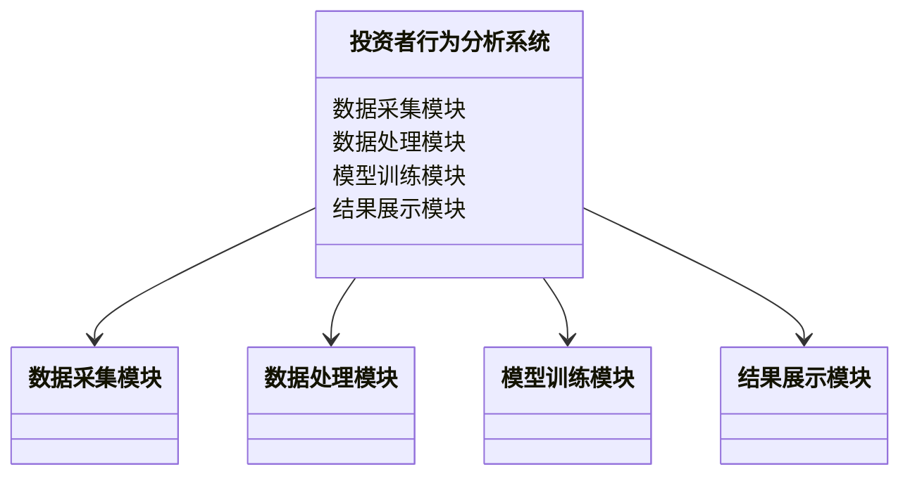
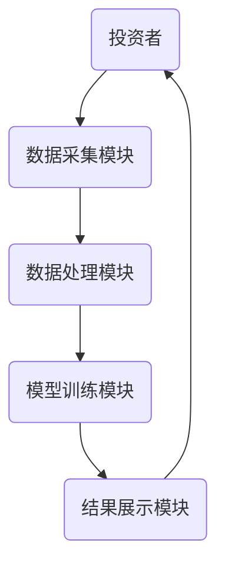
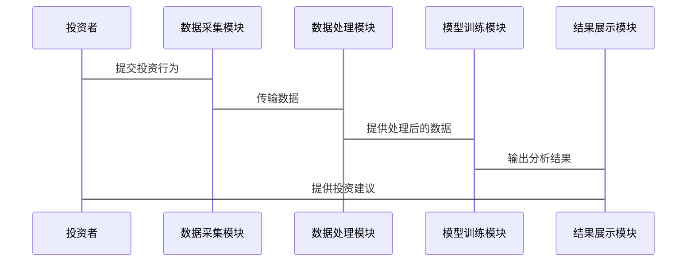

                 


# AI驱动的投资者行为分析平台

> 关键词：投资者行为分析，人工智能，机器学习，LSTM，BERT，强化学习

> 摘要：本文探讨了AI驱动的投资者行为分析平台的构建与应用。通过分析投资者行为的核心概念、算法原理、系统架构及实战案例，展示了如何利用AI技术提升投资决策的效率与准确性。

---

# 第一部分：AI驱动的投资者行为分析平台背景与核心概念

## 第1章：投资者行为分析的背景与问题背景

### 1.1 问题背景与问题描述

#### 1.1.1 投资者行为分析的现状

投资者行为分析是金融领域的重要研究方向。传统分析方法依赖于人工经验，难以应对金融市场数据的复杂性和动态变化。随着AI技术的发展，基于机器学习和深度学习的投资者行为分析逐渐成为研究热点。

#### 1.1.2 传统投资者行为分析的局限性

传统方法存在以下问题：
- 数据处理能力有限，难以应对海量数据。
- 分析结果缺乏实时性，难以捕捉市场波动。
- 模型泛化能力不足，难以适应不同市场环境。

#### 1.1.3 AI驱动的投资者行为分析的必要性

AI技术的应用可以显著提升投资者行为分析的效率和准确性。通过深度学习模型，可以自动提取数据特征，实时预测市场趋势，为投资决策提供科学依据。

### 1.2 问题解决与边界

#### 1.2.1 AI驱动的投资者行为分析的核心问题

- 数据特征提取与行为模式识别。
- 情感分析与情绪预测。
- 行为预测与投资决策优化。

#### 1.2.2 解决方案的边界与外延

- 数据范围：投资者交易记录、市场数据、社交媒体数据。
- 分析范围：短期行为预测、长期趋势分析。
- 应用场景：个人投资者、机构投资者。

#### 1.2.3 平台的核心要素与组成

- 数据采集模块：获取投资者行为数据。
- 数据处理模块：清洗和预处理数据。
- 模型训练模块：构建并训练深度学习模型。
- 结果展示模块：可视化分析结果。

### 1.3 投资者行为分析的概念结构

#### 1.3.1 投资者行为的定义与分类

投资者行为是指投资者在金融市场中的决策过程和交易行为。主要分类包括：
- 风险偏好型：高风险高回报。
- 保守型：低风险低回报。
- 情感驱动型：受情绪影响较大。

#### 1.3.2 数据驱动的投资者行为分析框架

框架包括数据采集、特征提取、模型训练和结果分析四个步骤。

#### 1.3.3 AI驱动的投资者行为分析的创新点

- 引入深度学习技术，提升分析精度。
- 实现实时行为预测，捕捉市场机会。
- 提供个性化投资建议，满足不同需求。

---

## 第2章：核心概念与联系

### 2.1 投资者行为分析的核心概念

#### 2.1.1 数据特征与行为模式

数据特征包括交易频率、资产配置、收益目标等。行为模式则包括贪婪、恐慌、理性等。

#### 2.1.2 情感分析与情绪预测

通过自然语言处理技术，分析投资者的情感倾向，预测市场情绪变化。

#### 2.1.3 行为预测与投资决策

利用机器学习模型，预测投资者的下一步行为，并优化投资策略。

### 2.2 核心概念的属性特征对比

| 概念       | 数据特征 | 情感分析 | 行为预测 |
|------------|----------|----------|----------|
| 数据来源   | 交易记录 | 社交媒体 | 交易数据 |
| 分析目标   | 行为模式 | 情感倾向 | 投资决策 |
| 分析方法   | 特征提取 | 文本挖掘 | 模型预测 |

### 2.3 ER实体关系图

```mermaid
erDiagram
    actor 投资者 {
        <属性> 帐户ID
        <属性> 投资行为
        <属性> 投资决策
    }
    actor 平台 {
        <属性> 平台ID
        <属性> 数据来源
        <属性> 分析结果
    }
    actor 数据源 {
        <属性> 数据类型
        <属性> 数据时间
        <属性> 数据格式
    }
    投资者 --> 平台 : 提交投资行为
    平台 --> 数据源 : 获取数据
    平台 --> 投资者 : 提供分析结果
```

---

## 第3章：算法原理与实现

### 3.1 算法原理

#### 3.1.1 基于LSTM的时间序列分析

LSTM网络擅长处理时间序列数据，能够捕捉长期依赖关系。

#### 3.1.2 基于BERT的情感分析

BERT模型用于分析投资者在社交媒体上的文本情感。

#### 3.1.3 基于强化学习的投资决策模型

强化学习模型通过模拟市场环境，优化投资策略。

### 3.2 算法实现流程

#### 3.2.1 LSTM模型流程

```mermaid
graph TD
    A[数据预处理] --> B[特征提取]
    B --> C[模型训练]
    C --> D[结果预测]
    D -->
```

代码示例：

```python
import numpy as np
from tensorflow.keras import layers

# 定义LSTM模型
model = tf.keras.Sequential()
model.add(layers.LSTM(64, input_shape=(timesteps, features)))
model.add(layers.Dense(1))
model.compile(optimizer='adam', loss='mean_squared_error')
```

#### 3.2.2 BERT模型流程

代码示例：

```python
import transformers

# 加载预训练的BERT模型
tokenizer = transformers.BertTokenizer.from_pretrained('bert-base-uncased')
model = transformers.BertForSequenceClassification.from_pretrained('bert-base-uncased')
```

### 3.3 数学模型与公式

#### LSTM模型结构

$$
f(t) = \sigma(w_f x_t + u_{t-1} + b_f)
$$

#### BERT模型输入

$$
X = \{x_1, x_2, ..., x_n\}
$$

---

## 第4章：系统分析与架构设计

### 4.1 系统功能设计

#### 4.1.1 领域模型类图



### 4.2 系统架构设计

#### 4.2.1 系统架构图



### 4.3 接口与交互流程图



---

## 第5章：项目实战

### 5.1 环境安装与代码实现

#### 5.1.1 环境安装

安装Python和必要的库：

```bash
pip install numpy pandas tensorflow transformers
```

#### 5.1.2 核心代码实现

LSTM模型实现：

```python
import numpy as np
from tensorflow.keras import layers

# 定义LSTM模型
model = tf.keras.Sequential()
model.add(layers.LSTM(64, input_shape=(timesteps, features)))
model.add(layers.Dense(1))
model.compile(optimizer='adam', loss='mean_squared_error')
```

BERT情感分析实现：

```python
import transformers

# 加载预训练的BERT模型
tokenizer = transformers.BertTokenizer.from_pretrained('bert-base-uncased')
model = transformers.BertForSequenceClassification.from_pretrained('bert-base-uncased')
```

---

## 第6章：最佳实践与总结

### 6.1 小结与注意事项

- 数据质量对分析结果影响重大。
- 模型需要定期更新以适应市场变化。
- 保护投资者隐私，确保数据安全。

### 6.2 扩展阅读与参考文献

- 《深度学习》—— Ian Goodfellow
- 《自然语言处理入门》—— Jurafsky
- 《强化学习》—— Sutton & Barto

---

通过以上步骤，您可以构建一个功能强大的AI驱动的投资者行为分析平台，利用先进的AI技术提升投资决策的效率与准确性。

