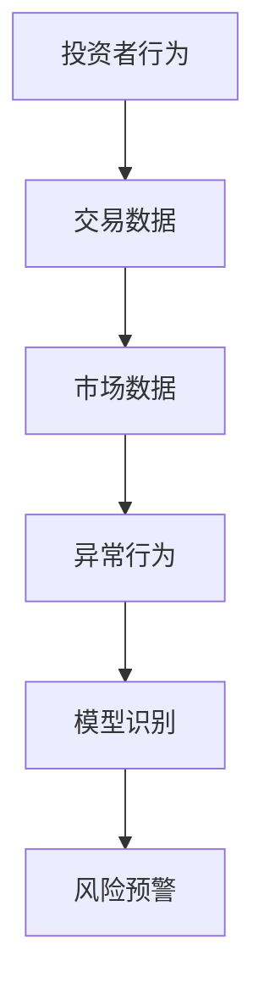
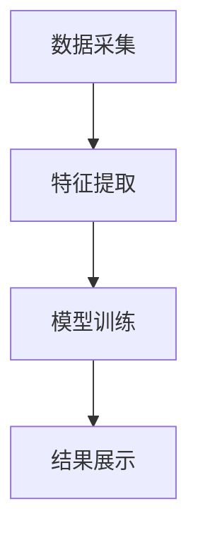
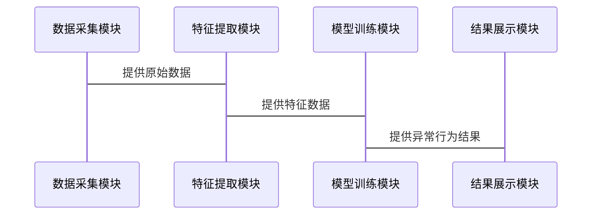

                 


# AI驱动的投资者行为异常识别

## 关键词：AI技术、投资者行为、异常识别、机器学习、深度学习、金融分析

## 摘要：  
本文探讨了利用AI技术进行投资者行为异常识别的方法，从问题背景、核心概念到算法原理、系统架构，再到实际案例，全面分析了如何利用AI技术来识别投资者的异常行为，为金融市场的风险管理提供了新的思路。

---

# 第一部分: AI驱动的投资者行为异常识别背景与基础

## 第1章: 投资者行为异常识别的背景与问题

### 1.1 问题背景

#### 1.1.1 金融市场中的投资者行为分析
金融市场的参与者（如投资者、交易员）的行为对市场波动有重要影响。投资者的行为数据通常包括交易频率、交易金额、时间分布、资产选择偏好等。通过分析这些数据，可以识别投资者的行为模式。

#### 1.1.2 投资者行为异常识别的必要性
异常行为识别是金融市场风险管理的重要环节。例如：
- **欺诈行为**：如操纵市场、内幕交易等。
- **异常交易行为**：如突然的大额交易、高频交易异常集中等。
- **情绪化交易**：投资者因情绪波动导致的非理性交易行为。
及时识别这些异常行为，有助于监管部门采取措施，维护市场稳定。

#### 1.1.3 AI技术在金融分析中的应用现状
AI技术（如机器学习、深度学习）在金融分析中的应用越来越广泛。AI能够处理大量非结构化数据（如新闻、社交媒体数据），并结合结构化数据（如交易数据）进行分析，帮助识别投资者行为中的异常模式。

---

### 1.2 问题描述

#### 1.2.1 投资者行为的多样性与复杂性
投资者行为受多种因素影响，如市场环境、个人情绪、投资目标等。不同投资者可能表现出不同的交易模式，例如：
- **长期投资者**：注重资产配置，交易频率低。
- **短期交易者**：频繁买卖，关注短期价格波动。

#### 1.2.2 异常行为的定义与分类
异常行为的定义可能因场景而异，例如：
- **交易量突增**：短时间内交易量远超正常水平。
- **价格敏感性异常**：对价格波动的反应与历史模式不符。
- **时间模式异常**：交易时间集中在非正常时段。

#### 1.2.3 异常行为识别的挑战与难点
- 数据质量：金融市场数据可能包含噪声。
- 数据维度：需要处理多维度数据（如交易数据、市场数据、情绪数据）。
- 模型泛化能力：需要模型能够适应不同类型的异常行为。

---

### 1.3 问题解决思路

#### 1.3.1 数据驱动的异常识别方法
基于数据驱动的方法，通过分析历史数据，识别正常行为的模式，并检测偏离这些模式的行为。

#### 1.3.2 AI技术在异常识别中的优势
AI技术能够处理大量数据，并通过特征提取和模型训练，识别复杂的行为模式。例如：
- **无监督学习**：用于发现隐藏的异常模式。
- **监督学习**：基于标注数据，训练分类模型识别异常行为。

#### 1.3.3 端到端解决方案的设计思路
1. 数据采集：收集投资者行为数据（如交易记录、市场数据）。
2. 数据预处理：清洗数据，提取特征。
3. 模型训练：使用机器学习或深度学习算法训练模型。
4. 模型部署：将模型部署到实时监控系统中，识别异常行为。

---

### 1.4 边界与外延

#### 1.4.1 异常行为识别的边界条件
- 数据范围：仅限于投资者行为数据，不考虑外部事件（如市场新闻）的影响。
- 时间范围：可能仅关注短时间窗口内的行为异常。

#### 1.4.2 相关领域的区别与联系
- **异常检测**：与入侵检测、网络流量分析等领域的技术有共通之处。
- **行为分析**：与用户行为分析（如欺诈检测）有相似性。

#### 1.4.3 技术与业务的结合点
- 技术：AI算法、大数据处理。
- 业务：金融市场风险管理、合规性检查。

---

### 1.5 核心要素与概念结构

#### 1.5.1 核心要素分析
- **数据**：投资者行为数据、市场数据。
- **模型**：用于识别异常行为的AI模型。
- **场景**：金融市场中的异常行为识别场景。

#### 1.5.2 概念结构图


#### 1.5.3 核心要素的特征对比表
| 特征 | 正常行为 | 异常行为 |
|------|----------|----------|
| 交易频率 | 稳定 | 突然增加 |
| 交易时间 | 集中于交易时段 | 非交易时段集中 |
| 交易金额 | 正常波动 | 突然突增 |

---

## 第2章: 核心概念与联系

### 2.1 投资者行为分析的基本原理

#### 2.1.1 行为数据的采集与处理
- 数据来源：交易记录、市场数据、投资者调查问卷等。
- 数据预处理：清洗、归一化、特征提取。

#### 2.1.2 行为特征的提取方法
- 时间特征：交易时间间隔、交易频率。
- 金额特征：交易金额、累计金额。
- 行为模式特征：交易序列、资产配置比例。

#### 2.1.3 行为模式的识别技术
- 聚类分析：识别交易模式相似的投资者群体。
- 序列分析：识别交易时间序列中的异常模式。

---

### 2.2 异常识别的核心原理

#### 2.2.1 异常检测的定义与分类
- 定义：识别偏离正常模式的数据点。
- 分类：基于统计（如均值、标准差）、基于机器学习（如聚类、深度学习）。

#### 2.2.2 基于统计的方法
- 常见方法：Z-score、孤立森林。
- 示例：检测交易金额的标准差偏离正常范围。

#### 2.2.3 基于机器学习的方法
- 常见方法：聚类（K-means）、分类（随机森林）。
- 示例：使用聚类算法发现交易模式的异常群体。

---

### 2.3 AI技术的基本原理

#### 2.3.1 机器学习的核心概念
- 监督学习：分类问题（正常/异常）。
- 无监督学习：聚类问题。

#### 2.3.2 深度学习的基本原理
- 常见模型：LSTM、Transformer。
- 示例：使用LSTM分析时间序列数据中的异常行为。

#### 2.3.3 强化学习的应用场景
- 示例：用于交易策略优化，间接识别异常行为。

---

## 第3章: 核心概念的原理与联系

### 3.1 投资者行为分析的数学模型

#### 3.1.1 聚类分析
- 算法：K-means。
- 公式：$$ \text{距离} = \sqrt{\sum (x_i - \mu_j)^2} $$
- 示例：将投资者分为不同的交易模式群体。

#### 3.1.2 分类分析
- 算法：随机森林。
- 公式：$$ P(y|x) = \prod_{i=1}^n P(x_i|y)P(y) $$
- 示例：根据交易特征分类投资者行为。

---

### 3.2 异常检测的算法原理

#### 3.2.1 基于统计的异常检测
- 公式：$$ Z = \frac{x - \mu}{\sigma} $$
- 示例：检测交易金额的标准差异常。

#### 3.2.2 基于机器学习的异常检测
- 算法：孤立森林。
- 公式：$$ \text{异常分数} = 1 - \frac{\text{叶节点数}}{\text{树高度}} $$
- 示例：识别交易时间序列中的异常点。

---

### 3.3 AI技术在投资者行为分析中的应用

#### 3.3.1 机器学习在行为模式识别中的应用
- 示例：使用聚类算法识别交易模式的异常群体。

#### 3.3.2 深度学习在时间序列分析中的应用
- 示例：使用LSTM分析交易时间序列中的异常行为。

---

## 第4章: 系统分析与架构设计

### 4.1 系统功能设计

#### 4.1.1 数据采集模块
- 功能：采集投资者行为数据（如交易记录、市场数据）。

#### 4.1.2 特征提取模块
- 功能：提取投资者行为特征（如交易金额、时间间隔）。

#### 4.1.3 模型训练模块
- 功能：训练AI模型，识别异常行为。

#### 4.1.4 结果展示模块
- 功能：展示异常行为识别结果，提供风险预警。

---

### 4.2 系统架构设计



---

### 4.3 系统接口设计

#### 4.3.1 数据接口
- 输入：投资者行为数据。
- 输出：特征提取结果。

#### 4.3.2 模型接口
- 输入：特征数据。
- 输出：异常行为识别结果。

---

### 4.4 系统交互流程



---

## 第5章: 项目实战

### 5.1 环境搭建

#### 5.1.1 安装Python
```bash
python --version
pip install --upgrade pip
```

#### 5.1.2 安装机器学习库
```bash
pip install numpy scikit-learn
```

---

### 5.2 核心代码实现

#### 5.2.1 数据预处理
```python
import numpy as np
import pandas as pd

# 加载数据
data = pd.read_csv('investor_behavior.csv')

# 数据清洗
data.dropna()
```

#### 5.2.2 模型训练
```python
from sklearn.cluster import KMeans

# 特征提取
features = data[['交易金额', '交易时间间隔']]
features = features.values

# 聚类模型
model = KMeans(n_clusters=2)
model.fit(features)
```

---

### 5.3 案例分析与结果解读

#### 5.3.1 案例分析
- 数据：某投资者在一段时间内的交易记录。
- 分析：识别交易金额突增的异常行为。

#### 5.3.2 结果解读
- 聚类结果：识别出一个异常交易群体。
- 风险预警：触发异常行为预警机制。

---

## 第6章: 最佳实践与小结

### 6.1 最佳实践

#### 6.1.1 数据质量
- 确保数据的完整性和准确性。

#### 6.1.2 模型选择
- 根据具体场景选择合适的算法。

#### 6.1.3 系统监控
- 实时监控模型性能，及时调整参数。

---

### 6.2 小结

本文详细介绍了AI技术在投资者行为异常识别中的应用，从问题背景、核心概念到算法原理、系统设计，再到实际案例，全面分析了如何利用AI技术识别投资者的异常行为。通过本文的学习，读者可以掌握投资者行为分析的基本方法，并能够实际应用AI技术解决相关问题。

---

### 6.3 注意事项

- 数据隐私：投资者行为数据可能包含敏感信息，需注意数据隐私保护。
- 模型解释性：确保模型的可解释性，便于实际应用中的调整和优化。
- 实时性：异常行为识别需要实时性，对系统性能要求较高。

---

### 6.4 拓展阅读

- **书籍**：《机器学习实战》、《深度学习》。
- **论文**：相关领域的学术论文（如异常检测、行为分析）。
- **工具**：学习使用TensorFlow、PyTorch等深度学习框架。

---

通过本文的学习，读者可以深入了解AI技术在投资者行为异常识别中的应用，并能够实际应用这些技术解决相关问题。

