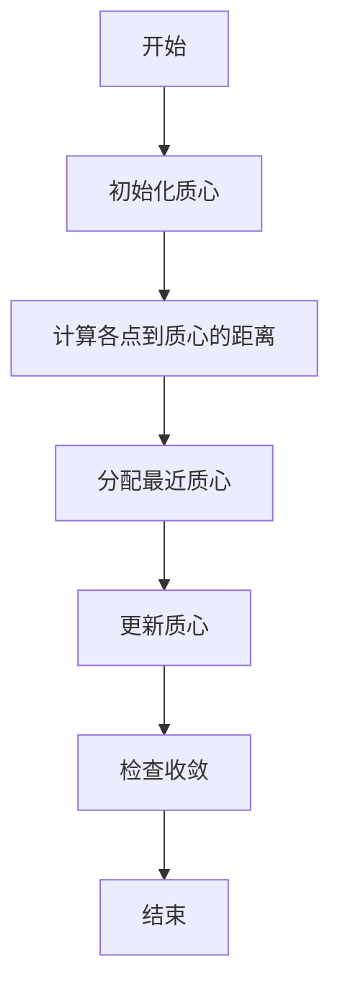
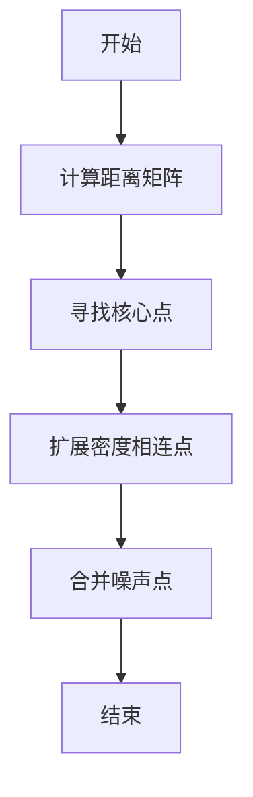
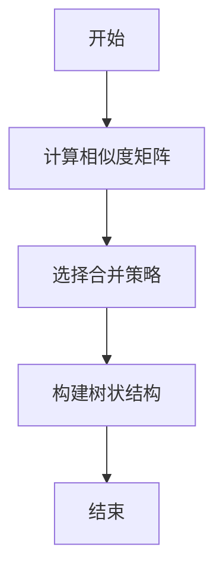
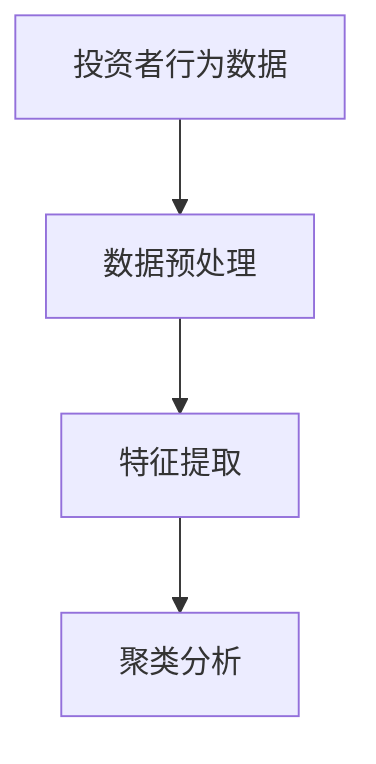
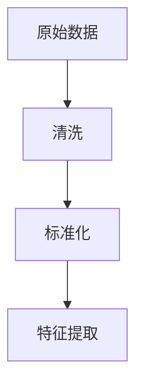

                 


# AI驱动的投资者行为模式聚类分析

## 关键词：AI驱动，投资者行为模式，聚类分析，机器学习，数据挖掘

## 摘要：本文通过AI技术深入分析投资者行为模式，结合聚类分析方法，探讨如何识别和分类投资者行为，为投资策略优化提供数据支持。

---

# 第1章: 背景介绍与问题背景

## 1.1 投资者行为分析的必要性

### 1.1.1 投资者行为分析的定义

投资者行为分析是指研究投资者在不同市场条件下的决策过程、交易模式和投资策略，旨在理解其行为背后的心理、情绪和理性因素。

### 1.1.2 传统投资者行为分析的局限性

传统分析依赖于问卷调查和统计分析，存在主观性和样本局限性，难以捕捉实时行为数据和复杂模式。

### 1.1.3 AI驱动分析的优势

AI技术利用大数据分析和机器学习，能够实时处理大量数据，发现传统方法难以识别的隐性模式。

## 1.2 问题描述与目标

### 1.2.1 投资者行为模式的复杂性

投资者行为受多因素影响，包括市场波动、个人情绪和宏观经济指标，导致行为模式复杂多样。

### 1.2.2 聚类分析在投资者行为研究中的作用

聚类分析能够将相似行为模式的投资者归类，帮助识别典型行为特征和投资策略。

### 1.2.3 本书的研究目标

通过AI驱动的聚类分析，探索投资者行为模式的分类方法，为投资策略优化和风险控制提供支持。

---

# 第2章: 核心概念与联系

## 2.1 聚类分析的基本原理

### 2.1.1 聚类分析的定义

聚类分析是将数据点分成若干组，使组内相似度最大化，组间差异度最大化。

### 2.1.2 聚类分析的类型

- 划分型：将数据分成非重叠子集。
- 层次型：逐步合并或分割数据点形成层次结构。
- 模糊型：处理数据的不确定性。

### 2.1.3 聚类分析的关键步骤

1. 数据预处理：清洗和标准化数据。
2. 特征选择：提取关键特征。
3. 选择算法：根据数据特点选择合适算法。
4. 模型训练：应用算法进行聚类。
5. 结果分析：评估聚类效果。

## 2.2 投资者行为模式的特征

### 2.2.1 行为数据的特征

| 特征     | 描述                     |
|----------|--------------------------|
| 交易频率 | 每日交易次数             |
| 交易时间 | 集中交易时段             |
| 交易金额 | 单笔交易金额             |
| 操作类型 | 股票、基金、债券等       |
| 情绪指标 | 市场情绪指数             |

### 2.2.2 不同投资者类型的行为模式

#### 抢手交易者
- 高交易频率，快速反应市场变化，追求短期收益。
- 行为特征：频繁买卖，单笔交易金额小，交易时间分散。

#### 长期投资者
- 低交易频率，长期持有，关注基本面。
- 行为特征：单笔金额大，交易时间集中。

#### 普通投资者
- 中等交易频率，操作类型多样，情绪波动较大。
- 行为特征：交易时间不固定，金额适中。

### 2.2.3 行为模式与投资结果的关系

行为模式影响投资结果，如高交易者可能面临交易成本增加和市场冲击，长期投资者更注重资产配置和风险控制。

## 2.3 核心概念的ER实体关系图

```mermaid
erDiagram
    投资者行为模式 o-|{投资者} 投资者
    投资者行为模式 o-|{交易记录} 交易记录
    交易记录 -->|{交易时间} 时间戳
    交易记录 -->|{交易金额} 金额
```

---

# 第3章: 算法原理与数学模型

## 3.1 聚类分析的算法选择

### 3.1.1 K-means算法

K-means算法通过迭代优化质心位置，将数据点划分到最近质心的组别中。



### 3.1.2 DBSCAN算法

DBSCAN基于密度和距离概念，识别高密度区域为簇。



### 3.1.3 层次聚类算法

层次聚类通过构建树状结构，逐步合并或分割数据点。



## 3.2 聚类分析的数学模型

### 3.2.1 距离度量

使用欧氏距离公式：

$$ d(x,y) = \sqrt{(x_1 - y_1)^2 + (x_2 - y_2)^2} $$

### 3.2.2 聚类评估指标

- 内部评估指标：轮廓系数（silhouette coefficient）。
- 外部评估指标：调整兰德指数（adjusted Rand index）。

### 3.2.3 聚类算法的收敛性分析

质心更新公式：

$$ c_i^{new} = \frac{1}{k_i} \sum_{x_j \in C_i} x_j $$

其中，$k_i$是簇$i$中的数据点数量。

---

# 第4章: 系统分析与架构设计

## 4.1 项目介绍与目标

### 4.1.1 项目背景

随着金融市场的数据化，投资者行为分析需求日益增长。

### 4.1.2 项目目标

开发AI驱动的投资者行为分析系统，提供实时数据处理和行为模式识别功能。

## 4.2 系统功能设计

### 4.2.1 数据采集模块

#### 功能描述

- 收集交易记录、市场数据和投资者信息。

#### 数据流图



### 4.2.2 数据预处理模块

#### 功能描述

- 清洗数据，处理缺失值和异常值。

#### 数据处理流程



## 4.3 系统架构设计

### 4.3.1 系统架构图

```mermaid
subgraph 数据处理层
    A[数据采集] --> B[数据预处理]
end

subgraph 分析层
    C[聚类分析] --> D[结果存储]
end

A --> B --> C --> D
```

---

# 第5章: 项目实战

## 5.1 环境安装

### 安装Python和机器学习库

```bash
pip install numpy pandas scikit-learn
```

## 5.2 核心算法实现

### K-means算法实现

```python
from sklearn.cluster import KMeans
from sklearn.preprocessing import StandardScaler
import numpy as np

# 数据预处理
scaler = StandardScaler()
X_scaled = scaler.fit_transform(X)

# 模型训练
kmeans = KMeans(n_clusters=3, random_state=42)
kmeans.fit(X_scaled)

# 获取聚类结果
labels = kmeans.labels_
centroids = kmeans.cluster_centers_
```

### 聚类结果分析

将交易数据分为三类，分析各类的交易频率和金额分布，识别不同类型投资者的行为特征。

## 5.3 实际案例分析

#### 案例背景

某投资平台的交易数据，包括用户的交易记录和市场指标。

#### 数据预处理

清洗数据，处理缺失值和异常值。

#### 聚类分析

使用K-means算法将用户分为三类：抢手交易者、长期投资者和普通投资者。

#### 结果解读

- 抢手交易者：高频交易，金额小，适合短期操作。
- 长期投资者：低频交易，金额大，适合长期持有。
- 普通投资者：交易频率和金额中等，情绪波动较大，风险承受能力较低。

---

# 第6章: 总结与展望

## 6.1 最佳实践 tips

- 数据质量是关键，确保数据清洗和预处理。
- 选择合适的算法和参数，提高聚类效果。
- 结合领域知识，优化特征选择和结果解释。

## 6.2 小结

本文通过AI驱动的聚类分析，识别投资者行为模式，为投资策略优化提供数据支持。

## 6.3 注意事项

- 数据隐私保护，遵守相关法律法规。
- 聚类结果需结合市场环境和投资者心理进行解释。
- 模型需定期更新，适应市场变化。

## 6.4 拓展阅读

- 《机器学习实战》
- 《数据挖掘导论》
- 《投资者行为分析》

---

# 结语

通过AI驱动的投资者行为模式聚类分析，投资者可以更好地理解市场行为，制定科学的投资策略，降低投资风险。未来，随着技术的发展，AI在金融领域的应用将更加广泛和深入。

