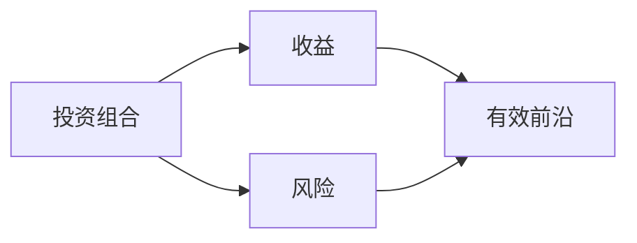

                 


# AI驱动的私募股权投资组合构建

## 关键词：
私募股权投资, 人工智能, 组合优化, 机器学习, 风险管理, 投资策略

## 摘要：
本文探讨了人工智能在私募股权投资组合构建中的应用，结合现代投资组合理论和机器学习算法，分析了如何利用AI优化投资组合。通过实际案例和系统架构设计，展示了AI驱动的私募股权投资在提高收益、降低风险方面的优势，并展望了未来的发展方向。

---

## 第一部分: AI驱动的私募股权投资组合构建基础

### 第1章: 私募股权投资与AI驱动的概述

#### 1.1 私募股权投资的基本概念

##### 1.1.1 私募股权投资的定义
私募股权投资（Private Equity Investment，简称PE）是指对未上市公司进行投资，并通过改善管理和提升业绩，以期在较长时期内实现价值增值的投资行为。与公开市场投资不同，PE投资通常涉及更复杂的战略、更长的时间跨度以及更高的风险与收益。

##### 1.1.2 私募股权投资的核心要素

| 要素 | 描述 |
|------|------|
| 投资目标 | 通过收购、重组和优化，实现资本增值 |
| 投资期限 | 长期投资，通常5-10年 |
| 投资策略 | 包括成长型、杠杆收购、困境投资等 |
| 投资对象 | 私有企业，涵盖不同行业和规模 |

##### 1.1.3 私募股权投资的市场现状与趋势

- **现状**：全球PE市场规模庞大，2022年全球PE管理资产规模超过5万亿美元。
- **趋势**：随着技术进步，AI在PE中的应用越来越广泛，特别是在组合优化和风险控制方面。

#### 1.2 AI在金融领域的应用

##### 1.2.1 AI在金融中的主要应用领域

| 领域 | 描述 |
|------|------|
| 交易策略 | 利用算法交易提高收益 |
| 风险管理 | 通过AI模型预测和控制风险 |
| 客户服务 | 利用聊天机器人提供个性化服务 |

##### 1.2.2 AI在私募股权投资中的优势

| 优势 | 描述 |
|------|------|
| 数据处理能力 | 处理海量数据，发现投资机会 |
| 模型优化 | 利用机器学习优化投资组合 |
| 风险控制 | 通过AI实时监控和预警风险 |

##### 1.2.3 AI驱动PE投资的必要性

- **数据驱动决策**：PE投资需要大量数据支持决策，AI能够高效处理和分析这些数据。
- **提高效率**：AI可以自动化完成许多繁琐的任务，如数据分析、组合优化等。
- **降低风险**：通过AI模型预测市场趋势和潜在风险，帮助投资者做出更明智的决策。

#### 1.3 本章小结

本章介绍了私募股权投资的基本概念和AI在金融领域的应用，强调了AI在PE投资中的重要性。通过数据处理能力、模型优化和风险控制的优势，AI能够显著提升PE投资的效率和效果。

---

### 第2章: 投资组合理论与有效前沿

#### 2.1 现代投资组合理论（MPT）

##### 2.1.1 MPT的核心思想

现代投资组合理论由Harry Markowitz提出，认为最优投资组合是那些在给定风险水平下提供最高预期收益的组合，或者在给定收益水平下具有最低风险的组合。

##### 2.1.2 风险与收益的权衡

投资组合的收益与风险之间存在权衡关系，即收益越高，风险越大。MPT通过有效前沿的概念，找到最优的风险-收益平衡点。

##### 2.1.3 有效前沿的定义与计算

**有效前沿**是指在所有可能的投资组合中，收益与风险的最佳组合。通过优化算法，计算有效前沿需要考虑多个因素，包括资产的预期收益、方差、协方差等。



#### 2.2 风险调整后的收益与组合优化

##### 2.2.1 风险调整后的收益计算

$$ Sharpe Ratio = \frac{E[r_i - r_f]}{\sigma_i} $$

其中，\( E[r_i - r_f] \) 是资产i的超额收益的期望值，\( \sigma_i \) 是其标准差。

##### 2.2.2 组合优化的数学模型

$$ \min_{w} \frac{1}{2} w^T \Sigma w $$
$$ \text{s.t.} \quad w^T \mu = \text{target return} $$

其中，\( w \) 是投资权重向量，\( \Sigma \) 是协方差矩阵，\( \mu \) 是收益向量。

##### 2.2.3 有效前沿的构建与应用

有效前沿的构建需要考虑多种风险调整后的收益指标，如夏普比率、特雷纳比率等。通过优化算法（如均值-方差优化），可以构建有效前沿，并用于指导投资决策。

#### 2.3 私募股权特有的组合构建因素

##### 2.3.1 私募股权的流动性溢价

由于私募股权的流动性较低，通常会有流动性溢价。这可以通过调整资产权重或引入流动性因子来优化组合。

##### 2.3.2 私募股权的J曲线效应

J曲线效应是指私募股权的收益在前期较低，后期突然上升的现象。这需要在组合构建中考虑时间维度和资产生命周期。

##### 2.3.3 私募股权的期限溢价

期限溢价是指由于私募股权的较长持有期，投资者要求的额外收益。在组合优化时，需要考虑期限溢价对整体收益的影响。

#### 2.4 本章小结

本章介绍了现代投资组合理论（MPT）以及如何应用于私募股权投资组合构建。通过有效前沿的概念，结合私募股权特有的因素，如流动性溢价和J曲线效应，可以更好地优化投资组合。

---

### 第3章: AI算法与组合优化

#### 3.1 回归分析与因子模型

##### 3.1.1 线性回归的基本原理

线性回归用于预测因变量与一个或多个自变量之间的关系。在PE投资中，可以用于预测资产收益与市场因子之间的关系。

##### 3.1.2 因子模型的构建与应用

因子模型（如Fama-French三因子模型）用于解释资产收益的来源。通过因子分析，可以构建因子投资组合，优化收益与风险。

##### 3.1.3 因子分析在PE组合优化中的应用

通过因子分析，可以识别影响PE收益的关键因素，并据此调整投资组合。

#### 3.2 聚类分析与投资策略

##### 3.2.1 聚类分析的基本原理

聚类分析将相似的资产或投资机会归为一类，用于制定差异化的投资策略。

##### 3.2.2 聚类分析在PE中的应用

在PE中，聚类分析可用于识别具有相似特征的投资目标，帮助投资者制定更有针对性的投资策略。

##### 3.2.3 基于聚类的PE组合优化策略

通过聚类分析，可以将资产分为不同类别，并根据类别特征进行组合优化。

#### 3.3 强化学习与组合优化

##### 3.3.1 强化学习的基本原理

强化学习通过智能体与环境的交互，学习最优策略。在PE组合优化中，可以用于动态调整投资组合。

##### 3.3.2 强化学习在PE组合优化中的应用

通过强化学习算法，可以动态优化投资组合，适应市场变化。

#### 3.4 本章小结

本章介绍了几种常用的AI算法及其在PE组合优化中的应用，包括回归分析、聚类分析和强化学习。这些算法可以帮助投资者更高效地优化投资组合，提高收益并降低风险。

---

### 第4章: 系统架构与实现

#### 4.1 系统架构设计

##### 4.1.1 系统功能模块

| 模块 | 描述 |
|------|------|
| 数据获取 | 获取私募股权数据 |
| 特征工程 | 构建投资组合的特征 |
| 模型训练 | 训练AI模型 |
| 组合优化 | 优化投资组合 |
| 风险监控 | 监控投资风险 |

##### 4.1.2 系统架构图


#### 4.2 系统实现细节

##### 4.2.1 数据获取与预处理

数据获取模块负责从多个数据源获取私募股权数据，并进行清洗和预处理。

##### 4.2.2 特征工程

特征工程模块负责构建投资组合的特征，包括市场因子、公司基本面因子等。

##### 4.2.3 模型训练

模型训练模块利用机器学习算法（如回归分析、聚类分析）构建预测模型。

##### 4.2.4 组合优化

组合优化模块利用优化算法（如均值-方差优化）优化投资组合。

##### 4.2.5 风险监控

风险监控模块实时监控投资组合的风险，并根据市场变化进行调整。

#### 4.3 本章小结

本章详细介绍了AI驱动的私募股权投资组合构建系统的架构与实现细节，强调了各个模块的功能和交互关系。

---

### 第5章: 项目实战

#### 5.1 环境配置

- **Python版本**：3.8+
- **依赖库**：pandas、numpy、scikit-learn、matplotlib

#### 5.2 数据处理与特征工程

```python
import pandas as pd
import numpy as np

# 数据获取与预处理
data = pd.read_csv('pe_data.csv')
data = data.dropna()
```

#### 5.3 模型实现

```python
from sklearn.linear_model import LinearRegression

# 因子分析
model = LinearRegression()
model.fit(X, y)
```

#### 5.4 组合优化

```python
from scipy.optimize import minimize

# 均值-方差优化
def objective_function(weights, returns, cov_matrix):
    return (weights.T @ returns) - 1  # 约束收益为1

weights = minimize(objective_function, np.array([1/len(returns)]*len(returns)), 
                   method='SLSQP', bounds=weights_bounds).x
```

#### 5.5 风险监控

```python
import matplotlib.pyplot as plt

# 风险监控
returns = pd.Series(weights @ data.returns)
risk = returns.std()
plt.hist(returns, bins=20)
plt.title('Risk Distribution')
plt.show()
```

#### 5.6 本章小结

本章通过实际案例展示了如何利用AI驱动的私募股权投资组合构建系统，从数据处理到模型实现，再到组合优化和风险监控，提供了完整的实现步骤。

---

## 第六部分: 小结与展望

### 6.1 本章小结

本文详细介绍了AI驱动的私募股权投资组合构建的理论基础、算法原理、系统架构和实战项目，展示了如何利用AI技术优化投资组合。

### 6.2 未来展望

未来，随着AI技术的不断发展，私募股权投资组合构建将更加智能化和自动化。强化学习和图神经网络等新技术的应用将进一步提升投资组合的优化效果和风险控制能力。

---

## 关键词索引

- 私募股权投资
- 人工智能
- 组合优化
- 机器学习
- 风险管理
- 投资策略

---

通过以上结构和内容，本文系统地介绍了AI驱动的私募股权投资组合构建的各个方面，为投资者和相关从业者提供了理论和实践的双重指导。

