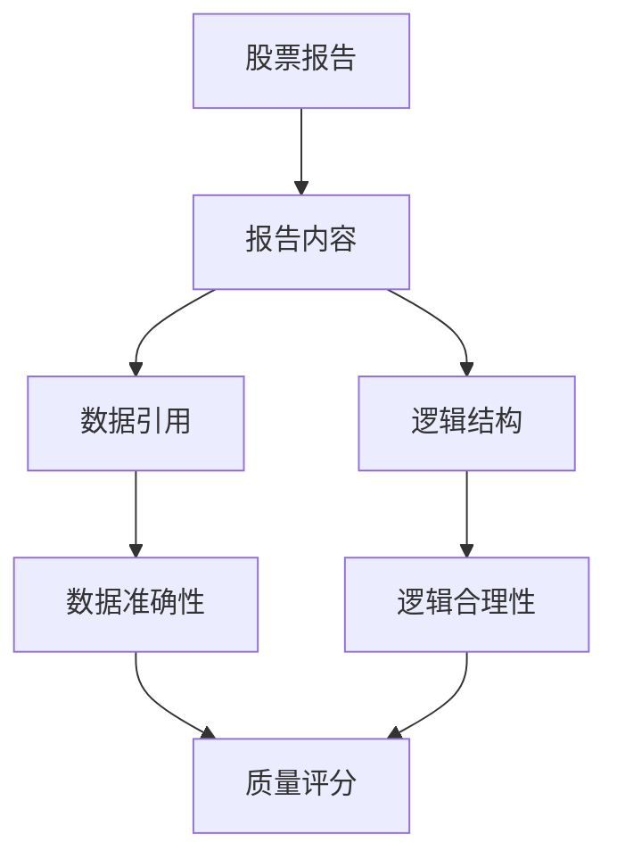
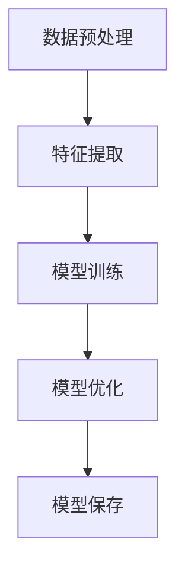
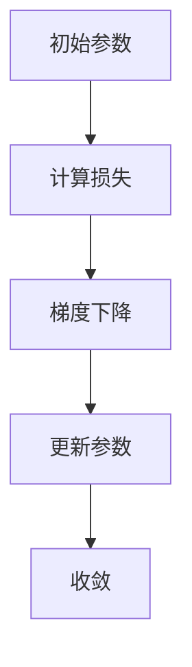
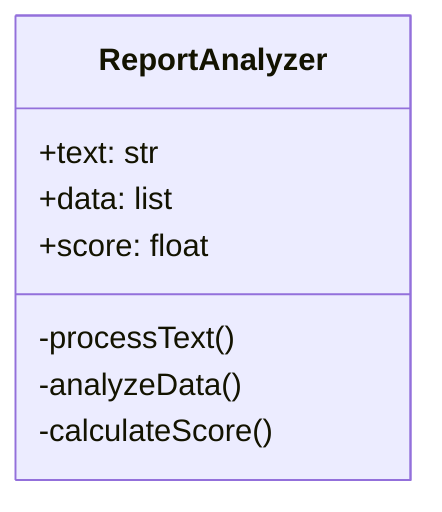
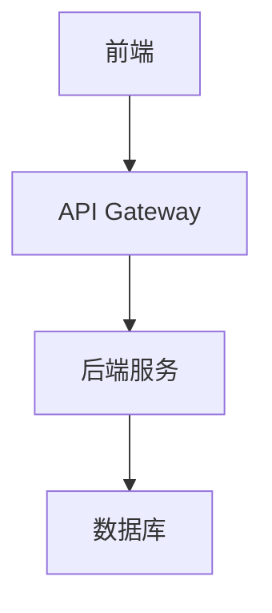

                 


# AI驱动的股票分析师报告质量评估

> 关键词：AI，股票分析师，报告质量，评估模型，金融数据分析，机器学习

> 摘要：本文探讨如何利用AI技术评估股票分析师报告的质量，涵盖背景分析、核心概念、算法原理、系统设计、项目实现和最佳实践，提供详细的理论与实践指导。

---

## 第一部分: 背景与核心概念

### 第1章: 问题背景与问题描述

#### 1.1 问题背景
股票市场的复杂性和不确定性使得投资者高度依赖专业分析师的报告。然而，分析师报告的质量参差不齐，传统评估方法存在主观性和效率低下问题。AI技术的应用为解决这一问题提供了新思路。

#### 1.2 问题描述
- **定义**: 报告质量评估是对分析师报告的准确性、逻辑性和可读性进行量化评价。
- **评估维度**: 包括内容准确性、数据完整性、逻辑合理性、语言清晰度等。
- **目标**: 通过AI模型实现自动、客观、高效的报告质量评估。

#### 1.3 解决方案
AI技术，特别是自然语言处理和机器学习，可用于自动化评估报告质量。通过分析报告的文本内容、数据支持和逻辑结构，AI模型可以提供量化评分和改进建议。

### 第2章: 核心概念与联系

#### 2.1 AI驱动的评估模型
- **输入**: 文本内容、数据引用、逻辑结构。
- **输出**: 质量评分、改进建议。
- **模型特点**: 结构化处理文本，量化评估指标。

#### 2.2 概念对比表
| 模型类型 | 输入数据 | 输出结果 | 优点 | 缺点 |
|----------|----------|----------|------|------|
| 基于规则 | 文本、数据 | 评分 | 易实现 | 依赖规则库 |
| 基于机器学习 | 文本、数据 | 评分 | 高准确性 | 需大量数据 |
| 基于深度学习 | 文本、数据 | 评分 | 高精度 | 计算资源需求高 |

#### 2.3 实体关系图


---

## 第二部分: 算法原理与数学模型

### 第3章: 算法原理讲解

#### 3.1 模型训练流程


#### 3.2 核心算法实现
```python
def preprocess(text):
    # 文本预处理代码
    return processed_text

def train_model(X, y):
    # 训练模型代码
    return model

def evaluate_model(model, X_test, y_test):
    # 模型评估代码
    return scores
```

### 第4章: 数学模型与公式

#### 4.1 损失函数
$$ L = \sum_{i=1}^{n}(y_i - \hat{y_i})^2 $$

#### 4.2 优化算法


---

## 第三部分: 系统分析与架构设计

### 第5章: 系统分析与架构设计

#### 5.1 项目背景
- **目标**: 自动化评估股票分析师报告质量。
- **范围**: 包括报告内容、数据引用和逻辑结构的评估。
- **约束**: 数据隐私和模型准确性。

#### 5.2 系统功能设计


#### 5.3 系统架构设计


---

## 第四部分: 项目实战与案例分析

### 第6章: 项目实战

#### 6.1 环境安装与配置
- **Python**: 3.8+
- **依赖**: NLTK、Scikit-learn、TensorFlow

#### 6.2 核心代码实现
```python
import numpy as np
from sklearn.model_selection import train_test_split
from tensorflow.keras import layers, models

def build_model(input_shape):
    model = models.Sequential()
    model.add(layers.Embedding(input_shape[0], 100))
    model.add(layers.LSTM(64))
    model.add(layers.Dense(1, activation='sigmoid'))
    return model

X_train, X_test, y_train, y_test = train_test_split(X, y)
model = build_model((max_length,))
model.compile(loss='binary_crossentropy', optimizer='adam', metrics=['accuracy'])
model.fit(X_train, y_train, epochs=10, batch_size=32, validation_data=(X_test, y_test))
```

---

## 第五部分: 总结与展望

### 第7章: 总结与展望

#### 7.1 最佳实践
- 数据质量是关键，需确保数据的完整性和代表性。
- 模型部署要考虑计算资源和实时性要求。

#### 7.2 小结
本文详细介绍了AI在股票分析师报告质量评估中的应用，从理论到实践，为读者提供了全面的指导。

#### 7.3 注意事项
- 数据隐私问题需谨慎处理。
- 模型需定期更新以适应市场变化。

#### 7.4 拓展阅读
- 《深度学习在金融中的应用》
- 《自然语言处理与金融文本分析》

---

通过以上结构，文章系统地介绍了AI驱动的股票分析师报告质量评估的各个方面，从背景到实现，为读者提供了全面的指导和参考。

