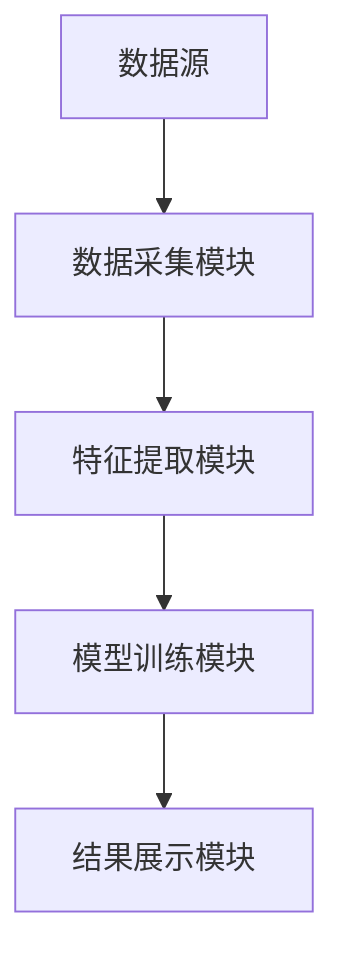

                 


# AI驱动的股票基本面分析工具

## 关键词：AI、股票分析、基本面分析、机器学习、深度学习

## 摘要：本文深入探讨了AI技术在股票基本面分析中的应用，分析了如何利用机器学习和深度学习模型来提高股票分析的效率和准确性。文章从基本概念、核心算法、系统架构到实际项目案例，全面解析了AI驱动的股票基本面分析工具的构建过程。

---

# 第1章: 股票基本面分析与AI的结合

## 1.1 股票基本面分析的核心概念

### 1.1.1 股票基本面分析的定义
股票基本面分析是指通过对公司财务状况、行业地位、盈利能力等多方面因素的分析，评估其内在价值，从而预测股票价格的变化趋势。传统的基本面分析依赖于分析师的主观判断和经验，而AI技术的引入为这一过程带来了更高的效率和准确性。

### 1.1.2 基本面分析的关键指标
基本面分析的关键指标包括：
- **市盈率（P/E）**：衡量股票价格是否被高估或低估。
- **市净率（P/B）**：反映股票价格与账面价值之间的关系。
- **股息率**：衡量股票的收益能力。
- **营业收入与净利润**：反映公司的盈利能力。
- **资产负债率**：衡量公司的财务健康状况。

### 1.1.3 AI在基本面分析中的作用
AI通过处理大量历史数据和实时信息，可以快速识别影响股价的关键因素，帮助投资者做出更明智的投资决策。

---

## 1.2 AI驱动的股票分析工具的优势

### 1.2.1 提高数据分析效率
AI能够快速处理海量数据，包括财务报表、市场新闻、社交媒体情绪等，提取关键特征，显著提高分析效率。

### 1.2.2 模型自动优化能力
AI模型能够根据市场变化自动调整参数，优化预测准确性，减少人为错误。

### 1.2.3 处理海量数据的能力
AI技术能够处理和分析来自多个来源的海量数据，包括非结构化数据（如新闻、社交媒体）和结构化数据（如财务报表）。

---

# 第2章: AI与股票基本面分析的结合方式

## 2.1 数据特征提取与分析

### 2.1.1 财务数据的特征提取
财务数据的特征提取包括对公司财务报表的分析，提取如收入、利润、资产负债率等关键指标。

### 2.1.2 市场情绪数据的特征提取
市场情绪数据的特征提取包括分析社交媒体、新闻媒体等来源的情绪指标，如情感强度、情感分布等。

### 2.1.3 公司新闻与公告的特征提取
通过自然语言处理技术，提取公司公告中的关键词和主题，分析其对股价的影响。

---

## 2.2 AI模型选择与算法流程

### 2.2.1 传统机器学习模型的选择
常用的机器学习模型包括线性回归、支持向量机（SVM）、随机森林等。

### 2.2.2 深度学习模型的选择
常用的深度学习模型包括LSTM、卷积神经网络（CNN）等。

### 2.2.3 混合模型的应用
混合模型结合了传统机器学习和深度学习的优势，能够在复杂场景中表现更好。

---

# 第3章: 传统机器学习算法在股票分析中的应用

## 3.1 线性回归模型

### 3.1.1 线性回归的基本原理
线性回归是一种统计学方法，用于预测目标变量与一个或多个解释变量之间的关系。

### 3.1.2 股票价格预测的线性回归模型
线性回归模型可以用于预测股票价格，但其局限性在于无法捕捉非线性关系。

### 3.1.3 模型的优缺点分析
线性回归模型简单易懂，但对非线性关系的捕捉能力较弱。

---

## 3.2 支持向量机（SVM）

### 3.2.1 SVM的基本原理
SVM是一种监督学习算法，用于分类和回归问题。

### 3.2.2 SVM在股票分类中的应用
SVM可以用于股票涨跌分类，具有较高的准确性和稳定性。

### 3.2.3 SVM的参数优化
通过调整C和γ参数，可以优化SVM的性能。

---

# 第4章: 基于深度学习的股票分析模型

## 4.1 神经网络基础

### 4.1.1 神经网络的结构与训练
神经网络由输入层、隐藏层和输出层组成，通过反向传播算法进行训练。

### 4.1.2 卷积神经网络（CNN）
CNN常用于图像识别，但在股票时间序列数据中也有应用。

### 4.1.3 循环神经网络（RNN）
RNN适用于时间序列数据的分析，能够捕捉数据的时序特征。

---

## 4.2 长短期记忆网络（LSTM）

### 4.2.1 LSTM的基本原理
LSTM通过门控机制有效捕捉长距离依赖关系，适用于时间序列预测。

### 4.2.2 LSTM在时间序列预测中的应用
LSTM可以用于股票价格预测，表现优于传统模型。

### 4.2.3 LSTM的训练与调优
通过调整学习率、批量大小和Dropout率，可以优化LSTM的性能。

---

# 第5章: 自然语言处理（NLP）在股票分析中的应用

## 5.1 NLP的基本原理

### 5.1.1 词嵌入（Word Embedding）
词嵌入将词语转换为低维向量，便于机器学习模型处理。

### 5.1.2 文本分类与情感分析
情感分析可以用于分析市场情绪，预测股价走势。

### 5.1.3 文本摘要与信息提取
NLP技术可以提取公司公告中的关键信息，辅助投资决策。

---

## 5.2 NLP在公司公告分析中的应用

### 5.2.1 公司公告的情感分析
通过情感分析，可以判断公司公告的积极或消极情绪，预测股价波动。

### 5.2.2 公司公告的主题提取
主题提取可以帮助识别公告中的主要信息，如财务业绩、重大事件等。

### 5.2.3 公司公告对股价的影响分析
通过分析历史数据，可以识别特定公告对股价的具体影响。

---

# 第6章: 系统分析与架构设计

## 6.1 问题场景介绍
构建一个AI驱动的股票分析工具，需要考虑数据采集、模型训练、结果展示等多个方面。

## 6.2 系统功能设计

### 6.2.1 数据采集模块
负责采集财务数据、市场新闻、社交媒体数据等。

### 6.2.2 特征提取模块
对采集的数据进行特征提取，生成可用于模型训练的特征向量。

### 6.2.3 模型训练模块
训练机器学习或深度学习模型，优化模型性能。

### 6.2.4 结果展示模块
将模型预测结果以可视化方式展示，辅助投资决策。

---

## 6.3 系统架构设计

### 6.3.1 系统架构图
使用Mermaid绘制系统架构图，展示各模块之间的关系。



---

## 6.4 系统接口设计

### 6.4.1 数据接口
定义数据输入输出接口，确保数据格式一致。

### 6.4.2 模型接口
定义模型调用接口，方便集成到其他系统中。

---

## 6.5 系统交互设计

### 6.5.1 用户交互流程
用户输入查询条件，系统返回分析结果。

### 6.5.2 技术交互流程
数据采集模块调用API获取数据，特征提取模块处理数据，模型训练模块训练模型，结果展示模块输出结果。

---

# 第7章: 项目实战

## 7.1 环境安装

### 7.1.1 安装Python
安装Python 3.8及以上版本。

### 7.1.2 安装相关库
安装numpy、pandas、scikit-learn、tensorflow等库。

---

## 7.2 核心实现代码

### 7.2.1 数据处理代码
```python
import pandas as pd
import numpy as np

# 读取数据
data = pd.read_csv('stock_data.csv')

# 数据预处理
data = data.dropna()
data = data.iloc[-100:]
```

### 7.2.2 LSTM模型实现
```python
import tensorflow as tf
from tensorflow.keras import layers

model = tf.keras.Sequential()
model.add(layers.LSTM(64, input_shape=(None, 1)))
model.add(layers.Dense(1))
model.compile(optimizer='adam', loss='mse')
```

---

## 7.3 案例分析

### 7.3.1 数据分析
分析某公司过去一年的财务数据和市场新闻，提取关键特征。

### 7.3.2 模型预测
使用训练好的LSTM模型预测未来30天的股价走势。

### 7.3.3 结果解读
根据预测结果，制定投资策略。

---

# 第8章: 最佳实践与小结

## 8.1 最佳实践
- 数据质量是关键，确保数据准确性和完整性。
- 模型选择要结合实际场景，避免过度复杂化。
- 结果展示要直观，方便用户理解和使用。

## 8.2 注意事项
- 风险提示：AI模型的结果仅供参考，投资需谨慎。
- 模型调优：定期更新模型，适应市场变化。

## 8.3 未来展望
随着AI技术的不断发展，股票基本面分析工具将更加智能化和精准化。

---

通过以上章节的详细讲解，读者可以系统地了解AI在股票基本面分析中的应用，掌握构建AI驱动的股票分析工具的核心技术和方法。

