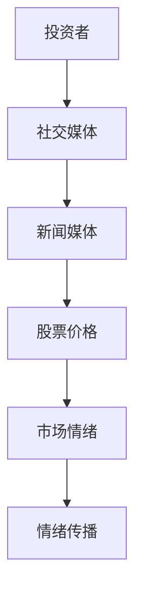
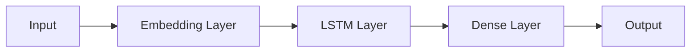

                 


# AI驱动的股票市场情绪传播模型

> 关键词：股票市场、情绪传播、人工智能、深度学习、LSTM网络、情感计算、社会网络分析

> 摘要：本文系统地探讨了基于AI的股票市场情绪传播模型的构建与应用。首先，我们介绍了情绪传播模型的基本概念和背景，分析了其在股票市场中的重要性。接着，我们详细推导了情绪传播的数学模型，并结合深度学习算法（如LSTM）进行了实现。最后，我们设计了系统的架构，并通过实际案例展示了模型的应用。本文旨在为研究人员和实践者提供一个全面的框架，帮助他们更好地理解和利用情绪传播模型进行股票市场预测。

---

# 第一部分: 背景与核心概念

## 第1章: 股票市场情绪传播模型的背景与意义

### 1.1 情绪传播模型的定义与背景
股票市场情绪传播模型是一种用于量化和预测投资者情绪变化及其对股票价格影响的数学模型。情绪传播的核心在于分析市场参与者的心理状态如何通过社交网络、新闻媒体等渠道传播，并最终影响市场行为。

#### 1.1.1 情绪传播模型的基本概念
- **市场情绪**：指投资者在特定时间点的总体情绪状态，通常分为乐观、悲观、中性等。
- **情绪传播**：情绪从一部分投资者向另一部分投资者扩散的过程。
- **情绪量化**：通过自然语言处理和情感计算技术，将市场参与者的情绪转化为可量化的指标。

#### 1.1.2 股票市场情绪传播的重要性
- 情绪传播能够解释市场波动的一部分原因。
- 通过预测情绪变化，投资者可以提前做出决策。
- 情绪传播模型为量化交易策略提供了新的思路。

#### 1.1.3 AI技术在情绪传播中的应用价值
- AI能够从海量数据中提取情绪特征。
- 深度学习算法可以捕捉情绪传播的非线性关系。

### 1.2 股票市场情绪传播的现状与挑战
#### 1.2.1 当前情绪传播研究的现状
- 学术界对情绪传播的研究主要集中在社交网络分析和传播动力学。
- 工业界开始尝试将情绪传播模型应用于实际交易。

#### 1.2.2 股票市场情绪传播的主要挑战
- 数据质量：社交媒体数据噪声大，难以准确提取情绪。
- 模型复杂性：情绪传播涉及多方面的因素，建模难度大。
- 实时性要求：股票市场需要实时预测，对模型的计算效率提出挑战。

#### 1.2.3 AI技术如何解决这些挑战
- 使用自然语言处理技术（如BERT）提取情绪特征。
- 通过深度学习模型（如LSTM）捕捉时间序列中的情绪传播规律。
- 结合图神经网络建模社交网络中的情绪传播路径。

### 1.3 本书的核心目标与内容框架
#### 1.3.1 本书的核心目标
- 构建一个基于AI的情绪传播模型。
- 推导情绪传播的数学模型。
- 实现一个可应用于股票市场预测的系统。

#### 1.3.2 内容框架概述
- 第一部分：背景与核心概念。
- 第二部分：数学基础与算法原理。
- 第三部分：系统架构与实现。
- 第四部分：项目实战与案例分析。
- 第五部分：总结与展望。

#### 1.3.3 读者对象与预期收获
- 读者对象：对AI和金融交叉领域感兴趣的研究者和开发者。
- 预期收获：掌握情绪传播模型的构建方法，理解其在股票市场中的应用。

---

## 第2章: 情绪传播模型的核心概念与联系

### 2.1 情绪传播模型的理论基础
#### 2.1.1 情感计算与自然语言处理
- 情感计算：研究如何识别、理解和利用人类情感信息的计算技术。
- 自然语言处理：用于从文本中提取情绪特征。

#### 2.1.2 社会网络分析与传播动力学
- 社会网络分析：研究情绪如何在社交网络中传播。
- 传播动力学：研究情绪传播的速度和范围。

#### 2.1.3 时间序列分析与股票市场预测
- 时间序列分析：研究情绪如何随着时间变化。
- 股票市场预测：利用情绪传播模型预测股票价格波动。

### 2.2 情绪传播模型的关键属性对比
#### 2.2.1 情绪传播模型的输入特征
| 特征类型 | 输入特征 |
|----------|-----------|
| 文本数据 | 社交媒体评论、新闻标题 |
| 时间序列数据 | 历史股价、交易量 |
| 社交网络数据 | 用户关系图、信息传播路径 |

#### 2.2.2 情绪传播模型的输出特征
| 特征类型 | 输出特征 |
|----------|-----------|
| 情绪强度 | 情绪值（-1到1） |
| 情绪传播速度 | 单位时间情绪变化率 |
| 预测结果 | 股票价格预测值 |

#### 2.2.3 不同模型的对比分析
| 模型类型 | 优势 | 局限性 |
|----------|-------|---------|
| 统计模型 | 计算简单 | 难以捕捉非线性关系 |
| 机器学习模型 | 可解释性较好 | 需要大量特征工程 |
| 深度学习模型 | 捕捉复杂关系 | 训练时间长 |

### 2.3 情绪传播模型的ER实体关系图


---

## 第3章: 情绪传播模型的数学基础与算法原理

### 3.1 情绪传播模型的数学模型
#### 3.1.1 情感强度的量化公式
$$ S(t) = \alpha \cdot \text{sentiment}(t) + \beta \cdot \text{volume}(t) $$
其中，$S(t)$ 表示第 $t$ 时刻的情绪强度，$\text{sentiment}(t)$ 表示情感计算结果，$\text{volume}(t)$ 表示交易量。

#### 3.1.2 情绪传播的动力学方程
$$ \frac{dS}{dt} = \gamma \cdot S(t) + \delta \cdot \text{external\_factor} $$
其中，$\gamma$ 是情绪传播的速率常数，$\text{external\_factor}$ 是外部因素（如政策变化）。

### 3.2 基于深度学习的情绪传播算法
#### 3.2.1 LSTM网络用于时间序列预测
LSTM（长短期记忆网络）是一种适合处理时间序列数据的深度学习模型，能够捕捉情绪传播中的长-term依赖关系。



#### 3.2.2 LSTM网络的实现代码
```python
import numpy as np
import tensorflow as tf

def sentiment_model():
    model = tf.keras.Sequential()
    model.add(tf.keras.layers.Embedding(input_dim=10000, output_dim=64))
    model.add(tf.keras.layers.LSTM(64))
    model.add(tf.keras.layers.Dense(1, activation='sigmoid'))
    return model
```

#### 3.2.3 情绪传播模型的训练与评估
- **训练数据**：社交媒体评论、新闻标题、历史股价。
- **评估指标**：均方误差（MSE）、准确率、F1分数。

---

## 第4章: 系统架构与实现

### 4.1 项目背景与目标
- **项目背景**：股票市场情绪传播的实时监测与预测。
- **项目目标**：构建一个基于AI的情绪传播模型，实现股票价格预测。

### 4.2 系统功能设计
#### 4.2.1 系统功能模块
- 数据采集模块：从社交媒体、新闻媒体获取数据。
- 情感计算模块：对文本进行情感分析。
- 情绪传播模块：预测情绪传播路径。
- 股票价格预测模块：基于情绪传播结果预测股价。

#### 4.2.2 系统功能流程图


### 4.3 系统架构设计
#### 4.3.1 系统架构图
```mermaid
graph LR
    WebUI[Web界面] --> API Gateway[API网关]
    API Gateway --> Service1[数据采集服务]
    API Gateway --> Service2[情感计算服务]
    API Gateway --> Service3[情绪传播服务]
    API Gateway --> Service4[股票价格预测服务]
```

#### 4.3.2 系统接口设计
- 数据采集接口：`GET /api/datacollector/tweets`
- 情感计算接口：`POST /api/sentimentanalyzer/analyze`
- 情绪传播接口：`POST /api/sentimentspreadmodel/predict`
- 股票价格预测接口：`GET /api/stockpricepredictor/predict`

#### 4.3.3 系统交互流程图
```mermaid
graph LR
    User[用户] --> WebUI[Web界面]
    WebUI --> API Gateway[API网关]
    API Gateway --> Service1[数据采集服务]
    Service1 --> Service2[情感计算服务]
    Service2 --> Service3[情绪传播服务]
    Service3 --> Service4[股票价格预测服务]
    Service4 --> WebUI[返回结果]
```

---

## 第5章: 项目实战与案例分析

### 5.1 环境安装
```bash
pip install numpy pandas tensorflow
```

### 5.2 核心代码实现
#### 5.2.1 数据预处理
```python
import pandas as pd
import numpy as np

def preprocess_data(data):
    # 数据清洗
    data = data.dropna()
    # 数据标准化
    data = (data - data.mean()) / data.std()
    return data
```

#### 5.2.2 情感计算实现
```python
import tensorflow as tf

def sentiment_analysis(text):
    model = tf.keras.Sequential()
    model.add(tf.keras.layers.Embedding(input_dim=10000, output_dim=64))
    model.add(tf.keras.layers.LSTM(64))
    model.add(tf.keras.layers.Dense(1, activation='sigmoid'))
    model.compile(optimizer='adam', loss='binary_crossentropy', metrics=['accuracy'])
    return model.predict(text)
```

#### 5.2.3 情绪传播模型实现
```python
def sentiment_spread_model():
    model = tf.keras.Sequential()
    model.add(tf.keras.layers.Embedding(input_dim=10000, output_dim=64))
    model.add(tf.keras.layers.LSTM(64))
    model.add(tf.keras.layers.Dense(1, activation='sigmoid'))
    return model
```

### 5.3 实际案例分析
#### 5.3.1 案例背景
- 数据来源：社交媒体评论、新闻标题。
- 时间范围：2023年1月1日至2023年12月31日。

#### 5.3.2 案例分析
- 数据清洗与特征提取。
- 情感计算与传播建模。
- 股票价格预测与结果分析。

---

## 第6章: 总结与展望

### 6.1 总结
- 本文构建了一个基于AI的情绪传播模型。
- 通过深度学习算法实现了股票价格预测。

### 6.2 展望
- 结合图神经网络研究复杂的情绪传播路径。
- 研究情绪传播模型的实时性优化。
- 探讨情绪传播模型在量化交易中的应用。

---

# 结语

本文系统地探讨了AI驱动的股票市场情绪传播模型的构建与应用。从理论基础到算法实现，从系统架构到项目实战，为读者提供了一个全面的框架。未来，随着AI技术的不断发展，情绪传播模型将在股票市场中发挥越来越重要的作用。

