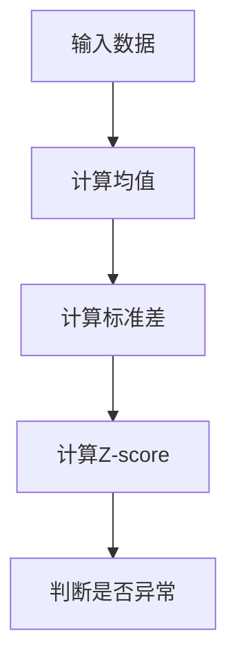
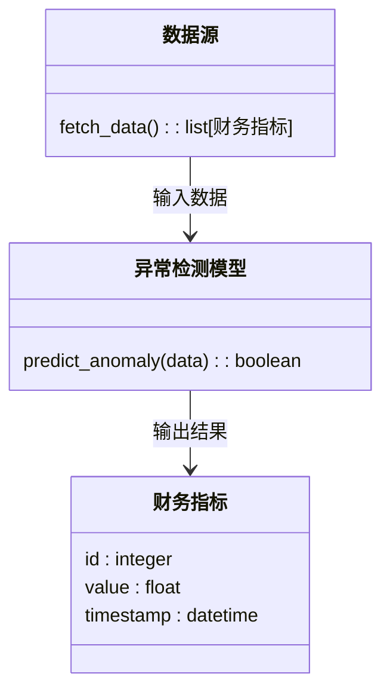

                 


# AI驱动的股票财务指标异常检测

> 关键词：AI驱动，股票，财务指标，异常检测，机器学习，深度学习

> 摘要：本文系统地探讨了利用人工智能技术进行股票财务指标异常检测的方法，从背景、核心概念、算法原理到系统架构和项目实战，层层递进地分析了该领域的关键问题和技术挑战。文章通过详细的理论阐述、算法实现和案例分析，为读者提供了一个全面了解AI驱动股票异常检测的框架，最后总结了实践中的最佳经验和注意事项。

---

# 第一部分：AI驱动的股票财务指标异常检测背景与概念

## 第1章：股票财务指标异常检测的背景与问题

### 1.1 问题背景

#### 1.1.1 股票市场与财务指标的重要性
股票市场是现代经济体系的重要组成部分，财务指标是衡量企业财务健康状况的核心工具。投资者和分析师通过分析财务指标（如市盈率、市净率、ROE等）来评估企业的投资价值。

#### 1.1.2 异常检测在股票投资中的价值
财务指标的异常变化可能预示着企业的潜在风险或重大事件，及时发现这些异常可以帮助投资者做出更明智的投资决策。

#### 1.1.3 AI技术在金融领域的应用现状
人工智能技术在金融领域的应用日益广泛，特别是在高频交易、风险控制和异常检测方面展现了强大的潜力。

### 1.2 问题描述

#### 1.2.1 财务指标异常的定义与分类
财务指标异常可以分为短期波动异常和长期趋势异常。短期波动异常通常由市场情绪或突发事件引起，而长期趋势异常则可能反映企业基本面的变化。

#### 1.2.2 异常检测的常见场景与挑战
常见的场景包括：财务报表数据异常、市场波动异常、企业经营状况突变等。挑战在于如何在噪声中准确识别真正的异常信号。

#### 1.2.3 传统方法的局限性与AI的优势
传统方法通常依赖人工经验或简单的统计指标，难以应对复杂的市场环境。AI技术可以通过深度学习等方法，捕捉数据中的非线性关系，提高检测的准确性和效率。

### 1.3 问题解决思路

#### 1.3.1 异常检测的基本原理
通过分析历史数据，建立正常状态的模型，识别偏离模型的样本作为异常。

#### 1.3.2 AI驱动的解决方案框架
采用机器学习或深度学习模型，结合实时数据流，构建实时异常检测系统。

#### 1.3.3 数据来源与处理流程
数据来源包括股票价格、财务报表、市场新闻等。处理流程包括数据清洗、特征提取、模型训练等。

### 1.4 边界与外延

#### 1.4.1 异常检测的适用范围
适用于实时监控、风险预警、投资策略优化等领域。

#### 1.4.2 与其他技术的结合
可以与自然语言处理（NLP）结合，分析新闻数据对财务指标的影响。

#### 1.4.3 应用中的潜在风险与应对
模型过拟合、数据偏差等问题需要通过交叉验证、数据增强等方法进行应对。

---

## 第2章：AI驱动的股票财务指标异常检测核心概念

### 2.1 财务指标的核心属性

#### 2.1.1 财务指标的分类与特征
财务指标可以分为盈利能力、成长能力、偿债能力、营运能力等类别。每个指标都有其独特的数学表达式和经济意义。

#### 2.1.2 异常检测的关键维度
包括时间维度（短期 vs 长期）、空间维度（同一企业 vs 同行业企业）等。

#### 2.1.3 数据特征的对比分析
通过对比分析，识别出异常指标。

### 2.2 异常检测的算法原理

#### 2.2.1 统计方法
- 基于均值和标准差的方法：识别偏离均值超过一定倍数标准差的样本。
- 算法流程图：数据输入 → 计算均值和标准差 → 判断是否异常。

#### 2.2.2 机器学习模型
- 基于聚类的异常检测：使用K-Means或DBSCAN算法，识别密度低的区域。
- 基于分类的异常检测：使用支持向量机（SVM）或随机森林（RF）模型，区分正常和异常样本。

#### 2.2.3 深度学习方法
- 基于RNN的异常检测：适用于时间序列数据，捕捉长期依赖关系。
- 基于CNN的异常检测：适用于图像-like的特征提取。

### 2.3 核心概念对比

#### 2.3.1 财务指标与市场行为的关系
财务指标反映企业的基本面，市场行为反映投资者的预期，两者共同影响股价。

#### 2.3.2 异常检测与预测的区别
异常检测关注的是“异常”，而预测关注的是“未来趋势”。

#### 2.3.3 AI模型的可解释性问题
深度学习模型通常缺乏可解释性，这在金融领域可能是一个挑战。

### 2.4 ER实体关系图

```mermaid
erDiagram
    customer[投资者] {
        id : integer
        name : string
        investment : float
    }
    stock[股票] {
        id : integer
        ticker : string
        price : float
        financial指标 : reference to financial_indicator
    }
    financial_indicator[财务指标] {
        id : integer
        value : float
        date : date
        stock_id : integer
    }
    customer --> stock : 持有
    stock --> financial_indicator : 具有
```

---

## 第3章：异常检测算法原理与实现

### 3.1 统计方法

#### 3.1.1 基于均值和标准差的异常检测
公式：
$$ z = \frac{x - \mu}{\sigma} $$
其中，$\mu$是均值，$\sigma$是标准差，$x$是数据点，$z$是Z-score。

#### 3.1.2 算法流程图



### 3.2 机器学习模型

#### 3.2.1 基于聚类的异常检测
使用K-Means算法：
1. 数据预处理：标准化或归一化。
2. 训练聚类模型。
3. 判断离群点。

### 3.3 深度学习方法

#### 3.3.1 基于RNN的异常检测
网络结构：
- 输入层 → LSTM层 → 输出层（分类或回归）。

### 3.4 算法实现代码示例

#### 统计方法代码

```python
import numpy as np

def is_anomaly(data, threshold=3):
    mu = np.mean(data)
    sigma = np.std(data)
    z_scores = [(x - mu) / sigma for x in data]
    return any(abs(z) > threshold for z in z_scores)
```

#### 机器学习模型代码

```python
from sklearn.cluster import DBSCAN

def detect_anomalies(X, eps=0.5, min_samples=5):
    db = DBSCAN(eps=eps, min_samples=min_samples)
    db.fit(X)
    return db.labels_
```

#### 深度学习模型代码

```python
import tensorflow as tf
from tensorflow.keras import layers

model = tf.keras.Sequential([
    layers.Dense(64, activation='relu'),
    layers.Dense(1, activation='sigmoid')
])

model.compile(optimizer='adam', loss='binary_crossentropy')
```

---

## 第4章：数学模型与公式

### 4.1 统计学基础

#### 均值与标准差公式
$$ \mu = \frac{1}{n}\sum_{i=1}^{n}x_i $$
$$ \sigma = \sqrt{\frac{1}{n-1}\sum_{i=1}^{n}(x_i - \mu)^2} $$

### 4.2 机器学习模型

#### 聚类算法公式
使用DBSCAN算法，密度可达性度量：
$$ \text{Reachability}(x, y) = \min\{ \text{distance}(x, y), \text{core_dist}(y) \} $$

### 4.3 深度学习模型

#### RNN损失函数公式
$$ \mathcal{L} = -\sum_{t=1}^{T} \text{log}(p(y_t|y_{t-1})) $$

---

## 第5章：系统分析与架构设计方案

### 5.1 问题场景介绍
实时监控股票市场，及时发现财务指标异常。

### 5.2 系统功能设计

#### 领域模型



### 5.3 系统架构设计


### 5.4 系统接口设计

#### 接口描述
- 输入：股票代码、时间范围。
- 输出：异常指标列表。

---

## 第6章：项目实战

### 6.1 环境安装

```bash
pip install numpy pandas scikit-learn tensorflow
```

### 6.2 核心实现

#### 数据预处理

```python
import pandas as pd

data = pd.read_csv('financial_indicators.csv')
data = data.dropna()
```

#### 模型训练

```python
from sklearn.ensemble import IsolationForest

model = IsolationForest(random_state=42)
model.fit(X_train)
```

### 6.3 案例分析

#### 实际案例
分析某企业的ROE指标，发现其突然下降，触发异常警报。

---

## 第7章：总结与最佳实践

### 7.1 最佳实践 tips

- 数据预处理是关键，尤其是缺失值和异常值的处理。
- 使用多种算法进行交叉验证，提高检测的准确性。

### 7.2 小结

AI驱动的股票财务指标异常检测是一个复杂的系统工程，需要结合统计学、机器学习和深度学习等多种技术。

### 7.3 注意事项

- 模型的可解释性在金融领域尤为重要。
- 需要定期更新模型，以适应市场变化。

### 7.4 拓展阅读

- 《Python机器学习实战》
- 《深度学习入门：基于Python的理论与实现》

---

通过以上目录，读者可以系统地学习AI驱动的股票财务指标异常检测的理论与实践，从基础概念到高级算法，再到实际应用，逐步掌握这一领域的核心技能。

