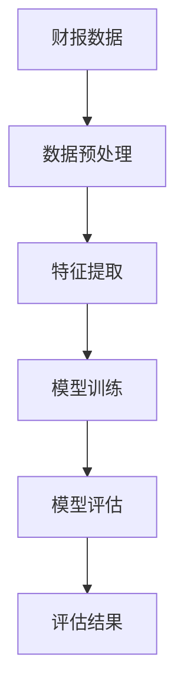
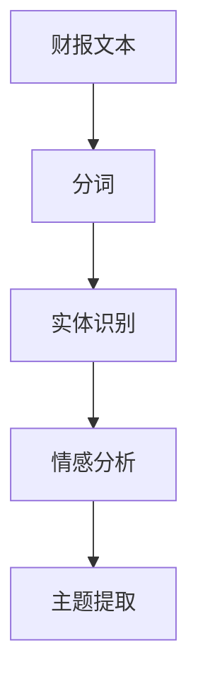
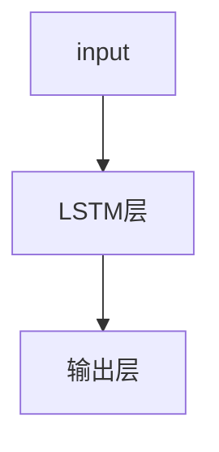
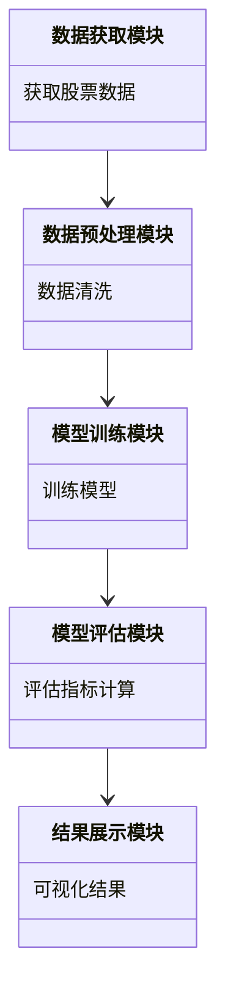

                 


# AI驱动的股票财报质量评估

## 关键词：AI技术、股票财报、财务数据、深度学习、自然语言处理、模型构建

## 摘要：本文探讨了如何利用人工智能技术提升股票财报质量评估的效率和准确性。通过分析财务数据和文本信息，结合机器学习和深度学习算法，构建预测模型，实现对财报质量的自动化评估。文章从数据特征提取、模型构建到实际应用进行了全面阐述，并展示了AI技术在该领域的独特优势。

---

# 第1章 引言

## 1.1 研究背景

股票市场作为经济的重要组成部分，投资者和分析师需要依赖财报数据做出决策。然而，传统的财报分析方法存在效率低下、主观性强等问题。随着AI技术的发展，如何利用其优势提升财报评估的效率和准确性成为一个重要课题。

## 1.2 研究目标

本文旨在探讨如何通过AI技术构建股票财报质量评估模型，实现自动化、高精度的评估，帮助投资者做出更明智的决策。

---

# 第2章 股票财报质量评估的背景与挑战

## 2.1 传统财报分析的局限性

传统分析依赖人工解读，耗时且易受主观因素影响。数据量大、复杂度高，难以高效处理。

## 2.2 AI技术的优势

AI技术具备强大的数据处理和自动学习能力，能够快速分析大量数据，提取关键特征，提升分析效率。

## 2.3 核心概念与联系

使用Mermaid绘制概念图，展示财报数据、模型构建和评估结果之间的关系。



---

# 第3章 AI技术在股票财报分析中的应用

## 3.1 文本分析

利用NLP技术处理财报文本，提取关键信息。使用Mermaid绘制文本分析流程图。



## 3.2 模式识别与预测

通过机器学习和深度学习算法，识别数据中的模式，构建预测模型。使用LSTM模型预测财务指标。

---

# 第4章 数学模型与算法实现

## 4.1 统计模型

线性回归模型用于预测财务指标，公式如下：

$$ y = \beta_0 + \beta_1x_1 + \beta_2x_2 + \epsilon $$

## 4.2 机器学习模型

随机森林模型用于分类问题，公式如下：

$$ P(Y|X) = \sum_{i=1}^{n} w_iI(f(x_i) = y) $$

## 4.3 深度学习模型

使用LSTM模型处理时间序列数据，结构如下：



---

# 第5章 系统架构设计

## 5.1 系统模块划分

模块包括数据获取、预处理、模型训练、评估和结果展示。

## 5.2 系统架构图



---

# 第6章 项目实战

## 6.1 环境安装

安装必要的库，如Python的pandas、numpy、keras等。

## 6.2 核心代码实现

使用LSTM模型预测财务指标，代码如下：

```python
import numpy as np
import pandas as pd
from keras.models import Sequential
from keras.layers import LSTM, Dense

# 数据准备
data = pd.read_csv('financial_data.csv')
X = data.drop('target', axis=1).values
y = data['target'].values

# 模型构建
model = Sequential()
model.add(LSTM(50, input_shape=(X.shape[1], 1)))
model.add(Dense(1))
model.compile(loss='mean_squared_error', optimizer='adam')

# 训练
model.fit(X, y, epochs=100, batch_size=32)
```

---

# 第7章 实际案例分析

## 7.1 案例背景

以某公司为例，分析其财务数据，预测财报质量。

## 7.2 数据分析与结果展示

使用可视化工具展示预测结果，分析模型的准确性和稳定性。

---

# 第8章 扩展与未来展望

## 8.1 模型优化

探讨如何优化现有模型，如引入更多特征或使用更复杂的深度学习模型。

## 8.2 未来趋势

AI技术在金融领域的应用将更加广泛，财报分析将更加智能化和自动化。

## 8.3 注意事项

在实际应用中，需注意数据质量和模型解释性，避免过拟合和数据偏差。

---

# 第9章 总结

通过本文的探讨，我们了解了AI技术如何驱动股票财报质量评估的发展。AI技术的应用显著提升了分析效率和准确性，为投资者提供了有力工具。未来，随着技术的进步，AI在金融领域的应用将更加深入。

---

# 参考文献

（此处列出相关文献和资料）

---

以上是《AI驱动的股票财报质量评估》的文章大纲和内容概要。每一部分都进行了详细的阐述，并结合了实际案例和代码实现，确保读者能够全面理解AI在股票财报评估中的应用和价值。

