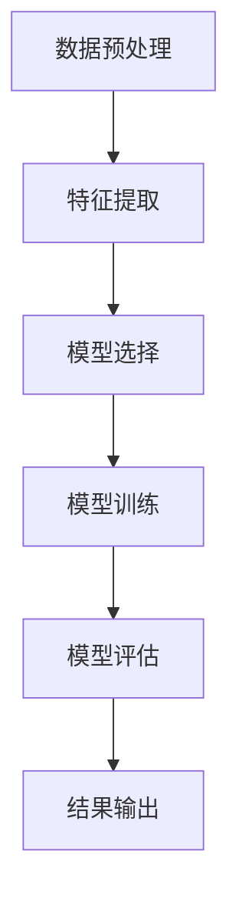
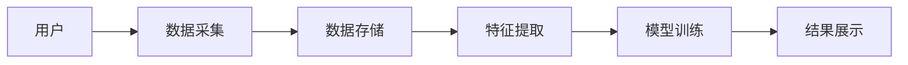
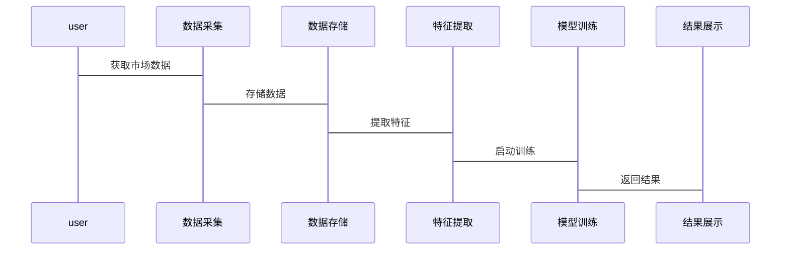

                 


# AI驱动的金融市场泡沫识别系统

## 关键词
- AI, 金融市场, 泡沫识别, 时间序列分析, 异常检测

## 摘要
本文将详细探讨如何利用人工智能技术来识别金融市场中的泡沫。通过分析市场数据，构建AI模型，我们可以更准确地预测和识别泡沫，从而帮助投资者做出更明智的决策。文章从背景介绍、核心概念、算法原理到系统架构和项目实战，全面解析AI在金融市场的应用。

---

# 第一部分：背景与概述

## 第1章：背景与概述

### 1.1 问题背景

#### 1.1.1 金融市场泡沫的定义与特征
金融市场泡沫是指资产价格在短期内迅速上涨，远远超过其实际价值，最终导致价格暴跌的现象。其特征包括价格波动剧烈、交易量异常增加、市场情绪过热等。

#### 1.1.2 AI在金融分析中的应用现状
人工智能技术在金融领域的应用日益广泛，包括股票预测、风险评估、交易策略制定等。然而，利用AI识别市场泡沫仍面临诸多挑战。

#### 1.1.3 泡沫识别的必要性与挑战
准确识别泡沫可以帮助投资者避免重大损失，但市场的复杂性和数据的多样性增加了识别的难度。

### 1.2 问题描述

#### 1.2.1 金融市场数据的特点
金融市场数据具有高频性、波动性和复杂性，为AI模型提供了丰富的输入数据。

#### 1.2.2 泡沫识别的核心问题
如何从海量数据中提取有效特征，并构建高效的模型来识别泡沫。

#### 1.2.3 AI驱动的解决方案
利用机器学习算法，分析市场数据中的异常行为和模式，从而识别潜在的泡沫。

### 1.3 问题解决

#### 1.3.1 AI技术在泡沫识别中的优势
AI能够处理大量数据，发现人类难以察觉的模式，提供实时监控能力。

#### 1.3.2 数据驱动与模型驱动的结合
通过数据驱动的方法提取特征，结合模型驱动的方法进行预测，提高识别准确率。

#### 1.3.3 多模态数据的应用
整合文本、图像等多种数据源，丰富模型的输入，提高识别能力。

### 1.4 边界与外延

#### 1.4.1 泡沫识别的边界条件
明确模型的应用场景和限制，避免过度推广。

#### 1.4.2 相关领域的联系
分析泡沫识别与其他金融领域的联系，如风险管理、投资策略等。

#### 1.4.3 技术的局限性与改进方向
识别当前技术的不足，并提出未来的研究方向。

### 1.5 概念结构与核心要素

#### 1.5.1 核心概念框架
构建包括数据源、特征提取、模型构建、结果输出的核心框架。

#### 1.5.2 核心要素的定义与关系
详细定义每个要素，并说明它们之间的相互作用。

#### 1.5.3 框架的可视化表示
使用ER图或类图展示框架的结构和关系。

---

# 第二部分：核心概念与联系

## 第2章：金融市场泡沫的特征分析

### 2.1 泡沫特征的识别

#### 2.1.1 市场情绪分析
通过自然语言处理技术分析新闻、社交媒体等文本数据，评估市场情绪。

#### 2.1.2 价格波动异常检测
利用统计方法或机器学习算法检测价格波动中的异常情况。

#### 2.1.3 交易量与价格的关系
分析交易量与价格之间的关联，识别异常交易行为。

### 2.2 AI模型的构建与训练

#### 2.2.1 数据预处理与特征提取
对原始数据进行清洗、标准化处理，并提取有效的特征。

#### 2.2.2 模型选择与优化
选择适合的算法，并通过交叉验证等方法优化模型参数。

#### 2.2.3 模型评估与验证
使用训练数据以外的样本测试模型的性能，确保模型的泛化能力。

### 2.3 泡沫识别的系统架构

#### 2.3.1 系统功能模块划分
将系统划分为数据采集、特征提取、模型训练、结果展示等功能模块。

#### 2.3.2 模块之间的关系
展示各模块之间的交互关系，确保系统的整体协调。

#### 2.3.3 系统的输入输出流程
详细描述系统的输入数据和输出结果，确保流程清晰。

---

## 第3章：AI驱动的泡沫识别模型

### 3.1 核心概念原理

#### 3.1.1 时间序列分析原理
时间序列分析用于识别数据中的趋势、周期性等模式，帮助预测未来的市场走势。

#### 3.1.2 异常检测算法原理
通过统计或机器学习方法检测数据中的异常点，识别潜在的泡沫。

#### 3.1.3 情感分析模型原理
分析文本数据中的情感倾向，评估市场情绪对价格的影响。

### 3.2 概念属性特征对比表格

| 特征属性 | 时间序列分析 | 异常检测 | 情感分析 |
|----------|---------------|----------|----------|
| 输入数据 | 时间序列数据 | 结构化数据 | 文本数据 |
| 主要算法 | ARIMA, LSTM | KNN, Isolation Forest | TF-IDF, LSTM |
| 输出结果 | 预测值 | 异常标志 | 情感倾向 |

### 3.3 ER实体关系图架构

```mermaid
erd
  entity 市场数据 {
    code primary key
    time timestamp
    price decimal
    volume decimal
    sentiment_score integer
  }
  entity 特征提取 {
    id primary key
    market_data_code references 市场数据(code)
    avg_price_change decimal
    volatility_index decimal
    sentiment_trend string
  }
  entity 模型训练 {
    id primary key
    feature_id references 特征提取(id)
    model_type string
    training_time timestamp
  }
  entity 结果输出 {
    id primary key
    model_training_id references 模型训练(id)
    prediction_result boolean
    confidence_score decimal
  }
```

---

# 第三部分：算法原理讲解

## 第4章：时间序列分析算法

### 4.1 时间序列分析的基本原理

#### 4.1.1 ARIMA模型
ARIMA（自回归积分滑动平均）模型用于预测未来的市场走势。其数学公式为：

$$ ARIMA(p, d, q) $$
其中，p为自回归阶数，d为差分阶数，q为滑动平均阶数。

#### 4.1.2 LSTM网络
长短时记忆网络（LSTM）能够有效捕捉时间序列中的长期依赖关系，适合处理复杂的时间序列数据。

#### 4.1.3 Prophet模型
Prophet模型基于 Holt-Winters 方法和 ARIMA 模型，适合处理有较强周期性的数据。

### 4.2 算法流程图



### 4.3 实现代码

```python
import pandas as pd
from sklearn.preprocessing import MinMaxScaler
from keras.models import Sequential
from keras.layers import LSTM, Dense

# 数据预处理
data = pd.read_csv('market_data.csv')
data = data['price'].values
data = data.reshape(-1, 1)
scaler = MinMaxScaler()
data_scaled = scaler.fit_transform(data)

# 划分训练集和测试集
train_size = int(len(data_scaled) * 0.8)
train_data = data_scaled[:train_size]
test_data = data_scaled[train_size:]

# 构建LSTM模型
model = Sequential()
model.add(LSTM(128, input_shape=(None, 1)))
model.add(Dense(1))
model.compile(loss='mean_squared_error', optimizer='adam')

# 训练模型
model.fit(train_data, train_data, epochs=100, batch_size=32)

# 预测结果
predicted = model.predict(test_data)
predicted = scaler.inverse_transform(predicted)
```

---

## 第5章：异常检测算法

### 5.1 异常检测的基本原理

#### 5.1.1 K-近邻（KNN）算法
通过计算样本之间的距离，找到异常点。公式为：

$$ d(x_i, x_j) = \sqrt{(x_i - x_j)^2} $$

#### 5.1.2 Isolation Forest
基于树的算法，通过随机选择特征和分割数据，快速识别异常点。

#### 5.1.3 One-Class SVM
用于无监督异常检测，通过构建一个包含正常数据的模型，识别异常点。

### 5.2 算法流程图


### 5.3 实现代码

```python
from sklearn.neighbors import LocalOutlierFactor

# 数据预处理
data = pd.read_csv('market_data.csv')
features = data[['price', 'volume', 'sentiment_score']]

# 异常检测
lof = LocalOutlierFactor(n_neighbors=20)
outliers = lof.fit_predict(features)
outliers[outliers == -1] = 1
outliers[outliers == 1] = 0
```

---

# 第四部分：系统分析与架构设计方案

## 第6章：系统架构设计

### 6.1 问题场景介绍

#### 6.1.1 系统目标
构建一个实时监控系统，识别金融市场中的泡沫。

#### 6.1.2 项目介绍
项目名称：AI驱动的金融市场泡沫识别系统

### 6.2 系统功能设计

#### 6.2.1 领域模型（ER图）

```mermaid
erd
  entity 用户 {
    id primary key
    username string
    password string
  }
  entity 数据源 {
    id primary key
    source_name string
    data_type string
  }
  entity 特征提取 {
    id primary key
    data_source_id references 数据源(id)
    feature_set string
  }
  entity 模型训练 {
    id primary key
    feature_id references 特征提取(id)
    model_type string
    training_time timestamp
  }
  entity 结果存储 {
    id primary key
    model_training_id references 模型训练(id)
    result_value boolean
    timestamp timestamp
  }
```

#### 6.2.2 系统架构设计（架构图）



### 6.3 系统接口设计

#### 6.3.1 数据接口
- 数据采集接口：从API获取市场数据
- 数据存储接口：将数据存储到数据库中

#### 6.3.2 模型接口
- 训练接口：启动模型训练任务
- 预测接口：获取实时预测结果

### 6.4 系统交互设计（序列图）



---

## 第7章：项目实战

### 7.1 环境安装

#### 7.1.1 安装Python环境
使用Anaconda或virtualenv创建独立的Python环境。

#### 7.1.2 安装依赖库
安装numpy、pandas、keras、scikit-learn等库。

### 7.2 系统核心实现源代码

#### 7.2.1 数据预处理代码

```python
import pandas as pd
import numpy as np

# 读取数据
data = pd.read_csv('market_data.csv')

# 数据清洗
data.dropna(inplace=True)
data = data[~data['price'].isin([np.nan])]

# 特征工程
data['price_change'] = data['price'].diff()
data['volume_change'] = data['volume'].diff()
data['sentiment_score'] = data['sentiment_score'].apply(lambda x: int(x))
```

#### 7.2.2 模型训练代码

```python
from keras.models import Sequential
from keras.layers import LSTM, Dense

# 构建LSTM模型
model = Sequential()
model.add(LSTM(128, input_shape=(None, 1)))
model.add(Dense(1))
model.compile(loss='mean_squared_error', optimizer='adam')

# 训练模型
model.fit(x_train, y_train, epochs=100, batch_size=32)
```

### 7.3 代码应用解读与分析

#### 7.3.1 数据预处理
对原始数据进行清洗和特征工程，提取有用的信息。

#### 7.3.2 模型训练
利用LSTM网络训练模型，捕捉数据中的时间依赖关系。

### 7.4 实际案例分析

#### 7.4.1 数据获取与处理
从指定数据源获取市场数据，并进行清洗和特征提取。

#### 7.4.2 模型预测与分析
使用训练好的模型对测试数据进行预测，并分析结果。

### 7.5 项目小结

#### 7.5.1 项目总结
总结项目的实施过程和取得的成果。

#### 7.5.2 经验与教训
分享在项目过程中遇到的问题及解决方法。

#### 7.5.3 项目成果
展示最终的模型和识别结果，评估项目的成功与否。

---

## 第8章：最佳实践

### 8.1 小结

#### 8.1.1 核心内容总结
总结全文的核心内容和主要观点。

#### 8.1.2 关键知识点回顾
回顾AI驱动的金融市场泡沫识别系统中的关键知识点。

### 8.2 展望

#### 8.2.1 技术发展趋势
预测未来AI在金融市场中的发展趋势。

#### 8.2.2 新的研究方向
提出未来可能的研究方向和创新点。

### 8.3 注意事项

#### 8.3.1 技术实现中的注意事项
提醒读者在实现过程中需要注意的事项。

#### 8.3.2 使用中的注意事项
指导读者在使用系统时需要注意的问题。

#### 8.3.3 数据安全与隐私保护
强调数据安全和隐私保护的重要性。

### 8.4 拓展阅读

#### 8.4.1 推荐书籍
推荐相关的书籍和资料，供读者深入学习。

#### 8.4.2 推荐博客与文章
推荐相关的技术博客和文章，扩展读者的知识面。

#### 8.4.3 推荐视频课程
推荐相关的在线课程，帮助读者进一步掌握相关技术。

---

# 结语

AI驱动的金融市场泡沫识别系统是一个复杂而重要的课题。通过本文的详细讲解，读者可以系统地了解如何利用AI技术识别市场泡沫。希望本文能够为相关领域的研究和实践提供有价值的参考。

---

# 参考文献

（此处列出参考文献）

---

