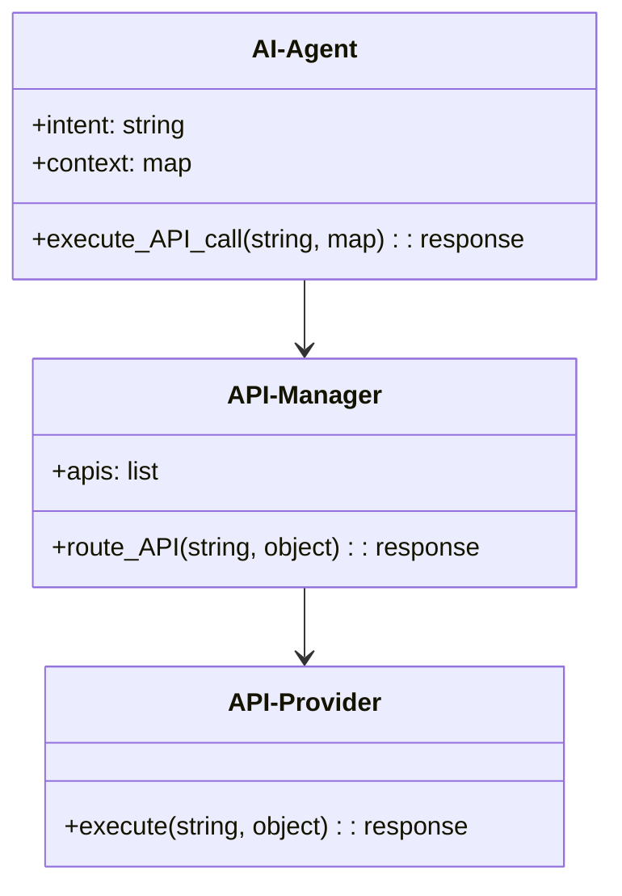
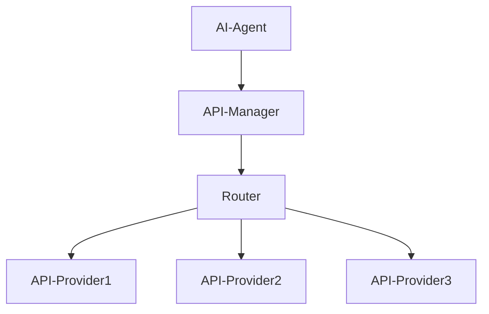

                 


# API集成：扩展AI Agent的功能与数据源

> 关键词：API集成，AI Agent，数据源扩展，API调用，功能扩展，系统架构设计

> 摘要：本文深入探讨了API集成在扩展AI Agent功能和数据源方面的重要性。通过详细分析API集成的核心概念、算法原理、系统架构设计以及项目实战，本文为读者提供了从理论到实践的全面指导，帮助他们理解如何通过API集成来提升AI Agent的能力。

---

## 第1章: API集成与AI Agent的背景与概念

### 1.1 API集成的核心概念

#### 1.1.1 API的基本概念与作用
API（应用程序编程接口）是软件系统之间的通信桥梁，通过定义良好的接口规范，允许不同的系统之间进行数据交互和功能调用。API的作用包括：
- **数据交换**：允许系统之间共享数据。
- **功能扩展**：通过调用外部API，系统可以扩展自身功能。
- **模块化设计**：API使得系统功能可以模块化，便于维护和扩展。

#### 1.1.2 AI Agent的定义与功能
AI Agent（人工智能代理）是一种能够感知环境、执行任务并作出决策的智能实体。AI Agent的核心功能包括：
- **感知环境**：通过传感器或数据源获取信息。
- **决策与执行**：基于获取的信息作出决策并执行任务。
- **学习与优化**：通过机器学习算法不断优化自身行为。

#### 1.1.3 API集成在AI Agent中的作用
API集成是将AI Agent与外部系统连接的关键，通过调用外部API，AI Agent可以获取更多数据源、扩展功能模块，并与外部系统进行交互。

### 1.2 问题背景与问题描述

#### 1.2.1 当前AI Agent的功能局限性
AI Agent的功能通常受限于其内部数据源和功能模块，无法充分利用外部资源。

#### 1.2.2 数据源不足的问题
AI Agent的决策能力依赖于数据源的多样性和丰富性，而单靠内部数据往往无法满足需求。

#### 1.2.3 API集成的必要性
通过API集成，AI Agent可以访问外部系统提供的数据和功能，从而弥补内部数据和功能的不足。

### 1.3 问题解决与边界

#### 1.3.1 通过API扩展AI Agent功能
API集成使得AI Agent能够调用外部系统提供的功能，如天气查询、新闻获取等。

#### 1.3.2 数据源扩展的边界与限制
API集成虽然可以扩展数据源，但也需要考虑API的访问权限、调用频率和成本等限制。

#### 1.3.3 API集成的边界与外延
API集成的边界在于API的调用方式和接口规范，而外延则涉及API的管理、监控和优化。

---

## 第2章: API集成与AI Agent的核心概念

### 2.1 核心概念与原理

#### 2.1.1 API的请求与响应机制
API通过请求-响应模式进行数据交互，通常包括请求头、请求体和响应头等部分。

#### 2.1.2 AI Agent的意图识别与执行
AI Agent通过自然语言处理等技术识别用户的意图，并通过API调用执行相应的操作。

#### 2.1.3 API集成的核心原理
API集成通过中间件或网关将AI Agent与外部系统连接，实现数据的交互与功能的扩展。

### 2.2 核心概念对比与特征分析

#### 2.2.1 API与AI Agent的功能对比
| 功能 | API | AI Agent |
|------|-----|----------|
| 数据交互 | 支持 | 支持 |
| 功能扩展 | 通过调用外部功能 | 通过内部算法实现 |
| 自主决策 | 无 | 有 |

#### 2.2.2 数据源的多样性与实时性
API集成可以通过不同的数据源提供多样化的数据，并支持实时数据的获取。

#### 2.2.3 API调用的异步与同步特性
API调用可以是同步的（阻塞式）或异步的（非阻塞式），影响系统的响应速度和资源利用。

---

## 第3章: API集成的核心算法与原理

### 3.1 算法原理

#### 3.1.1 请求路由与分发
API集成通常需要根据请求的类型和目标进行路由分发，确保请求能够准确到达对应的API服务。

#### 3.1.2 数据格式转换与适配
不同系统之间可能存在数据格式的差异，API集成需要进行数据的格式转换和适配。

#### 3.1.3 API调用的负载均衡
通过负载均衡算法（如轮询、随机、加权等）分配API请求，确保系统性能和稳定性。

### 3.2 数学模型与公式

#### 3.2.1 负载均衡算法
$$ \text{权重} = \frac{\text{资源利用率}}{\text{总资源}} $$

#### 3.2.2 请求路由算法
$$ \text{路由选择} = \argmin_{i} (R_i) $$
其中，$R_i$ 表示第i个API的响应时间。

---

## 第4章: 系统分析与架构设计

### 4.1 问题场景分析

#### 4.1.1 AI Agent的功能扩展需求
AI Agent需要通过API集成获取外部数据和功能支持。

#### 4.1.2 数据源的多样性和实时性要求
AI Agent需要实时获取多样化的数据源以提高决策能力。

#### 4.1.3 API集成的复杂性与挑战
API集成需要处理接口兼容性、安全性、性能优化等问题。

### 4.2 系统架构设计

#### 4.2.1 领域模型


#### 4.2.2 系统架构


---

## 第5章: 项目实战

### 5.1 环境安装

#### 5.1.1 安装Python环境
```bash
python --version
pip install requests
```

#### 5.1.2 安装其他依赖
根据具体项目需求安装相关依赖库。

### 5.2 核心代码实现

#### 5.2.1 AI Agent核心代码
```python
class AI-Agent:
    def __init__(self):
        self.apis = []
    
    def add_API(self, api):
        self.apis.append(api)
    
    def execute_API_call(self, intent, params):
        for api in self.apis:
            if api.supports(intent):
                return api.execute(intent, params)
        return None
```

#### 5.2.2 API管理代码
```python
class API-Manager:
    def __init__(self):
        self.apis = []
    
    def register_API(self, api):
        self.apis.append(api)
    
    def route_API(self, intent, params):
        for api in self.apis:
            if api.match(intent):
                return api
        return None
```

---

## 第6章: 高级主题与未来趋势

### 6.1 无服务器架构
通过Serverless架构实现API的动态扩展和按需调用。

### 6.2 事件驱动设计
通过事件驱动的方式实现API的异步调用和响应。

### 6.3 AI驱动的API网关
通过AI算法优化API的路由、负载均衡和安全性。

---

## 小结

API集成是扩展AI Agent功能和数据源的关键技术。通过本文的系统分析和项目实战，读者可以深入了解API集成的核心概念、算法原理和系统架构设计。未来，随着AI和API技术的不断发展，API集成将为AI Agent提供更多可能性。

---

**注意事项：**
- API集成需要考虑安全性、性能和可扩展性。
- 在实际项目中，建议使用成熟的API管理平台和工具。
- 定期监控和优化API调用，确保系统的稳定性和高效性。

**拓展阅读：**
- 《API设计与实践》
- 《AI Agent开发指南》
- 《分布式系统架构设计》

--- 

通过以上结构，您可以逐步展开每个部分的内容，确保文章逻辑清晰、内容丰富且具有深度。希望这篇技术博客对您有所帮助！

