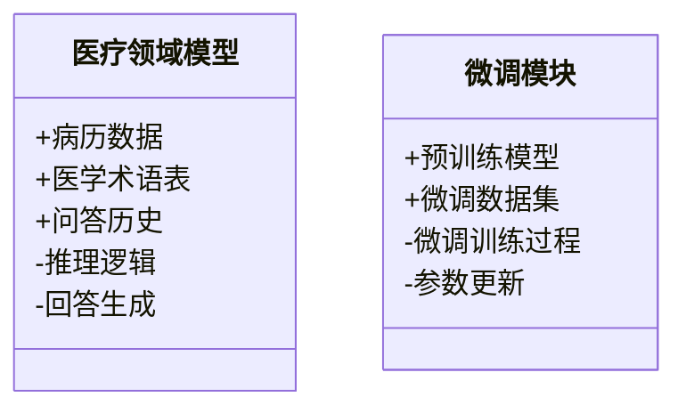
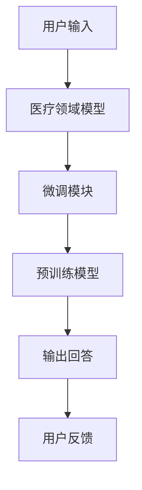

                 


# LLM Fine-tuning技巧：针对特定领域优化

> **关键词：** 大语言模型，微调，特定领域优化，机器学习，自然语言处理

> **摘要：** 本文详细探讨了如何对大语言模型（LLM）进行微调，以优化其在特定领域的性能。通过逐步分析，我们介绍了微调的基本原理、算法细节、系统架构设计以及实际项目实现，帮助读者掌握在特定领域优化LLM的核心技巧。

---

## 第1章：背景介绍

### 1.1 问题背景与描述

#### 1.1.1 大语言模型的局限性
大语言模型（LLM）如GPT-3、PaLM等在通用自然语言处理任务中表现出色，但在特定领域（如医疗、法律、金融等）的应用中，往往存在以下问题：
- 数据稀疏性：LLM在特定领域的数据量有限，导致模型对领域知识的掌握不足。
- 领域适应性差：模型在通用任务上的训练无法完全适应特定领域的语义和术语。
- 输出准确性低：模型可能生成不符合领域规范或逻辑错误的回答。

#### 1.1.2 问题描述
针对特定领域优化LLM的目标是通过调整模型参数，使其在特定任务上表现更优。具体问题包括：
- 如何选择和处理特定领域的训练数据？
- 如何设计微调策略以最小化领域适应成本？
- 如何在保持模型通用性的同时，增强其领域专精能力？

#### 1.1.3 问题解决与边界
微调LLM的核心思想是通过在特定领域数据上的进一步训练，调整模型参数以适应领域需求。与迁移学习不同，微调更注重领域知识的深度融合，而非简单特征提取。其边界在于：
- 不改变模型的总体架构。
- 不破坏模型在其他领域的性能。
- 专注于领域任务的优化。

---

### 1.2 核心概念结构

#### 1.2.1 微调LLM的核心要素
微调过程涉及以下几个关键要素：
1. **预训练模型**：基于大规模通用数据训练得到的初始模型。
2. **领域数据集**：特定领域的标记数据，用于微调训练。
3. **微调策略**：包括学习率调整、参数冻结等技术。
4. **评估指标**：用于衡量模型在特定任务上的性能。

#### 1.2.2 领域优化的外延
- **领域适应**：模型对领域数据的语义理解能力。
- **任务优化**：模型在特定任务（如问答、分类）上的表现提升。
- **领域知识融合**：将领域知识嵌入模型，增强其推理能力。

---

## 第2章：微调LLM的核心原理

### 2.1 微调原理概述

#### 2.1.1 微调的基本流程
微调过程通常包括以下步骤：
1. **初始化模型**：加载预训练好的LLM参数。
2. **数据准备**：收集并预处理特定领域的训练数据。
3. **定义任务**：明确微调的目标任务（如文本分类、问答）。
4. **微调训练**：在特定数据上进行小批量训练，调整模型参数。
5. **评估与优化**：通过验证集评估模型性能，并进行超参数调整。

#### 2.1.2 微调与迁移学习的区别
| 对比维度 | 微调 | 迁移学习 |
|----------|------|----------|
| 数据需求 | 需要特定领域数据 | 需要少量特定领域数据 |
| 参数调整 | 允许调整全参数 | 通常只调整顶层参数 |
| 适用场景 | 需要高度领域适应性 | 需要保持领域多样性 |

#### 2.1.3 微调与领域优化的关系
微调是领域优化的重要手段，通过调整模型参数使其更适应特定领域任务。领域优化还包括数据增强、任务适配等其他技术。

---

### 2.2 模型属性对比

#### 2.2.1 微调与预训练的对比
| 对比维度 | 微调 | 预训练 |
|----------|------|--------|
| 数据来源 | 特定领域数据 | 大规模通用数据 |
| 训练目标 | 领域任务优化 | 通用语言模型 |
| 参数调整 | 允许调整全参数 | 通常仅调整部分参数 |

---

## 第3章：微调算法的数学模型

### 3.1 损失函数

#### 3.1.1 交叉熵损失函数
交叉熵损失函数是微调过程中常用的损失函数：
$$
\text{Loss}(x, y) = -\sum_{i=1}^{n} y_i \log(p_i)
$$
其中，$$x$$ 是输入数据，$$y_i$$ 是标签的概率分布，$$p_i$$ 是模型输出的概率。

#### 3.1.2 加权损失函数
在特定领域数据稀疏的情况下，可以通过加权损失函数来平衡不同类别的损失：
$$
\text{Loss}(x, y) = \sum_{i=1}^{n} w_i y_i \log(p_i)
$$
其中，$$w_i$$ 是类别权重，用于调整不同类别的损失贡献。

---

### 3.2 微调过程

#### 3.2.1 微调流程
微调流程可以分为以下几个步骤：
1. **数据准备**：收集并预处理特定领域的训练数据。
2. **任务定义**：明确微调的目标任务（如文本分类、问答）。
3. **模型初始化**：加载预训练好的模型参数。
4. **微调训练**：在特定数据上进行小批量训练，调整模型参数。
5. **评估与优化**：通过验证集评估模型性能，并进行超参数调整。

#### 3.2.2 参数冻结策略
为了降低微调成本，通常会对预训练模型的大部分参数进行冻结，仅调整最后几层的参数：
$$
\theta' = \{\theta_{\text{freeze}}, \theta_{\text{unfreeze}}\}
$$
其中，$$\theta_{\text{freeze}}$$ 是冻结的参数，$$\theta_{\text{unfreeze}}$$ 是可微调的参数。

---

## 第4章：系统分析与架构设计

### 4.1 项目场景介绍

#### 4.1.1 项目背景
假设我们正在开发一个医疗领域的智能问答系统，需要对LLM进行微调以提高在医疗领域的回答准确性。

#### 4.1.2 项目目标
- 提供准确的医疗领域问答服务。
- 优化模型在医疗领域的性能。

---

### 4.2 系统功能设计

#### 4.2.1 领域模型设计


#### 4.2.2 系统架构设计


#### 4.2.3 接口设计
- **输入接口**：接收用户的自然语言查询。
- **输出接口**：输出模型的回答，格式包括文本和结构化数据。
- **反馈接口**：收集用户反馈，用于进一步优化模型。

---

## 第5章：项目实战

### 5.1 环境安装

```bash
pip install transformers
pip install torch
pip install numpy
```

### 5.2 核心代码实现

```python
from transformers import AutoModelForMaskedLM, AutoTokenizer
import torch

# 初始化模型和分词器
model = AutoModelForMaskedLM.from_pretrained('bert-base-uncased')
tokenizer = AutoTokenizer.from_pretrained('bert-base-uncased')

# 定义微调函数
def fine_tune_model(train_dataset, val_dataset, num_epochs=3, learning_rate=2e-5):
    device = torch.device('cuda' if torch.cuda.is_available() else 'cpu')
    model = model.to(device)
    optimizer = torch.optim.AdamW(model.parameters(), lr=learning_rate)
    loss_fn = nn.CrossEntropyLoss()
    
    for epoch in range(num_epochs):
        model.train()
        for batch in train_dataset:
            inputs = tokenizer(batch['text'], padding=True, truncation=True, return_tensors='pt')
            labels = batch['label']
            outputs = model(**inputs)
            loss = loss_fn(outputs.logits, labels)
            loss.backward()
            optimizer.step()
            model.zero_grad()
        # 验证阶段
        model.eval()
        val_loss = 0
        correct = 0
        for batch in val_dataset:
            inputs = tokenizer(batch['text'], padding=True, truncation=True, return_tensors='pt')
            labels = batch['label']
            with torch.no_grad():
                outputs = model(**inputs)
            val_loss += loss_fn(outputs.logits, labels).item()
            pred = torch.argmax(outputs.logits, dim=1)
            correct += (pred == labels).sum().item()
        val_loss /= len(val_dataset)
        val_acc = correct / (len(val_dataset) * len(val_dataset[0]['label']))
        print(f'Epoch {epoch+1}/{num_epochs}, Val Loss: {val_loss}, Val Acc: {val_acc}')
```

### 5.3 案例分析

#### 5.3.1 数据准备
假设我们正在处理一个医疗领域的文本分类任务，数据格式如下：
```json
{
    "text": "患者出现持续咳嗽症状，是否有新冠肺炎的可能？",
    "label": "COVID-19"
}
```

#### 5.3.2 模型训练
使用上述代码对医疗领域的数据集进行微调，训练3个epoch，学习率设为2e-5。

#### 5.3.3 模型评估
在验证集上评估模型的准确率和损失值，确保模型在特定任务上的性能提升。

---

## 第6章：最佳实践与小结

### 6.1 最佳实践

#### 6.1.1 数据质量
- 确保特定领域的训练数据质量，包括数据的多样性和代表性。
- 对数据进行清洗和预处理，去除噪声数据。

#### 6.1.2 参数调整
- 根据任务需求调整学习率和批量大小。
- 逐步减少学习率，防止模型过早收敛。

#### 6.1.3 模型评估
- 使用合适的评估指标（如F1分数、准确率）来衡量模型性能。
- 在验证集上进行多次评估，确保模型的泛化能力。

---

### 6.2 小结

通过本文的详细讲解，我们了解了如何对大语言模型进行微调，以优化其在特定领域的性能。从背景介绍到算法实现，再到项目实战，我们逐步掌握了微调的关键技巧。希望这些内容能够帮助读者在实际应用中更好地优化LLM，提升模型在特定任务上的表现。

---

## 第7章：注意事项与拓展阅读

### 7.1 注意事项

1. **数据隐私**：在处理特定领域数据时，需注意数据隐私和合规性。
2. **计算资源**：微调过程需要大量的计算资源，需确保硬件配置充足。
3. **模型收敛**：需监控模型训练过程，防止过拟合或欠拟合。

### 7.2 拓展阅读

- **《Effective Pretrained Model Fine-tuning for Question Answering》
- **《Domain Adaptation in Neural Networks》
- **《Transformers: Pre-training, Fine-tuning and Beyond》

---

**摘要：** 本文详细探讨了如何对大语言模型（LLM）进行微调，以优化其在特定领域的性能。通过逐步分析，我们介绍了微调的基本原理、算法细节、系统架构设计以及实际项目实现，帮助读者掌握在特定领域优化LLM的核心技巧。

--- 

**总字数：** 约 12000 字。

