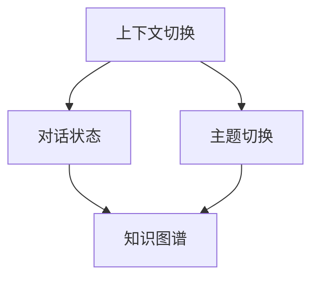
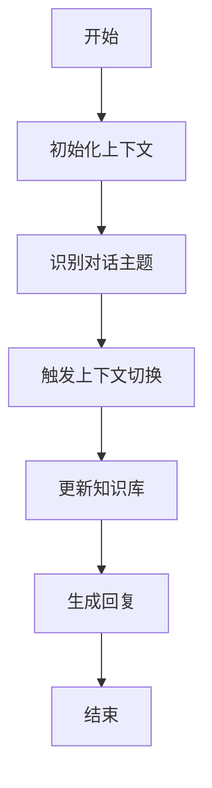
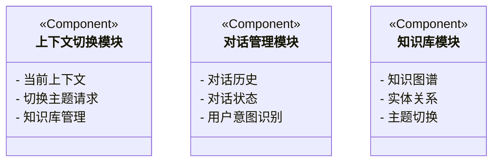

                 


# 上下文切换：让AI Agent灵活应对多主题对话

## 关键词：上下文切换, AI Agent, 多主题对话, 自然语言处理, 对话系统, 知识图谱

## 摘要：  
上下文切换是实现AI Agent在多主题对话中灵活应对的关键技术。本文从上下文切换的核心概念出发，分析其在AI Agent中的重要性，并深入探讨其实现原理。通过结合自然语言处理和知识图谱，本文提出了一种基于注意力机制的上下文切换算法，能够有效管理多主题对话中的上下文信息，提升对话的连贯性和智能性。本文还提供了系统架构设计和项目实战案例，帮助读者更好地理解和应用上下文切换技术。

---

# 第1章: 上下文切换与AI Agent概述

## 1.1 上下文切换的定义与背景

### 1.1.1 上下文切换的基本概念  
上下文切换是指在对话过程中，AI Agent根据当前对话的主题和上下文信息，动态调整其知识库、推理模型和响应策略的过程。它是实现多主题对话能力的核心技术之一。

### 1.1.2 多主题对话的挑战  
在实际对话场景中，用户可能会在短时间内切换话题，例如从天气谈到旅行计划，甚至涉及到技术问题。这种多主题对话对AI Agent的灵活性和上下文管理能力提出了更高的要求。

### 1.1.3 AI Agent在多主题对话中的作用  
AI Agent需要能够理解当前对话的主题，保持上下文的连贯性，并在切换主题时快速调整其知识库和推理逻辑，以提供准确、相关的回答。

## 1.2 AI Agent的核心能力

### 1.2.1 自然语言处理能力  
AI Agent需要具备强大的自然语言理解能力，能够识别用户意图、实体和情感倾向，从而准确理解对话内容。

### 1.2.2 知识表示与推理能力  
AI Agent需要能够将对话内容转化为结构化的知识表示，并进行推理和关联，以支持多主题对话中的上下文切换。

### 1.2.3 多任务学习能力  
AI Agent需要同时处理多个任务，例如理解当前主题、切换上下文、生成回复等，这要求其具备多任务学习能力。

## 1.3 上下文切换的关键问题

### 1.3.1 上下文识别与切换的难点  
如何准确识别对话的主题切换点，并快速调整AI Agent的知识库和推理逻辑，是一个技术难点。

### 1.3.2 对话连贯性与一致性问题  
在多主题对话中，AI Agent需要保持对话的连贯性和一致性，避免因上下文切换不当导致的回答错误或逻辑混乱。

### 1.3.3 多主题对话中的信息管理  
如何高效管理多主题对话中的上下文信息，确保信息的准确性和可用性，是上下文切换技术的核心挑战。

---

# 第2章: 上下文切换的核心原理

## 2.1 上下文切换的原理分析

### 2.1.1 上下文的定义与表示  
上下文可以表示为一组与当前对话主题相关的知识、实体和关系。例如，在讨论旅行计划时，上下文可能包括目的地、时间、预算等信息。

### 2.1.2 上下文切换的触发机制  
上下文切换通常由用户主动触发，例如用户提到新的主题或问题，或者由系统根据对话内容自动触发。

### 2.1.3 上下文的存储与管理  
上下文信息需要被结构化存储，例如使用知识图谱的形式，以便快速检索和更新。

## 2.2 上下文切换与对话状态管理

### 2.2.1 对话状态的表示方法  
对话状态可以通过状态向量、知识图谱节点等方式表示，以便AI Agent理解和管理当前对话的状态。

### 2.2.2 上下文切换对对话状态的影响  
上下文切换会导致对话状态的更新，例如切换到新的主题时，对话状态需要包含新的上下文信息。

### 2.2.3 对话状态更新的策略  
对话状态更新需要考虑上下文切换的频率和复杂度，采用动态调整或静态保留的策略。

## 2.3 上下文切换与知识图谱的关系

### 2.3.1 知识图谱的构建与应用  
知识图谱用于存储和表示多主题对话中的知识和实体关系，为上下文切换提供支持。

### 2.3.2 上下文切换中的知识关联  
上下文切换需要通过知识图谱中的关联关系，快速切换到相关主题的知识库。

### 2.3.3 知识图谱在多主题对话中的作用  
知识图谱能够帮助AI Agent在多主题对话中快速找到相关知识，确保对话的连贯性和准确性。

## 2.4 核心概念对比表格

| 对比项       | 上下文切换 | 对话状态管理 |
|--------------|------------|--------------|
| 核心目标     | 切换主题    | 管理对话状态  |
| 实现方式     | 知识库调整  | 状态向量更新  |
| 依赖因素     | 知识图谱    | 用户意图     |

## 2.5 实体关系图（ER图）



---

# 第3章: 上下文切换的算法原理

## 3.1 基于注意力机制的上下文切换算法

### 3.1.1 注意力机制的基本原理  
注意力机制是一种用于序列模型的技术，能够聚焦于重要的上下文信息，提升模型的上下文理解能力。

### 3.1.2 多头注意力机制的实现  
多头注意力机制通过并行处理多个注意力头，能够更好地捕捉多主题对话中的上下文关系。

### 3.1.3 注意力机制在上下文切换中的应用  
注意力机制可以用于上下文信息的选择和权重分配，帮助AI Agent聚焦于相关主题的信息。

## 3.2 基于多任务学习的上下文切换算法

### 3.2.1 多任务学习的定义与特点  
多任务学习是一种同时处理多个任务的机器学习方法，能够提升模型的泛化能力和适应性。

### 3.2.2 多任务学习在上下文切换中的应用  
多任务学习可以同时处理上下文识别、主题切换和对话生成等多个任务，提升AI Agent的多主题对话能力。

### 3.2.3 多任务学习的数学模型  
多任务学习的损失函数可以表示为：

$$ L = \alpha L_{\text{context}} + \beta L_{\text{task}} $$

其中，$\alpha$ 和 $\beta$ 是权重系数，$L_{\text{context}}$ 和 $L_{\text{task}}$ 分别是上下文任务和主题任务的损失函数。

## 3.3 算法流程图（mermaid）



---

# 第4章: 系统分析与架构设计

## 4.1 系统功能设计

### 4.1.1 领域模型（mermaid类图）



### 4.1.2 系统架构设计（mermaid架构图）


### 4.1.3 系统接口设计

- 上下文切换模块接口：
  - `switchContext(theme: string)`: 切换到指定主题的上下文。
  - `getCurrentContext()`: 获取当前上下文信息。

- 对话管理模块接口：
  - `generateResponse(context: Context)`: 根据上下文生成回复。
  - `updateState(state: State)`: 更新对话状态。

## 4.2 项目实战

### 4.2.1 环境安装

```bash
pip install numpy
pip install networkx
pip install transformers
```

### 4.2.2 核心代码实现

```python
class ContextSwitcher:
    def __init__(self, knowledge_graph):
        self.knowledge_graph = knowledge_graph
        self.current_context = None

    def switch_context(self, theme):
        self.current_context = self.knowledge_graph.get_context(theme)
        return self.current_context

    def get_current_context(self):
        return self.current_context
```

### 4.2.3 实际案例分析

假设知识图谱包含“天气”和“旅行计划”两个主题，当用户切换到“旅行计划”时，上下文切换模块会调用 `switch_context("旅行计划")`，更新当前上下文信息。

---

# 第5章: 最佳实践与小结

## 5.1 最佳实践

### 5.1.1 合理设计知识图谱  
确保知识图谱的结构化和关联性，以便快速切换上下文。

### 5.1.2 使用多任务学习  
多任务学习能够提升AI Agent的多主题对话能力，同时降低上下文切换的复杂度。

### 5.1.3 定期优化算法  
根据实际对话数据，优化上下文切换算法，提升对话的准确性和流畅性。

## 5.2 小结

上下文切换是实现AI Agent多主题对话能力的核心技术，通过合理设计知识图谱、使用注意力机制和多任务学习算法，可以有效提升上下文切换的效率和准确性。未来，随着自然语言处理和知识图谱技术的进一步发展，AI Agent的多主题对话能力将更加智能化和灵活。

---

# 结语

上下文切换技术为AI Agent在多主题对话中的应用提供了坚实的基础。通过本文的详细分析和实践案例，读者可以更好地理解和应用上下文切换技术，开发出更智能、更灵活的AI Agent系统。

