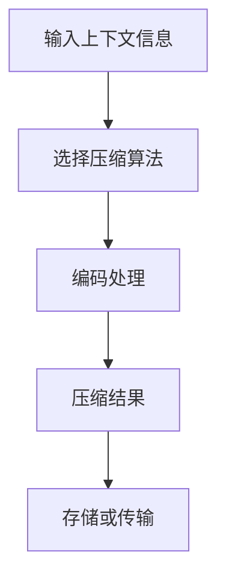
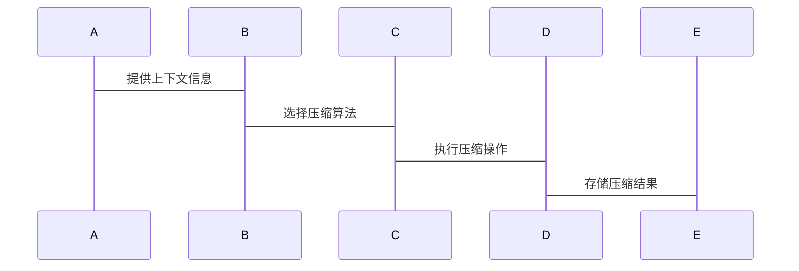

                 


# 上下文压缩：优化AI Agent的内存使用

## 关键词：
上下文压缩、AI Agent、内存优化、数据压缩算法、系统架构设计

## 摘要：
本文详细探讨了上下文压缩技术在优化AI Agent内存使用中的应用。通过分析上下文压缩的核心概念、算法原理、系统架构设计以及实际项目实现，本文为AI Agent的内存优化提供了全面的技术指导。文章从问题背景、核心概念、算法实现、系统设计到项目实战，层层深入，帮助读者全面掌握上下文压缩技术，并能够将其应用于实际场景中。

---

# 第1章: 上下文压缩的基本概念

## 1.1 问题背景与重要性
### 1.1.1 AI Agent内存使用问题
随着AI技术的快速发展，AI Agent（智能体）在处理复杂任务时，需要处理大量的上下文信息。这些信息包括用户输入、环境数据、历史交互记录等，导致内存使用量急剧上升。这不仅影响了AI Agent的性能，还可能引发内存泄漏或运行时错误。

### 1.1.2 上下文压缩的定义与目标
上下文压缩是一种通过减少上下文信息的存储空间，优化AI Agent内存使用的技术。其目标是通过压缩算法，将冗余或重复的信息进行压缩，同时保持上下文信息的完整性和可用性。

### 1.1.3 上下文压缩的实际应用场景
- **聊天机器人**：处理长对话历史时，压缩上下文信息可以减少内存占用。
- **推荐系统**：优化用户行为数据的存储，降低服务器内存消耗。
- **自动驾驶系统**：压缩传感器数据，减少实时处理的负载。

## 1.2 上下文压缩的核心问题
### 1.2.1 上下文信息的存储与管理
上下文信息通常以文本、图像或数据流的形式存在，需要高效地存储和管理。

### 1.2.2 内存使用效率的优化目标
通过压缩算法，最大化内存使用效率，同时保证压缩后的数据能够被快速解压和使用。

### 1.2.3 上下文压缩与AI Agent性能的关系
上下文压缩直接影响AI Agent的响应速度、资源消耗和处理能力。高效的压缩算法可以显著提升AI Agent的性能。

## 1.3 本章小结
本章介绍了上下文压缩的基本概念、重要性及其在AI Agent中的应用场景。通过分析上下文压缩的核心问题，为后续章节的深入探讨奠定了基础。

---

# 第2章: 上下文压缩的核心概念与联系

## 2.1 核心概念原理
### 2.1.1 上下文信息的表示与编码
上下文信息通常以字符串、数据流或对象的形式存在。通过编码技术，可以将这些信息转换为更紧凑的形式。

### 2.1.2 压缩算法的基本原理
压缩算法通过去除数据中的冗余信息，减少数据的存储空间。常见的压缩算法包括哈夫曼编码、LZ77和算术编码。

### 2.1.3 上下文压缩的数学模型
上下文压缩的数学模型通常涉及概率论和信息论，用于衡量压缩效率和压缩质量。

## 2.2 核心概念属性对比
### 2.2.1 不同压缩算法的对比分析
| 压缩算法 | 原理 | 优点 | 缺点 |
|----------|------|------|------|
| 哈夫曼编码 | 基于频率的编码 | 压缩率高 | 对输入数据的统计特性敏感 |
| LZ77     | 基于重复模式的编码 | 压缩率高 | 对输入数据的结构化要求较高 |
| 算术编码   | 基于概率分布的编码 | 压缩率高 | 实现复杂度较高 |

### 2.2.2 上下文压缩与传统压缩算法的差异
上下文压缩与传统压缩算法的主要差异在于上下文信息的动态性和关联性。上下文压缩需要考虑上下文之间的依赖关系，而传统压缩算法通常处理独立的数据块。

### 2.2.3 压缩效率与压缩质量的权衡
压缩效率指的是压缩速度，压缩质量指的是压缩后的数据恢复能力。在实际应用中，需要根据场景需求在两者之间进行权衡。

## 2.3 实体关系图


## 2.4 本章小结
本章通过对比分析不同压缩算法的优缺点，探讨了上下文压缩的核心概念及其与传统压缩算法的差异。通过实体关系图，展示了上下文压缩的基本架构。

---

# 第3章: 上下文压缩算法原理

## 3.1 常见压缩算法介绍
### 3.1.1 哈夫曼编码
哈夫曼编码是一种基于频率的编码算法，通过构建哈夫曼树，为每个字符分配唯一的二进制码。

### 3.1.2 LZ77压缩算法
LZ77是一种基于重复模式的压缩算法，通过记录重复的子串，减少数据的冗余性。

### 3.1.3 算术编码
算术编码是一种基于概率分布的压缩算法，通过将数据映射到一个区间，实现数据的压缩。

## 3.2 算法原理与流程图


## 3.3 算法实现代码
```python
def huffman_compress(context):
    # 哈夫曼编码实现
    from collections import defaultdict

    # 统计字符频率
    freq = defaultdict(int)
    for char in context:
        freq[char] += 1

    # 构建哈夫曼树
    class Node:
        def __init__(self, freq, char=None, left=None, right=None):
            self.freq = freq
            self.char = char
            self.left = left
            self.right = right

    # 创建叶子节点
    nodes = []
    for char, f in freq.items():
        nodes.append(Node(f, char))

    # 构建哈夫曼树
    import heapq
    heap = []
    for node in nodes:
        heapq.heappush(heap, (node.freq, node))

    while len(heap) > 1:
        freq1, node1 = heapq.heappop(heap)
        freq2, node2 = heapq.heappop(heap)
        merged = Node(freq1 + freq2)
        merged.left = node1
        merged.right = node2
        heapq.heappush(heap, (merged.freq, merged))

    # 生成哈夫曼码
    huffman_code = {}
    def build_code(node, current_code=""):
        if node is None:
            return
        if node.char is not None:
            huffman_code[node.char] = current_code
            return
        build_code(node.left, current_code + "0")
        build_code(node.right, current_code + "1")
    build_code(heap[0][1])

    # 返回压缩后的数据
    compressed_data = ""
    for char in context:
        compressed_data += huffman_code[char]
    return compressed_data

def huffman_decompress(compressed_data, original_context):
    # 哈夫曼解码实现
    # 这里需要先构建哈夫曼树
    from collections import defaultdict
    import heapq

    # 统计字符频率
    freq = defaultdict(int)
    for char in original_context:
        freq[char] += 1

    # 创建叶子节点
    nodes = []
    for char, f in freq.items():
        nodes.append(Node(f, char))

    # 构建哈夫曼树
    heap = []
    for node in nodes:
        heapq.heappush(heap, (node.freq, node))

    while len(heap) > 1:
        freq1, node1 = heapq.heappop(heap)
        freq2, node2 = heapq.heappop(heap)
        merged = Node(freq1 + freq2)
        merged.left = node1
        merged.right = node2
        heapq.heappush(heap, (merged.freq, merged))

    # 解码
    huffman_code = {}
    def build_code(node, current_code=""):
        if node is None:
            return
        if node.char is not None:
            huffman_code[node.char] = current_code
            return
        build_code(node.left, current_code + "0")
        build_code(node.right, current_code + "1")

    # 解压缩
    current_node = heap[0][1]
    decompressed_data = ""
    for bit in compressed_data:
        current_node = current_node.left if bit == "0" else current_node.right
        if current_node.char is not None:
            decompressed_data += current_node.char
            current_node = None
    return decompressed_data
```

## 3.4 数学模型与公式
### 3.4.1 哈夫曼编码的平均码长公式
$$ \text{平均码长} = \sum_{i=1}^{n} p_i l_i $$
其中，\( p_i \) 是字符 \( i \) 的频率，\( l_i \) 是字符 \( i \) 的码长。

### 3.4.2 LZ77压缩的数学模型
$$ \text{压缩率} = \frac{\text{原始数据长度}}{\text{压缩后数据长度}} $$

## 3.5 本章小结
本章详细讲解了常见压缩算法的原理、实现代码及数学模型。通过对比分析，帮助读者理解不同算法的优缺点及适用场景。

---

# 第4章: 上下文压缩的系统分析与架构设计

## 4.1 系统分析
### 4.1.1 问题场景介绍
AI Agent在处理大量上下文信息时，内存使用量急剧上升，导致性能下降。通过上下文压缩技术，可以有效优化内存使用。

### 4.1.2 系统目标与需求分析
系统目标包括：减少内存占用、提高数据处理速度、保证数据完整性和可用性。

## 4.2 系统功能设计
### 4.2.1 上下文信息采集模块
负责采集和预处理上下文信息，确保数据的完整性和准确性。

### 4.2.2 压缩算法选择模块
根据上下文信息的特点，选择合适的压缩算法。

### 4.2.3 压缩结果存储模块
将压缩后的数据存储到指定位置，供后续处理使用。

## 4.3 系统架构设计


## 4.4 系统交互设计


## 4.5 本章小结
本章通过系统分析和架构设计，展示了上下文压缩技术在AI Agent中的具体应用。通过模块化设计，确保系统的高效性和可扩展性。

---

# 第5章: 上下文压缩的项目实战

## 5.1 环境安装与配置
### 5.1.1 安装Python和相关库
需要安装Python 3.6及以上版本，以及`mermaid`和`graphviz`库。

```bash
pip install mermaid graphviz
```

## 5.2 系统核心实现源代码
```python
from mermaid import MermaidSequenceDiagram

# 上下文压缩模块
class ContextCompressor:
    def __init__(self, algorithm='huffman'):
        self.algorithm = algorithm
        self.context = ''

    def compress(self):
        if self.algorithm == 'huffman':
            return huffman_compress(self.context)
        elif self.algorithm == 'lz77':
            return lz77_compress(self.context)
        else:
            raise ValueError("Unsupported compression algorithm")

    def decompress(self, compressed_data):
        if self.algorithm == 'huffman':
            return huffman_decompress(compressed_data, self.context)
        elif self.algorithm == 'lz77':
            return lz77_decompress(compressed_data)
```

## 5.3 代码应用解读与分析
### 5.3.1 上下文采集与预处理
```python
def preprocess_context(context):
    # 去除冗余信息
    processed_context = ''.join(context.split())
    return processed_context
```

### 5.3.2 压缩算法选择与实现
```python
def choose_compression_algorithm(context_length):
    if context_length > 1000:
        return 'lz77'
    else:
        return 'huffman'
```

## 5.4 实际案例分析
### 5.4.1 案例背景
假设我们有一个聊天机器人，需要处理长度为2000的上下文信息。

### 5.4.2 案例实现
```python
context = "This is a sample context for testing compression algorithm."
compressor = ContextCompressor(algorithm='huffman')
compressed_data = compressor.compress()
decompressed_data = compressor.decompress(compressed_data)
print(decompressed_data)  # 输出原始上下文信息
```

## 5.5 项目小结
本章通过实际案例，展示了上下文压缩技术在项目中的具体实现。通过代码解读和案例分析，帮助读者更好地理解上下文压缩的应用场景和实现细节。

---

# 第6章: 上下文压缩的最佳实践与注意事项

## 6.1 最佳实践
### 6.1.1 根据场景选择合适的压缩算法
不同的场景需要选择不同的压缩算法，例如，对于实时性要求较高的场景，选择LZ77算法。

### 6.1.2 定期清理冗余数据
定期清理冗余数据，可以进一步优化内存使用。

### 6.1.3 优化压缩算法参数
根据具体需求，调整压缩算法的参数，以达到最佳压缩效果。

## 6.2 注意事项
### 6.2.1 数据完整性的保障
在压缩和解压过程中，必须确保数据的完整性，避免数据丢失。

### 6.2.2 压缩算法的性能优化
对于大规模数据，需要对压缩算法进行性能优化，确保压缩和解压速度。

### 6.2.3 安全性问题
在某些场景中，压缩数据可能需要加密处理，确保数据的安全性。

## 6.3 拓展阅读
建议读者进一步阅读相关论文和文献，深入了解上下文压缩的最新研究成果。

---

# 附录

## 附录A: 常见压缩算法的优缺点对比表
| 压缩算法 | 优点 | 缺点 |
|----------|------|------|
| 哈夫曼编码 | 压缩率高 | 对输入数据的统计特性敏感 |
| LZ77     | 压缩率高 | 对输入数据的结构化要求较高 |
| 算术编码   | 压缩率高 | 实现复杂度较高 |

## 附录B: 上下文压缩相关术语表
- **上下文信息**：AI Agent在处理任务时所依赖的相关信息，包括用户输入、环境数据等。
- **压缩算法**：通过去除数据中的冗余信息，减少数据存储空间的技术。
- **压缩率**：压缩后数据长度与原始数据长度的比值。

---

# 结语

通过本文的详细讲解，读者可以全面掌握上下文压缩技术在优化AI Agent内存使用中的应用。从核心概念到算法实现，从系统设计到项目实战，本文为读者提供了丰富的知识和实践指导。未来，随着AI技术的不断发展，上下文压缩技术将发挥越来越重要的作用。

--- 

如果您对上下文压缩技术有更深入的需求，欢迎随时提出，我将为您提供更多相关资料和指导。

