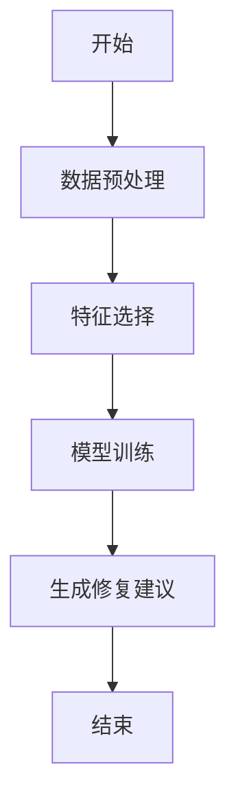
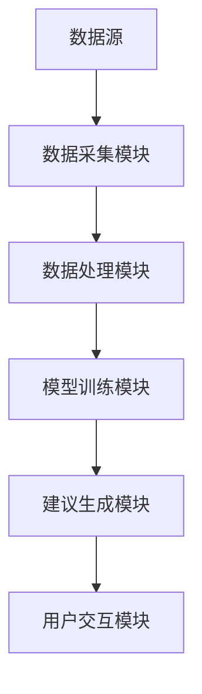

                 


# 个人信用修复建议生成器

---

## 关键词：
- 个人信用修复  
- 信用评分模型  
- 机器学习  
- 系统架构设计  
- 信用修复算法  

---

## 摘要：
随着信用评分在金融领域的广泛应用，个人信用修复的需求日益增长。本文旨在设计一个基于机器学习的个人信用修复建议生成器，通过分析信用评分模型的核心算法、系统架构设计以及实际项目实现，为用户提供个性化的信用修复建议。文章详细介绍了信用评分模型的原理、修复建议生成的算法流程，以及系统架构的实现方案，并通过实际案例展示了如何利用该系统进行信用修复。

---

## 第一部分：个人信用修复的背景与概念

### 第1章：个人信用修复的背景与重要性

#### 1.1 信用修复的定义与核心概念
- **1.1.1 信用修复的定义**  
  信用修复是指通过调整个人的信用行为，改善信用评分的过程。信用评分是金融机构评估个人信用风险的重要指标，直接影响个人的贷款申请、信用卡额度等金融服务。

- **1.1.2 个人信用评分的核心要素**  
  个人信用评分主要基于以下几个核心要素：  
  - **信用历史**：包括按时还款记录、逾期记录等。  
  - **信用使用情况**：包括信用卡使用率、贷款余额等。  
  - **信用 inquiries**：查询记录，包括自我查询和机构查询。  
  - **信用种类**：拥有的信用卡、贷款等种类。  
  - **时间因素**：信用历史的长短。

- **1.1.3 信用修复的必要性与应用场景**  
  信用修复的必要性主要体现在以下几个方面：  
  - **改善信用评分**：通过修复不良信用记录，提高信用评分。  
  - **降低融资成本**：良好的信用评分通常意味着更低的贷款利率。  
  - **增加融资机会**：高信用评分者更容易获得金融机构的青睐。

#### 1.2 个人信用评分模型简介
- **1.2.1 信用评分模型的基本原理**  
  信用评分模型通过分析个人的信用历史、行为数据等，利用数学模型计算出一个信用评分。常见的信用评分模型包括线性回归模型、决策树模型、随机森林模型等。

- **1.2.2 主流信用评分模型对比**  
  下表对比了几种常见的信用评分模型：

  | 模型名称       | 优点                           | 缺点                           |
  |----------------|--------------------------------|--------------------------------|
  | 线性回归       | 简单易懂，计算速度快             | 易受异常值影响，模型复杂度低   |
  | 决策树         | 易解释，适合处理非线性关系       | � prone to overfitting         |
  | 随机森林       | 鲁棒性高，抗过拟合能力强           | 计算复杂度高                   |
  | 支持向量机（SVM）| 分离能力强，适合小样本数据       | 数据预处理复杂                 |

- **1.2.3 信用评分模型的局限性与改进方向**  
  信用评分模型的局限性主要体现在以下方面：  
  - 数据质量问题：模型的准确性依赖于数据的完整性和准确性。  
  - 过度依赖历史数据：模型难以捕捉实时信用行为的变化。  
  - 模型解释性问题：部分复杂模型（如随机森林）难以解释具体评分逻辑。

#### 1.3 个人信用修复的法律与伦理问题
- **1.3.1 信用修复的法律框架**  
  不同国家和地区对信用修复的法律有不同的规定。例如，在美国，消费者可以通过《公平信用报告法案》（FCRA）要求更正错误的信用记录。在中国，个人可以通过向中国人民银行提交异议申请来修复不良信用记录。

- **1.3.2 信用修复的伦理挑战**  
  信用修复涉及个人隐私和金融机构的利益，如何在保护个人隐私的同时，确保金融机构的权益，是一个复杂的伦理问题。

- **1.3.3 个人隐私保护与信用修复的关系**  
  在信用修复过程中，必须严格保护个人隐私，确保信用数据的安全性和合法性。

---

## 第二部分：信用修复建议生成器的核心算法与原理

### 第2章：信用修复建议生成器的核心算法

#### 2.1 信用评分预测模型
- **2.1.1 线性回归模型**  
  线性回归模型是一种简单但有效的信用评分预测模型。其基本原理是通过最小化预测值与实际值之间的平方差之和，找到最佳拟合直线。

  公式：
  $$ \text{预测值} = \beta_0 + \beta_1 \times \text{特征1} + \beta_2 \times \text{特征2} + \ldots + \beta_n \times \text{特征n} $$

- **2.1.2 随机森林模型**  
  随机森林是一种基于决策树的集成学习算法，通过随机选取特征和样本进行多次训练，最终通过投票或加权的方式得出预测结果。

  流程图：
  ```mermaid
  graph TD
      A[开始] --> B[数据预处理]
      B --> C[特征选择]
      C --> D[模型训练]
      D --> E[生成修复建议]
      E --> F[结束]
  ```

- **2.1.3 支持向量机（SVM）模型**  
  SVM是一种监督学习算法，通过在特征空间中找到一个超平面，将数据分为两类。在信用评分预测中，SVM可以有效处理非线性关系。

  公式：
  $$ y = \text{sign}(w \cdot x + b) $$

#### 2.2 信用修复建议生成算法
- **2.2.1 基于规则的修复建议生成**  
  基于规则的修复建议生成是一种简单但有效的策略，通过预设的规则（如“按时还款可以提高信用评分”）生成修复建议。

- **2.2.2 基于机器学习的修复建议生成**  
  基于机器学习的修复建议生成通过训练模型，预测不同修复行为对信用评分的影响，从而生成最优修复建议。

- **2.2.3 混合模型的修复建议生成**  
  混合模型结合了基于规则和基于机器学习的优势，通过规则初步筛选修复建议，再利用机器学习模型优化建议。

#### 2.3 算法流程图


---

## 第三部分：信用修复建议生成器的系统架构与设计

### 第3章：系统架构设计

#### 3.1 系统功能模块划分
- **3.1.1 数据采集模块**  
  数据采集模块负责从多种数据源（如信用报告、银行交易记录等）获取个人信用数据。

- **3.1.2 数据处理模块**  
  数据处理模块对采集到的数据进行清洗、特征提取和数据转换，为后续模型训练提供高质量的数据。

- **3.1.3 模型训练模块**  
  模型训练模块利用训练数据集训练信用评分预测模型和修复建议生成模型。

- **3.1.4 建议生成模块**  
  建议生成模块根据训练好的模型生成个性化的信用修复建议。

- **3.1.5 用户交互模块**  
  用户交互模块为用户提供友好的操作界面，展示信用评分结果和修复建议。

#### 3.2 系统架构图


---

## 第四部分：信用修复建议生成器的实现与实战

### 第4章：环境搭建与数据准备

#### 4.1 环境安装
- **4.1.1 安装Python**  
  Python是当前最受欢迎的编程语言之一，支持多种机器学习库。

- **4.1.2 安装必要的库**  
  需要安装以下库：  
  - `pandas`：数据处理库  
  - `scikit-learn`：机器学习库  
  - `matplotlib`：数据可视化库  
  - `mermaid`：图表生成工具  

#### 4.2 数据准备
- **4.2.1 数据来源**  
  数据可以来自公开数据集（如Kaggle）或模拟数据生成器。

- **4.2.2 数据清洗**  
  数据清洗包括处理缺失值、异常值和重复值。

- **4.2.3 数据特征工程**  
  特征工程包括特征选择、特征转换和特征组合。

### 第5章：核心代码实现

#### 5.1 数据预处理代码
```python
import pandas as pd

# 加载数据
data = pd.read_csv('credit_data.csv')

# 数据清洗
data.dropna(inplace=True)
data = pd.get_dummies(data)
```

#### 5.2 模型训练代码
```python
from sklearn.ensemble import RandomForestClassifier
from sklearn.model_selection import train_test_split

# 划分数据集
X_train, X_test, y_train, y_test = train_test_split(data.drop('credit_score', axis=1), data['credit_score'], test_size=0.2, random_state=42)

# 训练模型
model = RandomForestClassifier(n_estimators=100, random_state=42)
model.fit(X_train, y_train)

# 预测信用评分
y_pred = model.predict(X_test)
```

#### 5.3 修复建议生成代码
```python
def generate修复建议(credit_score):
    if credit_score < 500:
        return "建议您优先偿还逾期账单，保持良好的还款记录。"
    elif 500 <= credit_score < 600:
        return "建议您合理使用信用卡，避免频繁查询信用报告。"
    else:
        return "您的信用评分良好，继续保持即可。"
```

### 第6章：实际案例分析

#### 6.1 案例背景
某用户信用评分为620分，希望通过修复建议生成器获得提高信用评分的方法。

#### 6.2 数据分析
- 该用户的信用历史存在少量逾期记录。
- 信用卡使用率较高，接近信用额度的90%。
- 近期有多次信用查询记录。

#### 6.3 模型预测与建议
- 模型预测该用户的信用评分为620分。
- 修复建议生成器根据模型预测结果，生成以下建议：  
  "建议您降低信用卡使用率，避免频繁查询信用报告。"

---

## 第五部分：总结与展望

### 第7章：总结与展望

#### 7.1 本文总结
本文设计了一个基于机器学习的个人信用修复建议生成器，详细介绍了系统的架构设计、算法实现和实际案例分析。通过该系统，用户可以获得个性化的信用修复建议，从而有效改善信用评分。

#### 7.2 未来展望
未来，随着机器学习和大数据技术的不断发展，信用修复建议生成器将更加智能化和个性化。以下是未来可能的发展方向：  
- **实时信用修复建议**：通过实时数据分析，动态生成信用修复建议。  
- **多模型融合**：结合多种机器学习模型，提高修复建议的准确性和实用性。  
- **个性化修复策略**：根据用户的个性化需求，定制化信用修复方案。

---

## 参考文献
1. 《机器学习实战》  
2. 《信用评分模型与应用》  
3. 《个人信用修复指南》  

---

## 致谢
感谢读者的耐心阅读，感谢相关领域的专家和同行的指导与支持。

