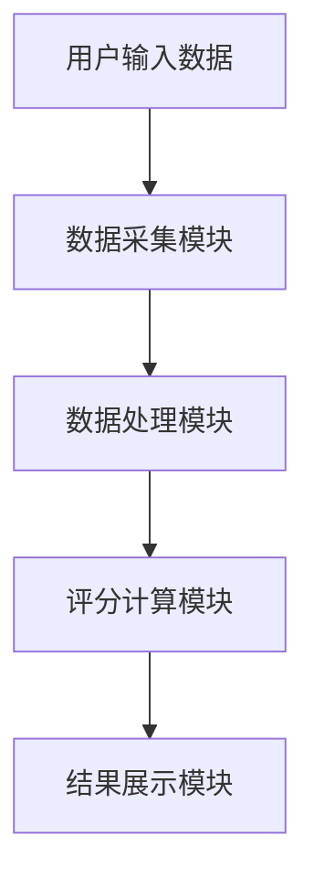
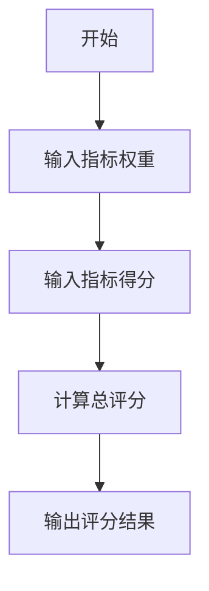
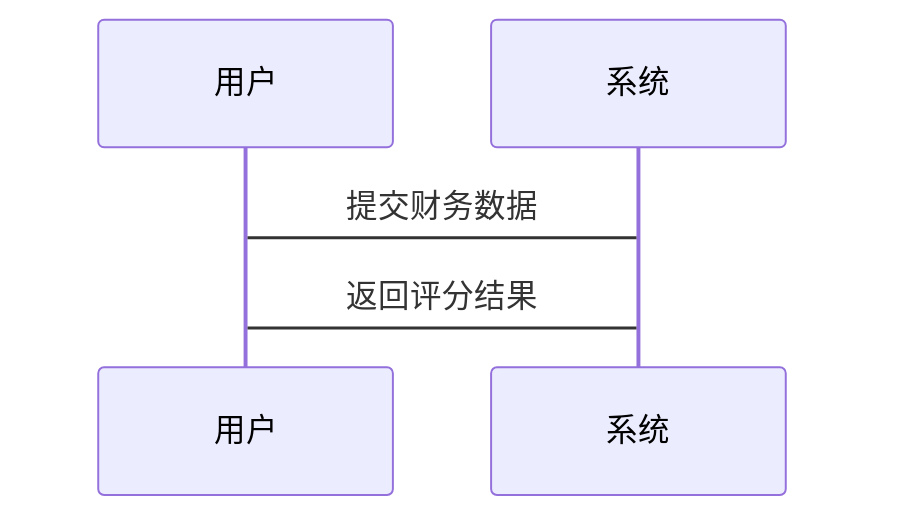

                 


# 个人财务健康评分系统设计

> 关键词：个人财务健康评分系统、财务健康评估、评分算法、系统架构、项目实战

> 摘要：个人财务健康评分系统是一种通过量化分析个人财务状况，提供健康评分的系统。本文将详细探讨该系统的背景、核心概念、算法实现、系统架构设计以及项目实战，为读者提供全面的系统设计思路。

---

# 第一部分：个人财务健康评分系统概述

## 第1章：个人财务健康评分系统背景与问题分析

### 1.1 个人财务健康评分的背景与意义
#### 1.1.1 个人财务管理的重要性
- 个人财务管理是实现财务自由的基础。
- 通过科学的评分系统，帮助用户优化财务结构。

#### 1.1.2 财务健康评分的定义与目标
- 财务健康评分：通过量化指标评估个人财务状况的健康程度。
- 目标：帮助用户识别财务问题，提供改进建议。

#### 1.1.3 系统设计的必要性与价值
- 系统设计是实现自动化财务评估的关键。
- 提供个性化建议，帮助用户实现财务目标。

### 1.2 个人财务健康问题的现状与挑战
#### 1.2.1 当前个人财务管理的痛点
- 信息分散：银行账户、投资、负债等数据分散。
- 缺乏专业性：用户难以准确评估自身财务状况。
- 缺乏工具：缺乏简便的自动化评估工具。

#### 1.2.2 财务健康评分系统的需求分析
- 需求背景：用户需要简单、直观的财务健康评估工具。
- 需求分析：通过数据分析，量化用户的财务状况。

#### 1.2.3 系统设计的关键问题与边界
- 关键问题：如何准确量化财务指标。
- 边界：聚焦于个人财务，不涉及企业或机构。

### 1.3 本章小结
- 财务健康评分系统的核心目标是帮助用户了解和优化财务状况。
- 系统设计需要解决数据整合、量化评估等问题。

---

## 第2章：财务健康评分系统的核心概念与联系

### 2.1 财务健康评分的核心概念
#### 2.1.1 财务健康评分的定义
- 财务健康评分：通过多维度指标评估个人财务状况的健康程度。
- 指标包括：收入支出比、资产负债比、储蓄率等。

#### 2.1.2 评分指标的分类与特征
- 收入类指标：月收入、年收入等。
- 支出类指标：日常生活支出、投资支出等。
- 资产负债类指标：净资产、负债率等。

#### 2.1.3 系统的核心要素与组成
- 数据采集模块：整合用户财务数据。
- 评分计算模块：计算健康评分。
- 结果展示模块：可视化评分结果。

### 2.2 财务健康评分指标的对比分析
#### 2.2.1 指标对比特征表格
| 指标类型 | 指标名称 | 描述 | 计算公式 | 特性 |
|----------|----------|------|----------|------|
| 收入类   | 月收入   | 用户每月收入总额 | 收入 = 工资 + 其他收入 | 高收入用户评分高 |
| 支出类   | 日常支出 | 用户每月日常开支 | 支出 = 食品 + 交通 + 其他 | 支出越低评分越高 |
| 资产负债类 | 净资产   | 用户总资产减去负债 | 净资产 = 资产 - 负债 | 净资产越高评分越高 |

#### 2.2.2 指标对比的ER实体关系图
```mermaid
er
actor: 用户
schema: 财务评分系统
entity: 财务指标
attribute: 指标类型、指标名称、描述、计算公式
```

### 2.3 系统的核心流程与架构
#### 2.3.1 系统核心流程的Mermaid流程图


#### 2.3.2 系统架构的ER实体关系图
```mermaid
er
actor: 用户
schema: 财务评分系统
entity: 财务指标
attribute: 指标类型、指标名称、描述、计算公式
```

### 2.4 本章小结
- 本章介绍了财务健康评分的核心概念和指标分类。
- 通过对比分析，明确了系统设计的关键要素。

---

## 第3章：财务健康评分算法原理与实现

### 3.1 财务健康评分算法的数学模型
#### 3.1.1 算法原理的数学公式
- 加权评分公式：
$$ \text{总评分} = \sum (\text{指标权重} \times \text{指标得分}) $$

#### 3.1.2 算法原理的详细解释
- 每个指标赋予不同的权重。
- 根据指标得分计算总评分。

#### 3.1.3 算法原理的Mermaid流程图


### 3.2 算法实现的Python源代码
```python
# 定义指标权重
weights = {
    '月收入': 0.3,
    '日常支出': 0.2,
    '净资产': 0.5
}

# 输入指标得分
scores = {
    '月收入': 0.8,
    '日常支出': 0.6,
    '净资产': 0.7
}

# 计算总评分
total_score = sum(weights[key] * scores[key] for key in weights)
print(f"总评分：{total_score}")
```

### 3.3 本章小结
- 本章详细讲解了财务健康评分算法的数学模型和实现方法。
- 提供了Python代码实现，帮助读者理解算法原理。

---

## 第4章：系统分析与架构设计方案

### 4.1 问题场景介绍
- 系统需要处理多来源的财务数据。
- 需要支持多用户同时访问。

### 4.2 系统功能设计
#### 4.2.1 领域模型的Mermaid类图


### 4.3 系统架构设计
#### 4.3.1 系统架构的Mermaid架构图


### 4.4 系统接口设计
- RESTful API接口：
  - POST /api/financial/data: 提交财务数据。
  - GET /api/financial/score: 获取评分结果。

### 4.5 系统交互的Mermaid序列图


### 4.6 本章小结
- 本章详细设计了系统的架构和接口。
- 提供了系统交互的流程图，帮助读者理解系统设计。

---

## 第5章：项目实战

### 5.1 环境安装与配置
- 安装Python和必要的库：
  ```bash
  pip install Flask
  pip install pandas
  ```

### 5.2 系统核心实现
#### 5.2.1 数据采集模块
```python
import pandas as pd

def collect_data():
    data = pd.DataFrame({
        '月收入': [5000],
        '日常支出': [2000],
        '净资产': [30000]
    })
    return data
```

#### 5.2.2 评分计算模块
```python
def calculate_score(data):
    weights = {'月收入': 0.3, '日常支出': 0.2, '净资产': 0.5}
    scores = {}
    for key in data.columns:
        scores[key] = data[key].values[0]
    total_score = sum(weights[key] * scores[key] for key in weights)
    return total_score
```

#### 5.2.3 结果展示模块
```python
from flask import Flask

app = Flask(__name__)

@app.route('/')
def index():
    return "财务健康评分系统"

if __name__ == '__main__':
    app.run()
```

### 5.3 代码应用解读与分析
- 数据采集模块：从数据库或文件中读取数据。
- 评分计算模块：根据权重计算总评分。
- 结果展示模块：使用Flask框架搭建Web界面。

### 5.4 实际案例分析
- 案例一：
  - 数据输入：月收入5000，日常支出2000，净资产30000。
  - 计算结果：总评分0.75。

### 5.5 本章小结
- 本章通过实际案例展示了系统的实现过程。
- 提供了完整的代码实现，帮助读者快速上手。

---

## 第6章：最佳实践

### 6.1 小结
- 系统设计的关键点包括数据采集、评分算法和结果展示。
- 通过实际案例分析，验证了系统的有效性。

### 6.2 注意事项
- 数据隐私保护：确保用户数据的安全性。
- 系统性能优化：提升数据处理速度。

### 6.3 拓展阅读
- 推荐阅读《个人财务管理的艺术》和《机器学习在金融领域的应用》。

---

# 结语
通过本篇文章，读者可以全面了解个人财务健康评分系统的设计与实现。从背景分析到算法实现，再到系统架构设计，每一步都进行了详细探讨。希望本文能为读者提供有价值的参考和启发。

