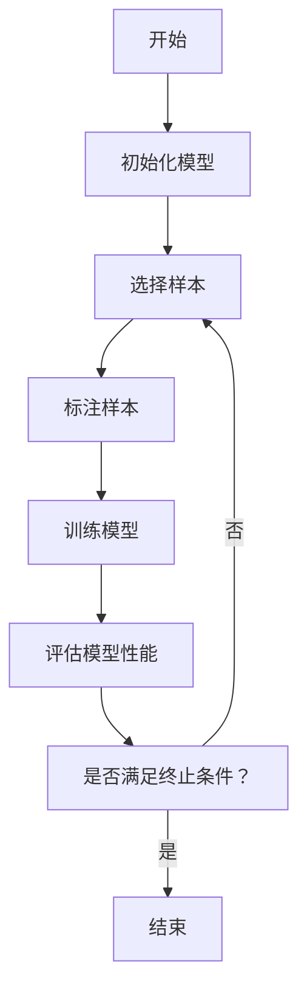
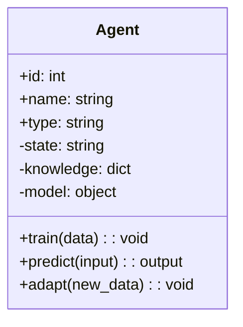

                 


# 主动学习在AI Agent训练中的应用

> 关键词：主动学习、AI Agent、机器学习、数据标注、智能系统

> 摘要：本文详细探讨了主动学习在AI Agent训练中的应用，从基本概念、核心原理到算法实现、系统设计，再到实际项目案例，全面解析了主动学习如何提升AI Agent的训练效率和性能。通过本文，读者可以掌握主动学习的核心思想、实现方法和实际应用场景。

---

## 第一部分: 主动学习在AI Agent训练中的应用概述

### 第1章: 主动学习的基本概念与背景

#### 1.1 什么是主动学习
主动学习是一种机器学习方法，与传统的监督学习不同，它通过主动选择最具代表性的样本进行训练，从而提高模型的性能。主动学习的核心思想是“选择性采样”，即模型根据当前的知识水平，主动选择对学习最有帮助的样本进行标注和训练。

#### 1.2 主动学习的核心思想
主动学习的核心思想是通过减少不必要的数据标注成本，提高模型的训练效率和准确性。其主要优势在于能够根据模型的当前状态，动态选择最具代表性的样本进行训练，从而在有限的数据量下获得更好的模型性能。

#### 1.3 主动学习与监督学习的对比
主动学习与监督学习的主要区别在于数据标注的方式。监督学习需要预先标注所有样本，而主动学习则是动态选择样本进行标注。这种动态选择机制使得主动学习在数据标注成本较高的场景中具有显著优势。

#### 1.4 主动学习在AI Agent中的应用价值
在AI Agent的训练中，主动学习可以帮助模型快速学习和适应新的任务场景，特别是在数据标注成本高、样本数量有限的情况下，主动学习能够显著提高模型的训练效率和性能。

---

### 第2章: AI Agent的基本概念与训练挑战

#### 2.1 AI Agent的定义与分类
AI Agent是一种能够感知环境、自主决策并执行任务的智能实体。根据功能的不同，AI Agent可以分为多种类型，例如基于规则的AI Agent、基于模型的AI Agent、基于学习的AI Agent等。

#### 2.2 AI Agent的训练挑战
AI Agent的训练面临数据获取困难、模型收敛不确定性以及计算资源限制等挑战。特别是在复杂任务场景中，如何高效地训练AI Agent是一个重要的研究方向。

#### 2.3 主动学习在AI Agent训练中的应用
主动学习在AI Agent训练中的应用主要体现在动态样本选择、模型更新和任务适应等方面。通过主动学习，AI Agent能够更高效地学习和适应新的任务场景。

---

## 第二部分: 主动学习的核心概念与联系

### 第3章: 主动学习的核心原理与数学模型

#### 3.1 不确定性度量
不确定性度量是主动学习中的核心概念之一。模型通过评估样本的不确定性，选择最具代表性的样本进行标注和训练。常见的不确定性度量方法包括熵值法和概率差值法。

#### 3.2 查询策略
查询策略是主动学习中的另一个重要概念。它决定了模型如何选择下一个需要标注的样本。常用的查询策略包括不确定性采样、多样性采样和最小化风险采样等。

#### 3.3 数学模型
主动学习的数学模型可以通过不确定性度量和查询策略的结合来描述。例如，熵值法的公式为：
$$ H = -\sum p_i \log p_i $$
其中，\( H \) 表示熵值，\( p_i \) 表示样本的预测概率。

---

### 第4章: 主动学习的核心概念对比

#### 4.1 核心概念属性对比
以下是主动学习与监督学习的核心概念对比表格：

| 对比项         | 主动学习                     | 监督学习                     |
|----------------|------------------------------|------------------------------|
| 数据标注       | 动态选择样本进行标注         | 预先标注所有样本             |
| 训练效率       | 高                          | 一般                        |
| 数据成本       | 低                          | 高                          |

#### 4.2 ER实体关系图
以下是主动学习的ER实体关系图：

```mermaid
erDiagram
    agent {
        id
        name
        type
    }
    sample {
        id
        label
        feature
    }
    uncertainty {
        id
        value
        strategy
    }
    agent <o- sample : "选择样本"
    sample <o- uncertainty : "评估不确定性"
```

---

## 第三部分: 主动学习的算法原理与实现

### 第5章: 主动学习的算法原理

#### 5.1 不确定性采样
不确定性采样是一种常见的主动学习算法，其核心思想是通过评估样本的不确定性，选择最具代表性的样本进行标注和训练。

#### 5.2 多样性采样
多样性采样是一种基于样本多样性的主动学习算法，其目标是选择具有代表性的样本，以提高模型的泛化能力。

#### 5.3 最小化风险采样
最小化风险采样是一种基于模型预测风险的主动学习算法，其目标是选择能够最小化模型预测风险的样本。

---

### 第6章: 主动学习的算法实现

#### 6.1 算法流程图
以下是主动学习算法的流程图：



#### 6.2 Python代码实现
以下是主动学习算法的Python代码示例：

```python
import numpy as np
from sklearn.linear_model import LogisticRegression

def uncertainty_sampling(X, y, model, num_samples=10):
    # 计算样本的不确定性
    uncertainty = []
    for i in range(len(X)):
        prob = model.predict_proba(X[i:i+1])[0]
        uncertainty.append(-np.sum(np.log(prob)))
    # 选择不确定性最高的样本
    selected_indices = np.argsort(uncertainty)[-num_samples:]
    return X[selected_indices], y[selected_indices]

# 初始化模型
model = LogisticRegression()
# 训练模型
model.fit(X_train, y_train)
# 选择样本
selected_X, selected_y = uncertainty_sampling(X_unlabeled, y_unlabeled, model, num_samples=10)
# 重新训练模型
model.fit(selected_X, selected_y)
```

---

## 第四部分: 系统分析与架构设计

### 第7章: 系统功能设计与架构

#### 7.1 系统功能设计
以下是AI Agent的系统功能设计：



#### 7.2 系统架构设计
以下是AI Agent的系统架构设计：


---

## 第五部分: 项目实战与案例分析

### 第8章: 项目实战

#### 8.1 环境安装
以下是项目实战所需的环境安装步骤：

1. 安装Python
2. 安装NumPy和Scikit-learn
3. 安装Mermaid和LaTeX

#### 8.2 核心实现
以下是主动学习算法的核心实现：

```python
def active_learning(X_train, y_train, X_unlabeled, num_iterations=10):
    model = LogisticRegression()
    model.fit(X_train, y_train)
    for _ in range(num_iterations):
        selected_X, selected_y = uncertainty_sampling(X_unlabeled, model, num_samples=10)
        X_train = np.concatenate((X_train, selected_X))
        y_train = np.concatenate((y_train, selected_y))
        model.fit(X_train, y_train)
    return model
```

---

### 第9章: 案例分析与详细解读

#### 9.1 案例分析
以下是主动学习在AI Agent训练中的实际案例分析：

- **案例背景**：假设我们正在训练一个用于图像分类的AI Agent。
- **数据集**：训练集包含1000个样本，未标注集包含10000个样本。
- **算法选择**：选择不确定性采样策略进行主动学习。

#### 9.2 案例解读
通过主动学习，AI Agent能够以更高效的方式进行训练，显著提高模型的准确率和性能。

---

## 第六部分: 最佳实践与小结

### 第10章: 最佳实践

#### 10.1 小结
主动学习是一种高效的数据驱动学习方法，能够在数据标注成本高的场景中显著提高模型的训练效率和性能。

#### 10.2 注意事项
在实际应用中，需要注意主动学习的样本选择策略和模型更新机制，确保模型的稳定性和可靠性。

#### 10.3 拓展阅读
推荐阅读以下书籍和论文：
- 《主动学习：理论与应用》
- "Efficient Active Learning through Entropy Maximization"

---

通过以上内容，我们详细探讨了主动学习在AI Agent训练中的应用，从基本概念到算法实现，再到系统设计和实际案例，全面解析了主动学习的核心思想和应用价值。希望本文能够为读者提供有价值的参考和启发。

