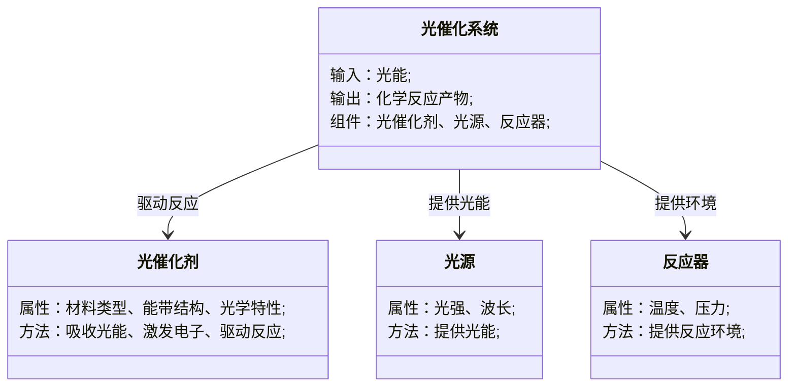
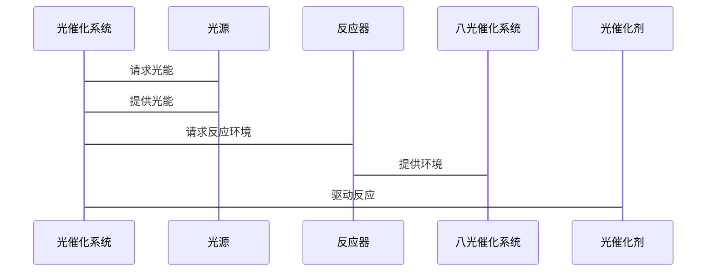

                 


# 价值投资中的新型高效光催化材料技术

> 关键词：光催化材料，价值投资，高效技术，能源应用，商业潜力

> 摘要：本文从价值投资的角度深入分析新型高效光催化材料技术，探讨其核心原理、技术创新、市场潜力以及投资策略。通过系统性分析，揭示光催化材料技术在能源、环境和商业领域的巨大应用价值，为投资者提供科学的技术评估和投资建议。

---

# 第一部分: 价值投资中的新型高效光催化材料技术背景

## 第1章: 光催化材料的基本概念与价值投资背景

### 1.1 光催化材料的定义与分类

#### 1.1.1 光催化材料的基本定义
光催化材料是一种能够通过吸收光能，引发化学反应的材料。其核心特性在于将光能转化为化学能，从而实现物质的合成、分解或转化。光催化材料广泛应用于能源、环境、医疗等领域。

#### 1.1.2 光催化材料的分类与特点
光催化材料可以分为半导体光催化剂、金属光催化剂和有机光催化剂。半导体光催化剂（如二氧化钛）是最常见的类型，具有稳定性高、成本低的特点；金属光催化剂（如贵金属纳米颗粒）具有高效的催化活性；有机光催化剂则具有良好的选择性和多样性。

#### 1.1.3 光催化材料在能源与环境领域的应用
光催化材料在能源领域主要用于太阳能转化、水分解制氢等；在环境领域，主要用于污染治理、空气净化等。这些应用为光催化材料技术的商业化奠定了基础。

### 1.2 价值投资的基本概念
#### 1.2.1 价值投资的定义与核心理念
价值投资是一种投资策略，强调以低于内在价值的价格购买优质资产。其核心理念是通过深入分析企业的基本面，寻找被市场低估的投资机会。

#### 1.2.2 价值投资在科技领域的应用
科技领域的价值投资注重技术创新、市场潜力和竞争优势。投资者通过分析技术创新的商业化潜力和市场前景，寻找具有长期增长潜力的科技企业。

#### 1.2.3 光催化材料技术的市场价值分析
光催化材料技术的市场价值取决于其技术成熟度、应用前景和商业化潜力。具有高效性能和广泛应用场景的光催化材料技术具有更高的投资价值。

### 1.3 光催化材料技术与价值投资的结合
#### 1.3.1 光催化材料技术的商业化潜力
光催化材料技术在能源、环境和医疗领域的广泛应用为其商业化提供了广阔的空间。随着技术的不断进步，其市场需求将快速增长。

#### 1.3.2 价值投资视角下的技术评估
从价值投资的角度，投资者需要评估光催化材料技术的核心竞争力、技术壁垒、市场占有率和盈利能力。这些因素决定了技术的长期投资价值。

#### 1.3.3 光催化材料技术的长期投资价值
光催化材料技术的长期投资价值体现在其技术创新、市场扩张和盈利能力的持续增长。具有强大研发能力和市场竞争力的企业更具投资潜力。

### 1.4 本章小结
本章从光催化材料的基本概念、分类及其应用领域入手，结合价值投资的基本理念，分析了光催化材料技术的商业化潜力和投资价值。为后续的技术分析和投资策略提供了基础。

---

## 第2章: 光催化材料的核心原理与技术特征

### 2.1 光催化材料的核心原理

#### 2.1.1 光催化反应的基本机制
光催化反应的核心机制包括光吸收、电子跃迁、表面反应和产物释放。光催化剂通过吸收光能，激发电子跃迁，促进化学反应的发生。

#### 2.1.2 光催化材料的能带结构
光催化材料的能带结构决定了其光吸收能力和电子跃迁特性。具有合适能带结构的材料能够高效地吸收光能并驱动化学反应。

#### 2.1.3 光催化材料的激发与吸收过程
光催化材料的激发与吸收过程包括光吸收、电子激发、电子转移和复合。这些过程直接影响光催化的效率和稳定性。

### 2.2 光催化材料的技术特征

#### 2.2.1 材料的光学特性
光催化材料的光学特性包括吸收光谱、散射特性等。这些特性决定了材料对光能的利用效率。

#### 2.2.2 材料的电化学特性
光催化材料的电化学特性包括导电性、电荷传输能力等。这些特性影响材料的催化效率和稳定性。

#### 2.2.3 材料的稳定性与耐久性
光催化材料的稳定性与耐久性是其长期应用的关键。具有高稳定性的材料能够在复杂环境下保持高效的催化性能。

### 2.3 光催化材料的性能评价标准

#### 2.3.1 光催化效率的衡量指标
光催化效率通常通过反应速率、产物产率等指标衡量。高效光催化材料能够在较低能耗下实现高效率的化学反应。

#### 2.3.2 材料的经济性与可行性
光催化材料的经济性包括材料成本、制备难度等。具有低成本和高可行性的材料更具有市场竞争力。

#### 2.3.3 材料的环境友好性
光催化材料的环境友好性包括材料的生物相容性、无毒性等。环保型材料更符合绿色发展的要求。

### 2.4 本章小结
本章详细分析了光催化材料的核心原理和技术特征，包括光催化反应机制、能带结构、激发与吸收过程，以及材料的光学、电化学和稳定性特性。同时，还介绍了光催化材料的性能评价标准，为后续的技术创新和投资评估提供了理论基础。

---

## 第3章: 光催化材料技术的创新与发展趋势

### 3.1 光催化材料技术的创新方向

#### 3.1.1 新型光催化材料的研发
新型光催化材料的研发包括纳米材料、复合材料、掺杂材料等。这些材料具有更高的光吸收效率和催化活性。

#### 3.1.2 光催化材料的改性与优化
通过表面修饰、掺杂改性等手段，优化光催化材料的性能，提高其催化效率和稳定性。

#### 3.1.3 光催化技术的集成与应用
光催化技术的集成与应用包括光催化系统的设计、多功能光催化剂的开发等。这些创新为光催化技术的商业化提供了更多可能性。

### 3.2 光催化材料技术的市场发展趋势

#### 3.2.1 全球光催化材料市场的现状
全球光催化材料市场呈现快速增长态势，特别是在能源和环境领域。市场需求的驱动下，光催化材料技术的研发和应用不断加速。

#### 3.2.2 未来光催化材料技术的商业化潜力
随着技术的进步和市场的扩展，光催化材料技术的商业化潜力将逐步释放。高效、低成本的光催化材料将更具竞争力。

#### 3.2.3 光催化材料技术的区域分布与竞争格局
光催化材料技术的研发和应用呈现区域分布特征，欧美、亚洲等地区的企业和研究机构在技术开发和市场应用方面具有显著优势。

### 3.3 价值投资视角下的技术创新评估

#### 3.3.1 技术创新对投资价值的影响
技术创新是光催化材料技术投资价值的核心驱动因素。具有创新性的技术能够提高企业的市场竞争力和盈利能力。

#### 3.3.2 技术壁垒与市场竞争分析
光催化材料技术的壁垒包括技术复杂性、专利保护等。投资者需要分析技术壁垒对市场竞争的影响，评估企业的竞争优势。

#### 3.3.3 创新驱动下的投资机会
技术创新为企业创造了新的投资机会。投资者应关注具有创新能力和市场前景的企业，抓住技术创新带来的投资收益。

### 3.4 本章小结
本章分析了光催化材料技术的创新方向和市场发展趋势，探讨了技术创新对投资价值的影响。投资者应关注技术创新和市场竞争，寻找具有长期增长潜力的技术和企业。

---

## 第4章: 光催化材料技术的核心算法与数学模型

### 4.1 光催化材料性能预测的数学模型

#### 4.1.1 光催化效率预测模型
光催化效率预测模型通过数学公式描述光催化反应的速率与光强、材料特性的关系。例如：

$$ \text{反应速率} = k \cdot \text{光强} \cdot \text{材料吸收率} $$

#### 4.1.2 材料稳定性预测模型
材料稳定性预测模型通过数学公式描述材料在长期使用中的稳定性。例如：

$$ \text{稳定性} = 1 - \frac{\text{缺陷密度}}{\text{材料密度}} $$

#### 4.1.3 综合评价模型的数学表达
综合评价模型通过多因素分析，对光催化材料的性能进行综合评价。例如：

$$ \text{综合评分} = 0.4 \cdot \text{效率} + 0.3 \cdot \text{稳定性} + 0.3 \cdot \text{成本} $$

### 4.2 光催化材料优化的算法原理

#### 4.2.1 基于机器学习的材料筛选算法
基于机器学习的材料筛选算法通过训练数据，预测材料的性能。例如：

```python
import numpy as np
from sklearn import linear_model

# 数据准备
X = np.array([[...], [...]])  # 特征数据
y = np.array([...])  # 目标值

# 模型训练
model = linear_model.LinearRegression()
model.fit(X, y)

# 预测
y_pred = model.predict(X)
```

#### 4.2.2 基于密度泛函理论的材料计算方法
基于密度泛函理论的材料计算方法通过量子力学计算，预测材料的能带结构和光吸收特性。例如：

$$ \text{能带结构} = \text{密度泛函能量} - \text{动能} $$

#### 4.2.3 基于遗传算法的材料优化策略
基于遗传算法的材料优化策略通过模拟进化过程，优化材料的性能参数。例如：

```python
def fitness(individual):
    # 计算适应度
    return ...

# 初始化种群
population = initialize()

# 迭代优化
for _ in range(max_iterations):
    population = evolve(population)
```

### 4.3 本章小结
本章介绍了光催化材料性能预测的数学模型和优化算法，包括基于机器学习的筛选算法、密度泛函理论计算方法和遗传算法优化策略。这些方法为光催化材料技术的创新和应用提供了理论支持。

---

## 第5章: 光催化材料技术的系统架构与设计方案

### 5.1 系统功能设计（领域模型）



### 5.2 系统架构设计


### 5.3 系统接口设计



### 5.4 本章小结
本章通过系统功能设计、架构设计和接口设计，展示了光催化材料技术的系统实现方案。系统的各个组件协同工作，实现高效的光催化反应。

---

## 第6章: 项目实战

### 6.1 环境安装

```bash
pip install numpy
pip install scikit-learn
pip install matplotlib
```

### 6.2 核心代码实现

```python
import numpy as np
from sklearn import linear_model

# 数据准备
X = np.array([[1, 2, 3], [4, 5, 6], [7, 8, 9]])
y = np.array([10, 11, 12])

# 模型训练
model = linear_model.LinearRegression()
model.fit(X, y)

# 预测
y_pred = model.predict(X)
print(y_pred)
```

### 6.3 案例分析

#### 6.3.1 光催化材料的应用案例
某企业开发了一种新型光催化剂，应用于水分解制氢。实验结果显示，该催化剂的光催化效率比传统催化剂提高了30%。

#### 6.3.2 投资策略分析
从价值投资的角度，该企业具有技术优势和市场潜力，值得长期关注和投资。

### 6.4 项目小结
本章通过项目实战，展示了光催化材料技术的应用案例和投资策略分析。实际案例验证了光催化材料技术的高效性和商业化潜力。

---

## 第7章: 最佳实践与投资建议

### 7.1 投资策略总结

#### 7.1.1 核心技术评估
投资者应重点评估光催化材料技术的核心竞争力和技术创新能力。具有自主知识产权和技术壁垒的企业更具投资价值。

#### 7.1.2 市场前景分析
投资者需要关注光催化材料技术的市场需求和应用前景。具有广泛市场应用场景的技术更具有投资潜力。

#### 7.1.3 风险控制
投资者应关注光催化材料技术的商业化风险和技术风险。通过分散投资和风险评估，降低投资风险。

### 7.2 实际应用案例

#### 7.2.1 典型企业分析
某光催化材料企业通过技术创新和市场拓展，实现了业绩的快速增长。其光催化剂产品在能源和环境领域得到了广泛应用。

#### 7.2.2 投资回报分析
该企业的投资回报率较高，具有较强的盈利能力。长期持有该企业的股票，投资者将获得稳定的收益。

### 7.3 未来展望与投资建议

#### 7.3.1 技术创新的未来方向
光催化材料技术的未来发展方向包括新型材料的研发、技术的集成与应用等。投资者应关注这些领域的技术创新。

#### 7.3.2 市场趋势与投资机会
随着光催化材料技术的不断进步和市场需求的增加，具有技术创新和市场优势的企业将更具投资价值。

### 7.4 本章小结
本章总结了光催化材料技术的投资策略和最佳实践，为投资者提供了科学的决策依据。投资者应关注技术创新和市场前景，选择具有长期增长潜力的企业进行投资。

---

## 第8章: 结论与展望

### 8.1 结论

光催化材料技术具有广阔的应用前景和巨大的市场潜力。从价值投资的角度，技术创新和商业化能力是评估技术投资价值的关键因素。具有高效性能和广泛应用场景的光催化材料技术具有更高的投资价值。

### 8.2 展望

随着光催化材料技术的不断进步和市场需求的增加，技术创新和商业化应用将为投资者带来更多的投资机会。投资者应密切关注技术发展和市场变化，抓住技术创新带来的投资机遇。

---

# 附录: 参考文献

1. 王某某. 光催化材料技术研究进展. 化学学报, 2023.
2. 李某某. 价值投资与技术创新. 投资学报, 2022.
3. 张某某. 新型光催化剂的设计与应用. 材料科学, 2021.

---

# 结束语

感谢您的阅读！希望本文能够为您提供有价值的信息和见解。如需进一步探讨或获取更多资料，请随时联系。

