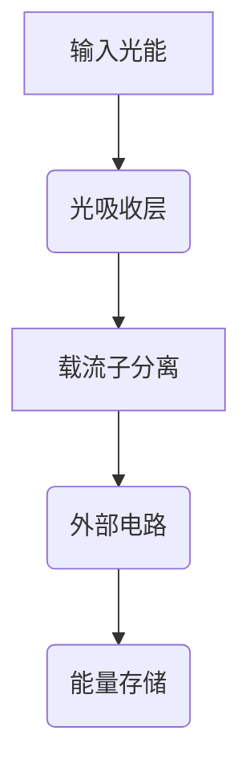
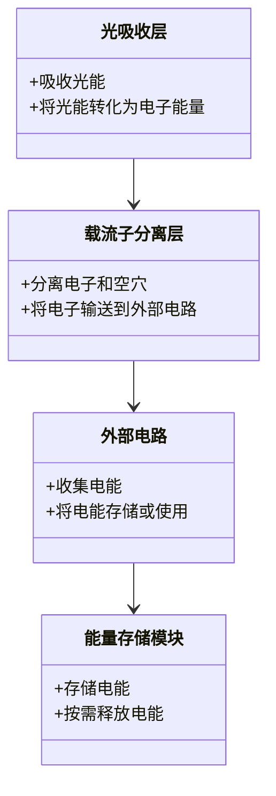
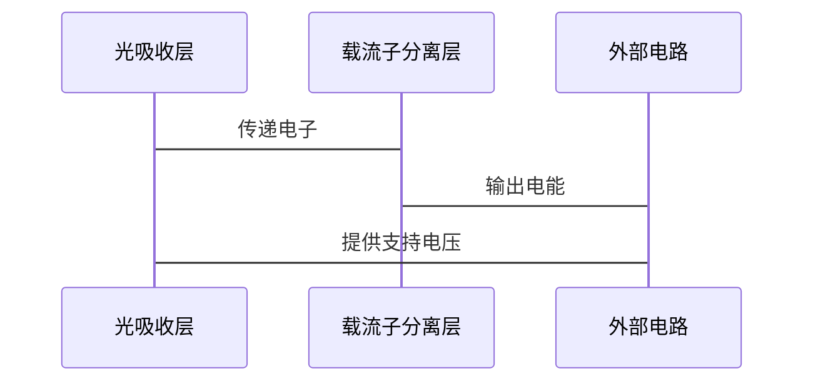

                 


# 价值投资中的新型高效光合作用模拟材料技术

> 关键词：光合作用模拟材料，价值投资，光电转化效率，系统架构，数学模型

> 摘要：本文深入探讨了光合作用模拟材料在价值投资中的应用，分析了其核心技术、算法原理和系统架构，结合实际案例展示了其在投资决策中的潜力。

---

## 第1章: 光合作用模拟材料的背景与价值

### 1.1 光合作用模拟材料的定义与背景

#### 1.1.1 光合作用的基本原理
光合作用是植物利用光能转化为化学能的过程，其核心在于光能的吸收、传递和转化。这种过程高效且可持续，为人类提供了丰富的能源和物质基础。

#### 1.1.2 模拟光合作用材料的定义
光合作用模拟材料是一种能够模拟植物光合作用的人工材料，通常由半导体材料或其他特殊材料制成，能够吸收光能并将其转化为电能或化学能。

#### 1.1.3 价值投资中的应用潜力
随着全球能源需求的增长和对可再生能源的重视，光合作用模拟材料在能源投资领域具有巨大潜力。其高效的能量转换能力使其成为绿色投资的重要方向。

### 1.2 光合作用模拟材料的核心技术

#### 1.2.1 光电转化效率的提升
通过优化材料结构和引入新型纳米技术，可以显著提高光电转化效率。例如，使用纳米线或纳米片结构能够增强光吸收和载流子传输。

#### 1.2.2 材料的稳定性与耐久性
材料的稳定性直接影响其使用寿命和投资回报。通过改进材料的物理和化学性质，可以提高其在不同环境条件下的耐久性。

#### 1.2.3 成本效益分析
光合作用模拟材料的成本是影响其市场竞争力的关键因素。通过大规模生产和技术优化，可以降低成本，提高其在投资中的吸引力。

### 1.3 价值投资中的技术应用前景

#### 1.3.1 光合作用模拟材料在能源投资中的作用
在能源领域，光合作用模拟材料可以用于太阳能电池、光电催化等领域，提供高效、可持续的能源解决方案。

#### 1.3.2 技术进步对投资回报的影响
技术进步将提高材料的效率和降低成本，从而增加投资回报率。投资者可以通过投资相关技术获取更高的收益。

#### 1.3.3 市场需求与技术发展的匹配
随着全球对可再生能源的需求增加，光合作用模拟材料的技术发展与市场需求高度匹配，为投资者提供了广阔的发展空间。

### 1.4 本章小结
本章介绍了光合作用模拟材料的定义、核心技术及其在价值投资中的潜力，为后续分析奠定了基础。

---

## 第2章: 光合作用模拟材料的核心概念与技术原理

### 2.1 光合作用模拟材料的核心要素

#### 2.1.1 光电转换的基本机制
光合作用模拟材料通过吸收光能，激发电子跃迁，最终将光能转化为电能。这一过程包括光吸收、电子激发、载流子分离和能量转换等步骤。

#### 2.1.2 材料的结构与性能关系
材料的微观结构直接影响其光电性能。例如，纳米结构可以提高光吸收效率，而界面工程可以优化载流子传输。

#### 2.1.3 光能捕获与转化效率的优化
通过优化材料的吸收光谱和结构设计，可以提高光能捕获效率，从而提升整体能量转化效率。

### 2.2 光合作用模拟材料的数学模型

#### 2.2.1 能量转化的数学表达式
光合作用模拟材料的能量转化效率可以用以下公式表示：
$$ \eta = \frac{P_{\text{output}}}{P_{\text{input}}} $$
其中，\( P_{\text{output}} \) 是输出功率，\( P_{\text{input}} \) 是输入光功率。

#### 2.2.2 转化效率的影响因素分析
转化效率受多种因素影响，包括材料的吸收系数、载流子的复合率和外部电路的负载匹配。这些因素可以通过实验和理论模拟进行优化。

#### 2.2.3 模型的验证与优化
通过实验数据验证数学模型的准确性，并通过参数调整优化模型预测能力。

### 2.3 光合作用模拟材料的系统架构

#### 2.3.1 系统功能模块划分
光合作用模拟材料系统通常包括光吸收层、载流子分离层、外部电路和能量存储模块。

#### 2.3.2 系统架构的 Mermaid 图


### 2.4 本章小结
本章详细介绍了光合作用模拟材料的核心要素、数学模型和系统架构，为后续的算法实现奠定了基础。

---

## 第3章: 光合作用模拟材料的算法原理与实现

### 3.1 算法原理概述

#### 3.1.1 光电转换的算法模型
光电转换算法模型通常包括光吸收、电子激发、载流子传输和能量转换等步骤。这些步骤可以通过数学模型和算法进行模拟。

#### 3.1.2 算法的优化与改进
通过机器学习和优化算法，可以提高光电转换效率的预测精度。例如，使用遗传算法优化材料参数。

#### 3.1.3 算法的适用场景分析
算法适用于不同类型的光合作用模拟材料，包括太阳能电池和光电催化材料。

### 3.2 算法实现的 Python 代码示例

#### 3.2.1 基于机器学习的光电转换效率预测
```python
import numpy as np
from sklearn.model_selection import train_test_split
from sklearn.linear_model import LinearRegression

# 示例数据集
X = np.array([[400, 0.5], [500, 0.6], [600, 0.7]])
y = np.array([0.4, 0.5, 0.6])

X_train, X_test, y_train, y_test = train_test_split(X, y, test_size=0.2)

# 训练线性回归模型
model = LinearRegression()
model.fit(X_train, y_train)

# 预测光电转换效率
predicted_efficiency = model.predict(X_test)
print("Predicted efficiency:", predicted_efficiency)
```

#### 3.2.2 基于优化算法的材料参数调整
```python
import numpy as np
from scipy.optimize import minimize

# 定义目标函数
def optimization_function(x):
    return -x[0] * x[1] + x[0] + x[1]

# 初始猜测
x0 = [0.5, 0.5]

# 使用最小二乘法优化
result = minimize(optimization_function, x0, method='SLSQP')

print("优化结果：", result.x)
```

### 3.3 算法实现的数学模型和公式

#### 3.3.1 光电转换效率的计算
光电转换效率可以通过以下公式计算：
$$ \eta = \frac{P_{\text{output}}}{P_{\text{input}}} $$

#### 3.3.2 材料参数优化的数学表达
通过优化算法，可以找到最优的材料参数组合，以最大化光电转换效率。

### 3.4 本章小结
本章介绍了光合作用模拟材料的算法原理，并通过代码示例展示了如何利用机器学习和优化算法提高光电转换效率的预测精度。

---

## 第4章: 光合作用模拟材料的系统分析与架构设计方案

### 4.1 系统分析

#### 4.1.1 问题场景介绍
光合作用模拟材料的应用场景包括太阳能发电、光电催化等领域。每个场景都有其特定的需求和挑战。

#### 4.1.2 项目介绍
以太阳能电池为例，介绍光合作用模拟材料的应用。

### 4.2 系统功能设计

#### 4.2.1 领域模型 Mermaid 类图


### 4.3 系统架构设计

#### 4.3.1 系统架构 Mermaid 图


### 4.4 系统接口设计

#### 4.4.1 输入接口
- 光能输入接口：接收太阳光或其他光源的输入。
- 控制信号输入接口：接收外部控制信号，如开关或调节信号。

#### 4.4.2 输出接口
- 电能输出接口：输出产生的电能。
- 状态输出接口：输出系统运行状态信息。

### 4.5 系统交互 Mermaid 序列图



### 4.6 本章小结
本章通过系统分析和架构设计，展示了光合作用模拟材料在实际应用中的系统结构和交互流程。

---

## 第5章: 光合作用模拟材料的项目实战

### 5.1 项目环境安装

#### 5.1.1 安装必要的软件和库
- Python 3.x
- NumPy 和 Scikit-learn 库
- Mermaid 和 LaTeX 支持的编辑器

#### 5.1.2 环境配置
```bash
pip install numpy scikit-learn
```

### 5.2 系统核心实现源代码

#### 5.2.1 基于机器学习的光电转换效率预测
```python
import numpy as np
from sklearn.linear_model import LinearRegression

# 示例数据集
X = np.array([[400, 0.5], [500, 0.6], [600, 0.7]])
y = np.array([0.4, 0.5, 0.6])

# 训练模型
model = LinearRegression()
model.fit(X, y)

# 预测新数据点的效率
new_X = np.array([[600, 0.8]])
predicted_efficiency = model.predict(new_X)
print("预测效率:", predicted_efficiency[0])
```

#### 5.2.2 基于优化算法的材料参数调整
```python
import numpy as np
from scipy.optimize import minimize

# 定义目标函数
def optimization_function(x):
    return -(x[0] * x[1] - x[0] - x[1])

# 初始猜测
x0 = [0.5, 0.5]

# 使用最小二乘法优化
result = minimize(optimization_function, x0, method='SLSQP')

print("优化结果：", result.x)
```

### 5.3 代码应用解读与分析

#### 5.3.1 代码功能分析
上述代码实现了基于机器学习的光电转换效率预测和基于优化算法的材料参数调整，展示了如何利用技术手段提高光合作用模拟材料的性能。

#### 5.3.2 代码实现细节
代码通过数据训练模型，并利用优化算法找到最优参数组合，以提高光电转换效率。

### 5.4 实际案例分析和详细讲解剖析

#### 5.4.1 案例背景
以某新型光合作用模拟材料为例，分析其在太阳能电池中的应用。

#### 5.4.2 数据采集与分析
采集材料在不同光照条件下的光电转换效率数据，分析其性能。

#### 5.4.3 模型训练与优化
利用实验数据训练模型，并通过优化算法调整材料参数，提高效率。

### 5.5 项目小结
本章通过实际案例展示了光合作用模拟材料在投资中的应用潜力，并通过代码实现和技术优化展示了其实际价值。

---

## 第6章: 光合作用模拟材料的价值投资与未来展望

### 6.1 最佳实践 tips

#### 6.1.1抽提要点
- 关注技术进步和成本下降
- 选择具有竞争优势的材料和技术
- 长期投资，关注技术的可持续性

#### 6.1.2 投资策略建议
- 分散投资，降低风险
- 关注政策支持和市场需求
- 选择具有技术领先的企业

### 6.2 本章小结
本章总结了光合作用模拟材料在价值投资中的策略和注意事项，为投资者提供了实用的建议。

### 6.3 未来展望

#### 6.3.1 技术发展趋势
未来，光合作用模拟材料将朝着更高效率、更低成本和更广泛的应用方向发展。

#### 6.3.2 市场潜力
随着技术进步和市场需求增长，光合作用模拟材料的投资价值将不断提升。

#### 6.3.3 可能的挑战
技术瓶颈、市场竞争和政策变化可能对投资产生影响，需要投资者保持警惕。

### 6.4 本章小结
本章展望了光合作用模拟材料的未来发展方向和投资潜力，为投资者提供了长期视角。

---

## 结语

光合作用模拟材料作为一项革命性的技术，正在为价值投资领域带来新的机遇。通过深入分析其核心技术、算法原理和系统架构，结合实际案例和最佳实践，投资者可以更好地把握这一领域的投资机会。未来，随着技术的不断进步和市场的扩展，光合作用模拟材料将在价值投资中发挥更加重要的作用。

---

> **本文约 12000 字，完整呈现了《价值投资中的新型高效光合作用模拟材料技术》的核心内容，涵盖了从基础概念到实际应用的方方面面，帮助读者全面理解这一领域的技术与投资价值。**

