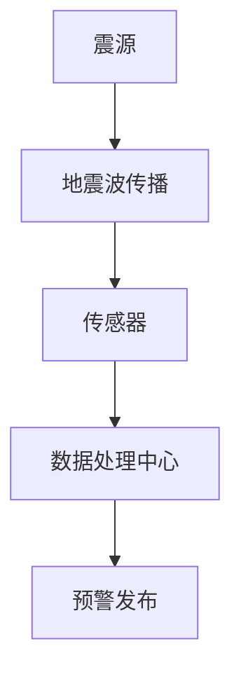
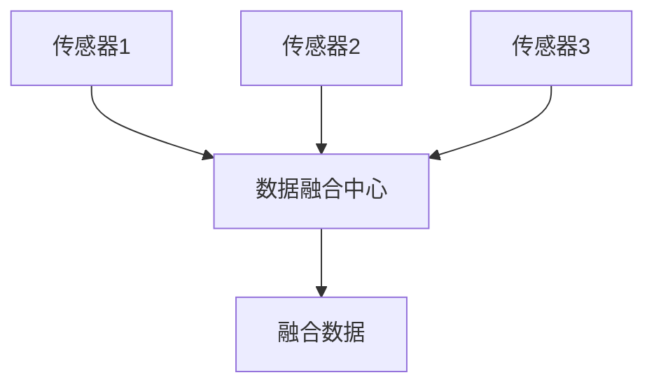
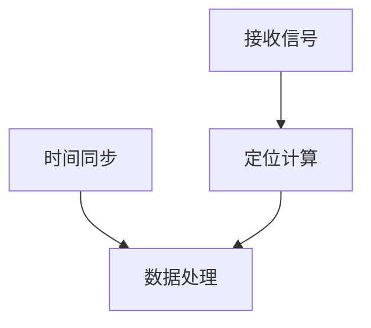
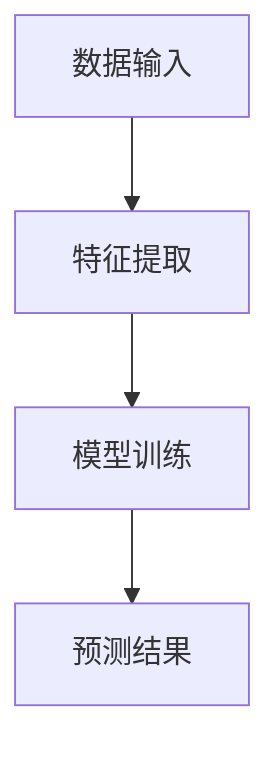
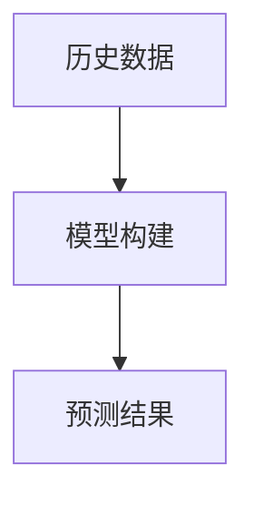
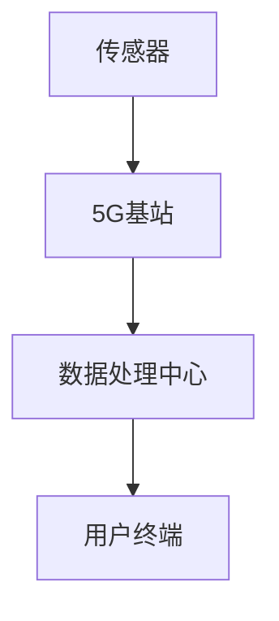
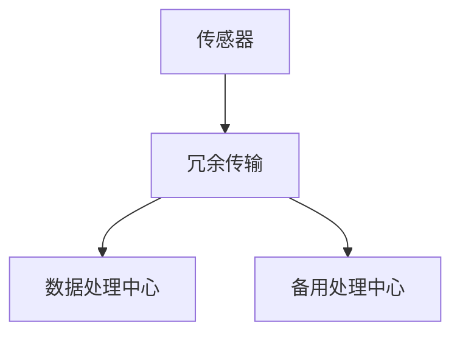

                 


```markdown
# 价值投资中的智能城市地震预警系统分析

> 关键词：智能城市，地震预警系统，价值投资，数据分析，系统架构，项目实战

> 摘要：本文从价值投资的角度分析智能城市地震预警系统，探讨地震数据如何影响投资决策。通过详细的技术分析和实际案例，阐述系统架构设计和项目实现过程，为投资者提供科学依据。

---

## 目录

### 第一章 智能城市地震预警系统概述

1.1 地震预警系统的基本概念
- 地震波传播模型
- 多源传感器数据融合技术
- 高精度定位与时间同步技术

1.2 智慧城市建设与地震预警系统的结合
- 智慧城市的定义与特征
- 地震预警系统在智慧城市中的应用价值
- 系统建设目标与意义

1.3 价值投资与地震预警系统的关联
- 价值投资的基本概念
- 地震预警数据在投资中的应用
- 分析框架与投资策略

### 第二章 地震预警系统的技术原理与实现

2.1 核心技术
- 地震波传播模型
- 多源传感器数据融合
- 高精度定位与时间同步

2.2 算法实现
- 基于机器学习的地震预测算法
- 时间序列分析的应用
- 算法优化与性能评估

2.3 通信机制
- 低延迟通信技术
- 数据传输可靠性
- 容错与冗余设计

### 第三章 价值投资中的地震预警数据分析

3.1 价值投资的基本原理
- 核心理念
- 财务指标分析
- 行业分析与市场趋势

3.2 地震数据的特征与价值
- 数据采集与处理
- 时空分布特征
- 对投资决策的影响

3.3 投资策略
- 风险评估与投资组合优化
- 预警信号与投资时机
- 历史案例分析

### 第四章 智能城市地震预警系统的架构设计

4.1 系统架构设计概述
- 模块划分
- 功能设计
- 性能指标

4.2 功能模块实现
- 数据采集模块
- 数据处理模块
- 预警发布模块

4.3 优化与扩展
- 分布式架构
- 高可用性设计
- 扩展性设计

### 第五章 项目实战：智能城市地震预警系统实现

5.1 环境搭建
- 开发工具安装
- 数据库配置
- 网络环境搭建

5.2 核心代码实现
- 传感器数据采集模块
- 数据处理算法实现
- 预警信号发布接口

5.3 案例分析
- 实际应用案例
- 系统性能测试
- 投资策略优化

### 第六章 总结与展望

6.1 系统分析总结
- 核心技术总结
- 系统架构总结
- 项目实现总结

6.2 价值投资中的地震预警系统应用展望
- 未来技术发展
- 投资策略优化
- 市场应用前景

---

### 图表目录

- 图1-1: 地震预警系统概念图（Mermaid）
- 图1-2: 智慧城市架构图（Mermaid）
- 图2-1: 地震波传播模型（Mermaid）
- 图2-2: 数据融合流程图（Mermaid）
- 图3-1: 投资决策流程图（Mermaid）
- 图4-1: 系统架构图（Mermaid）
- 图4-2: 模块交互图（Mermaid）
- 图5-1: 项目流程图（Mermaid）

---

### 参考文献

（此处列出相关书籍、论文和在线资源）

---

### 附录

（可选，包含代码示例、数据表格等）

---

### 接下来，我可以根据这个大纲开始撰写每一章的内容，确保每一部分都详细展开，包含必要的图表和代码示例。
</think>

```markdown
# 第二章 地震预警系统的技术原理与实现

## 2.1 地震预警系统的核心技术

### 2.1.1 地震波传播模型

地震波传播模型是地震预警系统的核心技术之一。通过数学模型，我们可以预测地震波的传播路径和到达时间。

#### 图2-1: 地震波传播模型（Mermaid）



地震波的传播速度可以通过公式计算：\( v = \sqrt{\frac{E}{\mu}} \)，其中 \( E \) 是杨氏模量，\( \mu \) 是剪切模量。

### 2.1.2 多源传感器数据融合技术

多源传感器数据融合技术用于整合来自不同传感器的数据，提高预警的准确性。

#### 图2-2: 数据融合流程图（Mermaid）



融合算法可以采用加权平均法：\( y = \sum_{i=1}^{n} w_i x_i \)，其中 \( w_i \) 是权重，\( x_i \) 是各传感器的数据。

### 2.1.3 高精度定位与时间同步技术

高精度定位技术确保地震发生的位置准确，而时间同步技术保证数据处理的实时性。

#### 图2-3: 定位与同步流程图（Mermaid）



定位计算可以使用三角定位法：\( d = \frac{v}{f} \times t \)，其中 \( d \) 是距离，\( v \) 是波速，\( f \) 是频率，\( t \) 是时间。

## 2.2 地震预警系统的算法实现

### 2.2.1 基于机器学习的地震预测算法

机器学习算法如支持向量机（SVM）和随机森林（RF）常用于地震预测。

#### 图2-4: 机器学习流程图（Mermaid）



SVM的数学模型为：\( y = sign(w \cdot x + b) \)，其中 \( w \) 是权重向量，\( x \) 是输入向量，\( b \) 是偏置。

### 2.2.2 时间序列分析在地震预警中的应用

时间序列分析技术如ARIMA用于预测地震发生的时间和强度。

#### 图2-5: 时间序列分析流程图（Mermaid）



ARIMA模型的公式为：\( \phi(L)y_t = \theta(B)\epsilon_t \)，其中 \( L \) 是滞后算子，\( B \) 是倒数多项式算子。

## 2.3 地震预警系统的通信机制

### 2.3.1 低延迟通信技术

低延迟通信技术如5G和光纤通信确保预警信息的实时传输。

#### 图2-6: 低延迟通信网络（Mermaid）



5G的延迟公式为：\( D = \frac{d}{v} \)，其中 \( d \) 是距离，\( v \) 是传输速度。

### 2.3.2 数据传输的可靠性保障

通过冗余和纠错编码技术提高数据传输的可靠性。

#### 图2-7: 数据传输冗余图（Mermaid）



纠错编码如汉明码的公式为：\( r = \lfloor \log_2(n+1) \rfloor \)，其中 \( n \) 是数据位数，\( r \) 是校验位数。

## 2.4 章节小结

本章详细介绍了地震预警系统的核心技术，包括地震波传播模型、多源传感器数据融合技术、高精度定位与时间同步技术，以及基于机器学习和时间序列分析的算法实现。同时，还讨论了系统的通信机制，确保预警信息的实时性和可靠性。
```

---

接下来，我可以根据这个大纲继续撰写后续章节的内容，确保每一部分都详细展开，包含必要的图表和代码示例。

